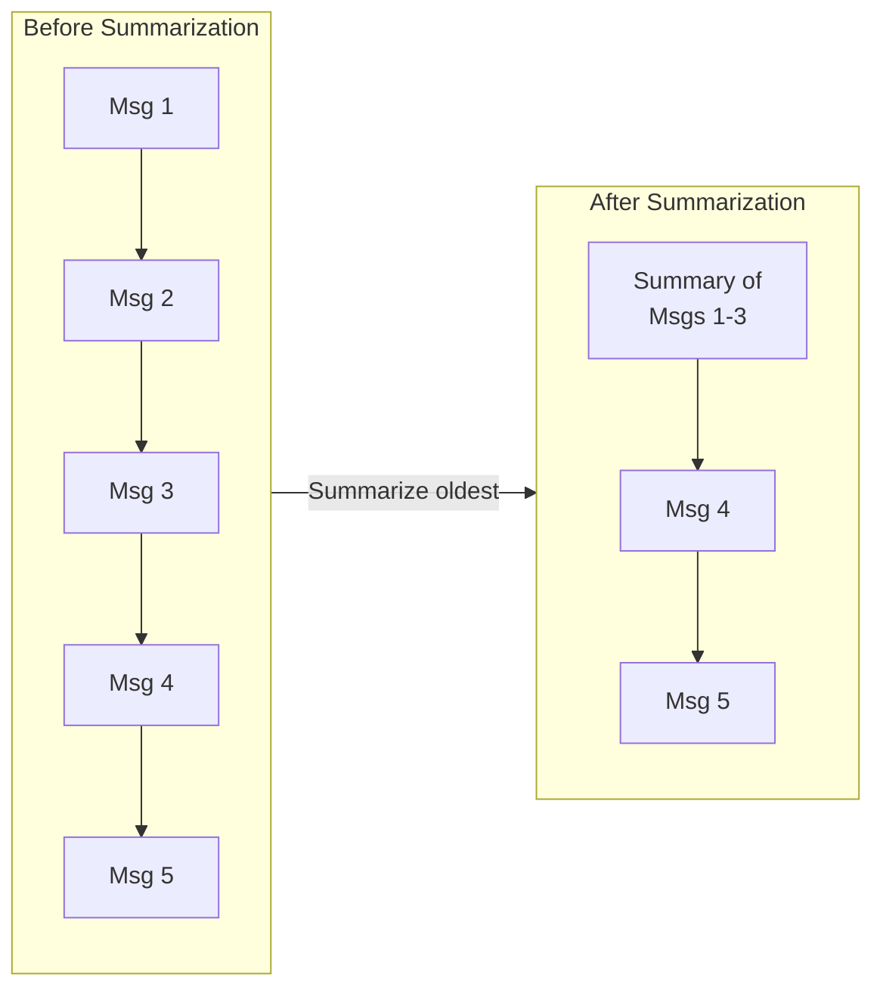
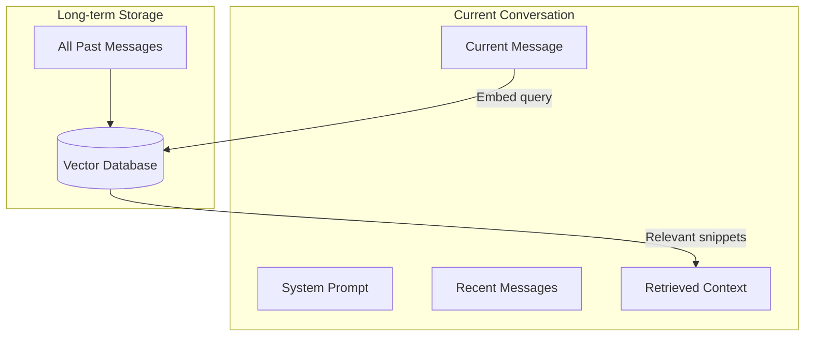

# Managing Long Conversations

## Introduction

Every conversation eventually exceeds the context window. When this happens, you must decide what to keep and what to discard. Good conversation management maintains coherence while staying within limits.

### What We'll Cover

- When conversations exceed context
- Progressive summarization
- Sliding window approach
- Selective memory retention
- RAG for extended memory

---

## When Conversations Exceed Context

Long conversations inevitably fill the context window:

```python
# Typical message sizes
message_sizes = {
    "user_message": 50,      # Average tokens
    "assistant_message": 150, # Average tokens
    "message_overhead": 4,    # Per message formatting
}

tokens_per_exchange = 50 + 150 + 8  # ~208 tokens per exchange

# How many exchanges fit?
context_windows = {
    "8K": 8000 // 208,      # ~38 exchanges
    "32K": 32000 // 208,    # ~153 exchanges
    "128K": 128000 // 208,  # ~615 exchanges
}

# Customer support session: 15-30 exchanges → fits easily
# Ongoing assistant: 100+ exchanges → needs management
```

### Detection Strategy

```python
import tiktoken

class ConversationManager:
    def __init__(self, model: str, max_context: int, reserve: int = 4000):
        self.enc = tiktoken.encoding_for_model(model)
        self.max_context = max_context
        self.reserve = reserve
        self.messages = []
        self.system_prompt = None
    
    def count_tokens(self) -> int:
        total = 0
        if self.system_prompt:
            total += len(self.enc.encode(self.system_prompt["content"])) + 4
        for msg in self.messages:
            total += len(self.enc.encode(msg["content"])) + 4
        return total
    
    def available_space(self) -> int:
        return self.max_context - self.reserve - self.count_tokens()
    
    def needs_trimming(self) -> bool:
        return self.available_space() < 1000  # Buffer threshold
    
    def utilization(self) -> float:
        return self.count_tokens() / (self.max_context - self.reserve)
```

---

## Progressive Summarization

Summarize older messages to compress history while preserving key information:



### Implementation

```python
async def summarize_conversation(
    messages: list,
    keep_recent: int = 10,
    summarizer_model: str = "gpt-4o-mini"
) -> list:
    """
    Compress old messages into a summary.
    
    Args:
        messages: Full message history
        keep_recent: Number of recent messages to keep verbatim
        summarizer_model: Model to use for summarization (can be cheaper)
    """
    
    if len(messages) <= keep_recent:
        return messages  # Nothing to summarize
    
    # Split into old and recent
    old_messages = messages[:-keep_recent]
    recent_messages = messages[-keep_recent:]
    
    # Format old messages for summarization
    conversation_text = format_messages_as_text(old_messages)
    
    # Generate summary
    summary_prompt = f"""
    Summarize this conversation history concisely, preserving:
    - Key facts and decisions made
    - User preferences expressed
    - Important context for future responses
    - Any commitments or promises made
    
    Conversation:
    {conversation_text}
    
    Summary (be concise but comprehensive):
    """
    
    summary = await generate_completion(
        model=summarizer_model,
        prompt=summary_prompt,
        max_tokens=500
    )
    
    # Create summary message
    summary_message = {
        "role": "system",
        "content": f"[Previous conversation summary: {summary}]"
    }
    
    return [summary_message] + recent_messages


def format_messages_as_text(messages: list) -> str:
    """Format messages for summarization"""
    lines = []
    for msg in messages:
        role = msg["role"].upper()
        content = msg["content"]
        lines.append(f"{role}: {content}")
    return "\n\n".join(lines)
```

### Multi-Level Summarization

```python
class HierarchicalSummarizer:
    """
    Create summaries at multiple levels for very long conversations.
    """
    
    def __init__(self, model: str):
        self.model = model
        self.summaries = {
            "session": [],     # High-level session summaries
            "topic": [],       # Topic-level summaries
            "recent": [],      # Recent message details
        }
    
    async def add_messages(self, messages: list):
        """Add new messages and update summaries as needed"""
        
        self.summaries["recent"].extend(messages)
        
        # Summarize recent into topic when too many
        if len(self.summaries["recent"]) > 20:
            topic_summary = await self._summarize_to_topic()
            self.summaries["topic"].append(topic_summary)
            self.summaries["recent"] = self.summaries["recent"][-10:]
        
        # Summarize topics into session when too many
        if len(self.summaries["topic"]) > 5:
            session_summary = await self._summarize_to_session()
            self.summaries["session"].append(session_summary)
            self.summaries["topic"] = self.summaries["topic"][-2:]
    
    def get_context(self) -> str:
        """Get current context for the model"""
        parts = []
        
        if self.summaries["session"]:
            parts.append(f"Previous sessions: {' '.join(self.summaries['session'])}")
        
        if self.summaries["topic"]:
            parts.append(f"Earlier in conversation: {' '.join(self.summaries['topic'])}")
        
        # Recent messages in full
        for msg in self.summaries["recent"]:
            parts.append(f"{msg['role']}: {msg['content']}")
        
        return "\n\n".join(parts)
```

---

## Sliding Window Approach

Keep only the most recent N messages:

```python
class SlidingWindowManager:
    """
    Simple sliding window: keep last N messages.
    """
    
    def __init__(self, window_size: int = 20):
        self.window_size = window_size
        self.messages = []
        self.system_prompt = None
    
    def add_message(self, role: str, content: str):
        self.messages.append({"role": role, "content": content})
        self._trim()
    
    def _trim(self):
        """Keep only window_size most recent messages"""
        if len(self.messages) > self.window_size:
            self.messages = self.messages[-self.window_size:]
    
    def get_messages(self) -> list:
        result = []
        if self.system_prompt:
            result.append(self.system_prompt)
        result.extend(self.messages)
        return result
```

### Token-Based Window

```python
class TokenWindowManager:
    """
    Sliding window based on token count, not message count.
    """
    
    def __init__(self, model: str, max_tokens: int):
        self.enc = tiktoken.encoding_for_model(model)
        self.max_tokens = max_tokens
        self.messages = []
        self.system_prompt = None
    
    def add_message(self, role: str, content: str):
        self.messages.append({"role": role, "content": content})
        self._trim_to_fit()
    
    def _trim_to_fit(self):
        """Remove oldest messages until we fit within token limit"""
        while self._count_tokens() > self.max_tokens and len(self.messages) > 2:
            # Remove oldest non-system message
            self.messages.pop(0)
    
    def _count_tokens(self) -> int:
        total = 0
        if self.system_prompt:
            total += len(self.enc.encode(self.system_prompt["content"])) + 4
        for msg in self.messages:
            total += len(self.enc.encode(msg["content"])) + 4
        return total
```

### When to Use Sliding Window

| ✅ Good For | ❌ Not Good For |
|------------|----------------|
| Simple chatbots | Long-term memory needed |
| Customer support | Reference to old messages |
| Quick Q&A | Complex multi-step tasks |
| Stateless interactions | User expects persistence |

---

## Selective Memory Retention

Keep important messages, summarize or drop less important ones:

```python
class SelectiveMemory:
    """
    Selectively retain important messages.
    """
    
    def __init__(self, model: str, max_tokens: int):
        self.enc = tiktoken.encoding_for_model(model)
        self.max_tokens = max_tokens
        self.messages = []
        self.pinned_indices = set()  # Messages marked as important
    
    def add_message(self, role: str, content: str, important: bool = False):
        index = len(self.messages)
        self.messages.append({
            "role": role,
            "content": content,
            "important": important
        })
        if important:
            self.pinned_indices.add(index)
        
        self._manage_memory()
    
    def pin_message(self, index: int):
        """Mark a message as important (won't be removed)"""
        self.pinned_indices.add(index)
    
    def _manage_memory(self):
        """Remove unimportant old messages when needed"""
        while self._count_tokens() > self.max_tokens:
            # Find oldest non-pinned message
            for i, msg in enumerate(self.messages):
                if i not in self.pinned_indices:
                    self.messages.pop(i)
                    # Adjust pinned indices
                    self.pinned_indices = {
                        idx - 1 if idx > i else idx 
                        for idx in self.pinned_indices
                    }
                    break
            else:
                # All messages are pinned - summarize oldest pinned
                break


# Usage example
memory = SelectiveMemory("gpt-4", max_tokens=10000)

memory.add_message("user", "My name is Alice", important=True)  # Pin this
memory.add_message("assistant", "Hello Alice!", important=True)
memory.add_message("user", "What's the weather?")  # Normal
memory.add_message("assistant", "I can't check weather...")
memory.add_message("user", "Remember I prefer metric units", important=True)  # Pin

# When trimming, unpinned messages go first
```

### Importance Scoring

```python
async def score_message_importance(message: dict, context: list) -> float:
    """
    Score how important a message is to keep.
    """
    
    content = message["content"].lower()
    
    score = 0.0
    
    # Contains personal information
    personal_indicators = ["my name is", "i am", "i live", "my email", "i prefer"]
    if any(indicator in content for indicator in personal_indicators):
        score += 0.3
    
    # Contains commitment/promise
    commitment_words = ["i will", "i'll", "promise", "guarantee", "scheduled"]
    if any(word in content for word in commitment_words):
        score += 0.3
    
    # Contains decision
    decision_words = ["decided", "chosen", "selected", "confirmed", "agreed"]
    if any(word in content for word in decision_words):
        score += 0.2
    
    # Recent messages are more important
    recency_bonus = 0.2 if message == context[-1] else 0.0
    score += recency_bonus
    
    # First messages often contain important context
    if message == context[0]:
        score += 0.2
    
    return min(score, 1.0)
```

---

## RAG for Extended Memory

Use retrieval to access older context without keeping it all in the window:



### Implementation

```python
from chromadb import Client

class RAGMemory:
    """
    Use retrieval to augment context with relevant past messages.
    """
    
    def __init__(self, model: str):
        self.client = Client()
        self.collection = self.client.create_collection("conversation_memory")
        self.message_count = 0
    
    def store_message(self, role: str, content: str):
        """Store message in vector database"""
        self.collection.add(
            documents=[content],
            metadatas=[{"role": role, "index": self.message_count}],
            ids=[f"msg_{self.message_count}"]
        )
        self.message_count += 1
    
    def retrieve_relevant(self, query: str, n_results: int = 5) -> list:
        """Retrieve messages relevant to current query"""
        results = self.collection.query(
            query_texts=[query],
            n_results=n_results
        )
        
        retrieved = []
        for doc, meta in zip(results["documents"][0], results["metadatas"][0]):
            retrieved.append({
                "role": meta["role"],
                "content": doc,
                "source": "retrieved"
            })
        
        return retrieved
    
    def build_context(
        self, 
        current_message: str,
        recent_messages: list,
        system_prompt: str
    ) -> list:
        """Build context with retrieved memories"""
        
        # Get relevant past context
        retrieved = self.retrieve_relevant(current_message, n_results=3)
        
        # Build context
        context = [{"role": "system", "content": system_prompt}]
        
        if retrieved:
            retrieved_text = "\n".join([
                f"[From earlier: {m['content'][:200]}...]" 
                for m in retrieved
            ])
            context.append({
                "role": "system",
                "content": f"Relevant context from earlier:\n{retrieved_text}"
            })
        
        context.extend(recent_messages)
        context.append({"role": "user", "content": current_message})
        
        return context
```

### Hybrid Approach

```python
class HybridMemoryManager:
    """
    Combine sliding window with RAG for best of both worlds.
    """
    
    def __init__(self, model: str, window_size: int = 10):
        self.window = SlidingWindowManager(window_size)
        self.rag = RAGMemory(model)
        self.system_prompt = None
    
    async def process_message(self, user_message: str) -> list:
        """Process user message and build optimal context"""
        
        # Store in RAG for future retrieval
        self.rag.store_message("user", user_message)
        
        # Get recent messages (sliding window)
        recent = self.window.messages[-self.window.window_size:]
        
        # Retrieve relevant older context
        relevant = self.rag.retrieve_relevant(user_message, n_results=3)
        
        # Build context: system + retrieved + recent + current
        context = self.rag.build_context(
            user_message,
            recent,
            self.system_prompt["content"] if self.system_prompt else ""
        )
        
        return context
    
    def add_response(self, response: str):
        """Store assistant response"""
        self.window.add_message("assistant", response)
        self.rag.store_message("assistant", response)
```

---

## Hands-on Exercise

### Your Task

Build a conversation manager that handles context limits:

```python
class SmartConversationManager:
    """
    Complete implementation with multiple strategies.
    """
    
    def __init__(
        self,
        model: str = "gpt-4",
        max_context: int = 128000,
        strategy: str = "hybrid"  # "sliding", "summarize", "hybrid"
    ):
        self.model = model
        self.max_context = max_context
        self.strategy = strategy
        # TODO: Initialize components based on strategy
    
    async def add_user_message(self, content: str) -> dict:
        """
        Add user message and manage context.
        
        Returns:
            dict with:
            - messages: list ready for API
            - tokens: current token count
            - trimmed: bool, whether any messages were removed
            - summary_created: bool, whether summarization happened
        """
        # TODO: Implement
        pass
    
    def add_assistant_message(self, content: str):
        """Add assistant response to history"""
        # TODO: Implement
        pass
    
    def get_stats(self) -> dict:
        """Get current context statistics"""
        # TODO: Implement
        pass

# Test your implementation
async def test_conversation():
    manager = SmartConversationManager(strategy="hybrid")
    
    # Simulate a long conversation
    for i in range(100):
        result = await manager.add_user_message(f"Message {i} with some content...")
        manager.add_assistant_message(f"Response {i} with more content...")
        
        print(f"Exchange {i}: {result['tokens']} tokens")
```

---

## Summary

✅ **All conversations eventually exceed context** — plan for it

✅ **Progressive summarization** preserves key info in compressed form

✅ **Sliding window** is simple but loses old context

✅ **Selective retention** keeps important messages longer

✅ **RAG** enables access to unlimited history via retrieval

✅ **Hybrid approaches** combine multiple strategies

**Next:** [Context Window Strategies](./05-context-strategies.md)

---

## Further Reading

- [LangChain Memory](https://python.langchain.com/docs/modules/memory/) — Memory implementations
- [Conversation Design](https://designguidelines.withgoogle.com/conversation/) — Google's guide
- [ChromaDB](https://docs.trychroma.com) — Vector database for RAG

---

## Navigation

| Previous | Up | Next |
|----------|-------|------|
| [Context Quality](./03-context-quality.md) | [Context Windows](./00-context-windows.md) | [Context Window Strategies](./05-context-strategies.md) |

