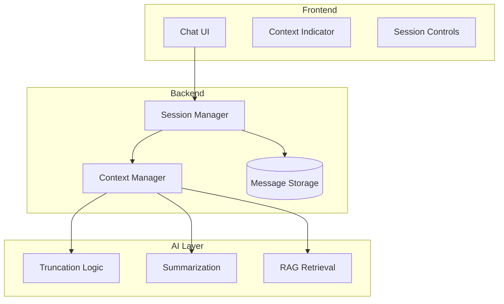

# Impact on Application Design

## Introduction

Context window limitations shape how you design AI applications. From UI decisions to backend architecture, understanding these constraints helps you build better user experiences and more robust systems.

### What We'll Cover

- Designing for context limits
- UI/UX for long conversations
- When to start new conversations
- Session management patterns

---

## Designing for Context Limits

Context limits influence every layer of your application:

### Architecture Considerations



### Design Principles

```python
design_principles = {
    "transparency": "Show users how much context remains",
    "graceful_degradation": "Conversation quality should decline smoothly, not suddenly",
    "user_control": "Let users decide when to start fresh",
    "smart_defaults": "Handle context automatically for most users",
    "persistence": "Store conversation history externally (not just context)",
}
```

---

## UI/UX for Long Conversations

### Context Indicator

Show users their context usage:

```jsx
// React component for context indicator
function ContextIndicator({ tokens, maxTokens, threshold = 0.8 }) {
  const percentage = (tokens / maxTokens) * 100;
  const isWarning = percentage > threshold * 100;
  
  return (
    <div className="context-indicator">
      <div 
        className={`progress-bar ${isWarning ? 'warning' : ''}`}
        style={{ width: `${percentage}%` }}
      />
      <span className="context-text">
        {isWarning 
          ? `Context ${percentage.toFixed(0)}% full - older messages may be forgotten`
          : `${percentage.toFixed(0)}% context used`
        }
      </span>
    </div>
  );
}
```

### Visual Indicators

```css
/* Fade old messages to indicate they may be summarized */
.message-container {
  --fade-start: 10;  /* Start fading after message 10 */
}

.message:nth-child(-n+10) {
  opacity: 0.6;
  position: relative;
}

.message:nth-child(-n+10)::after {
  content: "May be summarized";
  font-size: 10px;
  color: #888;
  position: absolute;
  bottom: 2px;
  right: 8px;
}
```

### Message Pinning UI

Let users mark important messages:

```jsx
function MessageWithPin({ message, onPin, isPinned }) {
  return (
    <div className={`message ${isPinned ? 'pinned' : ''}`}>
      <div className="message-content">{message.content}</div>
      <button 
        onClick={() => onPin(message.id)}
        className="pin-button"
        title={isPinned ? "Unpin (won't be forgotten)" : "Pin to remember"}
      >
        {isPinned ? '📌' : '📍'}
      </button>
    </div>
  );
}
```

---

## When to Start New Conversations

### Automatic Detection

```python
def should_start_new_conversation(
    context_usage: float,
    topic_shift_detected: bool,
    user_satisfaction: float,
    message_count: int
) -> dict:
    """
    Determine if a new conversation should be suggested.
    """
    
    reasons = []
    confidence = 0.0
    
    # Context nearly full
    if context_usage > 0.9:
        reasons.append("Context window is nearly full")
        confidence += 0.4
    
    # Major topic shift
    if topic_shift_detected:
        reasons.append("New topic detected")
        confidence += 0.3
    
    # Response quality declining
    if user_satisfaction < 0.6:
        reasons.append("Response quality may be declining")
        confidence += 0.2
    
    # Very long conversation
    if message_count > 100:
        reasons.append("Conversation is very long")
        confidence += 0.1
    
    return {
        "suggest_new": confidence > 0.5,
        "confidence": min(confidence, 1.0),
        "reasons": reasons,
        "message": format_suggestion(reasons) if reasons else None
    }


def format_suggestion(reasons: list) -> str:
    """Format user-friendly suggestion message"""
    return f"""
    💡 You might want to start a new conversation:
    {chr(10).join(f'• {r}' for r in reasons)}
    
    Starting fresh helps maintain response quality.
    Your conversation history is saved and can be referenced.
    """
```

### Topic Detection

```python
async def detect_topic_shift(
    recent_messages: list,
    new_message: str,
    threshold: float = 0.3
) -> bool:
    """
    Detect if the new message represents a significant topic shift.
    """
    
    # Get embeddings
    recent_embedding = await embed(
        " ".join([m["content"] for m in recent_messages[-5:]])
    )
    new_embedding = await embed(new_message)
    
    # Calculate similarity
    similarity = cosine_similarity(recent_embedding, new_embedding)
    
    # Low similarity = topic shift
    return similarity < threshold
```

---

## Session Management Patterns

### Session State

```python
from datetime import datetime, timedelta
from typing import Optional
import json

class ConversationSession:
    """
    Manage a single conversation session.
    """
    
    def __init__(self, session_id: str, user_id: str, model: str):
        self.session_id = session_id
        self.user_id = user_id
        self.model = model
        self.created_at = datetime.now()
        self.last_active = datetime.now()
        self.messages = []
        self.summary = None
        self.metadata = {}
    
    def add_message(self, role: str, content: str):
        self.messages.append({
            "role": role,
            "content": content,
            "timestamp": datetime.now().isoformat()
        })
        self.last_active = datetime.now()
    
    def is_expired(self, timeout: timedelta = timedelta(hours=24)) -> bool:
        return datetime.now() - self.last_active > timeout
    
    def get_context_for_api(self, max_tokens: int) -> list:
        """Get messages formatted for API, respecting token limits"""
        # Implementation uses strategies from previous lesson
        pass
    
    def to_dict(self) -> dict:
        return {
            "session_id": self.session_id,
            "user_id": self.user_id,
            "model": self.model,
            "created_at": self.created_at.isoformat(),
            "last_active": self.last_active.isoformat(),
            "messages": self.messages,
            "summary": self.summary,
            "metadata": self.metadata,
        }
    
    @classmethod
    def from_dict(cls, data: dict) -> "ConversationSession":
        session = cls(
            session_id=data["session_id"],
            user_id=data["user_id"],
            model=data["model"]
        )
        session.created_at = datetime.fromisoformat(data["created_at"])
        session.last_active = datetime.fromisoformat(data["last_active"])
        session.messages = data["messages"]
        session.summary = data.get("summary")
        session.metadata = data.get("metadata", {})
        return session


class SessionManager:
    """
    Manage multiple conversation sessions per user.
    """
    
    def __init__(self, storage):
        self.storage = storage  # Database, Redis, etc.
    
    async def get_or_create_session(
        self, 
        user_id: str,
        session_id: Optional[str] = None
    ) -> ConversationSession:
        """Get existing session or create new one"""
        
        if session_id:
            session = await self.storage.get(f"session:{session_id}")
            if session:
                return ConversationSession.from_dict(session)
        
        # Create new session
        new_id = generate_session_id()
        session = ConversationSession(
            session_id=new_id,
            user_id=user_id,
            model="gpt-4"
        )
        await self.save_session(session)
        return session
    
    async def save_session(self, session: ConversationSession):
        """Persist session to storage"""
        await self.storage.set(
            f"session:{session.session_id}",
            session.to_dict()
        )
        
        # Also index by user for listing
        user_sessions = await self.storage.get(f"user:{session.user_id}:sessions") or []
        if session.session_id not in user_sessions:
            user_sessions.append(session.session_id)
            await self.storage.set(f"user:{session.user_id}:sessions", user_sessions)
    
    async def list_user_sessions(self, user_id: str) -> list:
        """List all sessions for a user"""
        session_ids = await self.storage.get(f"user:{user_id}:sessions") or []
        sessions = []
        for sid in session_ids:
            session_data = await self.storage.get(f"session:{sid}")
            if session_data:
                sessions.append({
                    "id": sid,
                    "created": session_data["created_at"],
                    "last_active": session_data["last_active"],
                    "message_count": len(session_data["messages"]),
                    "preview": session_data["messages"][0]["content"][:50] if session_data["messages"] else "Empty"
                })
        return sorted(sessions, key=lambda s: s["last_active"], reverse=True)
```

### Multi-Session UI

```jsx
function ConversationSidebar({ sessions, activeSession, onSelectSession, onNewSession }) {
  return (
    <aside className="conversation-sidebar">
      <button onClick={onNewSession} className="new-conversation-btn">
        ➕ New Conversation
      </button>
      
      <div className="session-list">
        {sessions.map(session => (
          <div 
            key={session.id}
            className={`session-item ${session.id === activeSession ? 'active' : ''}`}
            onClick={() => onSelectSession(session.id)}
          >
            <div className="session-preview">{session.preview}...</div>
            <div className="session-meta">
              {session.message_count} messages • {formatDate(session.last_active)}
            </div>
          </div>
        ))}
      </div>
    </aside>
  );
}
```

---

## Complete Application Pattern

### API Design

```python
from fastapi import FastAPI, HTTPException
from pydantic import BaseModel

app = FastAPI()

class ChatRequest(BaseModel):
    session_id: str | None = None
    message: str
    pin_message: bool = False

class ChatResponse(BaseModel):
    response: str
    session_id: str
    context_usage: float
    suggestion: str | None = None

@app.post("/chat", response_model=ChatResponse)
async def chat(request: ChatRequest, user_id: str = Depends(get_current_user)):
    # Get or create session
    session = await session_manager.get_or_create_session(
        user_id=user_id,
        session_id=request.session_id
    )
    
    # Add user message
    session.add_message("user", request.message)
    if request.pin_message:
        session.metadata.setdefault("pinned", []).append(len(session.messages) - 1)
    
    # Get context for API (respecting limits)
    context = session.get_context_for_api(max_tokens=120000)
    context_usage = count_tokens(context) / 120000
    
    # Call LLM
    response = await call_llm(context)
    
    # Add assistant message
    session.add_message("assistant", response)
    
    # Save session
    await session_manager.save_session(session)
    
    # Check if we should suggest new conversation
    suggestion_info = should_start_new_conversation(
        context_usage=context_usage,
        topic_shift_detected=await detect_topic_shift(session.messages, request.message),
        user_satisfaction=1.0,  # Could track from feedback
        message_count=len(session.messages)
    )
    
    return ChatResponse(
        response=response,
        session_id=session.session_id,
        context_usage=context_usage,
        suggestion=suggestion_info.get("message")
    )

@app.get("/sessions")
async def list_sessions(user_id: str = Depends(get_current_user)):
    return await session_manager.list_user_sessions(user_id)

@app.post("/sessions")
async def create_session(user_id: str = Depends(get_current_user)):
    session = await session_manager.get_or_create_session(user_id)
    return {"session_id": session.session_id}

@app.get("/sessions/{session_id}/context")
async def get_context_info(session_id: str, user_id: str = Depends(get_current_user)):
    session = await session_manager.get_or_create_session(user_id, session_id)
    context = session.get_context_for_api(max_tokens=120000)
    
    return {
        "total_messages": len(session.messages),
        "context_messages": len(context),
        "token_usage": count_tokens(context),
        "max_tokens": 120000,
        "usage_percent": count_tokens(context) / 120000 * 100,
        "oldest_in_context": context[1]["content"][:100] if len(context) > 1 else None,
    }
```

---

## Best Practices Checklist

### For Developers

```python
best_practices = [
    "Store full conversation history externally (not just in context)",
    "Implement context management before you need it",
    "Use cheaper models for summarization tasks",
    "Test with conversations 2-3x longer than expected",
    "Monitor context usage in production",
    "Provide clear feedback when context is managed",
    "Allow users to control their experience (new sessions, pinning)",
    "Design for graceful degradation, not sudden failure",
]
```

### For UX Designers

```
✅ Show context usage clearly but not intrusively
✅ Provide obvious way to start new conversations
✅ Indicate when messages may be summarized/forgotten
✅ Allow pinning of important messages
✅ Show conversation history in sidebar
✅ Preview what context the model will see
❌ Don't let context fill silently with no indication
❌ Don't require users to understand tokens
❌ Don't hide session management in settings
```

---

## Hands-on Exercise

### Your Task

Design a complete context-aware chat interface:

```python
class ContextAwareChatApp:
    """
    Complete implementation with all the patterns from this lesson.
    """
    
    def __init__(self, model: str, max_context: int):
        self.session_manager = SessionManager(storage=InMemoryStorage())
        self.model = model
        self.max_context = max_context
    
    async def handle_message(
        self,
        user_id: str,
        session_id: str | None,
        message: str,
        options: dict = None
    ) -> dict:
        """
        Handle an incoming message with full context management.
        
        Returns:
            {
                "response": str,
                "session_id": str,
                "context_info": {
                    "usage_percent": float,
                    "messages_in_context": int,
                    "oldest_message": str | None,
                },
                "suggestions": [str],  # Any suggestions for user
            }
        """
        # TODO: Implement using patterns from this lesson
        pass
    
    async def get_session_preview(self, session_id: str) -> dict:
        """Get preview info about a session"""
        # TODO: Implement
        pass
    
    async def start_new_session(self, user_id: str, initial_context: str = None) -> str:
        """Create a new session, optionally with context from old session"""
        # TODO: Implement
        pass

# Test the complete flow
async def demo():
    app = ContextAwareChatApp("gpt-4", 128000)
    
    # Simulate a conversation that exceeds context
    for i in range(200):
        result = await app.handle_message(
            user_id="user123",
            session_id=None,  # Continue current session
            message=f"This is message {i} with some content."
        )
        
        print(f"Message {i}: {result['context_info']['usage_percent']:.1f}% context used")
        
        if result.get("suggestions"):
            print(f"Suggestions: {result['suggestions']}")
```

---

## Summary

✅ **Context limits shape application architecture** at every layer

✅ **Show context usage** to users with clear indicators

✅ **Detect when to suggest new conversations** based on usage and topic shifts

✅ **Implement session management** for persistent conversation history

✅ **Design for graceful degradation** not sudden failure

✅ **Give users control** over their experience (pinning, new sessions)

**Next Lesson:** [Model Parameters and Settings](../05-model-parameters-settings/00-model-parameters-settings.md)

---

## Further Reading

- [ChatGPT UI Patterns](https://www.nngroup.com/articles/ai-ux-guidelines/) — Nielsen Norman Group
- [Conversation Design Guidelines](https://designguidelines.withgoogle.com/conversation/) — Google
- [Building Chat Applications](https://platform.openai.com/docs/guides/chat) — OpenAI

---

## Navigation

| Previous | Up | Next |
|----------|-------|------|
| [Context Strategies](./05-context-strategies.md) | [Context Windows](./00-context-windows.md) | [Model Parameters](../05-model-parameters-settings/00-model-parameters-settings.md) |

<!-- 
Sources Consulted:
- OpenAI Chat Completions API: https://platform.openai.com/docs/api-reference/chat
- Anthropic Conversation Design: https://docs.anthropic.com/en/docs/build-with-claude/memory
-->

