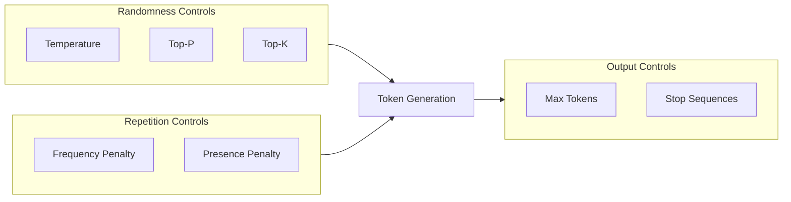

# Model Parameters & Settings

## Overview

Model parameters control how LLMs generate text. Understanding these settings helps you fine-tune outputs for specific use cases—from deterministic code generation to creative brainstorming.

Every API call accepts parameters that affect randomness, length, repetition, and output format. Mastering these settings is essential for building production-quality AI applications.

## What You'll Learn

This lesson covers eight essential topics:

1. **[Temperature](./01-temperature.md)** — Controlling randomness and creativity
2. **[Top-P Sampling](./02-top-p.md)** — Nucleus sampling for dynamic vocabulary
3. **[Top-K Sampling](./03-top-k.md)** — Limiting token selection to top candidates
4. **[Penalties](./04-penalties.md)** — Frequency and presence penalties for diversity
5. **[Max Tokens](./05-max-tokens.md)** — Output length control and cost management
6. **[Stop Sequences](./06-stop-sequences.md)** — Custom termination triggers
7. **[Advanced Parameters](./07-advanced-parameters.md)** — Seeds, JSON mode, logprobs, and more
8. **[Parameter Combinations](./08-parameter-combinations.md)** — Settings for different use cases

## Prerequisites

Before starting this lesson, you should have:

- Completed [Context Windows](../04-context-windows/00-context-windows.md)
- Basic understanding of token generation
- Familiarity with LLM API concepts

## Why Parameters Matter

| Parameter | Effect | Use Case |
|-----------|--------|----------|
| **Temperature** | Randomness | Creative vs. deterministic |
| **Top-P** | Vocabulary diversity | Fine-grained randomness |
| **Max Tokens** | Response length | Cost and format control |
| **Penalties** | Repetition | Avoiding loops |
| **Stop Sequences** | Termination | Format control |

## Quick Parameter Overview

```python
from openai import OpenAI

client = OpenAI()

response = client.chat.completions.create(
    model="gpt-4",
    messages=[{"role": "user", "content": "Explain quantum computing"}],
    
    # Key parameters
    temperature=0.7,        # Creativity (0-2)
    top_p=1.0,              # Nucleus sampling (0-1)
    max_tokens=500,         # Output length limit
    frequency_penalty=0.0,  # Reduce repetition (-2 to 2)
    presence_penalty=0.0,   # Encourage new topics (-2 to 2)
    stop=["\n\n---"],       # Stop generation at these sequences
)
```

### Default Values

```python
# Most providers use these defaults
default_parameters = {
    "temperature": 1.0,
    "top_p": 1.0,
    "max_tokens": None,  # Model's maximum
    "frequency_penalty": 0.0,
    "presence_penalty": 0.0,
    "stop": None,
}
```

> **🤖 AI Context:** These parameters interact with each other. For example, using both temperature=0 and top_p=0.1 is redundant—temperature=0 already makes output deterministic.

## Parameter Impact Visualization



## Learning Path

Complete topics in order:

```
01-temperature.md
    ↓
02-top-p.md
    ↓
03-top-k.md
    ↓
04-penalties.md
    ↓
05-max-tokens.md
    ↓
06-stop-sequences.md
    ↓
07-advanced-parameters.md
    ↓
08-parameter-combinations.md
```

---

## Summary

This lesson explains how to control LLM behavior through parameters including temperature, top-p, penalties, and stop sequences. These settings are fundamental for optimizing AI outputs for any application.

**Next:** [Temperature](./01-temperature.md)

---

## Navigation

| Previous | Up | Next |
|----------|-------|------|
| [Context Windows](../04-context-windows/00-context-windows.md) | [AI/LLM Fundamentals](../00-overview.md) | [Temperature](./01-temperature.md) |

