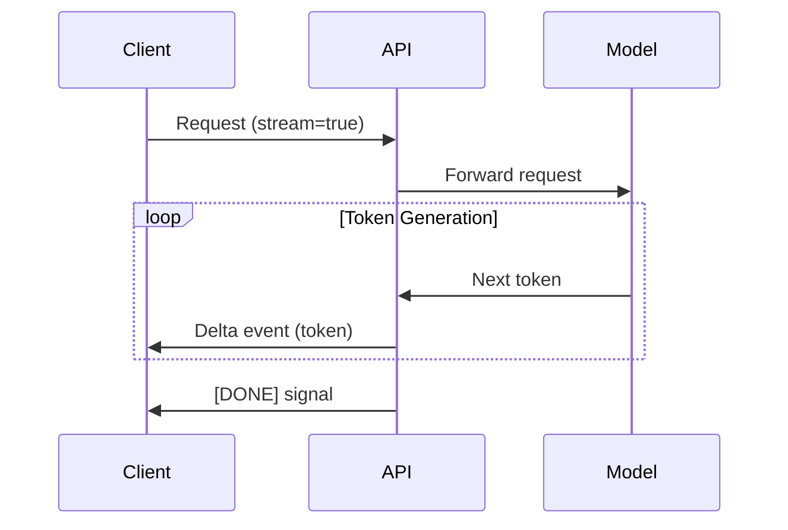

# Token-by-Token Generation

## Introduction

LLMs generate text one token at a time. Streaming exposes this natural generation process to your application, sending each token as it's produced. Understanding how this works helps you implement robust streaming solutions.

### What We'll Cover

- How streaming works internally
- Delta events and chunks
- Reconstructing full responses
- Buffer management
- Handling partial tokens

---

## How Streaming Works Internally

### The Generation Process



### Token-by-Token Output

```python
# The model generates one token at a time
# Each token is sent immediately

# Example generation: "Hello, how are you?"
# Token sequence: ["Hello", ",", " how", " are", " you", "?"]

# Streaming exposes this natural process:
# t=0.1s: "Hello"
# t=0.15s: ","
# t=0.2s: " how"
# t=0.25s: " are"
# t=0.3s: " you"
# t=0.35s: "?"
# t=0.4s: [DONE]
```

### Autoregressive Generation

```python
# LLMs are autoregressive: each token depends on all previous tokens

def visualize_generation():
    """
    Step 1: Generate token given: "User asked about weather"
            → Model outputs: "The"
    
    Step 2: Generate token given: "User asked about weather" + "The"
            → Model outputs: " weather"
    
    Step 3: Generate token given: "User asked about weather" + "The weather"
            → Model outputs: " today"
    
    ... continues until stop condition
    """
    pass
```

---

## Delta Events and Chunks

### What's in a Chunk?

```python
from openai import OpenAI

client = OpenAI()

response = client.chat.completions.create(
    model="gpt-4",
    messages=[{"role": "user", "content": "Hello!"}],
    stream=True
)

for chunk in response:
    print("Chunk received:")
    print(f"  ID: {chunk.id}")
    print(f"  Model: {chunk.model}")
    print(f"  Created: {chunk.created}")
    print(f"  Delta content: {chunk.choices[0].delta.content}")
    print(f"  Delta role: {chunk.choices[0].delta.role}")
    print(f"  Finish reason: {chunk.choices[0].finish_reason}")
    print()
```

### Example Chunk Sequence

```python
# First chunk (role only, no content)
{
    "id": "chatcmpl-123",
    "object": "chat.completion.chunk",
    "created": 1694268190,
    "model": "gpt-4",
    "choices": [{
        "index": 0,
        "delta": {"role": "assistant", "content": ""},
        "finish_reason": None
    }]
}

# Content chunks
{
    "choices": [{
        "index": 0,
        "delta": {"content": "Hello"},
        "finish_reason": None
    }]
}

{
    "choices": [{
        "index": 0,
        "delta": {"content": "!"},
        "finish_reason": None
    }]
}

# Final chunk
{
    "choices": [{
        "index": 0,
        "delta": {},
        "finish_reason": "stop"
    }]
}
```

### Delta vs Full Response

```python
# Non-streaming: Full message object
response.choices[0].message.content  # Complete string

# Streaming: Delta (change) objects
chunk.choices[0].delta.content  # Just the new content
```

---

## Reconstructing Full Responses

### Basic Accumulation

```python
def stream_and_accumulate(client, messages):
    """Collect streaming chunks into full response"""
    
    full_content = ""
    role = None
    finish_reason = None
    
    response = client.chat.completions.create(
        model="gpt-4",
        messages=messages,
        stream=True
    )
    
    for chunk in response:
        choice = chunk.choices[0]
        
        # Capture role from first chunk
        if choice.delta.role:
            role = choice.delta.role
        
        # Accumulate content
        if choice.delta.content:
            full_content += choice.delta.content
            print(choice.delta.content, end="", flush=True)
        
        # Capture finish reason from last chunk
        if choice.finish_reason:
            finish_reason = choice.finish_reason
    
    print()  # Newline after streaming
    
    return {
        "role": role,
        "content": full_content,
        "finish_reason": finish_reason
    }
```

### With Error Handling

```python
def robust_stream_accumulation(client, messages):
    """Stream with comprehensive error handling"""
    
    content_parts = []
    metadata = {
        "role": None,
        "finish_reason": None,
        "model": None,
        "id": None,
    }
    
    try:
        response = client.chat.completions.create(
            model="gpt-4",
            messages=messages,
            stream=True
        )
        
        for chunk in response:
            # Store metadata from first chunk
            if metadata["id"] is None:
                metadata["id"] = chunk.id
                metadata["model"] = chunk.model
            
            choice = chunk.choices[0]
            
            if choice.delta.role:
                metadata["role"] = choice.delta.role
            
            if choice.delta.content:
                content_parts.append(choice.delta.content)
                yield choice.delta.content  # Stream to caller
            
            if choice.finish_reason:
                metadata["finish_reason"] = choice.finish_reason
        
        # Store full content
        metadata["content"] = "".join(content_parts)
        
    except Exception as e:
        # Handle stream interruption
        metadata["error"] = str(e)
        metadata["content"] = "".join(content_parts)  # Partial content
        metadata["finish_reason"] = "error"
        raise
    
    return metadata
```

---

## Buffer Management

### Why Buffering Matters

```python
# Raw chunks arrive at variable rates
# Buffering smooths display for better UX

class StreamBuffer:
    """Buffer for smooth token display"""
    
    def __init__(self, min_chars: int = 1, max_buffer: int = 100):
        self.buffer = ""
        self.min_chars = min_chars
        self.max_buffer = max_buffer
    
    def add(self, content: str) -> str:
        """Add content, return what should be displayed"""
        self.buffer += content
        
        # Flush if buffer is full or has complete word
        if (len(self.buffer) >= self.max_buffer or 
            " " in self.buffer or 
            "\n" in self.buffer):
            output = self.buffer
            self.buffer = ""
            return output
        
        return ""  # Hold in buffer
    
    def flush(self) -> str:
        """Force flush remaining content"""
        output = self.buffer
        self.buffer = ""
        return output

# Usage
buffer = StreamBuffer()

for chunk in response:
    if chunk.choices[0].delta.content:
        to_display = buffer.add(chunk.choices[0].delta.content)
        if to_display:
            print(to_display, end="", flush=True)

# Don't forget final flush
print(buffer.flush(), flush=True)
```

### Sentence-Based Buffering

```python
import re

class SentenceBuffer:
    """Buffer that releases complete sentences"""
    
    def __init__(self):
        self.buffer = ""
        self.sentence_end = re.compile(r'[.!?]\s+')
    
    def add(self, content: str) -> list:
        """Add content, return list of complete sentences"""
        self.buffer += content
        
        sentences = []
        while True:
            match = self.sentence_end.search(self.buffer)
            if match:
                end_pos = match.end()
                sentences.append(self.buffer[:end_pos])
                self.buffer = self.buffer[end_pos:]
            else:
                break
        
        return sentences
    
    def flush(self) -> str:
        """Return remaining (possibly incomplete) content"""
        remaining = self.buffer
        self.buffer = ""
        return remaining
```

---

## Handling Partial Tokens

### The Partial Token Problem

```python
# Tokens don't always align with words or characters
# Unicode characters may split across chunks

# Example: Emoji 👋 might arrive as:
# Chunk 1: bytes 1-2 (incomplete)
# Chunk 2: bytes 3-4 (completes emoji)

# Or multi-byte characters:
# Chunk 1: "café" might arrive as "caf" + "é"
```

### UTF-8 Safe Streaming

```python
class UTF8StreamHandler:
    """Handle UTF-8 byte boundaries safely"""
    
    def __init__(self):
        self.pending_bytes = b""
    
    def process(self, new_bytes: bytes) -> str:
        """Process new bytes, return safe-to-display text"""
        combined = self.pending_bytes + new_bytes
        
        # Find last valid UTF-8 boundary
        for i in range(len(combined), 0, -1):
            try:
                text = combined[:i].decode('utf-8')
                self.pending_bytes = combined[i:]
                return text
            except UnicodeDecodeError:
                continue
        
        # All bytes are pending (incomplete sequence)
        self.pending_bytes = combined
        return ""
    
    def flush(self) -> str:
        """Try to decode remaining bytes"""
        if self.pending_bytes:
            try:
                text = self.pending_bytes.decode('utf-8')
                self.pending_bytes = b""
                return text
            except UnicodeDecodeError:
                return "�"  # Replacement character
        return ""
```

### Handling Token Boundaries

```python
def token_aware_streaming(response):
    """
    Most modern APIs handle this internally.
    But for raw byte streams, be aware of boundaries.
    """
    
    word_buffer = ""
    
    for chunk in response:
        content = chunk.choices[0].delta.content
        if content is None:
            continue
        
        word_buffer += content
        
        # Display complete words only
        if " " in word_buffer or "\n" in word_buffer:
            # Split at last space
            if " " in word_buffer:
                parts = word_buffer.rsplit(" ", 1)
                to_display = parts[0] + " "
                word_buffer = parts[1] if len(parts) > 1 else ""
            else:
                to_display = word_buffer
                word_buffer = ""
            
            print(to_display, end="", flush=True)
    
    # Final word
    if word_buffer:
        print(word_buffer, flush=True)
```

---

## Complete Streaming Implementation

```python
from openai import OpenAI
from dataclasses import dataclass
from typing import Iterator, Optional
import time

@dataclass
class StreamMetrics:
    """Metrics collected during streaming"""
    time_to_first_token: float
    total_time: float
    total_tokens: int
    tokens_per_second: float

class RobustStreamer:
    """Production-ready streaming handler"""
    
    def __init__(self, client: OpenAI):
        self.client = client
    
    def stream(
        self, 
        messages: list, 
        model: str = "gpt-4",
        **kwargs
    ) -> Iterator[str]:
        """Stream response, yielding content chunks"""
        
        start_time = time.time()
        first_token_time = None
        token_count = 0
        
        response = self.client.chat.completions.create(
            model=model,
            messages=messages,
            stream=True,
            **kwargs
        )
        
        try:
            for chunk in response:
                if chunk.choices[0].delta.content:
                    if first_token_time is None:
                        first_token_time = time.time()
                    
                    content = chunk.choices[0].delta.content
                    token_count += 1
                    yield content
        
        finally:
            end_time = time.time()
            
            self.last_metrics = StreamMetrics(
                time_to_first_token=first_token_time - start_time if first_token_time else 0,
                total_time=end_time - start_time,
                total_tokens=token_count,
                tokens_per_second=token_count / (end_time - start_time) if end_time > start_time else 0
            )
    
    def stream_to_string(self, messages: list, **kwargs) -> str:
        """Stream and return complete string"""
        return "".join(self.stream(messages, **kwargs))

# Usage
client = OpenAI()
streamer = RobustStreamer(client)

for chunk in streamer.stream([{"role": "user", "content": "Hello!"}]):
    print(chunk, end="", flush=True)

print(f"\nMetrics: {streamer.last_metrics}")
```

---

## Hands-on Exercise

### Your Task

Implement streaming with metrics and buffering:

```python
from openai import OpenAI
import time

client = OpenAI()

class MeteredStream:
    """Stream with real-time metrics"""
    
    def __init__(self):
        self.chunks_received = 0
        self.bytes_received = 0
        self.start_time = None
        self.first_token_time = None
        self.content = ""
    
    def stream(self, messages: list):
        self.start_time = time.time()
        
        response = client.chat.completions.create(
            model="gpt-4",
            messages=messages,
            stream=True
        )
        
        for chunk in response:
            self.chunks_received += 1
            
            if chunk.choices[0].delta.content:
                content = chunk.choices[0].delta.content
                
                if self.first_token_time is None:
                    self.first_token_time = time.time()
                
                self.bytes_received += len(content.encode('utf-8'))
                self.content += content
                
                yield content
    
    def get_metrics(self) -> dict:
        end_time = time.time()
        duration = end_time - self.start_time
        
        return {
            "chunks": self.chunks_received,
            "bytes": self.bytes_received,
            "ttft": self.first_token_time - self.start_time if self.first_token_time else None,
            "total_time": duration,
            "throughput": self.bytes_received / duration if duration > 0 else 0,
        }

# Test it
metered = MeteredStream()

print("Streaming response:\n")
for chunk in metered.stream([{"role": "user", "content": "Write a haiku about coding"}]):
    print(chunk, end="", flush=True)

print("\n\nMetrics:")
for key, value in metered.get_metrics().items():
    if isinstance(value, float):
        print(f"  {key}: {value:.3f}")
    else:
        print(f"  {key}: {value}")
```

---

## Summary

✅ **LLMs generate one token at a time** — streaming exposes this

✅ **Delta events** contain only the new content, not full message

✅ **Accumulate chunks** to reconstruct full response

✅ **Buffer management** smooths variable chunk rates

✅ **Handle encoding boundaries** for UTF-8 safety

✅ **Collect metrics** (TTFT, throughput) for monitoring

**Next:** [Streaming Transport Mechanisms](./03-transport-mechanisms.md)

---

## Navigation

| Previous | Up | Next |
|----------|-------|------|
| [Why Streaming Matters](./01-why-streaming-matters.md) | [Streaming Response Modes](./00-streaming-response-modes.md) | [Transport Mechanisms](./03-transport-mechanisms.md) |

