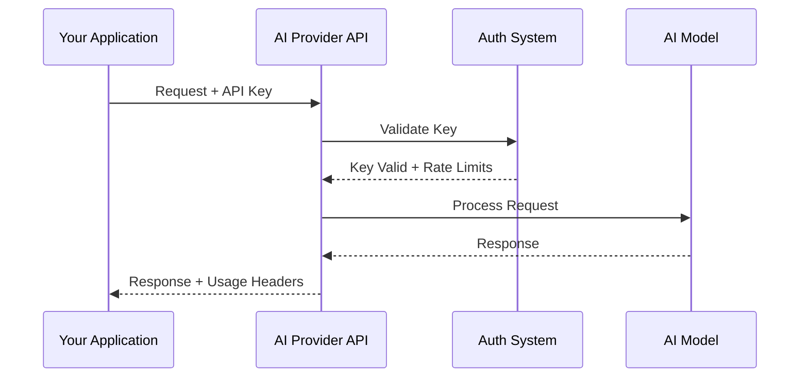

# API Authentication

## Introduction

Every AI API request begins with authentication—proving to the service that you're authorized to use it and identifying which account should be billed. Without proper authentication, your requests will fail before they even reach the AI model.

This lesson covers the essential authentication concepts you'll use with every major AI provider: OpenAI, Anthropic, Google, and others. We'll explore how API keys work, how to store them securely, and how to manage access across teams and projects.

### What We'll Cover

- Generating and managing API keys across providers
- Understanding different authentication methods (Bearer tokens, API keys, OAuth)
- Storing secrets securely using environment variables
- Implementing secure key storage with secret managers
- Planning key rotation strategies for production systems
- Managing organization and project-level access
- Understanding usage tiers and their implications

### Prerequisites

- Basic understanding of HTTP requests and headers
- Familiarity with command-line environments
- A code editor with terminal access
- (Optional) Accounts with OpenAI and/or Anthropic for hands-on practice

---

## How API Authentication Works

AI APIs use authentication to accomplish three goals:

1. **Identity verification**: Confirming you're an authorized user
2. **Usage tracking**: Measuring your consumption for billing
3. **Rate limiting**: Applying appropriate limits based on your tier



Most AI providers use **API keys**—long, random strings that act as both username and password. Unlike traditional login systems, there's no separate password; the key itself proves your identity.

---

## Authentication Methods by Provider

Different providers use slightly different authentication approaches:

| Provider | Authentication Method | Header Format |
|----------|----------------------|---------------|
| OpenAI | Bearer Token | `Authorization: Bearer sk-...` |
| Anthropic | API Key Header | `x-api-key: sk-ant-...` |
| Google Gemini | API Key (query or header) | `x-goog-api-key: ...` |
| Cohere | Bearer Token | `Authorization: Bearer ...` |
| Mistral | Bearer Token | `Authorization: Bearer ...` |

> **Note:** Despite the differences in header names, all these providers follow the same principle: include a secret key with every request to prove authorization.

---

## Lessons in This Section

| Lesson | Description |
|--------|-------------|
| [API Key Generation](./01-api-key-generation.md) | Creating and managing keys in provider dashboards |
| [Authentication Methods](./02-authentication-methods.md) | Bearer tokens, API keys, OAuth, and ephemeral keys |
| [Environment Variables](./03-environment-variables.md) | Using `.env` files and never committing secrets |
| [Secure Key Storage](./04-secure-key-storage.md) | Secret managers for production deployments |
| [Key Rotation](./05-key-rotation.md) | Rotation strategies and zero-downtime transitions |
| [Organization Access](./06-organization-access.md) | Team access, projects, and billing attribution |
| [Usage Tier System](./07-usage-tier-system.md) | Tier progression, limits, and enterprise options |

---

## Quick Start Example

Here's a minimal example showing authentication with both OpenAI and Anthropic:

**OpenAI (Bearer Token):**

```bash
curl https://api.openai.com/v1/chat/completions \
  -H "Authorization: Bearer $OPENAI_API_KEY" \
  -H "Content-Type: application/json" \
  -d '{"model": "gpt-4o", "messages": [{"role": "user", "content": "Hello"}]}'
```

**Anthropic (x-api-key Header):**

```bash
curl https://api.anthropic.com/v1/messages \
  -H "x-api-key: $ANTHROPIC_API_KEY" \
  -H "anthropic-version: 2023-06-01" \
  -H "Content-Type: application/json" \
  -d '{"model": "claude-sonnet-4-5", "max_tokens": 1024, "messages": [{"role": "user", "content": "Hello"}]}'
```

Both examples read the API key from environment variables (`$OPENAI_API_KEY` and `$ANTHROPIC_API_KEY`), which is the recommended approach we'll explore in detail.

---

## Security First Principles

Before diving into the specifics, internalize these security principles:

| ✅ Do | ❌ Don't |
|-------|---------|
| Store keys in environment variables | Hardcode keys in source code |
| Use `.gitignore` to exclude `.env` files | Commit secrets to version control |
| Rotate keys periodically | Use the same key forever |
| Use project-scoped keys when available | Share organization-level keys broadly |
| Monitor key usage for anomalies | Ignore usage reports |
| Revoke compromised keys immediately | Hope nobody noticed |

> **Warning:** An exposed API key can result in unauthorized charges to your account. Treat API keys like credit card numbers—never share them publicly.

---

## Summary

✅ API authentication proves your identity and enables usage tracking  
✅ Different providers use different header formats, but the principle is the same  
✅ API keys should be treated as sensitive credentials  
✅ Environment variables are the standard way to manage secrets locally  
✅ Production systems need secret managers and rotation strategies

**Next:** [API Key Generation](./01-api-key-generation.md)

---

## Further Reading

- [OpenAI API Authentication](https://platform.openai.com/docs/api-reference/authentication) — Official OpenAI auth documentation
- [Anthropic API Getting Started](https://platform.claude.com/docs/en/api/getting-started) — Claude API authentication
- [Google Gemini Authentication](https://ai.google.dev/gemini-api/docs/api-key) — Gemini API key setup

<!-- 
Sources Consulted:
- OpenAI API Reference Authentication: https://platform.openai.com/docs/api-reference/authentication
- Anthropic API Getting Started: https://platform.claude.com/docs/en/api/getting-started
- OpenAI Rate Limits Guide: https://platform.openai.com/docs/guides/rate-limits
-->
