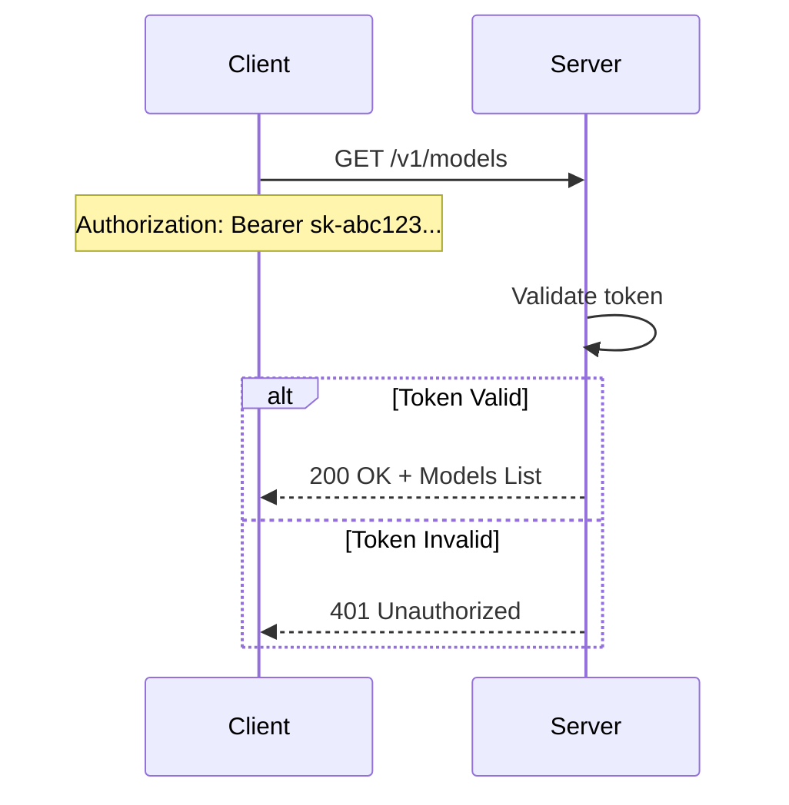
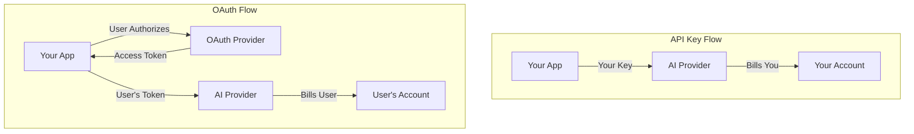
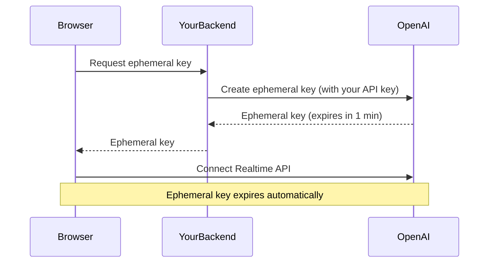

# Authentication Methods

## Introduction

Not all API authentication works the same way. While most AI providers use API keys, the *method* of transmitting those keys varies. Understanding these differences is essential for implementing correct authentication across providers and debugging auth failures.

This lesson explores the authentication methods you'll encounter: Bearer tokens, custom headers, query parameters, OAuth flows, and ephemeral keys for client-side use.

### What We'll Cover

- Bearer token format and usage (OpenAI, Cohere, Mistral)
- API key headers (Anthropic's `x-api-key`)
- Query parameter authentication (legacy APIs)
- OAuth for user-delegated access
- JWT-based API access patterns
- Ephemeral keys for client-side applications (Realtime API)

### Prerequisites

- Understanding of HTTP headers
- Basic knowledge of authentication concepts
- An API key from at least one provider

---

## Bearer Token Authentication

Bearer tokens are the most common authentication method for AI APIs. The format follows the HTTP Authorization header standard:

```http
Authorization: Bearer <your-api-key>
```

### How Bearer Tokens Work

The "Bearer" prefix tells the server to authenticate whoever "bears" (possesses) this token. It's simple and stateless—each request includes the full credential.



### Providers Using Bearer Tokens

| Provider | Header Format | Example |
|----------|---------------|---------|
| OpenAI | `Authorization: Bearer sk-...` | `Authorization: Bearer sk-proj-abc123` |
| Cohere | `Authorization: Bearer ...` | `Authorization: Bearer co-abc123` |
| Mistral | `Authorization: Bearer ...` | `Authorization: Bearer mis-abc123` |
| Hugging Face | `Authorization: Bearer hf_...` | `Authorization: Bearer hf_abc123` |

### Implementation Examples

**Python with requests:**

```python
import requests

response = requests.post(
    "https://api.openai.com/v1/chat/completions",
    headers={
        "Authorization": f"Bearer {api_key}",
        "Content-Type": "application/json"
    },
    json={
        "model": "gpt-4o",
        "messages": [{"role": "user", "content": "Hello!"}]
    }
)
```

**JavaScript with fetch:**

```javascript
const response = await fetch("https://api.openai.com/v1/chat/completions", {
  method: "POST",
  headers: {
    "Authorization": `Bearer ${process.env.OPENAI_API_KEY}`,
    "Content-Type": "application/json"
  },
  body: JSON.stringify({
    model: "gpt-4o",
    messages: [{ role: "user", content: "Hello!" }]
  })
});
```

**Using OpenAI SDK:**

```python
from openai import OpenAI

# SDK handles Bearer token automatically
client = OpenAI()  # Reads OPENAI_API_KEY from environment
response = client.chat.completions.create(
    model="gpt-4o",
    messages=[{"role": "user", "content": "Hello!"}]
)
```

---

## API Key Header Authentication

Some providers use custom headers instead of the standard `Authorization` header. Anthropic is the primary example.

### Anthropic's x-api-key Header

Anthropic requires two mandatory headers:

```http
x-api-key: sk-ant-api03-...
anthropic-version: 2023-06-01
```

### Why a Custom Header?

Custom headers can provide:
- Clear separation from OAuth tokens
- Simpler parsing on the server side
- Explicit versioning alongside authentication

### Implementation Examples

**curl:**

```bash
curl https://api.anthropic.com/v1/messages \
  -H "x-api-key: $ANTHROPIC_API_KEY" \
  -H "anthropic-version: 2023-06-01" \
  -H "content-type: application/json" \
  -d '{
    "model": "claude-sonnet-4-5",
    "max_tokens": 1024,
    "messages": [{"role": "user", "content": "Hello!"}]
  }'
```

**Python with Anthropic SDK:**

```python
import anthropic

# SDK handles headers automatically
client = anthropic.Anthropic()  # Reads ANTHROPIC_API_KEY from environment

message = client.messages.create(
    model="claude-sonnet-4-5",
    max_tokens=1024,
    messages=[{"role": "user", "content": "Hello!"}]
)
print(message.content[0].text)
```

**JavaScript/TypeScript:**

```typescript
import Anthropic from "@anthropic-ai/sdk";

const client = new Anthropic(); // Uses ANTHROPIC_API_KEY env var

const message = await client.messages.create({
  model: "claude-sonnet-4-5",
  max_tokens: 1024,
  messages: [{ role: "user", content: "Hello!" }]
});
```

---

## Query Parameter Authentication

Some APIs accept API keys as URL query parameters. This method is less secure and typically used for legacy or simpler integrations.

### Google Gemini Example

```bash
# Query parameter method (simpler but less secure)
curl "https://generativelanguage.googleapis.com/v1/models/gemini-pro:generateContent?key=$GOOGLE_API_KEY" \
  -H "Content-Type: application/json" \
  -d '{"contents":[{"parts":[{"text":"Hello"}]}]}'
```

### Security Concerns

| Aspect | Query Parameter | Header |
|--------|-----------------|--------|
| URL logging | Key in server logs | Not logged |
| Browser history | Visible in history | Not visible |
| Referrer leakage | Possible exposure | Protected |
| HTTPS protection | Encrypted in transit | Encrypted in transit |

> **Warning:** Avoid query parameter authentication when possible. Keys in URLs are more likely to be logged, cached, or exposed in referrer headers.

### When Query Parameters Are Acceptable

- Quick testing in development
- Systems where headers aren't easily configurable
- Internal tools behind additional auth layers

---

## OAuth for User-Delegated Access

OAuth is used when your application needs to act on behalf of a user, rather than using your own API credits. This is common in:

- Applications where users bring their own API keys
- Marketplace integrations
- SSO-enabled enterprise deployments

### OAuth vs. API Keys



### OAuth Implementation (Conceptual)

```javascript
// OAuth flow - user authorizes your app
// 1. Redirect user to authorization URL
const authUrl = `https://provider.com/oauth/authorize?
  client_id=${CLIENT_ID}&
  redirect_uri=${REDIRECT_URI}&
  scope=api.access`;

// 2. User authorizes, provider redirects with code
// 3. Exchange code for access token
const tokenResponse = await fetch("https://provider.com/oauth/token", {
  method: "POST",
  body: JSON.stringify({
    grant_type: "authorization_code",
    code: authorizationCode,
    client_id: CLIENT_ID,
    client_secret: CLIENT_SECRET
  })
});

// 4. Use access token for API calls
const { access_token } = await tokenResponse.json();
```

> **Note:** Most AI providers don't offer full OAuth flows yet. OAuth is more common with cloud platforms (GCP, Azure) that host AI services.

---

## JWT-Based API Access

JSON Web Tokens (JWTs) provide self-contained authentication with embedded claims. Some enterprise AI deployments use JWTs.

### JWT Structure

A JWT has three parts separated by dots:

```
header.payload.signature
```

```javascript
// Example JWT (decoded)
{
  // Header
  "alg": "RS256",
  "typ": "JWT"
}
{
  // Payload
  "sub": "user@company.com",
  "org_id": "org-abc123",
  "scope": "api.read api.write",
  "exp": 1735689600
}
// Signature validates the above
```

### Using JWTs with AI APIs

```python
import jwt
import time

# Generate JWT for service-to-service auth
payload = {
    "iss": "your-service",
    "sub": "service-account@your-org",
    "aud": "ai-provider",
    "exp": int(time.time()) + 3600,  # 1 hour
    "scope": "completions embeddings"
}

token = jwt.encode(payload, private_key, algorithm="RS256")

# Use JWT as Bearer token
headers = {
    "Authorization": f"Bearer {token}"
}
```

### When to Use JWTs

| Use Case | Standard API Key | JWT |
|----------|------------------|-----|
| Simple integrations | ✅ | ❌ Overkill |
| Enterprise SSO | ❌ | ✅ Preferred |
| Short-lived access | ❌ | ✅ Built-in expiry |
| Service-to-service | Either | ✅ With claims |

---

## Ephemeral Keys for Client-Side Use

Regular API keys should never be exposed in client-side code. But some features—like OpenAI's Realtime API—need client-side authentication.

### The Problem

```javascript
// ❌ NEVER DO THIS - Key exposed to anyone viewing source
const client = new OpenAI({
  apiKey: "sk-proj-abc123..." // Visible in browser!
});
```

### The Solution: Ephemeral Keys

Ephemeral keys are short-lived tokens generated by your backend specifically for client-side use.



### OpenAI Realtime API Example

**Backend (generates ephemeral key):**

```python
from openai import OpenAI

client = OpenAI()

# Generate ephemeral key for client-side use
response = client.realtime.sessions.create(
    model="gpt-4o-realtime-preview",
    voice="alloy"
)

ephemeral_key = response.client_secret.value
# Send this to the browser
```

**Frontend (uses ephemeral key):**

```javascript
// Safe - this key expires in 1 minute
const response = await fetch("/api/realtime-token");
const { ephemeral_key } = await response.json();

const pc = new RTCPeerConnection();
// Use ephemeral_key for WebRTC connection to Realtime API
```

### Ephemeral Key Properties

| Property | Value |
|----------|-------|
| Lifetime | ~1 minute |
| Scope | Single session |
| Rotation | Generate new per session |
| Exposure risk | Minimal (short-lived) |

---

## Provider-Specific Headers

Beyond authentication, providers require or accept additional headers:

### OpenAI Optional Headers

```http
Authorization: Bearer sk-proj-...
OpenAI-Organization: org-abc123
OpenAI-Project: proj-xyz789
X-Client-Request-Id: your-trace-id-123
```

| Header | Purpose |
|--------|---------|
| `OpenAI-Organization` | Specify org for multi-org accounts |
| `OpenAI-Project` | Route to specific project |
| `X-Client-Request-Id` | Your custom trace ID for debugging |

### Anthropic Required Headers

```http
x-api-key: sk-ant-...
anthropic-version: 2023-06-01
content-type: application/json
anthropic-beta: feature-name  # For beta features
```

| Header | Required | Purpose |
|--------|----------|---------|
| `x-api-key` | Yes | Authentication |
| `anthropic-version` | Yes | API version |
| `content-type` | Yes | Always `application/json` |
| `anthropic-beta` | No | Enable beta features |

---

## Common Authentication Errors

| Error Code | Meaning | Solution |
|------------|---------|----------|
| 401 | Invalid or missing key | Check key is correct and included |
| 403 | Key lacks permission | Verify key scope/permissions |
| 429 | Rate limit exceeded | Slow down or upgrade tier |

### Debugging Authentication Issues

```python
import requests

response = requests.post(
    "https://api.openai.com/v1/chat/completions",
    headers={"Authorization": f"Bearer {api_key}"},
    json={"model": "gpt-4o", "messages": []}
)

if response.status_code == 401:
    print("Check your API key:")
    print(f"  - Key starts with: {api_key[:10]}...")
    print(f"  - Key length: {len(api_key)}")
    print("  - Is it the correct provider's key?")
```

---

## Hands-on Exercise

### Your Task

Test authentication with multiple methods and debug a failing request.

### Requirements

1. Make a successful request using Bearer token (OpenAI or similar)
2. Make a successful request using x-api-key header (if you have Anthropic access)
3. Intentionally break authentication and observe the error
4. Add custom headers (like `X-Client-Request-Id`) to a request

### Expected Result

- Successful responses from both authentication methods
- Understanding of 401 vs 403 error differences
- Ability to add custom headers for debugging

<details>
<summary>💡 Hints</summary>

- Use `curl -v` to see request/response headers
- Try truncating your API key to trigger a 401
- Use an invalid model name to trigger a different error (not auth-related)
</details>

<details>
<summary>✅ Solution</summary>

```bash
# 1. Bearer token (OpenAI)
curl -v https://api.openai.com/v1/models \
  -H "Authorization: Bearer $OPENAI_API_KEY"

# 2. x-api-key header (Anthropic)
curl -v https://api.anthropic.com/v1/messages \
  -H "x-api-key: $ANTHROPIC_API_KEY" \
  -H "anthropic-version: 2023-06-01" \
  -H "content-type: application/json" \
  -d '{"model": "claude-sonnet-4-5", "max_tokens": 10, "messages": [{"role": "user", "content": "Hi"}]}'

# 3. Broken auth (invalid key)
curl https://api.openai.com/v1/models \
  -H "Authorization: Bearer sk-invalid-key"
# Should return 401 Unauthorized

# 4. Custom request ID
curl https://api.openai.com/v1/models \
  -H "Authorization: Bearer $OPENAI_API_KEY" \
  -H "X-Client-Request-Id: my-debug-trace-12345"
```

</details>

---

## Summary

✅ Bearer tokens use `Authorization: Bearer <key>` format (OpenAI, Cohere, Mistral)  
✅ Anthropic uses custom `x-api-key` header plus `anthropic-version`  
✅ Avoid query parameter authentication in production  
✅ OAuth enables user-delegated access (users bring their own credentials)  
✅ Ephemeral keys enable safe client-side authentication for features like Realtime API  
✅ Always use SDKs when possible—they handle headers automatically

**Next:** [Environment Variables](./03-environment-variables.md)

---

## Further Reading

- [OpenAI API Authentication](https://platform.openai.com/docs/api-reference/authentication) — Bearer token details
- [Anthropic API Headers](https://platform.claude.com/docs/en/api/getting-started) — Required headers
- [OAuth 2.0 Simplified](https://oauth.net/2/) — OAuth specification
- [OpenAI Realtime API](https://platform.openai.com/docs/guides/realtime) — Ephemeral key usage

<!-- 
Sources Consulted:
- OpenAI API Reference Authentication: https://platform.openai.com/docs/api-reference/authentication
- Anthropic API Getting Started: https://platform.claude.com/docs/en/api/getting-started
- OpenAI Realtime API Guide: https://platform.openai.com/docs/guides/realtime
-->
