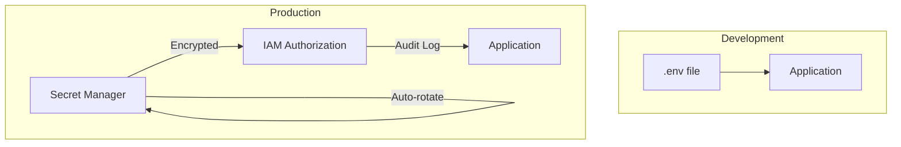
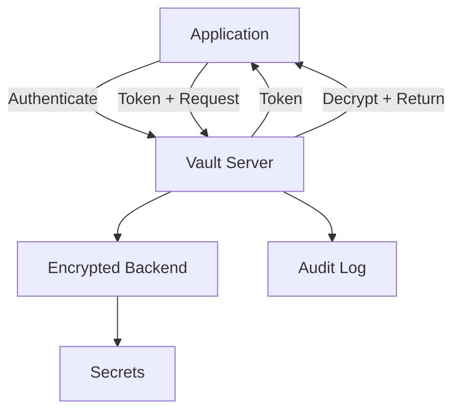
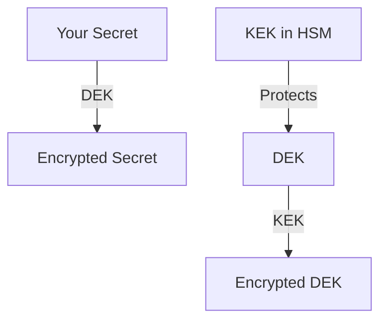
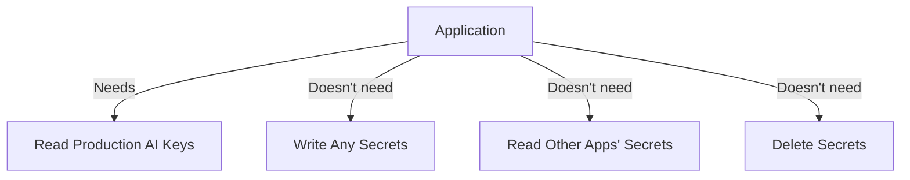
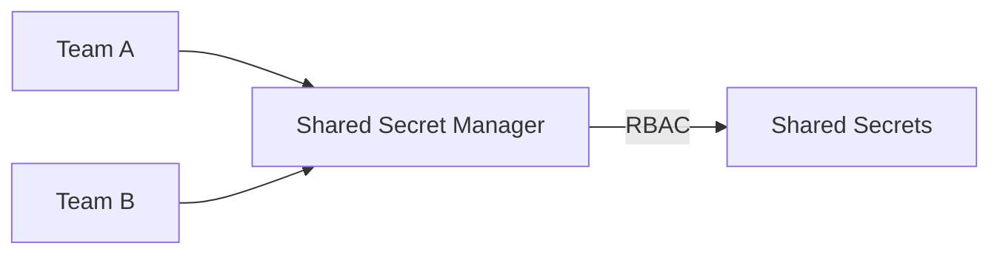

# Secure Key Storage Practices

## Introduction

Environment variables work well for local development, but production systems need more robust secret management. Secret management services provide encryption, access control, audit logging, and automatic rotation—essential features for any serious application.

This lesson covers production-grade secret storage solutions: from cloud secret managers to self-hosted options like HashiCorp Vault.

### What We'll Cover

- Why environment variables aren't enough for production
- Cloud secret managers (AWS, GCP, Azure)
- HashiCorp Vault for self-hosted secrets
- Key encryption at rest and in transit
- Access control and least privilege
- Audit logging for compliance
- Cross-organization key sharing patterns

### Prerequisites

- Understanding of environment variables
- Basic cloud platform familiarity (any provider)
- Understanding of encryption concepts

---

## Why Production Needs More Than .env Files

Environment variables have limitations in production:

| Issue | Problem | Secret Manager Solution |
|-------|---------|------------------------|
| No encryption at rest | Keys stored as plain text | Encrypted storage |
| No access control | Anyone with server access sees all | Role-based access |
| No audit trail | Can't track who accessed what | Full audit logging |
| Manual rotation | Downtime during key updates | Automatic rotation |
| No versioning | Can't roll back changes | Version history |



---

## AWS Secrets Manager

AWS Secrets Manager is the most common choice for AWS-hosted applications.

### Creating a Secret

**Via AWS Console:**

1. Navigate to Secrets Manager in AWS Console
2. Click "Store a new secret"
3. Choose "Other type of secret"
4. Enter key-value pairs:
   - `OPENAI_API_KEY`: `sk-proj-...`
   - `ANTHROPIC_API_KEY`: `sk-ant-...`
5. Name the secret (e.g., `myapp/production/ai-keys`)
6. Configure rotation (optional)

**Via AWS CLI:**

```bash
aws secretsmanager create-secret \
    --name "myapp/production/ai-keys" \
    --secret-string '{"OPENAI_API_KEY":"sk-proj-...","ANTHROPIC_API_KEY":"sk-ant-..."}'
```

### Retrieving Secrets in Python

```python
import json
import boto3
from botocore.exceptions import ClientError

def get_secret(secret_name: str, region: str = "us-east-1") -> dict:
    """Retrieve secret from AWS Secrets Manager."""
    client = boto3.client("secretsmanager", region_name=region)
    
    try:
        response = client.get_secret_value(SecretId=secret_name)
        return json.loads(response["SecretString"])
    except ClientError as e:
        raise RuntimeError(f"Failed to retrieve secret: {e}")

# Usage
secrets = get_secret("myapp/production/ai-keys")
openai_key = secrets["OPENAI_API_KEY"]
```

### Retrieving Secrets in JavaScript

```javascript
import { SecretsManagerClient, GetSecretValueCommand } from "@aws-sdk/client-secrets-manager";

async function getSecret(secretName, region = "us-east-1") {
  const client = new SecretsManagerClient({ region });
  const command = new GetSecretValueCommand({ SecretId: secretName });
  
  const response = await client.send(command);
  return JSON.parse(response.SecretString);
}

// Usage
const secrets = await getSecret("myapp/production/ai-keys");
const openaiKey = secrets.OPENAI_API_KEY;
```

### AWS Secrets Manager Pricing

| Feature | Cost |
|---------|------|
| Secret storage | $0.40/secret/month |
| API calls | $0.05/10,000 calls |
| Rotation | Included |

> **Tip:** Cache secrets in memory to reduce API calls and costs. Refresh every few minutes or on application restart.

---

## Google Cloud Secret Manager

Google Cloud Secret Manager works similarly but integrates with GCP IAM.

### Creating a Secret

**Via gcloud CLI:**

```bash
# Create the secret
echo -n "sk-proj-your-openai-key" | \
  gcloud secrets create openai-api-key --data-file=-

# Add a new version
echo -n "sk-proj-new-key-value" | \
  gcloud secrets versions add openai-api-key --data-file=-
```

### Retrieving Secrets in Python

```python
from google.cloud import secretmanager

def get_secret(project_id: str, secret_id: str, version: str = "latest") -> str:
    """Retrieve secret from Google Cloud Secret Manager."""
    client = secretmanager.SecretManagerServiceClient()
    name = f"projects/{project_id}/secrets/{secret_id}/versions/{version}"
    
    response = client.access_secret_version(name=name)
    return response.payload.data.decode("UTF-8")

# Usage
openai_key = get_secret("my-project", "openai-api-key")
```

### Secret Versioning

GCP automatically versions secrets:

```bash
# List all versions
gcloud secrets versions list openai-api-key

# Access specific version
gcloud secrets versions access 2 --secret=openai-api-key

# Disable old version
gcloud secrets versions disable 1 --secret=openai-api-key
```

---

## Azure Key Vault

Azure Key Vault is Microsoft's secret management solution.

### Creating a Secret

**Via Azure CLI:**

```bash
# Create Key Vault
az keyvault create \
    --name myapp-secrets \
    --resource-group myapp-rg \
    --location eastus

# Store secret
az keyvault secret set \
    --vault-name myapp-secrets \
    --name OpenAIApiKey \
    --value "sk-proj-..."
```

### Retrieving Secrets in Python

```python
from azure.identity import DefaultAzureCredential
from azure.keyvault.secrets import SecretClient

def get_secret(vault_url: str, secret_name: str) -> str:
    """Retrieve secret from Azure Key Vault."""
    credential = DefaultAzureCredential()
    client = SecretClient(vault_url=vault_url, credential=credential)
    
    secret = client.get_secret(secret_name)
    return secret.value

# Usage
vault_url = "https://myapp-secrets.vault.azure.net/"
openai_key = get_secret(vault_url, "OpenAIApiKey")
```

---

## HashiCorp Vault (Self-Hosted)

Vault is the leading open-source secret management solution, suitable for multi-cloud or on-premises deployments.

### Vault Architecture



### Basic Vault Usage

**Start Vault (development mode):**

```bash
vault server -dev
export VAULT_ADDR="http://127.0.0.1:8200"
export VAULT_TOKEN="dev-token"
```

**Store secrets:**

```bash
vault kv put secret/myapp/ai-keys \
    openai_api_key="sk-proj-..." \
    anthropic_api_key="sk-ant-..."
```

**Retrieve secrets:**

```bash
vault kv get secret/myapp/ai-keys
```

### Python HVAC Client

```python
import hvac

def get_vault_secrets(path: str) -> dict:
    """Retrieve secrets from HashiCorp Vault."""
    client = hvac.Client(
        url="https://vault.mycompany.com:8200",
        token=os.environ.get("VAULT_TOKEN")
    )
    
    response = client.secrets.kv.v2.read_secret_version(path=path)
    return response["data"]["data"]

# Usage
secrets = get_vault_secrets("myapp/ai-keys")
openai_key = secrets["openai_api_key"]
```

### Vault vs. Cloud Secret Managers

| Feature | Vault | Cloud Managers |
|---------|-------|----------------|
| Multi-cloud | ✅ Works everywhere | ❌ Vendor-specific |
| Self-hosted | ✅ Full control | ❌ Managed only |
| Setup complexity | Higher | Lower |
| Dynamic secrets | ✅ Advanced | Limited |
| Cost | Infrastructure | Per-secret + API |

---

## Key Encryption Concepts

Understanding encryption is essential for secure key management.

### Encryption at Rest

Secrets are encrypted when stored:


All major secret managers use AES-256 encryption at rest.

### Encryption in Transit

Secrets are encrypted during transmission:


Always use HTTPS/TLS for secret retrieval. Never retrieve secrets over unencrypted connections.

### Envelope Encryption

Most secret managers use envelope encryption:

1. A **Data Encryption Key (DEK)** encrypts your secret
2. A **Key Encryption Key (KEK)** encrypts the DEK
3. The KEK is stored in a Hardware Security Module (HSM)



---

## Access Control and Least Privilege

### Role-Based Access Control (RBAC)

Define roles that match actual job functions:

| Role | Permissions | Example Users |
|------|-------------|---------------|
| Secret Admin | Create, update, delete, rotate | Security team |
| Secret Reader | Read specific secrets | Application service accounts |
| Auditor | View access logs | Compliance team |
| None | No access | Everyone else |

### AWS IAM Policy Example

```json
{
  "Version": "2012-10-17",
  "Statement": [
    {
      "Effect": "Allow",
      "Action": [
        "secretsmanager:GetSecretValue"
      ],
      "Resource": [
        "arn:aws:secretsmanager:us-east-1:123456789:secret:myapp/production/*"
      ]
    }
  ]
}
```

### Principle of Least Privilege



Grant only the minimum permissions required:

| ❌ Too Broad | ✅ Just Right |
|--------------|---------------|
| `secretsmanager:*` | `secretsmanager:GetSecretValue` |
| `Resource: *` | `Resource: arn:...myapp/production/*` |
| Admin role | Custom read-only role |

---

## Audit Logging

Audit logs answer: "Who accessed what secret, when?"

### AWS CloudTrail Integration

```json
{
  "eventTime": "2025-01-15T10:30:45Z",
  "eventName": "GetSecretValue",
  "userIdentity": {
    "arn": "arn:aws:sts::123456789:assumed-role/MyAppRole/instance-1"
  },
  "requestParameters": {
    "secretId": "myapp/production/ai-keys"
  },
  "sourceIPAddress": "10.0.1.50"
}
```

### What to Monitor

| Event | Alert Level | Action |
|-------|-------------|--------|
| Normal read by known role | Info | Log only |
| Read from unusual IP | Warning | Investigate |
| Failed authentication | Warning | Review access |
| Secret deletion | Critical | Immediate review |
| Multiple failed reads | Critical | Possible attack |

### Setting Up Alerts

```python
# Example: CloudWatch alert for unusual access
import boto3

cloudwatch = boto3.client("cloudwatch")

cloudwatch.put_metric_alarm(
    AlarmName="SecretAccessAnomaly",
    MetricName="SecretAccessCount",
    Namespace="MyApp/Security",
    Statistic="Sum",
    Period=300,
    EvaluationPeriods=1,
    Threshold=100,
    ComparisonOperator="GreaterThanThreshold",
    AlarmActions=["arn:aws:sns:us-east-1:123456789:security-alerts"]
)
```

---

## Cross-Organization Key Sharing

Sometimes you need to share API keys across teams or organizations safely.

### Anti-Patterns

| ❌ Don't Do This | Risk |
|------------------|------|
| Email the key | Unencrypted, logged, forwarded |
| Slack/Teams message | Stored in message history |
| Shared spreadsheet | No access control |
| Hardcode in shared repo | Exposed to all contributors |

### Safe Sharing Patterns

**Option 1: Shared Secret Manager**



**Option 2: Secret References**

Instead of sharing the actual key, share access to where it lives:

```yaml
# Config file (safe to share)
secrets:
  openai_key:
    source: aws-secrets-manager
    path: shared/ai-keys/openai
    # Team B is granted read access via IAM
```

**Option 3: Provider Features**

OpenAI and Anthropic support organization-level controls:

- Create organization-scoped keys
- Invite team members with specific roles
- Use separate projects for cost tracking

---

## Caching Secrets

Fetching secrets on every request is slow and expensive. Implement caching:

```python
import time
from functools import lru_cache
from typing import Optional

class SecretCache:
    def __init__(self, ttl_seconds: int = 300):
        self._cache: dict = {}
        self._timestamps: dict = {}
        self.ttl = ttl_seconds
    
    def get(self, key: str) -> Optional[str]:
        """Get cached secret if not expired."""
        if key in self._cache:
            if time.time() - self._timestamps[key] < self.ttl:
                return self._cache[key]
        return None
    
    def set(self, key: str, value: str):
        """Cache a secret."""
        self._cache[key] = value
        self._timestamps[key] = time.time()

# Usage
cache = SecretCache(ttl_seconds=300)  # 5-minute cache

def get_openai_key() -> str:
    cached = cache.get("openai_api_key")
    if cached:
        return cached
    
    # Fetch from secret manager
    secrets = get_secret("myapp/production/ai-keys")
    cache.set("openai_api_key", secrets["OPENAI_API_KEY"])
    return secrets["OPENAI_API_KEY"]
```

### Caching Best Practices

| Practice | Reason |
|----------|--------|
| TTL of 5-15 minutes | Balance freshness vs. performance |
| Refresh on error | Catch rotated keys quickly |
| Memory-only cache | Don't persist decrypted secrets |
| Clear on shutdown | Don't leave secrets in memory |

---

## Hands-on Exercise

### Your Task

Implement a secret management abstraction that works with multiple backends.

### Requirements

1. Create a `SecretManager` interface/class
2. Implement at least two backends:
   - Environment variables (for local dev)
   - AWS Secrets Manager (or mock it)
3. Add basic caching
4. Include error handling for missing secrets

### Expected Result

```python
# Works with env vars locally
manager = SecretManager(backend="env")
key = manager.get("OPENAI_API_KEY")

# Works with AWS in production
manager = SecretManager(backend="aws", secret_path="myapp/prod")
key = manager.get("OPENAI_API_KEY")
```

<details>
<summary>💡 Hints</summary>

- Use an abstract base class or Protocol for the interface
- Environment backend just wraps `os.environ.get()`
- Mock AWS by storing secrets in a dictionary
- Cache at the manager level, not backend level
</details>

<details>
<summary>✅ Solution</summary>

```python
import os
import time
from abc import ABC, abstractmethod
from typing import Optional

class SecretBackend(ABC):
    @abstractmethod
    def get_secret(self, key: str) -> Optional[str]:
        pass

class EnvBackend(SecretBackend):
    def get_secret(self, key: str) -> Optional[str]:
        return os.environ.get(key)

class AWSBackend(SecretBackend):
    def __init__(self, secret_path: str):
        self.secret_path = secret_path
        # In real code: self._fetch_all_secrets()
        self._secrets = {
            "OPENAI_API_KEY": "sk-proj-mock-key",
            "ANTHROPIC_API_KEY": "sk-ant-mock-key"
        }
    
    def get_secret(self, key: str) -> Optional[str]:
        return self._secrets.get(key)

class SecretManager:
    def __init__(self, backend: str = "env", **kwargs):
        self._cache: dict = {}
        self._cache_time: dict = {}
        self._ttl = 300
        
        if backend == "env":
            self._backend = EnvBackend()
        elif backend == "aws":
            self._backend = AWSBackend(kwargs.get("secret_path", ""))
        else:
            raise ValueError(f"Unknown backend: {backend}")
    
    def get(self, key: str) -> str:
        # Check cache
        if key in self._cache:
            if time.time() - self._cache_time[key] < self._ttl:
                return self._cache[key]
        
        # Fetch from backend
        value = self._backend.get_secret(key)
        if value is None:
            raise KeyError(f"Secret not found: {key}")
        
        # Cache and return
        self._cache[key] = value
        self._cache_time[key] = time.time()
        return value

# Test it
if __name__ == "__main__":
    os.environ["OPENAI_API_KEY"] = "sk-test-local"
    
    # Local development
    local = SecretManager(backend="env")
    print(f"Local: {local.get('OPENAI_API_KEY')}")
    
    # Production (mocked)
    prod = SecretManager(backend="aws", secret_path="myapp/prod")
    print(f"Prod: {prod.get('OPENAI_API_KEY')}")
```

</details>

---

## Summary

✅ Production systems need secret managers, not just environment variables  
✅ AWS Secrets Manager, GCP Secret Manager, and Azure Key Vault are the major cloud options  
✅ HashiCorp Vault provides multi-cloud, self-hosted secret management  
✅ All secrets should be encrypted at rest and in transit  
✅ Apply least privilege—grant minimum necessary permissions  
✅ Enable audit logging for compliance and security monitoring  
✅ Cache secrets in memory to reduce API calls and latency

**Next:** [Key Rotation](./05-key-rotation.md)

---

## Further Reading

- [AWS Secrets Manager](https://docs.aws.amazon.com/secretsmanager/) — AWS documentation
- [Google Cloud Secret Manager](https://cloud.google.com/secret-manager/docs) — GCP documentation
- [Azure Key Vault](https://docs.microsoft.com/azure/key-vault/) — Azure documentation
- [HashiCorp Vault](https://www.vaultproject.io/docs) — Vault documentation
- [OWASP Secrets Management](https://cheatsheetseries.owasp.org/cheatsheets/Secrets_Management_Cheat_Sheet.html) — Security best practices

<!-- 
Sources Consulted:
- AWS Secrets Manager documentation: https://docs.aws.amazon.com/secretsmanager/
- Google Cloud Secret Manager: https://cloud.google.com/secret-manager/docs
- HashiCorp Vault documentation: https://www.vaultproject.io/docs
-->
