# Key Rotation Strategies

## Introduction

API keys should be treated like passwords—they need regular rotation. Even without a known compromise, periodic rotation limits the window of opportunity if a key is ever exposed. This lesson covers why rotation matters, how to implement zero-downtime rotation, and tools to automate the process.

### What We'll Cover

- Why key rotation is essential
- Rotation schedules and policies
- Zero-downtime rotation techniques
- Automated rotation with cloud secret managers
- Rotation procedures for different providers
- Handling rotation failures gracefully

### Prerequisites

- Understanding of secure key storage
- Basic familiarity with secret managers
- Access to at least one AI provider account

---

## Why Rotate Keys?

Key rotation limits risk even when no breach is detected.

### Risk Reduction

| Risk | Without Rotation | With Rotation |
|------|------------------|---------------|
| Undetected leak | Indefinite exposure | Limited window |
| Insider threat | Long-term access | Access expires |
| Log exposure | Keys in old logs work | Old keys invalid |
| Credential stuffing | Stolen keys work forever | Stolen keys expire |

### Compliance Requirements

Many security frameworks require key rotation:

| Framework | Rotation Requirement |
|-----------|---------------------|
| PCI-DSS | Cryptographic keys annually minimum |
| SOC 2 | Regular rotation documented |
| HIPAA | Access credentials regularly updated |
| ISO 27001 | Key management policy required |


---

## Rotation Schedules

How often should you rotate? It depends on risk level:

| Risk Level | Rotation Frequency | Examples |
|------------|-------------------|----------|
| High | Monthly or less | Production, high-volume |
| Medium | Quarterly | Staging, internal tools |
| Low | Semi-annually | Development, testing |
| Emergency | Immediately | After any suspected breach |

### Factors Affecting Schedule


### Recommended Schedule

| Environment | Rotation Period | Grace Period |
|-------------|-----------------|--------------|
| Production (Tier 1) | 30 days | 24 hours |
| Production (Other) | 90 days | 48 hours |
| Staging | 90 days | 1 week |
| Development | 180 days | 2 weeks |

---

## Zero-Downtime Rotation

The goal: rotate keys without any service interruption.

### The Dual-Key Strategy

```mermaid
sequenceDiagram
    participant Old as Old Key
    participant New as New Key
    participant System as Your System
    participant API as AI Provider
    
    Note over Old,API: Phase 1: Generate new key
    System->>API: Requests (Old Key) ✅
    
    Note over Old,API: Phase 2: Both keys active
    System->>API: Requests (Old Key) ✅
    System->>API: Requests (New Key) ✅
    
    Note over Old,API: Phase 3: Migrate to new key
    System->>API: Requests (New Key) ✅
    
    Note over Old,API: Phase 4: Revoke old key
    System->>API: Requests (New Key) ✅
    Old->>Old: Revoked ❌
```



### Step-by-Step Rotation Process

**Step 1: Generate new key**

```bash
# Don't revoke the old key yet!
# Generate new key in provider dashboard
# Store in secret manager with version
```

**Step 2: Deploy new key alongside old**

```python
import os

# Support both keys during transition
PRIMARY_KEY = os.environ.get("OPENAI_API_KEY_NEW")
FALLBACK_KEY = os.environ.get("OPENAI_API_KEY_OLD")

def get_client():
    """Create client with fallback support."""
    from openai import OpenAI
    
    try:
        client = OpenAI(api_key=PRIMARY_KEY)
        # Test the key works
        client.models.list()
        return client
    except Exception:
        # Fall back to old key
        return OpenAI(api_key=FALLBACK_KEY)
```

**Step 3: Verify new key works in all systems**

```bash
# Check logs for any failures with new key
# Monitor error rates
# Verify all services using new key
```

**Step 4: Revoke old key**

```bash
# Only after confirming all systems migrated
# Revoke in provider dashboard
# Update secret manager to remove old version
```

---

## Implementing Rotation in Code

### Graceful Key Fallback

```python
from openai import OpenAI, AuthenticationError
from typing import List
import logging

logger = logging.getLogger(__name__)

class ResilientClient:
    """OpenAI client with key rotation support."""
    
    def __init__(self, keys: List[str]):
        self.keys = keys
        self.current_index = 0
        self._client = None
    
    @property
    def client(self) -> OpenAI:
        if self._client is None:
            self._client = OpenAI(api_key=self.keys[self.current_index])
        return self._client
    
    def rotate_to_next_key(self):
        """Switch to the next available key."""
        self.current_index = (self.current_index + 1) % len(self.keys)
        self._client = OpenAI(api_key=self.keys[self.current_index])
        logger.warning(f"Rotated to key index {self.current_index}")
    
    def complete(self, **kwargs):
        """Make completion request with automatic key rotation."""
        for attempt in range(len(self.keys)):
            try:
                return self.client.chat.completions.create(**kwargs)
            except AuthenticationError:
                logger.error(f"Key {self.current_index} failed auth")
                self.rotate_to_next_key()
        
        raise AuthenticationError("All API keys failed authentication")

# Usage
keys = [
    os.environ["OPENAI_API_KEY_PRIMARY"],
    os.environ["OPENAI_API_KEY_BACKUP"],
]

client = ResilientClient(keys)
response = client.complete(
    model="gpt-4o",
    messages=[{"role": "user", "content": "Hello"}]
)
```

### JavaScript Implementation

```javascript
class ResilientClient {
  constructor(keys) {
    this.keys = keys;
    this.currentIndex = 0;
    this.client = null;
  }

  getClient() {
    if (!this.client) {
      const OpenAI = require("openai");
      this.client = new OpenAI({ apiKey: this.keys[this.currentIndex] });
    }
    return this.client;
  }

  rotateToNextKey() {
    this.currentIndex = (this.currentIndex + 1) % this.keys.length;
    this.client = null; // Force recreation
    console.warn(`Rotated to key index ${this.currentIndex}`);
  }

  async complete(params) {
    for (let attempt = 0; attempt < this.keys.length; attempt++) {
      try {
        return await this.getClient().chat.completions.create(params);
      } catch (error) {
        if (error.status === 401) {
          console.error(`Key ${this.currentIndex} failed auth`);
          this.rotateToNextKey();
        } else {
          throw error;
        }
      }
    }
    throw new Error("All API keys failed authentication");
  }
}

// Usage
const client = new ResilientClient([
  process.env.OPENAI_API_KEY_PRIMARY,
  process.env.OPENAI_API_KEY_BACKUP,
]);
```

---

## Automated Rotation with Secret Managers

### AWS Secrets Manager Rotation

AWS can automatically rotate secrets using Lambda functions.

**Enable rotation:**

```bash
aws secretsmanager rotate-secret \
    --secret-id myapp/production/ai-keys \
    --rotation-lambda-arn arn:aws:lambda:us-east-1:123456789:function:RotateAIKeys \
    --rotation-rules AutomaticallyAfterDays=30
```

**Lambda rotation function (Python):**

```python
import boto3
import json
from openai import OpenAI

def lambda_handler(event, context):
    """Rotate OpenAI API key."""
    secret_id = event["SecretId"]
    step = event["Step"]
    
    secrets_client = boto3.client("secretsmanager")
    
    if step == "createSecret":
        # Generate new API key via OpenAI API (if supported)
        # Or alert admin to create new key manually
        pass
    
    elif step == "setSecret":
        # Store new key in pending version
        pass
    
    elif step == "testSecret":
        # Verify new key works
        pending = secrets_client.get_secret_value(
            SecretId=secret_id,
            VersionStage="AWSPENDING"
        )
        secret = json.loads(pending["SecretString"])
        
        # Test the key
        client = OpenAI(api_key=secret["OPENAI_API_KEY"])
        client.models.list()  # Will raise if key invalid
    
    elif step == "finishSecret":
        # Promote pending to current
        # Move old current to previous
        pass
    
    return {"status": "success"}
```

### Google Cloud Secret Manager Rotation

GCP doesn't have built-in rotation, but you can use Cloud Scheduler + Cloud Functions:

```python
# Cloud Function triggered by Cloud Scheduler
from google.cloud import secretmanager

def rotate_secret(request):
    """Rotate AI API key on schedule."""
    client = secretmanager.SecretManagerServiceClient()
    
    # 1. Create new API key (provider-specific)
    new_key = create_new_api_key()  # Your implementation
    
    # 2. Add new version
    parent = "projects/my-project/secrets/openai-api-key"
    client.add_secret_version(
        parent=parent,
        payload={"data": new_key.encode()}
    )
    
    # 3. Disable old versions (after grace period)
    # Schedule this for later via Cloud Tasks
    
    return "Rotation initiated"
```

---

## Provider-Specific Rotation

### OpenAI Key Rotation

OpenAI doesn't have an API for key creation. Manual steps required:

1. Go to [platform.openai.com/api-keys](https://platform.openai.com/api-keys)
2. Click "Create new secret key"
3. Copy key to secret manager
4. Update applications to use new key
5. Verify new key works in all systems
6. Revoke old key in dashboard

> **Note:** OpenAI project-scoped keys are tied to specific projects. When rotating, ensure the new key has the same project scope.

### Anthropic Key Rotation

Similar manual process:

1. Visit [console.anthropic.com/settings/keys](https://console.anthropic.com/settings/keys)
2. Create new key with appropriate workspace
3. Deploy new key
4. Revoke old key

### Google Cloud Service Account Keys

Google supports automated rotation via API:

```bash
# Create new key
gcloud iam service-accounts keys create new-key.json \
    --iam-account=my-sa@project.iam.gserviceaccount.com

# List keys to find old one
gcloud iam service-accounts keys list \
    --iam-account=my-sa@project.iam.gserviceaccount.com

# Delete old key (after grace period)
gcloud iam service-accounts keys delete OLD_KEY_ID \
    --iam-account=my-sa@project.iam.gserviceaccount.com
```

---

## Rotation Monitoring and Alerts

### Key Age Tracking

```python
from datetime import datetime, timedelta
import logging

logger = logging.getLogger(__name__)

class KeyRotationMonitor:
    """Track key ages and alert when rotation needed."""
    
    def __init__(self, max_age_days: int = 30):
        self.max_age = timedelta(days=max_age_days)
        self.key_creation_dates: dict = {}
    
    def register_key(self, key_name: str, created_at: datetime):
        self.key_creation_dates[key_name] = created_at
    
    def check_all_keys(self) -> list:
        """Return list of keys needing rotation."""
        now = datetime.now()
        needs_rotation = []
        
        for key_name, created_at in self.key_creation_dates.items():
            age = now - created_at
            if age > self.max_age:
                needs_rotation.append({
                    "key": key_name,
                    "age_days": age.days,
                    "overdue_days": (age - self.max_age).days
                })
                logger.warning(f"Key {key_name} is {age.days} days old (max: {self.max_age.days})")
        
        return needs_rotation

# Usage
monitor = KeyRotationMonitor(max_age_days=30)
monitor.register_key("openai_prod", datetime(2024, 12, 15))
monitor.register_key("anthropic_prod", datetime(2025, 1, 1))

overdue = monitor.check_all_keys()
if overdue:
    # Send alert via PagerDuty, Slack, etc.
    send_rotation_alert(overdue)
```

### CloudWatch Alarm Example

```python
import boto3

cloudwatch = boto3.client("cloudwatch")

# Alert when key hasn't been rotated
cloudwatch.put_metric_alarm(
    AlarmName="KeyRotationOverdue",
    MetricName="DaysSinceRotation",
    Namespace="MyApp/Security",
    Statistic="Maximum",
    Period=86400,  # Daily
    EvaluationPeriods=1,
    Threshold=30,
    ComparisonOperator="GreaterThanThreshold",
    AlarmActions=["arn:aws:sns:us-east-1:123456789:security-alerts"],
    AlarmDescription="API key rotation is overdue"
)
```

---

## Handling Rotation Failures

Things can go wrong during rotation. Plan for failures:

### Failure Scenarios

| Scenario | Symptom | Recovery |
|----------|---------|----------|
| New key doesn't work | 401 errors after switch | Roll back to old key |
| Old key revoked too early | All requests failing | Generate new key immediately |
| Partial rollout | Some systems on old, some on new | Extend grace period |
| Secret manager unreachable | Can't fetch any key | Use cached/backup key |

### Rollback Procedure

```python
class RotationManager:
    """Manage key rotation with rollback support."""
    
    def __init__(self, secret_manager):
        self.sm = secret_manager
        self.rollback_version = None
    
    def begin_rotation(self, secret_name: str, new_key: str):
        """Start rotation, keeping old key for rollback."""
        # Store current version for potential rollback
        current = self.sm.get_current_version(secret_name)
        self.rollback_version = current
        
        # Add new version
        self.sm.add_version(secret_name, new_key)
        
        return {"rollback_version": current, "new_version": "pending"}
    
    def commit_rotation(self, secret_name: str):
        """Finalize rotation, promote new key."""
        self.sm.promote_pending(secret_name)
        self.rollback_version = None
    
    def rollback(self, secret_name: str):
        """Abort rotation, restore old key."""
        if self.rollback_version is None:
            raise ValueError("No rollback version available")
        
        self.sm.restore_version(secret_name, self.rollback_version)
        self.sm.delete_pending(secret_name)
        self.rollback_version = None
```

---

## Hands-on Exercise

### Your Task

Implement a key rotation simulation with monitoring.

### Requirements

1. Create a simple key store (dictionary-based is fine)
2. Implement rotation with:
   - Grace period (both keys valid)
   - Age tracking
   - Rollback capability
3. Add a check that alerts when keys are overdue

### Expected Result

```python
store = KeyStore()
store.set("openai", "sk-old-key", created=datetime(2024, 12, 1))

# Check age
overdue = store.check_overdue(max_age_days=30)
# Returns: [{"key": "openai", "age_days": 45, "overdue_days": 15}]

# Rotate
store.rotate("openai", "sk-new-key")
# Both keys work during grace period

# Finalize
store.finalize_rotation("openai")
# Old key no longer works
```

<details>
<summary>💡 Hints</summary>

- Use a dictionary with `{key_name: {"current": ..., "pending": ..., "created": ...}}`
- Track both current and pending during rotation
- Age calculation: `(datetime.now() - created).days`
</details>

<details>
<summary>✅ Solution</summary>

```python
from datetime import datetime, timedelta
from typing import Optional

class KeyStore:
    def __init__(self):
        self._store: dict = {}
    
    def set(self, name: str, value: str, created: datetime = None):
        """Set a key with creation timestamp."""
        self._store[name] = {
            "current": value,
            "pending": None,
            "created": created or datetime.now()
        }
    
    def get(self, name: str) -> str:
        """Get current key value."""
        return self._store[name]["current"]
    
    def check_overdue(self, max_age_days: int = 30) -> list:
        """Return list of keys past max age."""
        now = datetime.now()
        overdue = []
        
        for name, data in self._store.items():
            age = now - data["created"]
            if age.days > max_age_days:
                overdue.append({
                    "key": name,
                    "age_days": age.days,
                    "overdue_days": age.days - max_age_days
                })
        
        return overdue
    
    def rotate(self, name: str, new_value: str):
        """Begin rotation (both keys active)."""
        if name not in self._store:
            raise KeyError(f"Key {name} not found")
        
        self._store[name]["pending"] = new_value
        print(f"Rotation started for {name}. Both keys now active.")
    
    def is_valid(self, name: str, value: str) -> bool:
        """Check if a value matches current or pending."""
        data = self._store.get(name)
        if not data:
            return False
        return value in [data["current"], data["pending"]]
    
    def finalize_rotation(self, name: str):
        """Complete rotation (old key revoked)."""
        data = self._store[name]
        if data["pending"] is None:
            raise ValueError("No pending rotation")
        
        old_key = data["current"]
        data["current"] = data["pending"]
        data["pending"] = None
        data["created"] = datetime.now()
        
        print(f"Rotation finalized for {name}. Old key revoked.")
    
    def rollback(self, name: str):
        """Abort rotation."""
        self._store[name]["pending"] = None
        print(f"Rotation rolled back for {name}.")

# Test
if __name__ == "__main__":
    store = KeyStore()
    store.set("openai", "sk-old-key", created=datetime(2024, 12, 1))
    
    # Check age
    overdue = store.check_overdue(max_age_days=30)
    print(f"Overdue keys: {overdue}")
    
    # Rotate
    store.rotate("openai", "sk-new-key")
    print(f"Old key valid: {store.is_valid('openai', 'sk-old-key')}")
    print(f"New key valid: {store.is_valid('openai', 'sk-new-key')}")
    
    # Finalize
    store.finalize_rotation("openai")
    print(f"Old key valid: {store.is_valid('openai', 'sk-old-key')}")
    print(f"New key valid: {store.is_valid('openai', 'sk-new-key')}")
```

</details>

---

## Summary

✅ Key rotation limits exposure window even without known breaches  
✅ Follow a rotation schedule based on risk level (30-180 days)  
✅ Use zero-downtime rotation: new key first, then migrate, then revoke old  
✅ Cloud secret managers can automate rotation with Lambda/Cloud Functions  
✅ Build resilient clients that can fall back to backup keys  
✅ Monitor key ages and alert when rotation is overdue  
✅ Always have a rollback plan

**Next:** [Organization Access](./06-organization-access.md)

---

## Further Reading

- [AWS Secrets Manager Rotation](https://docs.aws.amazon.com/secretsmanager/latest/userguide/rotating-secrets.html) — AWS rotation guide
- [NIST Key Management Guidelines](https://csrc.nist.gov/publications/detail/sp/800-57-part-1/rev-5/final) — Cryptographic key management
- [OpenAI API Keys](https://platform.openai.com/api-keys) — Key management dashboard
- [HashiCorp Vault Dynamic Secrets](https://www.vaultproject.io/docs/secrets) — Advanced rotation patterns

<!-- 
Sources Consulted:
- AWS Secrets Manager rotation: https://docs.aws.amazon.com/secretsmanager/latest/userguide/rotating-secrets.html
- NIST SP 800-57: https://csrc.nist.gov/publications/detail/sp/800-57-part-1/rev-5/final
- OpenAI platform documentation
-->
