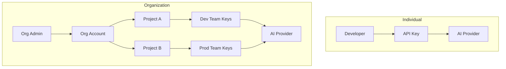
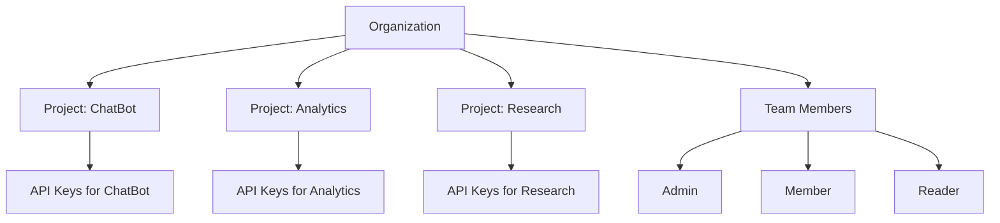
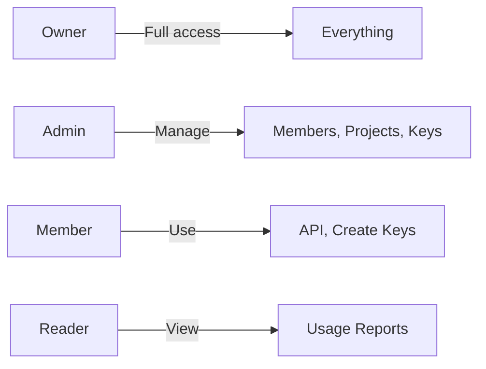
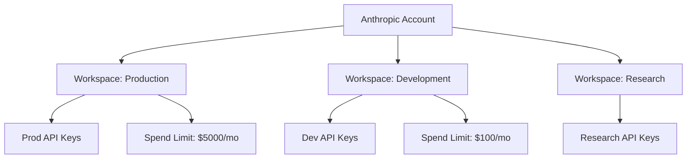
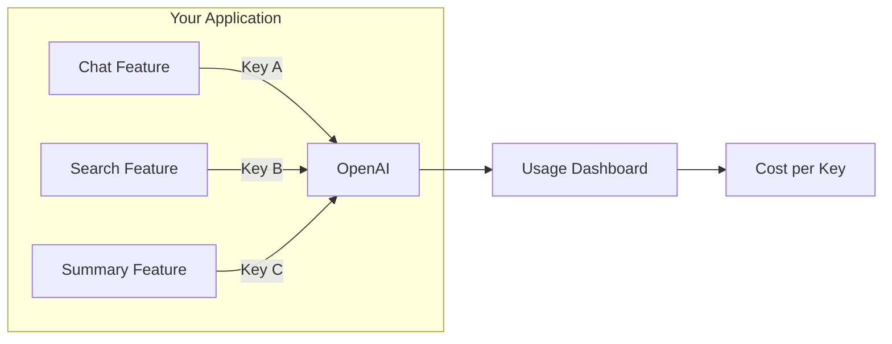
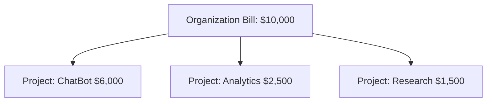
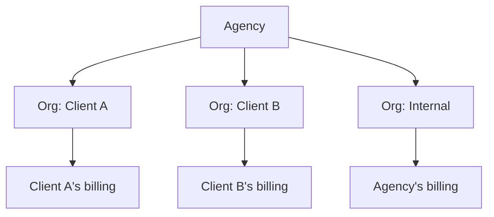
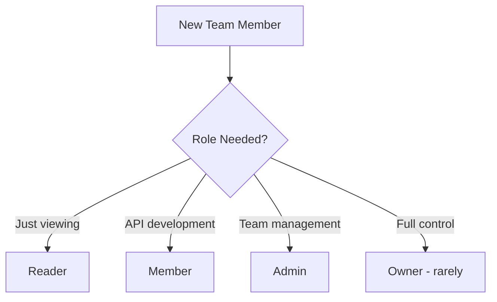
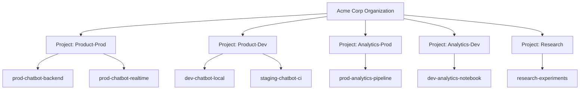

# Organization and Project-Level Access

## Introduction

As AI usage grows beyond individual developers, managing access becomes critical. Organization and project structures help teams share resources, control costs, and maintain security. This lesson covers how major AI providers structure accounts and how to set up effective team access.

### What We'll Cover

- Organization accounts and their benefits
- Team member roles and access levels
- Project-based billing and isolation
- Usage attribution and tracking
- Best practices for team structures

### Prerequisites

- An account with OpenAI, Anthropic, or similar provider
- Understanding of API key generation
- Basic knowledge of team/organization structures

---

## Why Organization Structure Matters

Individual API keys work for personal projects, but teams need more:

| Individual Account | Organization Account |
|--------------------|---------------------|
| Single billing | Centralized billing |
| Personal keys only | Team-wide key management |
| No usage attribution | Track who used what |
| Single rate limit | Project-scoped limits |
| No access control | Role-based permissions |



---

## OpenAI Organization Structure

OpenAI uses a three-tier hierarchy: Organization → Projects → API Keys.

### Hierarchy Overview



### Creating an Organization

1. Visit [platform.openai.com/settings/organization](https://platform.openai.com/settings/organization)
2. Click "Create organization" (if you don't have one)
3. Set organization name and settings
4. Invite team members

### Organization Settings

| Setting | Purpose |
|---------|---------|
| Name | Display name for the organization |
| ID | `org-xxx` identifier for API headers |
| Billing email | Where invoices are sent |
| Usage limits | Monthly spending caps |
| Team members | Who can access the organization |

---

## OpenAI Projects

Projects provide isolation within an organization. Each project has:
- Separate API keys
- Independent rate limits
- Distinct usage tracking
- Billing attribution

### Creating a Project

1. Go to [platform.openai.com/settings/projects](https://platform.openai.com/settings)
2. Click "Create project"
3. Name the project (e.g., "Customer Support Bot")
4. Configure project-specific settings

### Project-Scoped API Keys

```python
from openai import OpenAI

# Project-scoped key automatically routes to correct project
client = OpenAI(api_key="sk-proj-...")

# Or specify explicitly with legacy user key
client = OpenAI(
    api_key="sk-...",
    organization="org-abc123",
    project="proj-xyz789"
)
```

### When to Create Separate Projects

| Use Case | Recommendation |
|----------|----------------|
| Different applications | Separate projects |
| Dev/Staging/Prod | Separate projects |
| Different teams | Separate projects |
| Same app, different features | Same project |
| Cost tracking needs | Separate projects |

---

## Team Member Roles

### OpenAI Roles

| Role | Capabilities |
|------|--------------|
| **Owner** | Full control, billing, delete org |
| **Admin** | Manage members, projects, keys |
| **Member** | Create keys, use API |
| **Reader** | View usage, no API access |

### Inviting Team Members

1. Navigate to Organization settings → Members
2. Click "Invite"
3. Enter email address
4. Select role
5. (Optional) Restrict to specific projects



### Best Practices for Role Assignment

| Person/Role | Recommended OpenAI Role |
|-------------|------------------------|
| Engineering Manager | Admin |
| Backend Developer | Member |
| Data Scientist | Member |
| Finance/Accounting | Reader |
| Security Team | Admin (audit access) |
| Contractor | Member (specific project only) |

---

## Anthropic Workspaces

Anthropic uses workspaces instead of projects for organization.

### Workspace Structure



### Creating Workspaces

1. Visit [console.anthropic.com/settings/workspaces](https://console.anthropic.com/settings/workspaces)
2. Click "Create workspace"
3. Name the workspace
4. Set spend limits
5. Create API keys within the workspace

### Workspace Benefits

| Feature | Benefit |
|---------|---------|
| Separate billing | Track costs per team/project |
| Independent limits | Dev can't exhaust prod quota |
| Isolated keys | Compromised dev key doesn't affect prod |
| Team assignment | Right people access right workspace |

---

## Usage Attribution and Tracking

Understanding who uses what is essential for cost management and optimization.

### OpenAI Usage Dashboard

Access at [platform.openai.com/usage](https://platform.openai.com/usage)

| Metric | Description |
|--------|-------------|
| Tokens | Input and output tokens consumed |
| Requests | Number of API calls |
| Cost | Dollar amount spent |
| By model | Breakdown per model |
| By project | Breakdown per project |
| By key | Breakdown per API key (if tracked) |

### Using Request IDs for Attribution

```python
from openai import OpenAI

client = OpenAI()

response = client.chat.completions.create(
    model="gpt-4o",
    messages=[{"role": "user", "content": "Hello"}],
    # Custom metadata for tracking (not built-in, but useful pattern)
)

# The response includes a unique ID
request_id = response.id  # chatcmpl-xxx
# Also available in response headers: x-request-id
```

### Tracking by Feature

Use separate API keys or projects for different features:



### Building Internal Attribution

```python
from datetime import datetime
from dataclasses import dataclass
from typing import Optional
import json

@dataclass
class UsageRecord:
    timestamp: datetime
    feature: str
    user_id: Optional[str]
    model: str
    input_tokens: int
    output_tokens: int
    cost_estimate: float
    request_id: str

class UsageTracker:
    def __init__(self):
        self.records: list = []
    
    def record(self, feature: str, response, user_id: str = None):
        """Record usage from an API response."""
        record = UsageRecord(
            timestamp=datetime.now(),
            feature=feature,
            user_id=user_id,
            model=response.model,
            input_tokens=response.usage.prompt_tokens,
            output_tokens=response.usage.completion_tokens,
            cost_estimate=self._estimate_cost(response),
            request_id=response.id
        )
        self.records.append(record)
        return record
    
    def _estimate_cost(self, response) -> float:
        # Simplified cost calculation
        input_cost = response.usage.prompt_tokens * 0.000003
        output_cost = response.usage.completion_tokens * 0.000015
        return input_cost + output_cost
    
    def summary_by_feature(self) -> dict:
        """Get usage summary grouped by feature."""
        summary = {}
        for record in self.records:
            if record.feature not in summary:
                summary[record.feature] = {
                    "requests": 0,
                    "tokens": 0,
                    "cost": 0.0
                }
            summary[record.feature]["requests"] += 1
            summary[record.feature]["tokens"] += record.input_tokens + record.output_tokens
            summary[record.feature]["cost"] += record.cost_estimate
        return summary

# Usage
tracker = UsageTracker()

response = client.chat.completions.create(
    model="gpt-4o",
    messages=[{"role": "user", "content": "Summarize this..."}]
)

tracker.record(feature="summarization", response=response, user_id="user-123")
print(tracker.summary_by_feature())
```

---

## Project-Based Billing

### Cost Isolation

Each project can have its own spending patterns:



### Setting Spending Limits

**OpenAI:**
1. Go to Organization settings → Limits
2. Set monthly limit (org-wide)
3. Set project-specific limits if needed

**Anthropic:**
1. Navigate to Workspace settings
2. Set spend limit per workspace
3. Configure alerts at thresholds

### Alert Configuration

```python
# Example: Send alert when approaching limit
def check_usage_alert(current_spend: float, limit: float, threshold: float = 0.8):
    """Alert when usage exceeds threshold percentage of limit."""
    if current_spend >= limit * threshold:
        percentage = (current_spend / limit) * 100
        send_alert(
            title="Usage Alert",
            message=f"Current spend ${current_spend:.2f} is {percentage:.0f}% of ${limit:.2f} limit"
        )
```

---

## Multi-Organization Patterns

Some companies need multiple organizations for different business units or clients.

### When to Use Multiple Organizations

| Scenario | Single Org | Multiple Orgs |
|----------|------------|---------------|
| One company | ✅ | ❌ |
| Completely separate billing | ❌ | ✅ |
| Client isolation (agency) | ❌ | ✅ |
| Different legal entities | ❌ | ✅ |
| Different compliance needs | ❌ | ✅ |

### Agency Pattern



### Switching Organizations in Code

```python
from openai import OpenAI

# Client A's organization
client_a = OpenAI(
    api_key="sk-...",
    organization="org-client-a"
)

# Client B's organization
client_b = OpenAI(
    api_key="sk-...",
    organization="org-client-b"
)

# Route based on request context
def get_client(client_id: str) -> OpenAI:
    org_mapping = {
        "client_a": "org-client-a",
        "client_b": "org-client-b",
    }
    return OpenAI(
        api_key=os.environ["OPENAI_API_KEY"],
        organization=org_mapping[client_id]
    )
```

---

## Access Control Best Practices

### Principle of Least Privilege



### Access Review Checklist

| Check | Frequency | Action |
|-------|-----------|--------|
| Remove departed employees | Immediately | Revoke all access |
| Review role assignments | Quarterly | Demote over-privileged users |
| Audit API key usage | Monthly | Revoke unused keys |
| Check project membership | Quarterly | Remove from inactive projects |
| Review admin accounts | Monthly | Minimize admin count |

### Documenting Access

Maintain a record of who has access to what:

```markdown
## AI Platform Access Register

### OpenAI (org-acme-corp)

| Person | Role | Projects | Last Review |
|--------|------|----------|-------------|
| Jane Smith | Owner | All | 2025-01-01 |
| John Doe | Admin | All | 2025-01-01 |
| Alice Dev | Member | ChatBot, Analytics | 2025-01-01 |
| Bob Analyst | Reader | - | 2025-01-01 |

### Service Accounts

| Account | Purpose | Key ID | Rotation Due |
|---------|---------|--------|--------------|
| prod-backend | Production API | sk-proj-xxx | 2025-02-15 |
| ci-testing | GitHub Actions | sk-proj-yyy | 2025-02-15 |
```

---

## Hands-on Exercise

### Your Task

Design an organization structure for a medium-sized company with multiple teams.

### Scenario

Your company has:
- A product team building a customer-facing chatbot
- A data team using AI for analytics
- A research team exploring new models
- Dev, staging, and production environments

### Requirements

1. Draw the organization/project structure
2. Define roles for each team member type
3. Plan API key organization
4. Set up usage tracking approach

### Expected Result

A document/diagram showing:
- Project structure
- Role assignments
- Key naming convention
- Attribution strategy

<details>
<summary>💡 Hints</summary>

- Consider separating by both team AND environment
- Use consistent naming: `{team}-{env}-{purpose}`
- Plan for growth—new teams, new environments
</details>

<details>
<summary>✅ Solution</summary>

### Organization Structure



### Role Assignments

| Person | Role | Projects |
|--------|------|----------|
| CTO | Owner | All |
| Eng Manager | Admin | All |
| Product Dev | Member | Product-Prod, Product-Dev |
| Data Scientist | Member | Analytics-Prod, Analytics-Dev |
| Researcher | Member | Research only |
| Finance | Reader | None (usage viewing) |

### Key Naming Convention

```
{environment}-{team}-{purpose}

Examples:
- prod-product-backend
- staging-product-ci
- dev-analytics-notebook
- research-llm-experiments
```

### Attribution Strategy

1. Each key is named for its purpose → easy dashboard tracking
2. Internal tracker logs: feature, user_id, request_id
3. Weekly reports by project sent to team leads
4. Monthly rollup to finance by organization total

</details>

---

## Summary

✅ Organization accounts enable team-wide management and billing  
✅ Projects (OpenAI) and Workspaces (Anthropic) provide isolation  
✅ Role-based access controls who can do what  
✅ Usage attribution helps track costs by feature and team  
✅ Project-based billing enables cost allocation  
✅ Regular access reviews maintain security  
✅ Document your access structure for compliance

**Next:** [Usage Tier System](./07-usage-tier-system.md)

---

## Further Reading

- [OpenAI Organization Settings](https://platform.openai.com/settings/organization) — Manage your organization
- [OpenAI Projects Guide](https://platform.openai.com/docs/guides/production-best-practices) — Project best practices
- [Anthropic Workspaces](https://console.anthropic.com/settings/workspaces) — Workspace management
- [OpenAI Usage Dashboard](https://platform.openai.com/usage) — Track usage and costs

<!-- 
Sources Consulted:
- OpenAI Platform Settings: https://platform.openai.com/settings
- Anthropic Console: https://console.anthropic.com
- OpenAI Production Best Practices: https://platform.openai.com/docs/guides/production-best-practices
-->
