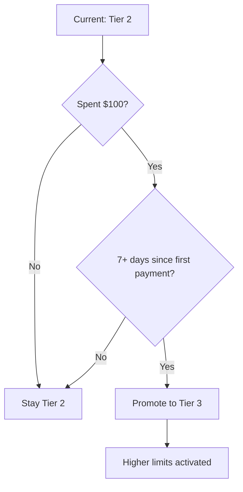

# Usage Tier System

## Introduction

AI providers use tiered systems to manage access, rate limits, and costs. Understanding your tier—and how to progress to higher tiers—directly impacts what you can build. This lesson explains how tier systems work across providers and how to plan for growth.

### What We'll Cover

- How tier systems work (OpenAI, Anthropic)
- Rate limits and quotas per tier
- Automatic tier promotion criteria
- Tier-based model access
- Enterprise tier benefits
- Requesting limit increases

### Prerequisites

- An active account with an AI provider
- Understanding of rate limiting concepts
- Billing information on file

---

## How Tier Systems Work

Providers use tiers to:
1. **Prevent abuse** from new accounts
2. **Scale resources** with proven usage
3. **Protect infrastructure** from overwhelming demand
4. **Build trust** gradually with customers


---

## OpenAI Usage Tiers

OpenAI has five usage tiers plus a free tier, based on cumulative spending and account age.

### Tier Requirements

| Tier | Payment Required | Time Requirement | Monthly Limit |
|------|------------------|------------------|---------------|
| Free | None | Account in allowed region | $100/month |
| Tier 1 | $5 paid | None | $100/month |
| Tier 2 | $50 paid | 7+ days since first payment | $500/month |
| Tier 3 | $100 paid | 7+ days since first payment | $1,000/month |
| Tier 4 | $250 paid | 14+ days since first payment | $5,000/month |
| Tier 5 | $1,000 paid | 30+ days since first payment | $200,000/month |

### Rate Limits by Tier

Rate limits vary by model and tier. Here's a simplified view:

| Model | Tier 1 RPM | Tier 2 RPM | Tier 3 RPM | Tier 5 RPM |
|-------|------------|------------|------------|------------|
| GPT-4o | 500 | 5,000 | 5,000 | 10,000 |
| GPT-4o-mini | 500 | 5,000 | 5,000 | 30,000 |
| o1 | 500 | 5,000 | 5,000 | 10,000 |
| Embeddings | 3,000 | 5,000 | 5,000 | 10,000 |

> **Note:** Actual limits depend on your specific account. Check [platform.openai.com/settings/organization/limits](https://platform.openai.com/settings/organization/limits) for your current limits.

### Token Limits

Beyond requests per minute (RPM), there are tokens per minute (TPM) limits:

| Model | Tier 1 TPM | Tier 5 TPM |
|-------|------------|------------|
| GPT-4o | 30,000 | 30,000,000 |
| GPT-4o-mini | 200,000 | 150,000,000 |

---

## Anthropic Usage Tiers

Anthropic uses a similar tiered approach with workspaces for additional control.

### Anthropic Tier Structure

| Tier | Spend Requirement | Rate Limits |
|------|-------------------|-------------|
| Free | None | Very limited |
| Build | Active billing | Standard limits |
| Scale | $100+/month average | Higher limits |
| Enterprise | Committed spend | Custom limits |

### Anthropic Rate Limits

| Model | Build RPM | Build TPM |
|-------|-----------|-----------|
| Claude Sonnet 4 | 50 | 40,000 |
| Claude Haiku | 50 | 50,000 |

> **Tip:** Anthropic allows setting per-workspace spend limits, providing additional control beyond tier limits.

---

## Checking Your Current Limits

### OpenAI Dashboard

1. Visit [platform.openai.com/settings/organization/limits](https://platform.openai.com/settings/organization/limits)
2. View your current tier
3. See model-specific rate limits
4. Check usage against limits

### API Response Headers

Rate limit information comes in every API response:

```python
import requests

response = requests.post(
    "https://api.openai.com/v1/chat/completions",
    headers={"Authorization": f"Bearer {api_key}"},
    json={...}
)

# Check rate limit headers
print(f"Request limit: {response.headers.get('x-ratelimit-limit-requests')}")
print(f"Remaining: {response.headers.get('x-ratelimit-remaining-requests')}")
print(f"Reset in: {response.headers.get('x-ratelimit-reset-requests')}")
```

**Output:**

```
Request limit: 500
Remaining: 495
Reset in: 32s
```

### Python SDK Access

```python
from openai import OpenAI

client = OpenAI()

response = client.chat.completions.with_raw_response.create(
    model="gpt-4o",
    messages=[{"role": "user", "content": "Hello"}]
)

# Access headers from raw response
headers = response.headers
print(f"Requests remaining: {headers.get('x-ratelimit-remaining-requests')}")
print(f"Tokens remaining: {headers.get('x-ratelimit-remaining-tokens')}")
```

---

## Automatic Tier Promotion

Tiers increase automatically when you meet the criteria:



### Checking Promotion Progress

```python
# Conceptual - track your spending progress
def check_tier_progress(current_tier: int, total_spent: float, days_since_first_payment: int):
    """Estimate next tier eligibility."""
    requirements = {
        1: (5, 0),
        2: (50, 7),
        3: (100, 7),
        4: (250, 14),
        5: (1000, 30),
    }
    
    next_tier = current_tier + 1
    if next_tier > 5:
        return {"message": "Already at maximum tier", "eligible": True}
    
    spend_needed, days_needed = requirements[next_tier]
    
    spend_gap = max(0, spend_needed - total_spent)
    days_gap = max(0, days_needed - days_since_first_payment)
    
    return {
        "next_tier": next_tier,
        "spend_needed": spend_gap,
        "days_needed": days_gap,
        "eligible": spend_gap == 0 and days_gap == 0
    }

# Example
progress = check_tier_progress(
    current_tier=2,
    total_spent=75.00,
    days_since_first_payment=10
)
print(f"Need ${progress['spend_needed']} more and {progress['days_needed']} more days")
```

---

## Tier-Based Model Access

Some models are only available at higher tiers:

### OpenAI Model Availability

| Model | Minimum Tier |
|-------|--------------|
| GPT-4o | Tier 1 |
| GPT-4o-mini | Free |
| GPT-4.1 | Tier 1 |
| o1 (Reasoning) | Tier 1 |
| o1-pro | Tier 5 |
| GPT-5.2 | Tier 1 |
| DALL-E 3 | Tier 1 |
| Realtime API | Tier 1 |

### Handling Model Access Errors

```python
from openai import OpenAI, PermissionDeniedError

client = OpenAI()

try:
    response = client.chat.completions.create(
        model="o1-pro",  # Tier 5 required
        messages=[{"role": "user", "content": "Solve this..."}]
    )
except PermissionDeniedError as e:
    print(f"Model not available at your tier: {e}")
    # Fall back to available model
    response = client.chat.completions.create(
        model="o1",  # Available at lower tier
        messages=[{"role": "user", "content": "Solve this..."}]
    )
```

---

## Rate Limit Management Strategies

### Tracking Usage

```python
from dataclasses import dataclass
from datetime import datetime, timedelta
from collections import deque

@dataclass
class RateLimiter:
    """Track API usage and prevent limit hits."""
    
    requests_per_minute: int = 500
    tokens_per_minute: int = 30000
    
    def __init__(self, rpm: int, tpm: int):
        self.requests_per_minute = rpm
        self.tokens_per_minute = tpm
        self._request_times = deque()
        self._token_usage = deque()
    
    def _clean_old_entries(self, entries: deque, window: timedelta):
        cutoff = datetime.now() - window
        while entries and entries[0][0] < cutoff:
            entries.popleft()
    
    def record_request(self, tokens: int):
        """Record a request and its token usage."""
        now = datetime.now()
        self._request_times.append((now, 1))
        self._token_usage.append((now, tokens))
        self._clean_old_entries(self._request_times, timedelta(minutes=1))
        self._clean_old_entries(self._token_usage, timedelta(minutes=1))
    
    def can_make_request(self, estimated_tokens: int) -> bool:
        """Check if we have capacity for another request."""
        self._clean_old_entries(self._request_times, timedelta(minutes=1))
        self._clean_old_entries(self._token_usage, timedelta(minutes=1))
        
        current_requests = sum(r[1] for r in self._request_times)
        current_tokens = sum(t[1] for t in self._token_usage)
        
        return (
            current_requests < self.requests_per_minute and
            current_tokens + estimated_tokens < self.tokens_per_minute
        )
    
    def wait_time(self) -> float:
        """Seconds until capacity is likely available."""
        if not self._request_times:
            return 0
        oldest = self._request_times[0][0]
        wait = 60 - (datetime.now() - oldest).total_seconds()
        return max(0, wait)

# Usage
limiter = RateLimiter(rpm=500, tpm=30000)

if limiter.can_make_request(estimated_tokens=1000):
    response = client.chat.completions.create(...)
    limiter.record_request(response.usage.total_tokens)
else:
    wait = limiter.wait_time()
    print(f"Rate limited. Wait {wait:.0f} seconds.")
```

### Backoff Strategies

```python
import time
import random
from openai import RateLimitError

def call_with_backoff(func, max_retries=5, base_delay=1):
    """Call function with exponential backoff on rate limits."""
    for attempt in range(max_retries):
        try:
            return func()
        except RateLimitError as e:
            if attempt == max_retries - 1:
                raise
            
            # Exponential backoff with jitter
            delay = base_delay * (2 ** attempt) + random.uniform(0, 1)
            print(f"Rate limited. Waiting {delay:.1f}s (attempt {attempt + 1})")
            time.sleep(delay)

# Usage
response = call_with_backoff(lambda: client.chat.completions.create(
    model="gpt-4o",
    messages=[{"role": "user", "content": "Hello"}]
))
```

---

## Enterprise Tier

Enterprise tiers offer custom limits, support, and features.

### Enterprise Benefits

| Feature | Standard Tiers | Enterprise |
|---------|----------------|------------|
| Rate limits | Fixed per tier | Negotiated |
| Support | Community/email | Dedicated |
| SLA | Best effort | Guaranteed uptime |
| Custom models | No | Fine-tuning options |
| Volume discounts | No | Yes |
| Private endpoints | No | Available |
| Compliance | Standard | Custom agreements |

### When to Consider Enterprise

- Monthly spend exceeds $10,000
- Need guaranteed uptime SLAs
- Require custom rate limits
- Need dedicated support
- Have specific compliance requirements
- Want volume pricing

### Requesting Enterprise Access

**OpenAI:**
1. Visit [openai.com/contact-sales](https://openai.com/contact-sales)
2. Describe your use case and volume
3. Discuss requirements with sales team

**Anthropic:**
1. Contact through Console
2. Or visit [anthropic.com/contact](https://anthropic.com/contact)

---

## Requesting Limit Increases

Sometimes you need higher limits before reaching the next tier naturally.

### When to Request

| Situation | Action |
|-----------|--------|
| Launching product soon | Request increase |
| Temporary spike expected | Request temporary increase |
| Hitting limits regularly | Optimize first, then request |
| Enterprise workload | Go enterprise route |

### How to Request (OpenAI)

1. Go to [platform.openai.com/settings/organization/limits](https://platform.openai.com/settings/organization/limits)
2. Click "Request increase"
3. Provide:
   - Use case description
   - Expected volume
   - Current usage patterns
   - Timeline

### Making a Strong Case

```markdown
## Rate Limit Increase Request

**Organization:** Acme Corp (org-abc123)
**Current Tier:** Tier 3

### Use Case
Customer support chatbot serving 50,000 daily active users.

### Current Usage
- Average: 400 RPM
- Peak: 495 RPM (hitting limit)
- Token usage: 25M tokens/day

### Requested Limits
- RPM: 1,000 (2x current)
- TPM: 100,000 (2x current)

### Justification
Launching in 3 new markets next month, expecting 2x traffic.
Current limits causing degraded experience during peak hours.

### Timeline
Needed by: February 1, 2025
```

---

## Planning for Growth

### Usage Projection

```python
from dataclasses import dataclass
from datetime import date

@dataclass
class UsageProjection:
    """Project future usage and tier requirements."""
    
    current_monthly_spend: float
    growth_rate_percent: float  # Monthly growth
    current_tier: int
    
    def project_months(self, months: int) -> list:
        """Project spending for N months."""
        projections = []
        spend = self.current_monthly_spend
        
        for month in range(1, months + 1):
            spend *= (1 + self.growth_rate_percent / 100)
            tier = self._tier_for_spend(spend)
            projections.append({
                "month": month,
                "projected_spend": round(spend, 2),
                "tier": tier,
                "upgrade": tier > self.current_tier
            })
        
        return projections
    
    def _tier_for_spend(self, cumulative: float) -> int:
        if cumulative < 5:
            return 0
        elif cumulative < 50:
            return 1
        elif cumulative < 100:
            return 2
        elif cumulative < 250:
            return 3
        elif cumulative < 1000:
            return 4
        else:
            return 5

# Example
projection = UsageProjection(
    current_monthly_spend=50,
    growth_rate_percent=20,
    current_tier=2
)

for month in projection.project_months(6):
    print(f"Month {month['month']}: ${month['projected_spend']} (Tier {month['tier']})")
```

**Output:**

```
Month 1: $60.0 (Tier 2)
Month 2: $72.0 (Tier 2)
Month 3: $86.4 (Tier 2)
Month 4: $103.68 (Tier 3)
Month 5: $124.42 (Tier 3)
Month 6: $149.3 (Tier 3)
```

---

## Common Tier-Related Issues

### Issue: Stuck at Lower Tier

| Symptom | Cause | Solution |
|---------|-------|----------|
| Can't upgrade | Haven't met spend | Use API more |
| Can't upgrade | Not enough time | Wait for time requirement |
| Rate limited | Low tier limits | Optimize or upgrade |

### Issue: Unexpected Costs

```python
def estimate_monthly_cost(
    requests_per_day: int,
    avg_input_tokens: int,
    avg_output_tokens: int,
    model: str = "gpt-4o"
) -> dict:
    """Estimate monthly API costs."""
    
    # Approximate pricing (check current rates)
    pricing = {
        "gpt-4o": {"input": 0.003, "output": 0.015},  # per 1K tokens
        "gpt-4o-mini": {"input": 0.00015, "output": 0.0006},
        "claude-sonnet-4": {"input": 0.003, "output": 0.015},
    }
    
    rates = pricing.get(model, pricing["gpt-4o"])
    
    daily_input_cost = (requests_per_day * avg_input_tokens / 1000) * rates["input"]
    daily_output_cost = (requests_per_day * avg_output_tokens / 1000) * rates["output"]
    daily_total = daily_input_cost + daily_output_cost
    
    return {
        "daily": round(daily_total, 2),
        "monthly": round(daily_total * 30, 2),
        "tier_reached": get_tier_for_monthly(daily_total * 30)
    }

def get_tier_for_monthly(monthly_spend: float) -> str:
    if monthly_spend < 100:
        return "Tier 1"
    elif monthly_spend < 500:
        return "Tier 2"
    elif monthly_spend < 1000:
        return "Tier 3"
    elif monthly_spend < 5000:
        return "Tier 4"
    else:
        return "Tier 5"

# Example
estimate = estimate_monthly_cost(
    requests_per_day=1000,
    avg_input_tokens=500,
    avg_output_tokens=200,
    model="gpt-4o"
)
print(f"Estimated: ${estimate['monthly']}/month → {estimate['tier_reached']}")
```

---

## Hands-on Exercise

### Your Task

Create a tier planning document for your project.

### Requirements

1. Determine your current tier and limits
2. Estimate your usage for the next 3 months
3. Identify when you'll need tier upgrades
4. Plan for rate limit handling

### Expected Result

A document with:
- Current tier status
- Usage projections
- Upgrade timeline
- Rate limit handling strategy

<details>
<summary>💡 Hints</summary>

- Check your current tier in the provider dashboard
- Use logs to estimate current usage
- Consider seasonal variations
- Plan for 2x your expected peak
</details>

<details>
<summary>✅ Solution Template</summary>

```markdown
# AI API Tier Planning - Q1 2025

## Current Status

| Provider | Tier | Monthly Limit | Current Usage |
|----------|------|---------------|---------------|
| OpenAI | Tier 2 | $500/month | $120/month |
| Anthropic | Build | $1000/month | $50/month |

## Rate Limits

| Model | Limit (RPM) | Current Peak | Buffer |
|-------|-------------|--------------|--------|
| GPT-4o | 5,000 | 1,200 | 3,800 |
| Claude Sonnet | 50 | 20 | 30 |

## Projections (20% monthly growth)

| Month | Projected Spend | Tier | Action Needed |
|-------|-----------------|------|---------------|
| Jan 2025 | $144 | Tier 2 | None |
| Feb 2025 | $173 | Tier 2 | None |
| Mar 2025 | $207 | Tier 3 | Eligible |

## Upgrade Timeline

- **Now:** Stay on Tier 2
- **Feb 1:** Verify Tier 3 eligibility
- **Mar 1:** Should auto-upgrade to Tier 3

## Rate Limit Strategy

1. Implement exponential backoff for 429 errors
2. Add request queuing for burst handling
3. Monitor usage via headers
4. Alert at 80% of limits

## Budget

- Q1 Budget: $600
- Projected Q1 Spend: $524
- Buffer: $76

## Escalation Path

If limits become blocking:
1. Check current tier status
2. Optimize prompts to reduce tokens
3. Request limit increase
4. Consider enterprise if >$2k/month
```

</details>

---

## Summary

✅ Tier systems manage rate limits and access based on spending and account age  
✅ OpenAI has 5 tiers (Free through Tier 5) with increasing limits  
✅ Tiers upgrade automatically when spending and time requirements are met  
✅ Rate limits are returned in API response headers  
✅ Some models are only available at higher tiers  
✅ Enterprise tiers offer custom limits, SLAs, and support  
✅ Plan ahead—project usage and tier requirements

**Next:** [Request Structure](../02-request-structure/00-request-structure.md)

---

## Further Reading

- [OpenAI Rate Limits](https://platform.openai.com/docs/guides/rate-limits) — Official rate limit documentation
- [OpenAI Usage Tiers](https://platform.openai.com/docs/guides/rate-limits#usage-tiers) — Tier requirements
- [Anthropic Rate Limits](https://platform.claude.com/docs/en/api/rate-limits) — Claude rate limiting
- [OpenAI Pricing](https://openai.com/api/pricing/) — Current pricing

<!-- 
Sources Consulted:
- OpenAI Rate Limits: https://platform.openai.com/docs/guides/rate-limits
- OpenAI Pricing: https://openai.com/api/pricing/
- Anthropic API documentation: https://platform.claude.com/docs/en/api/rate-limits
-->
