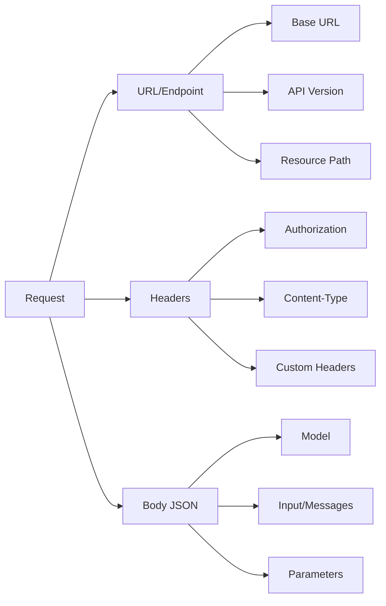
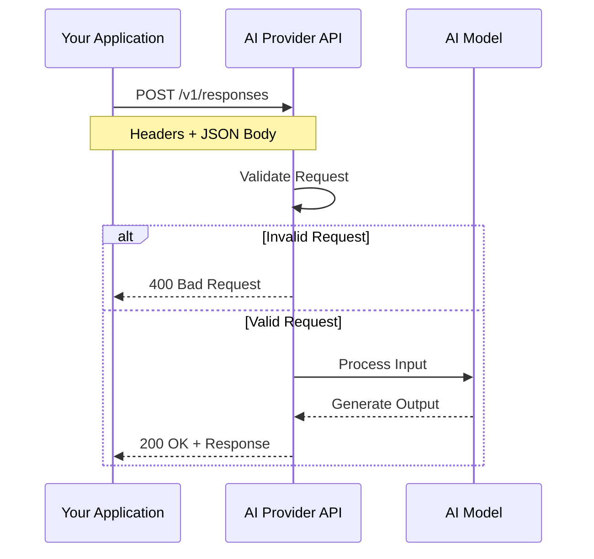

# Request Structure

## Introduction

Every AI API request follows a predictable structure: an endpoint URL, authentication headers, and a JSON body containing your instructions and parameters. Understanding this structure is essential for working with any AI provider—and for debugging when things go wrong.

This lesson covers how to construct requests for major AI APIs, with emphasis on the modern patterns used by OpenAI's Responses API and Chat Completions.

### What We'll Cover

- Endpoint URLs and API versioning strategies
- Required and optional request headers
- Request body structure and field organization
- Message formats and role-based conversations
- Model specification and version pinning
- Parameter configuration (temperature, max_tokens, etc.)
- Modern 2024-2025 parameters for advanced features

### Prerequisites

- Understanding of API authentication (previous lesson)
- Basic JSON knowledge
- HTTP request concepts

---

## Anatomy of an AI API Request

Every request has three main components:



### Complete Request Example

```bash
curl https://api.openai.com/v1/responses \
  -H "Content-Type: application/json" \
  -H "Authorization: Bearer $OPENAI_API_KEY" \
  -d '{
    "model": "gpt-4.1",
    "input": "Explain quantum computing in simple terms.",
    "temperature": 0.7,
    "max_output_tokens": 500
  }'
```

---

## Lessons in This Section

| Lesson | Description |
|--------|-------------|
| [Endpoints and Versioning](./01-endpoints-versioning.md) | Base URLs, version paths, deprecation handling |
| [Request Headers](./02-request-headers.md) | Authorization, Content-Type, custom tracking headers |
| [Request Body Structure](./03-request-body.md) | JSON format, required vs. optional fields |
| [Message Formats](./04-message-formats.md) | Roles, multi-turn conversations, developer messages |
| [Model Specification](./05-model-specification.md) | Model IDs, aliases, version pinning |
| [Parameter Configuration](./06-parameter-configuration.md) | temperature, max_tokens, and sampling controls |
| [Modern Parameters](./07-modern-parameters.md) | 2024-2025 parameters: reasoning, caching, modalities |

---

## Quick Reference: Chat Completions vs. Responses API

OpenAI now offers two main APIs. The Responses API is the modern choice:

| Feature | Chat Completions | Responses API |
|---------|-----------------|---------------|
| Endpoint | `/v1/chat/completions` | `/v1/responses` |
| Input format | `messages` array | `input` (string or array) |
| System message | `role: "system"` | `instructions` parameter |
| Developer role | `role: "developer"` | Supported |
| Conversation state | Manual | `previous_response_id` |
| Built-in tools | Limited | Web search, file search, etc. |
| Recommended for | Legacy compatibility | New projects |

### Chat Completions Example

```python
from openai import OpenAI
client = OpenAI()

response = client.chat.completions.create(
    model="gpt-4o",
    messages=[
        {"role": "developer", "content": "You are a helpful assistant."},
        {"role": "user", "content": "Hello!"}
    ]
)
```

### Responses API Example

```python
from openai import OpenAI
client = OpenAI()

response = client.responses.create(
    model="gpt-4.1",
    instructions="You are a helpful assistant.",
    input="Hello!"
)
```

---

## Request Flow Overview



---

## Summary

✅ AI API requests consist of URL, headers, and JSON body  
✅ The Responses API is OpenAI's modern interface for new projects  
✅ Chat Completions remains available for legacy compatibility  
✅ Understanding request structure enables debugging and cross-provider work

**Next:** [Endpoints and Versioning](./01-endpoints-versioning.md)

---

## Further Reading

- [OpenAI Responses API Reference](https://platform.openai.com/docs/api-reference/responses) — Complete Responses documentation
- [OpenAI Chat Completions API](https://platform.openai.com/docs/api-reference/chat) — Chat Completions documentation
- [Responses vs. Chat Completions Guide](https://platform.openai.com/docs/guides/responses-vs-chat-completions) — Migration guide

<!-- 
Sources Consulted:
- OpenAI API Reference Responses: https://platform.openai.com/docs/api-reference/responses/create
- OpenAI API Reference Chat: https://platform.openai.com/docs/api-reference/chat/create
-->
