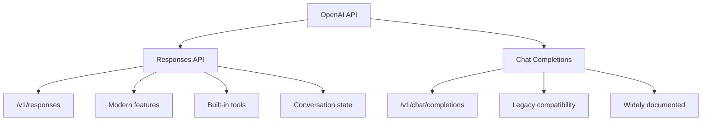
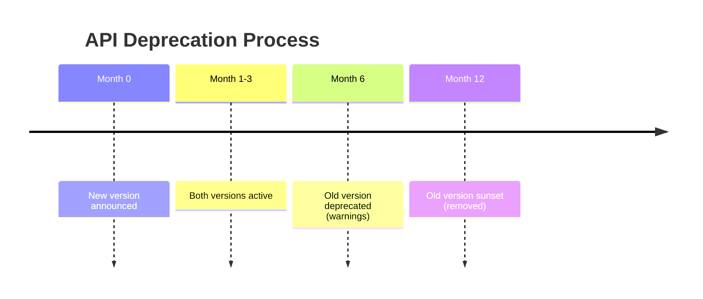

# Endpoints and Versioning

## Introduction

API endpoints are the URLs where you send requests. Each provider structures these differently, and understanding versioning strategies helps you navigate API changes and deprecations without breaking your applications.

### What We'll Cover

- Base URLs for major AI providers
- API versioning in URL paths vs. headers
- Handling API deprecations gracefully
- Stable vs. beta endpoints
- Responses API vs. Chat Completions endpoints

### Prerequisites

- Basic understanding of HTTP and URLs
- API authentication knowledge

---

## Base URLs by Provider

Each AI provider has a distinct base URL:

| Provider | Base URL | Version in URL |
|----------|----------|----------------|
| OpenAI | `https://api.openai.com` | `/v1/` |
| Anthropic | `https://api.anthropic.com` | `/v1/` |
| Google Gemini | `https://generativelanguage.googleapis.com` | `/v1/` or `/v1beta/` |
| Cohere | `https://api.cohere.ai` | `/v1/` or `/v2/` |
| Mistral | `https://api.mistral.ai` | `/v1/` |

### OpenAI Endpoints

```bash
# Responses API (modern)
POST https://api.openai.com/v1/responses

# Chat Completions (legacy)
POST https://api.openai.com/v1/chat/completions

# Embeddings
POST https://api.openai.com/v1/embeddings

# Models list
GET https://api.openai.com/v1/models
```

### Anthropic Endpoints

```bash
# Messages (primary)
POST https://api.anthropic.com/v1/messages

# Token counting
POST https://api.anthropic.com/v1/messages/count_tokens

# Batch processing
POST https://api.anthropic.com/v1/messages/batches
```

---

## API Versioning Strategies

Providers use different approaches to version their APIs:

### 1. URL Path Versioning

The version appears in the URL path:

```
https://api.openai.com/v1/responses
                       ^^
                       Version in path
```

**Pros:** Explicit, easy to see which version you're using  
**Cons:** URL changes when version changes

### 2. Header Versioning

Anthropic uses a required version header:

```http
anthropic-version: 2023-06-01
```

```bash
curl https://api.anthropic.com/v1/messages \
  -H "x-api-key: $ANTHROPIC_API_KEY" \
  -H "anthropic-version: 2023-06-01" \
  -H "content-type: application/json" \
  -d '...'
```

**Pros:** URL stays constant, version explicit in request  
**Cons:** Easy to forget the header

### 3. Date-Based Versioning

Anthropic uses date-based versions that indicate the API snapshot:

| Version | Description |
|---------|-------------|
| `2023-06-01` | Stable version |
| `2024-01-01` | Future version with new features |

> **Tip:** Always pin to a specific version in production. Don't rely on defaults.

---

## OpenAI Responses API vs. Chat Completions

OpenAI offers two primary completion endpoints:



### Feature Comparison

| Feature | `/v1/responses` | `/v1/chat/completions` |
|---------|-----------------|------------------------|
| Status | Current (recommended) | Legacy (supported) |
| Input format | `input` string/array | `messages` array |
| System prompt | `instructions` parameter | `role: "system"` message |
| Conversation | `previous_response_id` | Manual message history |
| Built-in tools | ✅ Web search, file search, etc. | Limited |
| Storage | `store` parameter | `store` parameter |
| Background | `background` parameter | ❌ |

### When to Use Each

| Use Case | Recommendation |
|----------|----------------|
| New project | Responses API |
| Existing codebase | Keep Chat Completions or migrate |
| Need built-in tools | Responses API |
| Simple Q&A | Either works |
| Multi-turn conversation | Responses API (easier) |

---

## Stable vs. Beta Endpoints

Providers often offer beta features through separate endpoints or headers:

### Google Gemini Beta

```bash
# Stable
https://generativelanguage.googleapis.com/v1/models/gemini-pro:generateContent

# Beta features
https://generativelanguage.googleapis.com/v1beta/models/gemini-pro:generateContent
```

### Anthropic Beta Headers

```bash
curl https://api.anthropic.com/v1/messages \
  -H "anthropic-version: 2023-06-01" \
  -H "anthropic-beta: prompt-caching-2024-07-31" \
  ...
```

### Beta Considerations

| Aspect | Stable | Beta |
|--------|--------|------|
| API stability | Guaranteed | May change |
| Backward compatibility | Yes | No guarantees |
| Documentation | Complete | May be partial |
| Production use | ✅ Recommended | ⚠️ Use carefully |
| Feature access | Standard | Early access |

---

## Handling API Deprecations

APIs evolve. Here's how to handle deprecations:

### Deprecation Timeline (Typical)



### Detecting Deprecation

Watch for deprecation headers in responses:

```python
response = requests.post(
    "https://api.openai.com/v1/chat/completions",
    headers={"Authorization": f"Bearer {api_key}"},
    json={...}
)

# Check for deprecation warnings
if "deprecation" in response.headers:
    print(f"⚠️ Deprecation notice: {response.headers['deprecation']}")
```

### Migration Strategy

```python
class APIClient:
    """Client that handles API version transitions."""
    
    def __init__(self, use_new_api: bool = True):
        self.use_new_api = use_new_api
    
    def complete(self, prompt: str, **kwargs):
        if self.use_new_api:
            return self._responses_api(prompt, **kwargs)
        else:
            return self._chat_completions_api(prompt, **kwargs)
    
    def _responses_api(self, prompt: str, **kwargs):
        """Modern Responses API."""
        return client.responses.create(
            model="gpt-4.1",
            input=prompt,
            **kwargs
        )
    
    def _chat_completions_api(self, prompt: str, **kwargs):
        """Legacy Chat Completions API."""
        return client.chat.completions.create(
            model="gpt-4o",
            messages=[{"role": "user", "content": prompt}],
            **kwargs
        )
```

---

## Multi-Provider URL Abstraction

When working with multiple providers, abstract the URLs:

```python
from enum import Enum
from dataclasses import dataclass

class Provider(Enum):
    OPENAI = "openai"
    ANTHROPIC = "anthropic"
    GOOGLE = "google"

@dataclass
class ProviderConfig:
    base_url: str
    completion_path: str
    version_header: str | None = None
    version_value: str | None = None

PROVIDERS = {
    Provider.OPENAI: ProviderConfig(
        base_url="https://api.openai.com",
        completion_path="/v1/responses"
    ),
    Provider.ANTHROPIC: ProviderConfig(
        base_url="https://api.anthropic.com",
        completion_path="/v1/messages",
        version_header="anthropic-version",
        version_value="2023-06-01"
    ),
    Provider.GOOGLE: ProviderConfig(
        base_url="https://generativelanguage.googleapis.com",
        completion_path="/v1/models/{model}:generateContent"
    ),
}

def get_completion_url(provider: Provider, model: str = None) -> str:
    """Get the completion endpoint URL for a provider."""
    config = PROVIDERS[provider]
    path = config.completion_path
    if "{model}" in path and model:
        path = path.replace("{model}", model)
    return f"{config.base_url}{path}"

# Usage
print(get_completion_url(Provider.OPENAI))
# https://api.openai.com/v1/responses

print(get_completion_url(Provider.GOOGLE, "gemini-pro"))
# https://generativelanguage.googleapis.com/v1/models/gemini-pro:generateContent
```

---

## Hands-on Exercise

### Your Task

Create a URL builder for multiple AI providers that handles versioning.

### Requirements

1. Support at least 3 providers (OpenAI, Anthropic, one other)
2. Handle both URL-based and header-based versioning
3. Include a method to get required headers for each provider
4. Add a deprecation check function

### Expected Result

```python
builder = URLBuilder(Provider.ANTHROPIC)
url = builder.get_completion_url()
headers = builder.get_required_headers(api_key="sk-ant-...")

# url = "https://api.anthropic.com/v1/messages"
# headers = {
#     "x-api-key": "sk-ant-...",
#     "anthropic-version": "2023-06-01",
#     "content-type": "application/json"
# }
```

<details>
<summary>💡 Hints</summary>

- Store provider configs in a dictionary
- Use dataclasses for clean configuration
- Remember Anthropic needs both `x-api-key` AND `anthropic-version`
</details>

<details>
<summary>✅ Solution</summary>

```python
from dataclasses import dataclass, field
from enum import Enum
from typing import Dict, Optional

class Provider(Enum):
    OPENAI = "openai"
    ANTHROPIC = "anthropic"
    MISTRAL = "mistral"

@dataclass
class ProviderConfig:
    base_url: str
    completion_path: str
    auth_header: str
    auth_prefix: str = ""
    extra_headers: Dict[str, str] = field(default_factory=dict)

CONFIGS = {
    Provider.OPENAI: ProviderConfig(
        base_url="https://api.openai.com",
        completion_path="/v1/responses",
        auth_header="Authorization",
        auth_prefix="Bearer "
    ),
    Provider.ANTHROPIC: ProviderConfig(
        base_url="https://api.anthropic.com",
        completion_path="/v1/messages",
        auth_header="x-api-key",
        extra_headers={
            "anthropic-version": "2023-06-01",
            "content-type": "application/json"
        }
    ),
    Provider.MISTRAL: ProviderConfig(
        base_url="https://api.mistral.ai",
        completion_path="/v1/chat/completions",
        auth_header="Authorization",
        auth_prefix="Bearer "
    ),
}

class URLBuilder:
    def __init__(self, provider: Provider):
        self.provider = provider
        self.config = CONFIGS[provider]
    
    def get_completion_url(self) -> str:
        return f"{self.config.base_url}{self.config.completion_path}"
    
    def get_required_headers(self, api_key: str) -> Dict[str, str]:
        headers = {
            self.config.auth_header: f"{self.config.auth_prefix}{api_key}",
            "Content-Type": "application/json"
        }
        headers.update(self.config.extra_headers)
        return headers

# Test
builder = URLBuilder(Provider.ANTHROPIC)
print(builder.get_completion_url())
print(builder.get_required_headers("sk-ant-test"))
```

</details>

---

## Summary

✅ Each AI provider has distinct base URLs and versioning strategies  
✅ OpenAI uses URL path versioning (`/v1/`), Anthropic uses header versioning  
✅ The Responses API (`/v1/responses`) is OpenAI's modern recommended endpoint  
✅ Beta endpoints provide early access but may change without notice  
✅ Plan for deprecations by abstracting API versions in your code  
✅ Pin API versions in production for stability

**Next:** [Request Headers](./02-request-headers.md)

---

## Further Reading

- [OpenAI API Reference](https://platform.openai.com/docs/api-reference) — Complete endpoint documentation
- [Anthropic API Versioning](https://platform.claude.com/docs/en/api/versioning) — Version header details
- [OpenAI Changelog](https://platform.openai.com/docs/changelog) — API changes and deprecations

<!-- 
Sources Consulted:
- OpenAI API Reference: https://platform.openai.com/docs/api-reference
- Anthropic API docs: https://platform.claude.com/docs/en/api/getting-started
-->
