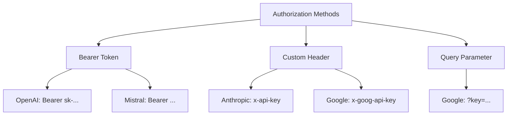
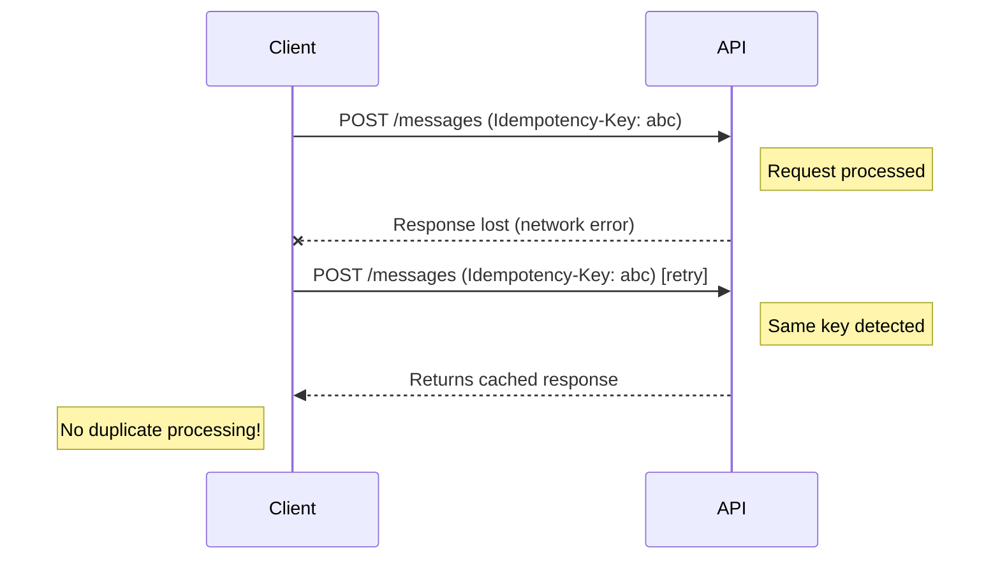

# Request Headers

## Introduction

HTTP headers carry essential metadata with every API request. For AI APIs, headers handle authentication, content negotiation, rate limit tracking, and request identification. Understanding required vs. optional headers helps you build robust integrations.

### What We'll Cover

- Required headers for AI APIs
- Content-Type and Accept headers
- Authorization header formats by provider
- Custom tracking and organization headers
- Idempotency and request tracing
- Response headers you should monitor

### Prerequisites

- Basic HTTP concepts
- API authentication knowledge

---

## Required Headers by Provider

Each provider requires specific headers:

### OpenAI

```http
POST /v1/responses HTTP/1.1
Host: api.openai.com
Authorization: Bearer sk-proj-abc123...
Content-Type: application/json
```

| Header | Required | Value |
|--------|----------|-------|
| `Authorization` | ✅ | `Bearer {api_key}` |
| `Content-Type` | ✅ | `application/json` |
| `OpenAI-Organization` | ❌ | Organization ID (multi-org accounts) |
| `OpenAI-Project` | ❌ | Project ID for billing |

### Anthropic

```http
POST /v1/messages HTTP/1.1
Host: api.anthropic.com
x-api-key: sk-ant-api03-...
anthropic-version: 2023-06-01
content-type: application/json
```

| Header | Required | Value |
|--------|----------|-------|
| `x-api-key` | ✅ | API key (no prefix) |
| `anthropic-version` | ✅ | Date-based version |
| `content-type` | ✅ | `application/json` |
| `anthropic-beta` | ❌ | Beta feature flags |

> **Warning:** Anthropic requests fail without `anthropic-version`. This catches many developers off guard.

### Google Gemini

```http
POST /v1/models/gemini-pro:generateContent HTTP/1.1
Host: generativelanguage.googleapis.com
x-goog-api-key: AIza...
Content-Type: application/json
```

| Header | Required | Value |
|--------|----------|-------|
| `x-goog-api-key` | ✅* | API key |
| `Authorization` | ✅* | `Bearer {token}` (OAuth alternative) |
| `Content-Type` | ✅ | `application/json` |

*One of these is required.

---

## Content-Type and Accept Headers

### Content-Type

Specifies the format of your request body:

```http
Content-Type: application/json
```

For most AI APIs, `application/json` is the only accepted format. Some file upload endpoints accept:

```http
Content-Type: multipart/form-data
```

### Accept Header

Specifies desired response format:

```http
Accept: application/json
```

For streaming responses, some APIs use:

```http
Accept: text/event-stream
```

```python
import requests

headers = {
    "Authorization": f"Bearer {api_key}",
    "Content-Type": "application/json",
    "Accept": "text/event-stream"  # For streaming
}

response = requests.post(
    "https://api.openai.com/v1/responses",
    headers=headers,
    json={
        "model": "gpt-4.1",
        "input": "Hello",
        "stream": True
    },
    stream=True
)
```

---

## Authorization Header Formats

Different providers use different authorization patterns:



### Implementation Pattern

```python
from enum import Enum
from typing import Dict

class AuthStyle(Enum):
    BEARER = "bearer"
    CUSTOM_HEADER = "custom"

def get_auth_headers(provider: str, api_key: str) -> Dict[str, str]:
    """Generate authentication headers for each provider."""
    
    providers = {
        "openai": {
            "Authorization": f"Bearer {api_key}"
        },
        "anthropic": {
            "x-api-key": api_key,
            "anthropic-version": "2023-06-01"
        },
        "google": {
            "x-goog-api-key": api_key
        },
        "mistral": {
            "Authorization": f"Bearer {api_key}"
        },
        "cohere": {
            "Authorization": f"Bearer {api_key}"
        }
    }
    
    if provider not in providers:
        raise ValueError(f"Unknown provider: {provider}")
    
    return providers[provider]

# Usage
headers = get_auth_headers("anthropic", "sk-ant-api03-...")
# {'x-api-key': 'sk-ant-api03-...', 'anthropic-version': '2023-06-01'}
```

---

## Organization and Project Headers

For team environments, additional headers route requests:

### OpenAI Organization Headers

```python
headers = {
    "Authorization": f"Bearer {api_key}",
    "Content-Type": "application/json",
    "OpenAI-Organization": "org-abc123",  # For multi-org accounts
    "OpenAI-Project": "proj-xyz789"       # For project-based billing
}
```

> **Note:** Project-scoped API keys automatically include project context. These headers are only needed with user-scoped keys.

### When to Use Organization Headers

| Scenario | Header Needed |
|----------|---------------|
| Personal account | None |
| Single organization | None (auto-detected) |
| Multiple organizations | `OpenAI-Organization` |
| Project cost tracking | `OpenAI-Project` |

---

## Request Tracking Headers

Track and debug requests with custom headers:

### OpenAI Tracking

```python
import uuid

headers = {
    "Authorization": f"Bearer {api_key}",
    "Content-Type": "application/json",
    "X-Request-ID": str(uuid.uuid4())  # Your tracking ID
}
```

### Correlation IDs

Link related requests together:

```python
class RequestContext:
    """Track related API calls with correlation ID."""
    
    def __init__(self, correlation_id: str = None):
        self.correlation_id = correlation_id or str(uuid.uuid4())
        self.request_count = 0
    
    def get_headers(self, api_key: str) -> Dict[str, str]:
        self.request_count += 1
        return {
            "Authorization": f"Bearer {api_key}",
            "Content-Type": "application/json",
            "X-Correlation-ID": self.correlation_id,
            "X-Request-Sequence": str(self.request_count)
        }

# Usage
context = RequestContext()
headers = context.get_headers(api_key)
# First request: X-Request-Sequence: 1
# Second request: X-Request-Sequence: 2
# Both share same X-Correlation-ID
```

---

## Idempotency Headers

Prevent duplicate operations on retries:

```python
headers = {
    "Authorization": f"Bearer {api_key}",
    "Content-Type": "application/json",
    "Idempotency-Key": "unique-request-identifier-12345"
}
```

### Why Idempotency Matters



### Implementation

```python
import hashlib
import json

def generate_idempotency_key(payload: dict) -> str:
    """Generate consistent key from payload content."""
    content = json.dumps(payload, sort_keys=True)
    return hashlib.sha256(content.encode()).hexdigest()[:32]

# Same payload always generates same key
payload = {"model": "gpt-4.1", "input": "Hello"}
key = generate_idempotency_key(payload)
# Retrying with same payload = same idempotency key
```

---

## Beta Feature Headers

Access experimental features:

### Anthropic Beta Features

```python
headers = {
    "x-api-key": api_key,
    "anthropic-version": "2023-06-01",
    "anthropic-beta": "prompt-caching-2024-07-31",  # Enable prompt caching
    "content-type": "application/json"
}
```

Multiple beta features:

```python
headers = {
    "anthropic-beta": "prompt-caching-2024-07-31,computer-use-2024-10-22"
}
```

### OpenAI Beta Access

OpenAI typically uses model names for beta access:

```python
# Beta model access
payload = {
    "model": "gpt-4.1-mini",  # Newer model
    "input": "Hello"
}
```

---

## Response Headers to Monitor

API responses include valuable metadata:

### Rate Limit Headers

```python
response = requests.post(url, headers=headers, json=payload)

# Check rate limit status
remaining = response.headers.get("x-ratelimit-remaining-requests")
reset_time = response.headers.get("x-ratelimit-reset-requests")
limit = response.headers.get("x-ratelimit-limit-requests")

print(f"Requests remaining: {remaining}/{limit}")
print(f"Resets at: {reset_time}")
```

### Common Response Headers

| Header | Provider | Purpose |
|--------|----------|---------|
| `x-ratelimit-remaining-requests` | OpenAI | Requests left |
| `x-ratelimit-remaining-tokens` | OpenAI | Tokens left |
| `x-request-id` | OpenAI | Request tracking |
| `request-id` | Anthropic | Request tracking |
| `retry-after` | Both | Wait time on rate limit |

### Monitoring Implementation

```python
from dataclasses import dataclass

@dataclass
class RateLimitInfo:
    remaining_requests: int
    limit_requests: int
    remaining_tokens: int
    limit_tokens: int
    reset_time: str
    
    @classmethod
    def from_headers(cls, headers: dict) -> "RateLimitInfo":
        return cls(
            remaining_requests=int(headers.get("x-ratelimit-remaining-requests", 0)),
            limit_requests=int(headers.get("x-ratelimit-limit-requests", 0)),
            remaining_tokens=int(headers.get("x-ratelimit-remaining-tokens", 0)),
            limit_tokens=int(headers.get("x-ratelimit-limit-tokens", 0)),
            reset_time=headers.get("x-ratelimit-reset-requests", "")
        )
    
    @property
    def is_low(self) -> bool:
        """Check if approaching rate limits."""
        return (self.remaining_requests < self.limit_requests * 0.1 or 
                self.remaining_tokens < self.limit_tokens * 0.1)

# Usage
response = requests.post(...)
rate_info = RateLimitInfo.from_headers(response.headers)
if rate_info.is_low:
    print("⚠️ Approaching rate limits!")
```

---

## Complete Header Builder

Here's a production-ready header builder:

```python
from dataclasses import dataclass, field
from typing import Dict, Optional
import uuid

@dataclass
class HeaderBuilder:
    """Build headers for AI API requests."""
    
    provider: str
    api_key: str
    organization: Optional[str] = None
    project: Optional[str] = None
    correlation_id: Optional[str] = None
    enable_streaming: bool = False
    beta_features: list = field(default_factory=list)
    
    def build(self) -> Dict[str, str]:
        headers = {
            "Content-Type": "application/json"
        }
        
        # Authentication
        if self.provider == "openai":
            headers["Authorization"] = f"Bearer {self.api_key}"
            if self.organization:
                headers["OpenAI-Organization"] = self.organization
            if self.project:
                headers["OpenAI-Project"] = self.project
                
        elif self.provider == "anthropic":
            headers["x-api-key"] = self.api_key
            headers["anthropic-version"] = "2023-06-01"
            if self.beta_features:
                headers["anthropic-beta"] = ",".join(self.beta_features)
                
        elif self.provider == "google":
            headers["x-goog-api-key"] = self.api_key
            
        # Streaming
        if self.enable_streaming:
            headers["Accept"] = "text/event-stream"
        
        # Tracking
        if self.correlation_id:
            headers["X-Correlation-ID"] = self.correlation_id
        
        headers["X-Request-ID"] = str(uuid.uuid4())
        
        return headers

# Usage
builder = HeaderBuilder(
    provider="openai",
    api_key="sk-proj-...",
    organization="org-abc123",
    enable_streaming=True,
    correlation_id="user-session-123"
)
headers = builder.build()
```

---

## Hands-on Exercise

### Your Task

Build a reusable `RequestHeaders` class that generates correct headers for any supported provider.

### Requirements

1. Support OpenAI, Anthropic, and Google
2. Handle streaming vs. non-streaming requests
3. Include request tracking (correlation ID, request ID)
4. Validate that required headers are present
5. Return headers as a dictionary

### Expected Result

```python
headers = RequestHeaders(
    provider="anthropic",
    api_key="sk-ant-...",
    streaming=True
)
print(headers.to_dict())
# {
#     "x-api-key": "sk-ant-...",
#     "anthropic-version": "2023-06-01",
#     "content-type": "application/json",
#     "Accept": "text/event-stream",
#     "X-Request-ID": "uuid..."
# }
```

<details>
<summary>💡 Hints</summary>

- Use a dictionary to map providers to their header configurations
- Remember Anthropic requires `anthropic-version`
- Generate a new UUID for each request ID
</details>

<details>
<summary>✅ Solution</summary>

```python
import uuid
from dataclasses import dataclass
from typing import Dict, Optional

@dataclass
class RequestHeaders:
    provider: str
    api_key: str
    streaming: bool = False
    correlation_id: Optional[str] = None
    
    _PROVIDERS = {
        "openai": {
            "auth_header": "Authorization",
            "auth_format": "Bearer {key}",
            "required": ["Content-Type"]
        },
        "anthropic": {
            "auth_header": "x-api-key",
            "auth_format": "{key}",
            "required": ["Content-Type", "anthropic-version"],
            "extra": {"anthropic-version": "2023-06-01"}
        },
        "google": {
            "auth_header": "x-goog-api-key",
            "auth_format": "{key}",
            "required": ["Content-Type"]
        }
    }
    
    def to_dict(self) -> Dict[str, str]:
        if self.provider not in self._PROVIDERS:
            raise ValueError(f"Unsupported provider: {self.provider}")
        
        config = self._PROVIDERS[self.provider]
        
        headers = {
            "Content-Type": "application/json",
            config["auth_header"]: config["auth_format"].format(key=self.api_key),
            "X-Request-ID": str(uuid.uuid4())
        }
        
        # Add extra required headers
        if "extra" in config:
            headers.update(config["extra"])
        
        # Streaming
        if self.streaming:
            headers["Accept"] = "text/event-stream"
        
        # Correlation tracking
        if self.correlation_id:
            headers["X-Correlation-ID"] = self.correlation_id
        
        return headers

# Test
headers = RequestHeaders("anthropic", "sk-ant-test", streaming=True)
print(headers.to_dict())
```

</details>

---

## Summary

✅ OpenAI uses `Authorization: Bearer`, Anthropic uses `x-api-key`  
✅ Anthropic requires `anthropic-version` header on all requests  
✅ Use `Content-Type: application/json` for all AI API requests  
✅ Add `Accept: text/event-stream` for streaming responses  
✅ Include request IDs for debugging and support tickets  
✅ Monitor response headers for rate limits and quotas

**Next:** [Request Body Structure](./03-request-body.md)

---

## Further Reading

- [OpenAI API Headers](https://platform.openai.com/docs/api-reference/making-requests) — Header requirements
- [Anthropic Headers](https://docs.anthropic.com/en/api/getting-started) — Version and beta headers
- [HTTP Headers (MDN)](https://developer.mozilla.org/en-US/docs/Web/HTTP/Headers) — General HTTP header reference

<!-- 
Sources Consulted:
- OpenAI API Reference: https://platform.openai.com/docs/api-reference
- Anthropic API docs: https://platform.claude.com/docs/en/api/getting-started
-->
