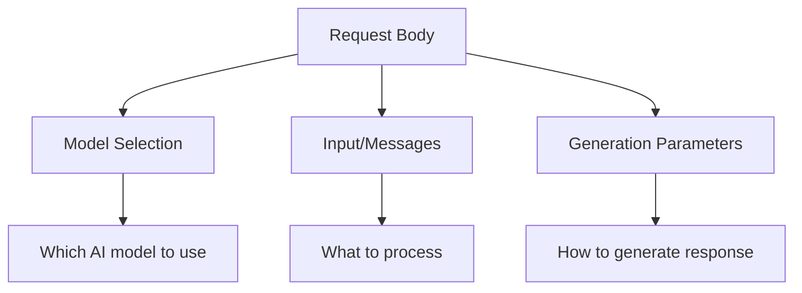

# Request Body Structure

## Introduction

The request body is where you specify what you want the AI to do. It contains your input, model selection, and generation parameters. Understanding the structure helps you craft precise requests and troubleshoot issues.

### What We'll Cover

- JSON request body anatomy
- Required vs. optional fields
- `input` array (Responses API) vs. `messages` array (Chat Completions)
- Structuring complex inputs
- Common validation errors

### Prerequisites

- JSON syntax familiarity
- Basic API concepts

---

## Request Body Anatomy

Every AI API request body follows a similar pattern:

```json
{
    "model": "model-identifier",
    "input": "Your prompt or messages",
    "parameters": "generation controls"
}
```



---

## OpenAI Responses API Structure

The modern Responses API uses a cleaner structure:

```python
{
    # Required
    "model": "gpt-4.1",
    "input": "What is Python?",
    
    # Optional
    "instructions": "You are a helpful coding tutor.",
    "temperature": 0.7,
    "max_output_tokens": 1000
}
```

### Minimal Request

```python
import requests

response = requests.post(
    "https://api.openai.com/v1/responses",
    headers={
        "Authorization": f"Bearer {api_key}",
        "Content-Type": "application/json"
    },
    json={
        "model": "gpt-4.1",
        "input": "Hello, how are you?"
    }
)
```

### Full Request Example

```python
payload = {
    # Model selection
    "model": "gpt-4.1",
    
    # System instructions
    "instructions": "You are a Python expert. Be concise.",
    
    # User input (string or array)
    "input": "Explain list comprehensions",
    
    # Generation parameters
    "temperature": 0.5,
    "max_output_tokens": 500,
    
    # Advanced options
    "store": True,                    # Save to conversation history
    "metadata": {"user_id": "123"},   # Custom metadata
    "stream": False                   # Streaming response
}
```

---

## OpenAI Chat Completions Structure

The legacy Chat Completions API uses `messages` array:

```python
{
    # Required
    "model": "gpt-4o",
    "messages": [
        {"role": "system", "content": "You are a helpful assistant."},
        {"role": "user", "content": "What is Python?"}
    ],
    
    # Optional
    "temperature": 0.7,
    "max_completion_tokens": 1000
}
```

### Message Array Format

```python
messages = [
    # System message (optional, sets behavior)
    {
        "role": "system",
        "content": "You are a Python coding tutor."
    },
    
    # User message (required)
    {
        "role": "user",
        "content": "What are decorators?"
    },
    
    # Assistant response (for multi-turn)
    {
        "role": "assistant",
        "content": "Decorators are functions that modify other functions..."
    },
    
    # Follow-up user message
    {
        "role": "user",
        "content": "Show me an example."
    }
]
```

---

## Input Formats Comparison

### String Input (Responses API)

```python
# Simple string
{
    "model": "gpt-4.1",
    "input": "Translate 'hello' to Spanish"
}
```

### Array Input (Responses API)

```python
# Structured array with types
{
    "model": "gpt-4.1",
    "input": [
        {
            "type": "input_text",
            "text": "What's in this image?"
        },
        {
            "type": "input_image",
            "image_url": "https://example.com/image.jpg"
        }
    ]
}
```

### Messages Array (Chat Completions)

```python
# Role-based messages
{
    "model": "gpt-4o",
    "messages": [
        {"role": "user", "content": "What's in this image?"},
        {
            "role": "user",
            "content": [
                {"type": "text", "text": "Describe this:"},
                {"type": "image_url", "image_url": {"url": "https://..."}}
            ]
        }
    ]
}
```

---

## Anthropic Request Structure

Anthropic's Messages API has its own format:

```python
{
    # Required
    "model": "claude-sonnet-4-20250514",
    "max_tokens": 1024,
    "messages": [
        {"role": "user", "content": "Hello, Claude!"}
    ],
    
    # Optional
    "system": "You are a helpful assistant.",
    "temperature": 0.7
}
```

> **Important:** Anthropic requires `max_tokens` in every request. OpenAI makes it optional.

### Anthropic vs. OpenAI Comparison

| Field | OpenAI (Responses) | Anthropic |
|-------|-------------------|-----------|
| Model | `model` | `model` |
| Input | `input` (string/array) | `messages` (array) |
| System prompt | `instructions` | `system` |
| Max tokens | `max_output_tokens` (optional) | `max_tokens` (required) |
| Temperature | `temperature` | `temperature` |

---

## Required vs. Optional Fields

### OpenAI Responses API

| Field | Required | Default |
|-------|----------|---------|
| `model` | ✅ | — |
| `input` | ✅* | — |
| `instructions` | ❌ | None |
| `temperature` | ❌ | Model-dependent |
| `max_output_tokens` | ❌ | Model max |
| `stream` | ❌ | `false` |
| `tools` | ❌ | None |
| `store` | ❌ | `true` |

*Either `input` or a continuation (`previous_response_id`) required.

### OpenAI Chat Completions

| Field | Required | Default |
|-------|----------|---------|
| `model` | ✅ | — |
| `messages` | ✅ | — |
| `temperature` | ❌ | 1.0 |
| `max_completion_tokens` | ❌ | Model max |
| `stream` | ❌ | `false` |
| `tools` | ❌ | None |

### Anthropic Messages

| Field | Required | Default |
|-------|----------|---------|
| `model` | ✅ | — |
| `messages` | ✅ | — |
| `max_tokens` | ✅ | — |
| `system` | ❌ | None |
| `temperature` | ❌ | 1.0 |
| `stream` | ❌ | `false` |

---

## Multimodal Input Structure

Modern APIs accept text, images, and other content types:

### OpenAI Vision Input

```python
# Responses API with image
{
    "model": "gpt-4.1",
    "input": [
        {"type": "input_text", "text": "What's in this image?"},
        {
            "type": "input_image",
            "image_url": "https://example.com/photo.jpg"
        }
    ]
}

# Base64 encoded image
{
    "model": "gpt-4.1",
    "input": [
        {"type": "input_text", "text": "Describe this:"},
        {
            "type": "input_image",
            "image_url": f"data:image/jpeg;base64,{base64_string}"
        }
    ]
}
```

### Anthropic Vision Input

```python
{
    "model": "claude-sonnet-4-20250514",
    "max_tokens": 1024,
    "messages": [
        {
            "role": "user",
            "content": [
                {
                    "type": "image",
                    "source": {
                        "type": "url",
                        "url": "https://example.com/image.jpg"
                    }
                },
                {
                    "type": "text",
                    "text": "What's in this image?"
                }
            ]
        }
    ]
}
```

---

## Building Requests Programmatically

Create a request builder for consistent formatting:

```python
from dataclasses import dataclass, field
from typing import List, Dict, Any, Optional

@dataclass
class ResponsesAPIRequest:
    """Builder for OpenAI Responses API requests."""
    
    model: str
    input: str | List[Dict[str, Any]]
    instructions: Optional[str] = None
    temperature: Optional[float] = None
    max_output_tokens: Optional[int] = None
    stream: bool = False
    tools: List[Dict[str, Any]] = field(default_factory=list)
    metadata: Dict[str, str] = field(default_factory=dict)
    
    def to_dict(self) -> Dict[str, Any]:
        """Convert to API-ready dictionary."""
        payload = {
            "model": self.model,
            "input": self.input
        }
        
        if self.instructions:
            payload["instructions"] = self.instructions
        if self.temperature is not None:
            payload["temperature"] = self.temperature
        if self.max_output_tokens:
            payload["max_output_tokens"] = self.max_output_tokens
        if self.stream:
            payload["stream"] = True
        if self.tools:
            payload["tools"] = self.tools
        if self.metadata:
            payload["metadata"] = self.metadata
            
        return payload

# Usage
request = ResponsesAPIRequest(
    model="gpt-4.1",
    input="Explain async/await in Python",
    instructions="Be concise. Use examples.",
    temperature=0.5,
    max_output_tokens=500
)

payload = request.to_dict()
```

### Multi-Provider Request Builder

```python
from abc import ABC, abstractmethod
from typing import Dict, Any

class BaseRequest(ABC):
    """Abstract base for API requests."""
    
    @abstractmethod
    def to_dict(self) -> Dict[str, Any]:
        pass

class OpenAIRequest(BaseRequest):
    def __init__(self, model: str, input: str, **kwargs):
        self.model = model
        self.input = input
        self.kwargs = kwargs
    
    def to_dict(self) -> Dict[str, Any]:
        return {
            "model": self.model,
            "input": self.input,
            **{k: v for k, v in self.kwargs.items() if v is not None}
        }

class AnthropicRequest(BaseRequest):
    def __init__(self, model: str, messages: list, max_tokens: int, **kwargs):
        self.model = model
        self.messages = messages
        self.max_tokens = max_tokens
        self.kwargs = kwargs
    
    def to_dict(self) -> Dict[str, Any]:
        return {
            "model": self.model,
            "messages": self.messages,
            "max_tokens": self.max_tokens,
            **{k: v for k, v in self.kwargs.items() if v is not None}
        }

# Usage
openai_req = OpenAIRequest("gpt-4.1", "Hello", temperature=0.7)
anthropic_req = AnthropicRequest(
    "claude-sonnet-4-20250514",
    [{"role": "user", "content": "Hello"}],
    max_tokens=1024
)
```

---

## Common Validation Errors

### Missing Required Fields

```python
# ❌ Missing model
{"input": "Hello"}
# Error: "model is required"

# ❌ Missing input (OpenAI)
{"model": "gpt-4.1"}
# Error: "input is required"

# ❌ Missing max_tokens (Anthropic)
{"model": "claude-sonnet-4-20250514", "messages": [...]}
# Error: "max_tokens is required"
```

### Invalid Field Types

```python
# ❌ temperature as string
{"model": "gpt-4.1", "input": "Hi", "temperature": "0.7"}
# Error: "temperature must be a number"

# ❌ messages as string (should be array)
{"model": "gpt-4o", "messages": "Hello"}
# Error: "messages must be an array"
```

### Out of Range Values

```python
# ❌ temperature > 2
{"model": "gpt-4.1", "input": "Hi", "temperature": 3.0}
# Error: "temperature must be between 0 and 2"

# ❌ max_tokens too high
{"model": "gpt-4.1", "input": "Hi", "max_output_tokens": 1000000}
# Error: "max_output_tokens exceeds model limit"
```

### Validation Helper

```python
def validate_request(payload: dict, provider: str) -> list:
    """Validate request payload, return list of errors."""
    errors = []
    
    # Common validations
    if "model" not in payload:
        errors.append("model is required")
    
    # Provider-specific
    if provider == "openai":
        if "input" not in payload:
            errors.append("input is required")
        if "temperature" in payload:
            temp = payload["temperature"]
            if not isinstance(temp, (int, float)):
                errors.append("temperature must be a number")
            elif not 0 <= temp <= 2:
                errors.append("temperature must be between 0 and 2")
                
    elif provider == "anthropic":
        if "messages" not in payload:
            errors.append("messages is required")
        if "max_tokens" not in payload:
            errors.append("max_tokens is required")
        elif not isinstance(payload["max_tokens"], int):
            errors.append("max_tokens must be an integer")
    
    return errors

# Usage
errors = validate_request({"model": "gpt-4.1"}, "openai")
# ['input is required']
```

---

## Hands-on Exercise

### Your Task

Create a `RequestBuilder` class that generates valid request bodies for OpenAI and Anthropic.

### Requirements

1. Support both providers
2. Include input validation
3. Handle optional parameters correctly
4. Raise clear errors for missing required fields

### Expected Result

```python
builder = RequestBuilder(provider="openai")
payload = builder.build(
    model="gpt-4.1",
    input="Hello",
    temperature=0.7
)
# {"model": "gpt-4.1", "input": "Hello", "temperature": 0.7}

builder = RequestBuilder(provider="anthropic")
payload = builder.build(
    model="claude-sonnet-4-20250514",
    messages=[{"role": "user", "content": "Hi"}],
    max_tokens=1024
)
# {"model": "claude-sonnet-4-20250514", "messages": [...], "max_tokens": 1024}
```

<details>
<summary>💡 Hints</summary>

- Use a factory pattern based on provider
- Validate required fields before building
- Filter out `None` values from optional parameters
</details>

<details>
<summary>✅ Solution</summary>

```python
from typing import Dict, Any, List, Optional

class RequestBuilder:
    REQUIRED_FIELDS = {
        "openai": ["model", "input"],
        "anthropic": ["model", "messages", "max_tokens"]
    }
    
    def __init__(self, provider: str):
        if provider not in self.REQUIRED_FIELDS:
            raise ValueError(f"Unknown provider: {provider}")
        self.provider = provider
    
    def build(self, **kwargs) -> Dict[str, Any]:
        # Validate required fields
        required = self.REQUIRED_FIELDS[self.provider]
        missing = [f for f in required if f not in kwargs]
        if missing:
            raise ValueError(f"Missing required fields: {missing}")
        
        # Build payload excluding None values
        payload = {k: v for k, v in kwargs.items() if v is not None}
        
        # Provider-specific validation
        self._validate(payload)
        
        return payload
    
    def _validate(self, payload: dict):
        if "temperature" in payload:
            temp = payload["temperature"]
            if not 0 <= temp <= 2:
                raise ValueError("temperature must be between 0 and 2")
        
        if self.provider == "anthropic":
            if not isinstance(payload.get("max_tokens"), int):
                raise ValueError("max_tokens must be an integer")

# Test
builder = RequestBuilder("openai")
print(builder.build(model="gpt-4.1", input="Hello", temperature=0.7))

builder = RequestBuilder("anthropic")
print(builder.build(
    model="claude-sonnet-4-20250514",
    messages=[{"role": "user", "content": "Hi"}],
    max_tokens=1024
))
```

</details>

---

## Summary

✅ Request bodies contain model, input, and generation parameters  
✅ OpenAI Responses API uses `input` (string or array), Chat Completions uses `messages` array  
✅ Anthropic requires `max_tokens` in every request  
✅ Validate required fields before sending requests  
✅ Use typed builders to ensure consistent request formatting  
✅ Handle multimodal input with proper content type arrays

**Next:** [Message Formats](./04-message-formats.md)

---

## Further Reading

- [OpenAI Responses API](https://platform.openai.com/docs/api-reference/responses) — Complete parameter reference
- [OpenAI Chat Completions](https://platform.openai.com/docs/api-reference/chat) — Message format details
- [Anthropic Messages API](https://docs.anthropic.com/en/api/messages) — Request structure

<!-- 
Sources Consulted:
- OpenAI Responses API: https://platform.openai.com/docs/api-reference/responses/create
- OpenAI Chat Completions: https://platform.openai.com/docs/api-reference/chat/create
- Anthropic Messages: https://docs.anthropic.com/en/api/messages
-->
