# Message Formats and Roles

## Introduction

AI APIs use structured message formats to distinguish between different speakers in a conversation. Understanding roles helps you craft effective prompts, build multi-turn conversations, and leverage features like tool calling.

### What We'll Cover

- The four primary message roles
- `developer` vs. `system` role
- `instructions` parameter (Responses API)
- Multi-turn conversation structure
- Tool and function messages
- Provider-specific role differences

### Prerequisites

- Basic API request structure knowledge
- Understanding of JSON format

---

## The Four Primary Roles

AI APIs recognize four main message roles:


| Role | Purpose | Who Writes It |
|------|---------|---------------|
| `system` / `developer` | Define AI behavior, personality | Developer |
| `user` | Questions, requests from end user | User / Application |
| `assistant` | AI's responses | AI (or mocked for context) |
| `tool` | Results from function calls | Application |

---

## System and Developer Roles

### The `system` Role (Legacy)

Traditionally, the `system` role sets the AI's behavior:

```python
# Chat Completions API
messages = [
    {
        "role": "system",
        "content": "You are a helpful Python tutor. Be concise and use examples."
    },
    {
        "role": "user",
        "content": "What are list comprehensions?"
    }
]
```

### The `developer` Role (Modern)

OpenAI introduced `developer` as a more explicit system role:

```python
# Chat Completions API (modern)
messages = [
    {
        "role": "developer",
        "content": "You are a Python expert. Always include code examples."
    },
    {
        "role": "user",
        "content": "Explain decorators"
    }
]
```

### System vs. Developer Comparison

| Aspect | `system` | `developer` |
|--------|----------|-------------|
| Introduced | Original | 2024 (newer models) |
| Intent | Set behavior | Set behavior (clearer naming) |
| Priority | Standard | Higher in some models |
| Support | All models | Newer models only |

> **Note:** For maximum compatibility, `system` works everywhere. Use `developer` with GPT-4.1 and newer models for potentially stronger instruction following.

---

## The `instructions` Parameter (Responses API)

The Responses API separates system instructions from messages:

```python
# Responses API - instructions is a separate parameter
{
    "model": "gpt-4.1",
    "instructions": "You are a Python tutor. Be concise. Use examples.",
    "input": "What are generators?"
}
```

### Comparison: `instructions` vs. `system` Message

```python
# Responses API (cleaner)
{
    "model": "gpt-4.1",
    "instructions": "You are a helpful assistant.",
    "input": "Hello"
}

# Chat Completions (verbose)
{
    "model": "gpt-4o",
    "messages": [
        {"role": "system", "content": "You are a helpful assistant."},
        {"role": "user", "content": "Hello"}
    ]
}
```

### Benefits of `instructions`

| Feature | `instructions` | `system` message |
|---------|----------------|------------------|
| Clarity | Separate from conversation | Mixed with messages |
| Caching | Better cache hit rate | Part of message hash |
| Modification | Easy to update | Rebuilds messages array |
| Token counting | Distinct | Part of message total |

---

## User Role

The `user` role represents human input:

```python
# Simple text
{
    "role": "user",
    "content": "What is machine learning?"
}

# With name (for multi-user scenarios)
{
    "role": "user",
    "content": "What is machine learning?",
    "name": "Alice"  # Optional identifier
}
```

### Multimodal User Messages

Modern APIs support rich content in user messages:

```python
# Image + text (Chat Completions)
{
    "role": "user",
    "content": [
        {"type": "text", "text": "What's in this image?"},
        {
            "type": "image_url",
            "image_url": {"url": "https://example.com/image.jpg"}
        }
    ]
}

# Image + text (Responses API)
{
    "model": "gpt-4.1",
    "input": [
        {"type": "input_text", "text": "Describe this:"},
        {"type": "input_image", "image_url": "https://example.com/image.jpg"}
    ]
}
```

---

## Assistant Role

The `assistant` role represents AI responses:

```python
# AI's response in multi-turn conversation
{
    "role": "assistant",
    "content": "Machine learning is a subset of AI that enables..."
}
```

### Multi-Turn Conversation Structure

```python
messages = [
    {"role": "system", "content": "You are a helpful coding assistant."},
    
    # Turn 1
    {"role": "user", "content": "What is a Python decorator?"},
    {"role": "assistant", "content": "A decorator is a function that modifies another function..."},
    
    # Turn 2
    {"role": "user", "content": "Show me an example"},
    {"role": "assistant", "content": "@my_decorator\ndef greet(): ..."},
    
    # Current turn
    {"role": "user", "content": "How do decorators with arguments work?"}
]
```

### Assistant Prefill

You can "prefill" the assistant's response to guide output format:

```python
# Chat Completions - prefill response format
messages = [
    {"role": "user", "content": "List 3 programming languages"},
    {"role": "assistant", "content": "1."}  # Force numbered list format
]

# Anthropic - explicit prefill
messages = [
    {"role": "user", "content": "What's 2+2? Answer with just the number."},
    {"role": "assistant", "content": ""}  # Some APIs allow empty prefill
]
```

---

## Tool Role

The `tool` role returns results from function/tool calls:

```python
# After AI requests a tool call
messages = [
    {"role": "user", "content": "What's the weather in Paris?"},
    {
        "role": "assistant",
        "content": None,
        "tool_calls": [
            {
                "id": "call_abc123",
                "type": "function",
                "function": {
                    "name": "get_weather",
                    "arguments": '{"location": "Paris"}'
                }
            }
        ]
    },
    # Tool result
    {
        "role": "tool",
        "tool_call_id": "call_abc123",
        "content": '{"temperature": 22, "condition": "sunny"}'
    }
]
```

### Tool Message Structure

```mermaid
sequenceDiagram
    participant User
    participant API
    participant Tool
    
    User->>API: "What's the weather?"
    API->>User: tool_call: get_weather(Paris)
    User->>Tool: Execute get_weather("Paris")
    Tool->>User: {"temp": 22}
    User->>API: role: tool, content: {"temp": 22}
    API->>User: "It's 22°C and sunny in Paris"
```



---

## Provider-Specific Differences

### OpenAI Roles

```python
# OpenAI Chat Completions
OPENAI_ROLES = ["system", "user", "assistant", "tool", "developer"]

# OpenAI Responses API
# Uses "instructions" instead of system message
# Input is not role-based
```

### Anthropic Roles

```python
# Anthropic Messages API
ANTHROPIC_ROLES = ["user", "assistant"]

# System is a separate parameter, not a role
{
    "model": "claude-sonnet-4-20250514",
    "system": "You are a helpful assistant.",  # Not in messages!
    "messages": [
        {"role": "user", "content": "Hello"}
    ],
    "max_tokens": 1024
}
```

> **Important:** Anthropic doesn't have a `system` role in messages. It's a separate top-level parameter.

### Anthropic Tool Results

```python
# Anthropic tool result format
{
    "role": "user",
    "content": [
        {
            "type": "tool_result",
            "tool_use_id": "toolu_abc123",
            "content": "Weather is sunny, 22°C"
        }
    ]
}
```

### Role Comparison Table

| Feature | OpenAI | Anthropic |
|---------|--------|-----------|
| System prompt | `role: "system"` or `instructions` | `system` parameter |
| User input | `role: "user"` | `role: "user"` |
| AI response | `role: "assistant"` | `role: "assistant"` |
| Tool result | `role: "tool"` | `type: "tool_result"` in user message |
| Developer role | `role: "developer"` | ❌ Not supported |

---

## Building Conversations Programmatically

Create a helper class for conversation management:

```python
from dataclasses import dataclass, field
from typing import List, Dict, Any, Optional
from enum import Enum

class Role(Enum):
    SYSTEM = "system"
    DEVELOPER = "developer"
    USER = "user"
    ASSISTANT = "assistant"
    TOOL = "tool"

@dataclass
class Message:
    role: Role
    content: str | List[Dict] | None
    name: Optional[str] = None
    tool_calls: Optional[List[Dict]] = None
    tool_call_id: Optional[str] = None
    
    def to_dict(self) -> Dict[str, Any]:
        msg = {"role": self.role.value}
        if self.content is not None:
            msg["content"] = self.content
        if self.name:
            msg["name"] = self.name
        if self.tool_calls:
            msg["tool_calls"] = self.tool_calls
        if self.tool_call_id:
            msg["tool_call_id"] = self.tool_call_id
        return msg

@dataclass
class Conversation:
    messages: List[Message] = field(default_factory=list)
    system_prompt: Optional[str] = None
    
    def add_system(self, content: str):
        self.system_prompt = content
        self.messages.insert(0, Message(Role.SYSTEM, content))
        return self
    
    def add_user(self, content: str, name: Optional[str] = None):
        self.messages.append(Message(Role.USER, content, name=name))
        return self
    
    def add_assistant(self, content: str):
        self.messages.append(Message(Role.ASSISTANT, content))
        return self
    
    def add_tool_result(self, tool_call_id: str, content: str):
        self.messages.append(Message(
            Role.TOOL, 
            content, 
            tool_call_id=tool_call_id
        ))
        return self
    
    def to_messages(self) -> List[Dict[str, Any]]:
        return [msg.to_dict() for msg in self.messages]

# Usage
conv = Conversation()
conv.add_system("You are a Python tutor.")
conv.add_user("What is a decorator?")
conv.add_assistant("A decorator is a function that wraps another function...")
conv.add_user("Show an example")

messages = conv.to_messages()
```

---

## Best Practices

### Message Structure

| ✅ Do | ❌ Don't |
|-------|----------|
| Keep system prompt focused | Put conversation history in system |
| Use clear role separation | Mix user/assistant content |
| Include relevant context | Overload with irrelevant history |
| Trim old messages for context window | Send entire conversation every time |

### System Prompt Tips

```python
# ✅ Good: Focused and specific
system = """You are a Python coding assistant.
- Be concise
- Include runnable code examples
- Explain errors clearly"""

# ❌ Bad: Vague and broad
system = "You are a helpful assistant that knows everything."
```

### Multi-Turn Best Practices

```python
def truncate_conversation(messages: list, max_tokens: int) -> list:
    """Keep system + recent messages within token limit."""
    # Always keep system message
    system_msg = messages[0] if messages[0]["role"] == "system" else None
    other_msgs = messages[1:] if system_msg else messages
    
    # Keep most recent messages
    # (In practice, count tokens properly)
    result = []
    if system_msg:
        result.append(system_msg)
    result.extend(other_msgs[-10:])  # Keep last 10 exchanges
    return result
```

---

## Hands-on Exercise

### Your Task

Build a `ConversationManager` that handles both OpenAI and Anthropic message formats.

### Requirements

1. Support both providers with consistent interface
2. Handle system prompts correctly for each provider
3. Convert between formats when needed
4. Include method to export conversation for API call

### Expected Result

```python
mgr = ConversationManager(provider="openai")
mgr.set_system("You are a helpful assistant.")
mgr.add_user("Hello!")
mgr.add_assistant("Hi! How can I help?")

openai_format = mgr.export()
# {"messages": [...], ...}

mgr.switch_provider("anthropic")
anthropic_format = mgr.export()
# {"system": "...", "messages": [...], ...}
```

<details>
<summary>💡 Hints</summary>

- Store messages in a normalized format internally
- Convert on export based on provider
- Remember Anthropic's system is a separate parameter
</details>

<details>
<summary>✅ Solution</summary>

```python
from dataclasses import dataclass, field
from typing import List, Dict, Any, Optional

@dataclass
class ConversationManager:
    provider: str = "openai"
    _system: Optional[str] = None
    _messages: List[Dict[str, str]] = field(default_factory=list)
    
    def set_system(self, content: str):
        self._system = content
        return self
    
    def add_user(self, content: str):
        self._messages.append({"role": "user", "content": content})
        return self
    
    def add_assistant(self, content: str):
        self._messages.append({"role": "assistant", "content": content})
        return self
    
    def switch_provider(self, provider: str):
        if provider not in ("openai", "anthropic"):
            raise ValueError(f"Unknown provider: {provider}")
        self.provider = provider
        return self
    
    def export(self) -> Dict[str, Any]:
        if self.provider == "openai":
            return self._export_openai()
        return self._export_anthropic()
    
    def _export_openai(self) -> Dict[str, Any]:
        messages = []
        if self._system:
            messages.append({"role": "system", "content": self._system})
        messages.extend(self._messages)
        return {"messages": messages}
    
    def _export_anthropic(self) -> Dict[str, Any]:
        result = {"messages": self._messages.copy()}
        if self._system:
            result["system"] = self._system
        return result

# Test
mgr = ConversationManager()
mgr.set_system("You are a Python expert.")
mgr.add_user("What is asyncio?")
mgr.add_assistant("Asyncio is Python's async I/O library...")

print("OpenAI format:", mgr.export())
mgr.switch_provider("anthropic")
print("Anthropic format:", mgr.export())
```

</details>

---

## Summary

✅ Four main roles: `system`/`developer`, `user`, `assistant`, `tool`  
✅ The `developer` role is OpenAI's modern alternative to `system`  
✅ Responses API uses `instructions` parameter instead of system messages  
✅ Anthropic places system prompts outside the messages array  
✅ Tool messages return function call results to the AI  
✅ Use conversation managers to handle multi-turn interactions

**Next:** [Model Specification](./05-model-specification.md)

---

## Further Reading

- [OpenAI Message Roles](https://platform.openai.com/docs/guides/text-generation) — Role documentation
- [Anthropic Message Format](https://docs.anthropic.com/en/api/messages) — System and message structure
- [OpenAI Function Calling](https://platform.openai.com/docs/guides/function-calling) — Tool message details

<!-- 
Sources Consulted:
- OpenAI Responses API: https://platform.openai.com/docs/api-reference/responses/create
- OpenAI Chat Completions: https://platform.openai.com/docs/api-reference/chat/create
- Anthropic Messages: https://docs.anthropic.com/en/api/messages
-->
