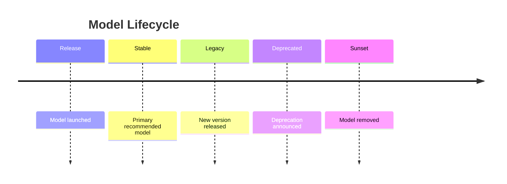
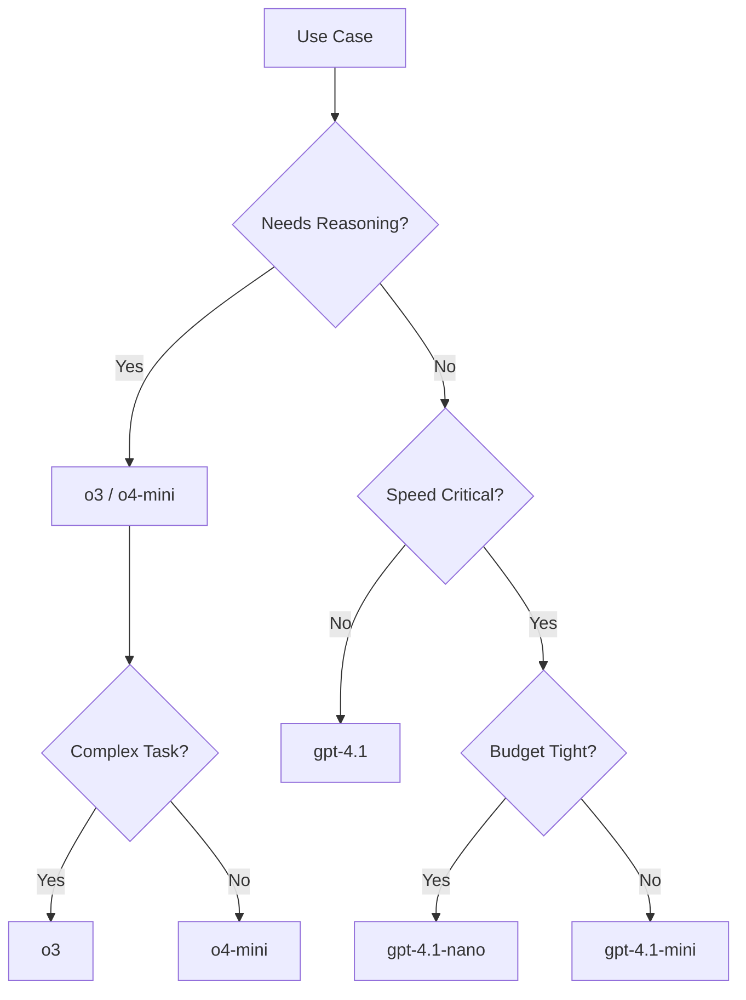

# Model Specification

## Introduction

Model selection significantly impacts response quality, speed, cost, and capabilities. Understanding model naming conventions, version pinning, and regional availability helps you make informed choices for your applications.

### What We'll Cover

- Model naming conventions and IDs
- Model aliases vs. specific versions
- Version pinning for production
- Model capabilities and limitations
- Regional and availability considerations
- Deprecated models and migration

### Prerequisites

- Basic API request structure
- Understanding of AI model concepts

---

## Model Naming Conventions

Each provider uses different naming patterns:

### OpenAI Models

```
gpt-4.1                    # Latest GPT-4.1
gpt-4.1-mini               # Smaller, faster variant
gpt-4.1-2025-04-14         # Date-pinned version
o3                         # Reasoning model
o4-mini                    # Smaller reasoning model
gpt-4o                     # Omni model (legacy naming)
gpt-4o-2024-11-20          # Date-pinned omni model
```

| Pattern | Example | Meaning |
|---------|---------|---------|
| `gpt-X.Y` | `gpt-4.1` | Major.minor version |
| `-mini` | `gpt-4.1-mini` | Smaller/faster variant |
| `-YYYY-MM-DD` | `gpt-4.1-2025-04-14` | Specific date snapshot |
| `o{N}` | `o3`, `o4-mini` | Reasoning models |

### Anthropic Models

```
claude-sonnet-4-20250514   # Claude Sonnet 4, May 2025
claude-opus-4-20250514     # Claude Opus 4, May 2025
claude-3-5-sonnet-20241022 # Claude 3.5 Sonnet, Oct 2024
claude-3-5-haiku-20241022  # Claude 3.5 Haiku, Oct 2024
```

| Pattern | Example | Meaning |
|---------|---------|---------|
| `claude-{tier}-{version}` | `claude-sonnet-4` | Model tier and version |
| `YYYYMMDD` suffix | `-20250514` | Date snapshot |
| Tier names | `opus`, `sonnet`, `haiku` | Capability level |

### Google Gemini Models

```
gemini-2.0-flash           # Fast, efficient
gemini-1.5-pro             # Balanced
gemini-1.5-flash           # Even faster
```

---

## Model Aliases vs. Specific Versions

### Aliases (Auto-Updating)

Aliases point to the latest stable version:

```python
# Alias - auto-updates when new version released
{
    "model": "gpt-4.1"  # Always latest GPT-4.1
}
```

**Pros:**
- Always get latest improvements
- No maintenance needed
- Automatic bug fixes

**Cons:**
- Behavior may change unexpectedly
- Harder to reproduce results
- Potential breaking changes

### Pinned Versions

Specific versions freeze the model snapshot:

```python
# Pinned - exact version, never changes
{
    "model": "gpt-4.1-2025-04-14"
}
```

**Pros:**
- Reproducible results
- No surprise behavior changes
- Predictable for testing

**Cons:**
- Miss improvements
- Must manually update
- May be deprecated

---

## Version Pinning Strategies

### Environment-Based Pinning

```python
import os

# Development: use latest
DEV_MODEL = "gpt-4.1"

# Production: pin to tested version
PROD_MODEL = "gpt-4.1-2025-04-14"

# Select based on environment
model = PROD_MODEL if os.getenv("ENV") == "production" else DEV_MODEL
```

### Configuration-Based Pinning

```python
# config.py
from dataclasses import dataclass

@dataclass
class ModelConfig:
    primary: str
    fallback: str
    pinned: bool
    
MODELS = {
    "development": ModelConfig(
        primary="gpt-4.1",
        fallback="gpt-4.1-mini",
        pinned=False
    ),
    "production": ModelConfig(
        primary="gpt-4.1-2025-04-14",
        fallback="gpt-4.1-mini-2025-04-14",
        pinned=True
    )
}
```

### When to Pin

| Scenario | Recommendation |
|----------|----------------|
| Development | Use aliases |
| Testing | Pin for reproducibility |
| Production | Pin, with scheduled updates |
| Experiments | Use aliases |
| Regulated industries | Always pin |

---

## Model Capabilities

### OpenAI Model Comparison (2025)

| Model | Context | Output | Vision | Tools | Speed | Cost |
|-------|---------|--------|--------|-------|-------|------|
| `gpt-4.1` | 1M | 32K | ✅ | ✅ | Medium | $$ |
| `gpt-4.1-mini` | 1M | 16K | ✅ | ✅ | Fast | $ |
| `gpt-4.1-nano` | 1M | 16K | ✅ | ✅ | Fastest | ¢ |
| `o3` | 200K | 100K | ✅ | ✅ | Slow | $$$$ |
| `o4-mini` | 200K | 100K | ✅ | ✅ | Medium | $$ |

### Anthropic Model Comparison

| Model | Context | Output | Vision | Cost |
|-------|---------|--------|--------|------|
| `claude-opus-4` | 200K | 32K | ✅ | $$$$ |
| `claude-sonnet-4` | 200K | 64K | ✅ | $$ |
| `claude-3-5-haiku` | 200K | 8K | ✅ | $ |

### Capability Detection

```python
from dataclasses import dataclass
from typing import Optional

@dataclass
class ModelCapabilities:
    context_window: int
    max_output: int
    vision: bool
    tools: bool
    streaming: bool
    reasoning: bool = False

MODEL_CAPS = {
    "gpt-4.1": ModelCapabilities(
        context_window=1_000_000,
        max_output=32_768,
        vision=True,
        tools=True,
        streaming=True
    ),
    "gpt-4.1-mini": ModelCapabilities(
        context_window=1_000_000,
        max_output=16_384,
        vision=True,
        tools=True,
        streaming=True
    ),
    "o3": ModelCapabilities(
        context_window=200_000,
        max_output=100_000,
        vision=True,
        tools=True,
        streaming=True,
        reasoning=True
    ),
    "claude-sonnet-4-20250514": ModelCapabilities(
        context_window=200_000,
        max_output=64_000,
        vision=True,
        tools=True,
        streaming=True
    )
}

def check_capability(model: str, capability: str) -> bool:
    """Check if model has a specific capability."""
    caps = MODEL_CAPS.get(model)
    if not caps:
        return False
    return getattr(caps, capability, False)

# Usage
if check_capability("gpt-4.1", "vision"):
    # Use vision features
    pass
```

---

## Listing Available Models

Query the API for available models:

### OpenAI

```python
import requests

response = requests.get(
    "https://api.openai.com/v1/models",
    headers={"Authorization": f"Bearer {api_key}"}
)

models = response.json()["data"]
for model in models:
    print(f"{model['id']} - owned by {model['owned_by']}")
```

### Filtering by Capability

```python
def get_chat_models(api_key: str) -> list:
    """Get models that support chat/completions."""
    response = requests.get(
        "https://api.openai.com/v1/models",
        headers={"Authorization": f"Bearer {api_key}"}
    )
    
    all_models = response.json()["data"]
    
    # Filter for chat-capable models
    chat_prefixes = ("gpt-", "o3", "o4", "chatgpt-")
    return [
        m["id"] for m in all_models 
        if any(m["id"].startswith(p) for p in chat_prefixes)
    ]
```

---

## Regional Availability

Some models have regional restrictions:

### OpenAI Regions

```python
# Most models available globally
# Some features may be region-specific

# Check headers for region info
response = client.responses.create(...)
region = response.headers.get("x-request-region")
```

### Anthropic Regions

```python
# Standard endpoint (global)
base_url = "https://api.anthropic.com"

# Specific region endpoints (if available)
# Check Anthropic docs for region-specific URLs
```

### Regional Fallback Pattern

```python
REGIONAL_ENDPOINTS = {
    "us": "https://api.openai.com",
    "eu": "https://api.openai.com",  # Same, but may differ in future
}

def get_endpoint(region: str = "us") -> str:
    return REGIONAL_ENDPOINTS.get(region, REGIONAL_ENDPOINTS["us"])
```

---

## Model Deprecation

Models get deprecated over time. Handle this gracefully:

### Deprecation Timeline



### Checking Deprecation Status

```python
# OpenAI returns deprecation info in model list
def check_deprecated(model_id: str, api_key: str) -> dict:
    response = requests.get(
        f"https://api.openai.com/v1/models/{model_id}",
        headers={"Authorization": f"Bearer {api_key}"}
    )
    
    if response.status_code == 404:
        return {"status": "removed", "model": model_id}
    
    model = response.json()
    return {
        "status": "active",
        "model": model_id,
        "created": model.get("created")
    }
```

### Migration Helper

```python
# Model migration mapping
MODEL_MIGRATIONS = {
    "gpt-4-0613": "gpt-4o",          # Old -> Recommended
    "gpt-4-turbo": "gpt-4.1",         # Legacy -> Current
    "gpt-3.5-turbo": "gpt-4.1-mini",  # Upgrade path
}

def get_recommended_model(model: str) -> str:
    """Get recommended replacement for deprecated model."""
    return MODEL_MIGRATIONS.get(model, model)

# Usage
old_model = "gpt-4-0613"
new_model = get_recommended_model(old_model)
if new_model != old_model:
    print(f"Consider migrating from {old_model} to {new_model}")
```

---

## Model Selection Strategy

Choose models based on your use case:



### Decision Matrix

| Use Case | Recommended Model | Reason |
|----------|-------------------|--------|
| General chat | `gpt-4.1-mini` | Balanced |
| Complex reasoning | `o3` | Advanced reasoning |
| High volume, simple | `gpt-4.1-nano` | Low cost |
| Code generation | `claude-sonnet-4` | Strong at code |
| Long documents | `gpt-4.1` | 1M context |
| Cost-optimized | `gpt-4.1-mini` | Good price/performance |

---

## Complete Model Selector

```python
from dataclasses import dataclass
from enum import Enum
from typing import Optional

class Priority(Enum):
    QUALITY = "quality"
    SPEED = "speed"
    COST = "cost"
    REASONING = "reasoning"

@dataclass
class ModelSelector:
    provider: str = "openai"
    priority: Priority = Priority.QUALITY
    needs_vision: bool = False
    needs_tools: bool = False
    max_context: Optional[int] = None
    
    def select(self) -> str:
        if self.provider == "openai":
            return self._select_openai()
        elif self.provider == "anthropic":
            return self._select_anthropic()
        raise ValueError(f"Unknown provider: {self.provider}")
    
    def _select_openai(self) -> str:
        if self.priority == Priority.REASONING:
            return "o3" if self.max_context and self.max_context > 100000 else "o4-mini"
        elif self.priority == Priority.SPEED:
            return "gpt-4.1-nano"
        elif self.priority == Priority.COST:
            return "gpt-4.1-mini"
        else:  # QUALITY
            return "gpt-4.1"
    
    def _select_anthropic(self) -> str:
        if self.priority == Priority.QUALITY:
            return "claude-opus-4-20250514"
        elif self.priority == Priority.COST:
            return "claude-3-5-haiku-20241022"
        else:
            return "claude-sonnet-4-20250514"

# Usage
selector = ModelSelector(
    provider="openai",
    priority=Priority.REASONING,
    needs_vision=True
)
model = selector.select()  # "o3"
```

---

## Hands-on Exercise

### Your Task

Build a `ModelRegistry` that manages model information and selection.

### Requirements

1. Store model capabilities (context, output, vision, tools)
2. Support OpenAI and Anthropic models
3. Filter models by capability
4. Recommend model based on requirements
5. Handle deprecated model lookups

### Expected Result

```python
registry = ModelRegistry()

# Find models with vision
vision_models = registry.find(vision=True)
# ["gpt-4.1", "gpt-4.1-mini", "claude-sonnet-4-20250514", ...]

# Get recommendation
model = registry.recommend(
    provider="openai",
    needs_vision=True,
    max_cost="medium"
)
# "gpt-4.1-mini"
```

<details>
<summary>💡 Hints</summary>

- Store model data in a dictionary with model ID as key
- Use dataclasses for model capabilities
- Filter with list comprehension
- Add cost tier to capabilities
</details>

<details>
<summary>✅ Solution</summary>

```python
from dataclasses import dataclass
from typing import List, Optional

@dataclass
class ModelInfo:
    id: str
    provider: str
    context: int
    max_output: int
    vision: bool
    tools: bool
    cost_tier: str  # "low", "medium", "high"
    deprecated: bool = False
    replacement: Optional[str] = None

class ModelRegistry:
    def __init__(self):
        self._models = {
            "gpt-4.1": ModelInfo(
                id="gpt-4.1", provider="openai",
                context=1_000_000, max_output=32_768,
                vision=True, tools=True, cost_tier="medium"
            ),
            "gpt-4.1-mini": ModelInfo(
                id="gpt-4.1-mini", provider="openai",
                context=1_000_000, max_output=16_384,
                vision=True, tools=True, cost_tier="low"
            ),
            "gpt-4.1-nano": ModelInfo(
                id="gpt-4.1-nano", provider="openai",
                context=1_000_000, max_output=16_384,
                vision=True, tools=True, cost_tier="low"
            ),
            "o3": ModelInfo(
                id="o3", provider="openai",
                context=200_000, max_output=100_000,
                vision=True, tools=True, cost_tier="high"
            ),
            "claude-sonnet-4-20250514": ModelInfo(
                id="claude-sonnet-4-20250514", provider="anthropic",
                context=200_000, max_output=64_000,
                vision=True, tools=True, cost_tier="medium"
            ),
            "claude-3-5-haiku-20241022": ModelInfo(
                id="claude-3-5-haiku-20241022", provider="anthropic",
                context=200_000, max_output=8_192,
                vision=True, tools=True, cost_tier="low"
            ),
        }
    
    def find(self, 
             vision: Optional[bool] = None,
             tools: Optional[bool] = None,
             provider: Optional[str] = None,
             max_cost: Optional[str] = None) -> List[str]:
        
        cost_order = {"low": 1, "medium": 2, "high": 3}
        results = []
        
        for model_id, info in self._models.items():
            if info.deprecated:
                continue
            if vision is not None and info.vision != vision:
                continue
            if tools is not None and info.tools != tools:
                continue
            if provider and info.provider != provider:
                continue
            if max_cost and cost_order.get(info.cost_tier, 3) > cost_order.get(max_cost, 3):
                continue
            results.append(model_id)
        
        return results
    
    def recommend(self,
                  provider: str = "openai",
                  needs_vision: bool = False,
                  max_cost: str = "medium") -> Optional[str]:
        
        candidates = self.find(
            vision=needs_vision if needs_vision else None,
            provider=provider,
            max_cost=max_cost
        )
        
        if not candidates:
            return None
        
        # Prefer medium-tier for balance
        for model_id in candidates:
            if self._models[model_id].cost_tier == "medium":
                return model_id
        
        return candidates[0]

# Test
registry = ModelRegistry()
print("Vision models:", registry.find(vision=True))
print("Recommended:", registry.recommend(provider="openai", needs_vision=True, max_cost="medium"))
```

</details>

---

## Summary

✅ Use aliases in development, pin versions in production  
✅ OpenAI uses `gpt-X.Y-YYYY-MM-DD` format for pinned versions  
✅ Anthropic uses `claude-{tier}-{version}-YYYYMMDD` format  
✅ Check model capabilities before using features like vision or tools  
✅ Plan for model deprecation with migration mappings  
✅ Choose models based on quality, speed, cost, and capability needs

**Next:** [Parameter Configuration](./06-parameter-configuration.md)

---

## Further Reading

- [OpenAI Models](https://platform.openai.com/docs/models) — Complete model list
- [Anthropic Models](https://docs.anthropic.com/en/docs/models-overview) — Claude model details
- [Model Deprecation Policy](https://platform.openai.com/docs/deprecations) — OpenAI deprecation timeline

<!-- 
Sources Consulted:
- OpenAI Models: https://platform.openai.com/docs/models
- OpenAI API Reference: https://platform.openai.com/docs/api-reference
- Anthropic Models: https://docs.anthropic.com/en/docs/models-overview
-->
