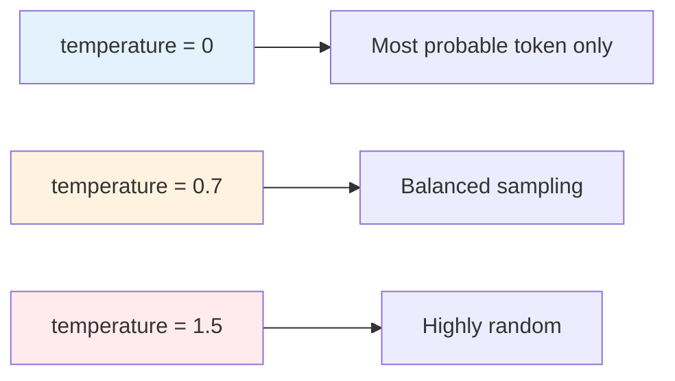

# Parameter Configuration

## Introduction

Generation parameters control how AI models produce responses. Understanding these parameters helps you tune output for specific use cases—from creative writing to deterministic code generation.

### What We'll Cover

- Core sampling parameters (temperature, top_p)
- Output control (max_tokens, stop sequences)
- Repetition penalties
- Streaming configuration
- Seed for reproducibility
- Provider-specific parameters

### Prerequisites

- Basic API request structure
- Understanding of probability concepts

---

## Core Sampling Parameters

### Temperature

Temperature controls randomness in token selection:

```python
# Low temperature (0.0-0.3): Focused, deterministic
{
    "model": "gpt-4.1",
    "input": "What is 2+2?",
    "temperature": 0.0  # Always picks most likely token
}

# Medium temperature (0.5-0.7): Balanced
{
    "model": "gpt-4.1",
    "input": "Write a product description",
    "temperature": 0.7  # Good balance
}

# High temperature (0.8-1.5): Creative, varied
{
    "model": "gpt-4.1",
    "input": "Write a creative poem",
    "temperature": 1.2  # More unexpected choices
}
```



| Range | Behavior | Use Cases |
|-------|----------|-----------|
| 0.0 | Deterministic | Math, code, facts |
| 0.1-0.4 | Mostly focused | Analysis, summaries |
| 0.5-0.8 | Balanced | General conversation |
| 0.9-1.2 | Creative | Stories, brainstorming |
| 1.3-2.0 | Very random | Experimental |

### Top-P (Nucleus Sampling)

Top-P limits the token pool by cumulative probability:

```python
{
    "model": "gpt-4.1",
    "input": "Complete this sentence:",
    "top_p": 0.9  # Consider tokens until 90% probability mass
}
```

| Value | Effect |
|-------|--------|
| 0.1 | Only most probable tokens (very focused) |
| 0.5 | Top 50% probability mass |
| 0.9 | Top 90% probability mass (default) |
| 1.0 | All tokens considered |

> **Best Practice:** Adjust either temperature OR top_p, not both. They interact in complex ways.

```python
# ✅ Good: Adjust one
{"temperature": 0.7, "top_p": 1.0}
{"temperature": 1.0, "top_p": 0.9}

# ❌ Avoid: Both adjusted
{"temperature": 0.5, "top_p": 0.5}  # Confusing interaction
```

---

## Output Control Parameters

### Max Tokens / Max Output Tokens

Limits response length:

```python
# OpenAI Responses API
{
    "model": "gpt-4.1",
    "input": "Explain quantum computing",
    "max_output_tokens": 500  # Responses API parameter
}

# OpenAI Chat Completions
{
    "model": "gpt-4o",
    "messages": [...],
    "max_completion_tokens": 500  # Chat Completions parameter
}

# Anthropic
{
    "model": "claude-sonnet-4-20250514",
    "messages": [...],
    "max_tokens": 1024  # Required for Anthropic
}
```

| Provider | Parameter Name | Required |
|----------|----------------|----------|
| OpenAI (Responses) | `max_output_tokens` | ❌ Optional |
| OpenAI (Chat) | `max_completion_tokens` | ❌ Optional |
| Anthropic | `max_tokens` | ✅ Required |

### Stop Sequences

Stop generation at specific strings:

```python
{
    "model": "gpt-4.1",
    "input": "List 3 colors:\n1.",
    "stop": ["\n4.", "```", "END"]  # Stop at any of these
}
```

**Use cases:**
- Stop at numbered list completion
- Prevent code block continuation
- End at custom markers

```python
# Generate until function ends
{
    "model": "gpt-4.1",
    "input": "def fibonacci(n):",
    "stop": ["\ndef ", "\nclass "]  # Stop at next function/class
}
```

---

## Repetition Penalties

Reduce repetitive outputs:

### Frequency Penalty

Penalizes tokens based on how often they've appeared:

```python
{
    "model": "gpt-4.1",
    "input": "Write about the ocean",
    "frequency_penalty": 0.5  # Range: -2.0 to 2.0
}
```

| Value | Effect |
|-------|--------|
| 0.0 | No penalty (default) |
| 0.5-1.0 | Moderate reduction |
| 1.5-2.0 | Strong reduction |
| Negative | Encourages repetition |

### Presence Penalty

Penalizes tokens that have appeared at all:

```python
{
    "model": "gpt-4.1",
    "input": "List diverse topics",
    "presence_penalty": 0.8  # Range: -2.0 to 2.0
}
```

| Parameter | Focus | Effect |
|-----------|-------|--------|
| `frequency_penalty` | How often | Reduces word frequency |
| `presence_penalty` | Appeared or not | Encourages new topics |

### Combined Usage

```python
# For varied, non-repetitive content
{
    "model": "gpt-4.1",
    "input": "Brainstorm startup ideas",
    "temperature": 0.9,
    "frequency_penalty": 0.5,
    "presence_penalty": 0.6
}

# For focused, consistent content
{
    "model": "gpt-4.1",
    "input": "Explain recursion",
    "temperature": 0.3,
    "frequency_penalty": 0.0,
    "presence_penalty": 0.0
}
```

---

## Streaming Configuration

Enable real-time token streaming:

```python
# Enable streaming
{
    "model": "gpt-4.1",
    "input": "Tell me a story",
    "stream": True
}
```

### Stream Options (OpenAI)

```python
{
    "model": "gpt-4.1",
    "input": "Explain machine learning",
    "stream": True,
    "stream_options": {
        "include_usage": True  # Include token usage in final chunk
    }
}
```

### Handling Streaming Responses

```python
import requests
import json

def stream_completion(prompt: str, api_key: str):
    response = requests.post(
        "https://api.openai.com/v1/responses",
        headers={
            "Authorization": f"Bearer {api_key}",
            "Content-Type": "application/json"
        },
        json={
            "model": "gpt-4.1",
            "input": prompt,
            "stream": True
        },
        stream=True
    )
    
    for line in response.iter_lines():
        if line:
            line = line.decode("utf-8")
            if line.startswith("data: "):
                data = line[6:]
                if data == "[DONE]":
                    break
                chunk = json.loads(data)
                # Process chunk
                yield chunk
```

---

## Seed for Reproducibility

Set a seed for deterministic outputs:

```python
{
    "model": "gpt-4.1",
    "input": "Generate a random name",
    "seed": 42,  # Same seed = same output
    "temperature": 0.0  # Combine with low temperature
}
```

> **Note:** Reproducibility is best-effort. Model updates may change outputs even with same seed.

### Checking Reproducibility

```python
def check_reproducibility(prompt: str, api_key: str, seed: int = 42):
    """Run same prompt twice to verify determinism."""
    
    responses = []
    for _ in range(2):
        response = requests.post(
            "https://api.openai.com/v1/responses",
            headers={"Authorization": f"Bearer {api_key}"},
            json={
                "model": "gpt-4.1",
                "input": prompt,
                "seed": seed,
                "temperature": 0
            }
        )
        responses.append(response.json()["output"][0]["content"][0]["text"])
    
    return responses[0] == responses[1]
```

---

## Logprobs (Token Probabilities)

Get probability information for generated tokens:

```python
# OpenAI Chat Completions
{
    "model": "gpt-4o",
    "messages": [...],
    "logprobs": True,
    "top_logprobs": 5  # Return top 5 alternatives per token
}
```

### Use Cases

- Confidence scoring
- Uncertainty detection
- Token-level analysis

```python
# Response includes logprobs
{
    "choices": [{
        "message": {"content": "Paris"},
        "logprobs": {
            "content": [{
                "token": "Paris",
                "logprob": -0.0001,
                "top_logprobs": [
                    {"token": "Paris", "logprob": -0.0001},
                    {"token": "London", "logprob": -8.5},
                    {"token": "Berlin", "logprob": -9.2}
                ]
            }]
        }
    }]
}
```

---

## Provider-Specific Parameters

### OpenAI-Specific

```python
{
    "model": "gpt-4.1",
    "input": "Hello",
    
    # Responses API specific
    "store": True,              # Save to conversation store
    "metadata": {"user": "123"}, # Custom metadata
    "truncation": "auto"        # Handle context overflow
}
```

### Anthropic-Specific

```python
{
    "model": "claude-sonnet-4-20250514",
    "messages": [...],
    "max_tokens": 1024,
    
    # Anthropic specific
    "metadata": {
        "user_id": "user-123"    # For abuse tracking
    }
}
```

---

## Parameter Reference Table

### Common Parameters

| Parameter | OpenAI | Anthropic | Default | Range |
|-----------|--------|-----------|---------|-------|
| temperature | ✅ | ✅ | 1.0 | 0-2 |
| max_tokens | `max_output_tokens` | `max_tokens` | Model max | 1-model max |
| top_p | ✅ | ✅ | 1.0 | 0-1 |
| stop | ✅ | `stop_sequences` | None | Array |
| stream | ✅ | ✅ | false | bool |

### OpenAI Only

| Parameter | Purpose |
|-----------|---------|
| `frequency_penalty` | Reduce repetition |
| `presence_penalty` | Encourage diversity |
| `logprobs` | Return token probabilities |
| `seed` | Reproducibility |
| `store` | Save to history |

### Anthropic Only

| Parameter | Purpose |
|-----------|---------|
| `metadata.user_id` | User tracking |
| `system` | System prompt (separate from messages) |

---

## Parameter Builder

```python
from dataclasses import dataclass, field
from typing import List, Optional, Dict, Any

@dataclass
class ParameterConfig:
    """Configure generation parameters."""
    
    temperature: float = 1.0
    max_tokens: Optional[int] = None
    top_p: float = 1.0
    stop: List[str] = field(default_factory=list)
    stream: bool = False
    frequency_penalty: float = 0.0
    presence_penalty: float = 0.0
    seed: Optional[int] = None
    
    def validate(self):
        """Validate parameter ranges."""
        if not 0 <= self.temperature <= 2:
            raise ValueError("temperature must be 0-2")
        if not 0 <= self.top_p <= 1:
            raise ValueError("top_p must be 0-1")
        if not -2 <= self.frequency_penalty <= 2:
            raise ValueError("frequency_penalty must be -2 to 2")
        if not -2 <= self.presence_penalty <= 2:
            raise ValueError("presence_penalty must be -2 to 2")
    
    def to_dict(self, provider: str = "openai") -> Dict[str, Any]:
        """Convert to provider-specific format."""
        self.validate()
        
        params = {
            "temperature": self.temperature,
            "top_p": self.top_p,
            "stream": self.stream
        }
        
        if provider == "openai":
            if self.max_tokens:
                params["max_output_tokens"] = self.max_tokens
            if self.stop:
                params["stop"] = self.stop
            if self.frequency_penalty != 0:
                params["frequency_penalty"] = self.frequency_penalty
            if self.presence_penalty != 0:
                params["presence_penalty"] = self.presence_penalty
            if self.seed is not None:
                params["seed"] = self.seed
                
        elif provider == "anthropic":
            params["max_tokens"] = self.max_tokens or 1024  # Required
            if self.stop:
                params["stop_sequences"] = self.stop
        
        return params

# Usage
config = ParameterConfig(
    temperature=0.7,
    max_tokens=500,
    frequency_penalty=0.5
)
params = config.to_dict("openai")
```

---

## Preset Configurations

```python
from enum import Enum

class Preset(Enum):
    CREATIVE = "creative"
    BALANCED = "balanced"
    PRECISE = "precise"
    CODE = "code"

PRESETS = {
    Preset.CREATIVE: ParameterConfig(
        temperature=1.2,
        top_p=0.95,
        frequency_penalty=0.5,
        presence_penalty=0.6
    ),
    Preset.BALANCED: ParameterConfig(
        temperature=0.7,
        top_p=0.9,
        frequency_penalty=0.0,
        presence_penalty=0.0
    ),
    Preset.PRECISE: ParameterConfig(
        temperature=0.0,
        top_p=1.0,
        frequency_penalty=0.0,
        presence_penalty=0.0,
        seed=42
    ),
    Preset.CODE: ParameterConfig(
        temperature=0.2,
        top_p=0.95,
        frequency_penalty=0.0,
        presence_penalty=0.0
    )
}

def get_preset(preset: Preset) -> ParameterConfig:
    return PRESETS[preset]

# Usage
code_params = get_preset(Preset.CODE).to_dict("openai")
```

---

## Hands-on Exercise

### Your Task

Create a `ParameterTuner` class that suggests optimal parameters based on task type.

### Requirements

1. Accept task descriptions (e.g., "write code", "creative story", "summarize")
2. Return recommended parameter configuration
3. Allow manual overrides
4. Validate all parameters

### Expected Result

```python
tuner = ParameterTuner()
params = tuner.for_task("write python code")
# {"temperature": 0.2, "max_output_tokens": 2000, ...}

params = tuner.for_task("write a poem", temperature=1.5)
# {"temperature": 1.5, ...}  # Override applied
```

<details>
<summary>💡 Hints</summary>

- Use keyword matching for task classification
- Store presets in a dictionary
- Allow `**kwargs` for overrides
</details>

<details>
<summary>✅ Solution</summary>

```python
from dataclasses import dataclass
from typing import Dict, Any

@dataclass
class ParameterTuner:
    TASK_KEYWORDS = {
        "code": ["code", "python", "function", "debug", "program"],
        "creative": ["poem", "story", "creative", "imagine", "fiction"],
        "analysis": ["analyze", "summarize", "explain", "compare"],
        "factual": ["what is", "define", "list", "facts"]
    }
    
    TASK_PRESETS = {
        "code": {
            "temperature": 0.2,
            "max_output_tokens": 2000,
            "top_p": 0.95,
            "frequency_penalty": 0.0
        },
        "creative": {
            "temperature": 1.0,
            "max_output_tokens": 1500,
            "top_p": 0.95,
            "frequency_penalty": 0.5,
            "presence_penalty": 0.5
        },
        "analysis": {
            "temperature": 0.5,
            "max_output_tokens": 1000,
            "top_p": 0.9,
            "frequency_penalty": 0.2
        },
        "factual": {
            "temperature": 0.0,
            "max_output_tokens": 500,
            "top_p": 1.0,
            "frequency_penalty": 0.0
        },
        "default": {
            "temperature": 0.7,
            "max_output_tokens": 1000,
            "top_p": 0.9
        }
    }
    
    def _classify_task(self, task: str) -> str:
        task_lower = task.lower()
        for task_type, keywords in self.TASK_KEYWORDS.items():
            if any(kw in task_lower for kw in keywords):
                return task_type
        return "default"
    
    def for_task(self, task: str, **overrides) -> Dict[str, Any]:
        task_type = self._classify_task(task)
        params = self.TASK_PRESETS[task_type].copy()
        
        # Apply overrides
        for key, value in overrides.items():
            if key in params or key in ["seed", "stop", "stream"]:
                params[key] = value
        
        # Validate
        if not 0 <= params.get("temperature", 0.7) <= 2:
            raise ValueError("temperature must be 0-2")
        
        return params

# Test
tuner = ParameterTuner()
print("Code params:", tuner.for_task("write python code"))
print("Creative params:", tuner.for_task("write a poem", temperature=1.5))
```

</details>

---

## Summary

✅ Temperature controls randomness (0=deterministic, 1+=creative)  
✅ Adjust temperature OR top_p, not both simultaneously  
✅ Use `max_output_tokens` (OpenAI) or `max_tokens` (Anthropic) to limit length  
✅ Stop sequences end generation at specific strings  
✅ Frequency/presence penalties reduce repetition  
✅ Seed + low temperature improves reproducibility  
✅ Create presets for different task types

**Next:** [Modern Parameters (2024-2025)](./07-modern-parameters.md)

---

## Further Reading

- [OpenAI Parameter Guide](https://platform.openai.com/docs/api-reference/responses/create) — Official parameter docs
- [Temperature and Sampling](https://platform.openai.com/docs/guides/text-generation) — Sampling explained
- [Anthropic Parameters](https://docs.anthropic.com/en/api/messages) — Claude parameter reference

<!-- 
Sources Consulted:
- OpenAI Responses API: https://platform.openai.com/docs/api-reference/responses/create
- OpenAI Chat Completions: https://platform.openai.com/docs/api-reference/chat/create
- Anthropic Messages: https://docs.anthropic.com/en/api/messages
-->
