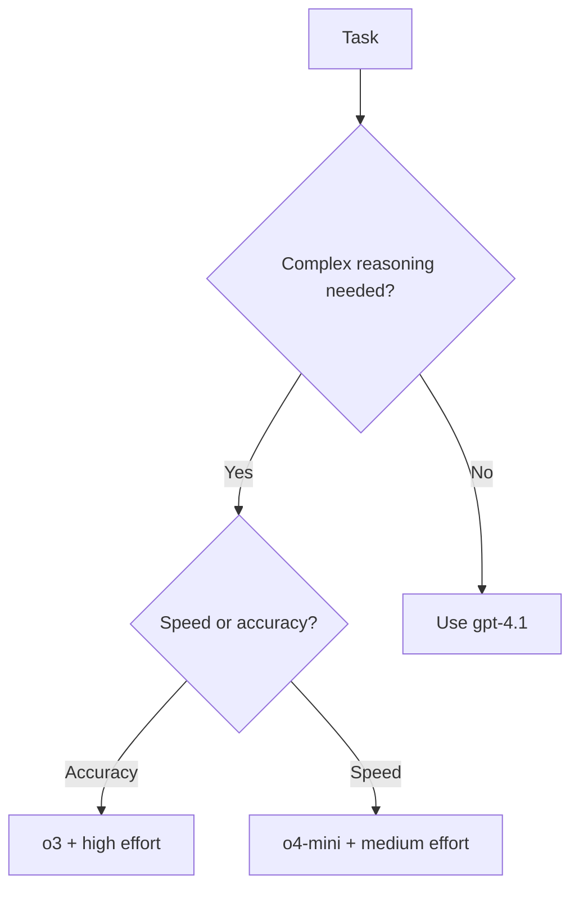
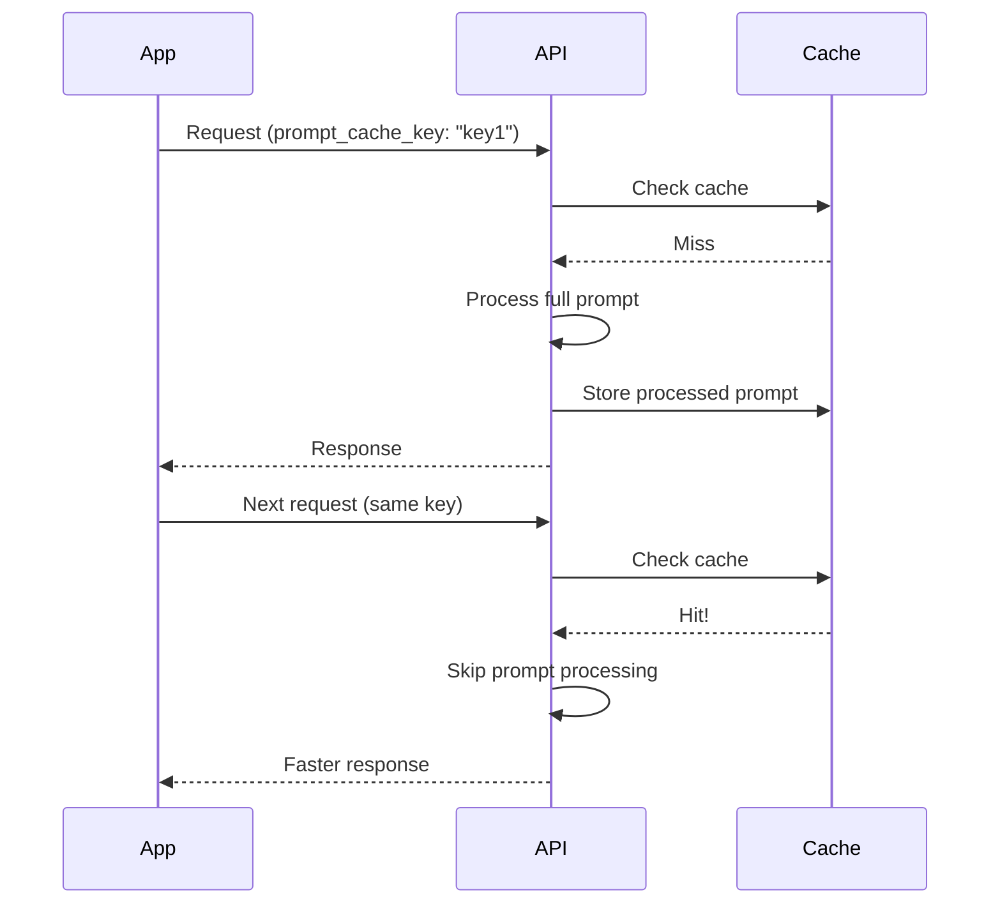

# Modern Parameters (2024-2025)

## Introduction

AI APIs have evolved rapidly with new capabilities. This lesson covers the latest parameters introduced in 2024-2025, including reasoning controls, prompt caching, conversation continuations, service tiers, and built-in tools.

### What We'll Cover

- Reasoning parameters (`reasoning`, `reasoning_effort`)
- Prompt caching (`prompt_cache_key`, cache retention)
- Conversation continuation (`previous_response_id`, `store`)
- Service tiers and priority (`service_tier`)
- Extended thinking (`verbosity`)
- Web search integration (`web_search_options`)
- Multimodal outputs (`modalities`)
- Custom metadata

### Prerequisites

- Core parameter understanding
- Familiarity with request structure

---

## Reasoning Parameters

Reasoning models like `o3` and `o4-mini` support special parameters:

### Reasoning Effort (Chat Completions)

```python
# Chat Completions API
{
    "model": "o3",
    "messages": [...],
    "reasoning_effort": "high"  # "low", "medium", "high"
}
```

| Effort | Tokens Used | Use Case |
|--------|-------------|----------|
| `low` | Fewer | Quick tasks, simple questions |
| `medium` | Moderate | Balanced reasoning |
| `high` | More | Complex problems, math, code |

### Reasoning Object (Responses API)

```python
# Responses API - more control
{
    "model": "o3",
    "input": "Solve this math problem: ...",
    "reasoning": {
        "effort": "high",
        "summary": "auto"  # "auto", "concise", "detailed"
    }
}
```

| Parameter | Values | Purpose |
|-----------|--------|---------|
| `effort` | low/medium/high | How much reasoning to use |
| `summary` | auto/concise/detailed | How to summarize thinking |

### When to Use Reasoning



---

## Prompt Caching

Cache frequently used prompts for faster responses and lower costs:

### OpenAI Prompt Caching

```python
# Responses API
{
    "model": "gpt-4.1",
    "input": "Analyze this code...",
    "instructions": "You are a code reviewer...",  # This gets cached
    "prompt_cache_key": "code-reviewer-v1"  # Cache key
}
```

### How Caching Works



### Anthropic Prompt Caching

```python
# Anthropic uses cache_control in content blocks
{
    "model": "claude-sonnet-4-20250514",
    "system": [
        {
            "type": "text",
            "text": "You are a helpful coding assistant...",
            "cache_control": {"type": "ephemeral"}
        }
    ],
    "messages": [...]
}
```

### Caching Best Practices

| ✅ Do | ❌ Don't |
|-------|----------|
| Cache static system prompts | Cache user-specific data |
| Use consistent cache keys | Change keys frequently |
| Cache large instruction sets | Cache small, simple prompts |
| Monitor cache hit rates | Ignore caching metrics |

---

## Conversation Continuation

The Responses API supports stateful conversations:

### Previous Response ID

```python
# First message
response1 = client.responses.create(
    model="gpt-4.1",
    input="What is Python?",
    store=True  # Save to conversation store
)

# Continue the conversation
response2 = client.responses.create(
    model="gpt-4.1",
    input="Show me an example",
    previous_response_id=response1.id  # Link to previous
)
```

### Store Parameter

```python
{
    "model": "gpt-4.1",
    "input": "Hello",
    "store": True,  # Enable conversation storage
    "metadata": {
        "conversation_id": "conv_123",
        "user_id": "user_456"
    }
}
```

| Value | Behavior |
|-------|----------|
| `true` | Save response, enable continuation |
| `false` | Don't save, single-turn only |

### Benefits of Continuation

- No need to resend conversation history
- Reduced token usage
- Consistent context handling
- Built-in conversation management

---

## Service Tiers

Control request priority and routing:

```python
{
    "model": "gpt-4.1",
    "input": "Important query",
    "service_tier": "auto"  # "auto", "default", "flex"
}
```

### Tier Options

| Tier | Behavior | Cost |
|------|----------|------|
| `auto` | Automatic selection | Varies |
| `default` | Standard priority | Standard |
| `flex` | Lower priority, may queue | Discounted |

### When to Use Each

```python
# Real-time user interaction
{
    "service_tier": "default",
    ...
}

# Background processing, batch jobs
{
    "service_tier": "flex",
    ...
}
```

---

## Extended Thinking / Verbosity

Control how much reasoning the model shows:

### Verbosity (Chat Completions)

```python
{
    "model": "o3",
    "messages": [...],
    "reasoning_effort": "high",
    "verbosity": "detailed"  # How much to show
}
```

### Response Includes Thinking

```python
# With detailed verbosity, response includes reasoning
{
    "id": "resp_...",
    "output": [
        {
            "type": "reasoning",
            "summary": [
                {
                    "type": "summary_text",
                    "text": "I need to consider several factors..."
                }
            ]
        },
        {
            "type": "message",
            "content": "The answer is..."
        }
    ]
}
```

---

## Web Search Integration

Built-in web search for grounded responses:

```python
# Responses API with web search
{
    "model": "gpt-4.1",
    "input": "What are today's top tech news stories?",
    "tools": [{"type": "web_search_preview"}],
    "tool_choice": "auto"
}
```

### Web Search Options (Chat Completions)

```python
{
    "model": "gpt-4o-search-preview",
    "messages": [...],
    "web_search_options": {
        "search_context_size": "medium",  # "low", "medium", "high"
        "user_location": {
            "type": "approximate",
            "country": "US"
        }
    }
}
```

| Parameter | Purpose |
|-----------|---------|
| `search_context_size` | How much search context to include |
| `user_location` | Localize search results |

### Response with Sources

```python
# Response includes citations
{
    "output": [...],
    "annotations": [
        {
            "type": "url_citation",
            "url": "https://example.com/article",
            "title": "Article Title"
        }
    ]
}
```

---

## Multimodal Outputs

Request specific output types:

```python
{
    "model": "gpt-4o-audio-preview",
    "messages": [...],
    "modalities": ["text", "audio"],  # Request both text and audio
    "audio": {
        "voice": "alloy",
        "format": "wav"
    }
}
```

### Supported Modalities

| Modality | Models | Purpose |
|----------|--------|---------|
| `text` | All | Standard text output |
| `audio` | Audio-preview models | Speech output |
| `image` | Image models | Generated images |

---

## Metadata and Tracking

Attach custom metadata for tracking and analytics:

```python
{
    "model": "gpt-4.1",
    "input": "Hello",
    "metadata": {
        "user_id": "user_12345",
        "session_id": "sess_abc",
        "request_source": "mobile_app",
        "feature_flag": "experiment_v2"
    }
}
```

### Metadata Uses

- User attribution
- A/B testing
- Cost allocation
- Debugging and tracing
- Compliance tracking

### Filtering by Metadata

```python
# When retrieving stored responses
responses = client.responses.list(
    metadata={"user_id": "user_12345"}
)
```

---

## Background Processing

Run requests in the background:

```python
# Responses API background mode
{
    "model": "gpt-4.1",
    "input": "Generate a detailed report...",
    "background": True  # Process asynchronously
}
```

### Response

```python
{
    "id": "resp_abc123",
    "status": "queued",  # Not complete yet
    "status_url": "https://api.openai.com/v1/responses/resp_abc123"
}
```

### Polling for Completion

```python
import time

def wait_for_response(response_id: str, client) -> dict:
    """Poll until background response completes."""
    while True:
        response = client.responses.retrieve(response_id)
        if response.status == "completed":
            return response
        elif response.status == "failed":
            raise Exception(f"Response failed: {response.error}")
        time.sleep(1)  # Wait and retry
```

---

## Complete Modern Request

Here's a request using multiple 2024-2025 features:

```python
{
    "model": "o3",
    "instructions": "You are an expert analyst...",
    "input": "Analyze the current state of AI development",
    
    # Reasoning control
    "reasoning": {
        "effort": "high",
        "summary": "detailed"
    },
    
    # Caching
    "prompt_cache_key": "analyst-prompt-v1",
    
    # Conversation
    "store": True,
    "previous_response_id": "resp_previous_123",
    
    # Service tier
    "service_tier": "default",
    
    # Web search
    "tools": [{"type": "web_search_preview"}],
    
    # Tracking
    "metadata": {
        "user_id": "user_123",
        "session": "analysis_session_1"
    }
}
```

---

## Provider Feature Comparison

| Feature | OpenAI Responses | OpenAI Chat | Anthropic |
|---------|------------------|-------------|-----------|
| Reasoning effort | `reasoning.effort` | `reasoning_effort` | ❌ |
| Prompt caching | `prompt_cache_key` | ❌ | `cache_control` |
| Conversation | `previous_response_id` | Manual | ❌ |
| Service tier | `service_tier` | ❌ | ❌ |
| Web search | Built-in tool | `web_search_options` | ❌ |
| Background | `background` | ❌ | ❌ |
| Metadata | `metadata` | ❌ | `metadata` |

---

## Modern Parameters Builder

```python
from dataclasses import dataclass, field
from typing import Optional, Dict, Any, List

@dataclass
class ModernParameterConfig:
    """Configure 2024-2025 API parameters."""
    
    # Reasoning
    reasoning_effort: Optional[str] = None  # low, medium, high
    reasoning_summary: Optional[str] = None  # auto, concise, detailed
    
    # Caching
    prompt_cache_key: Optional[str] = None
    
    # Conversation
    store: bool = True
    previous_response_id: Optional[str] = None
    
    # Service
    service_tier: str = "auto"
    
    # Tools
    enable_web_search: bool = False
    
    # Tracking
    metadata: Dict[str, str] = field(default_factory=dict)
    
    def to_dict(self) -> Dict[str, Any]:
        params = {}
        
        # Reasoning (Responses API format)
        if self.reasoning_effort:
            params["reasoning"] = {"effort": self.reasoning_effort}
            if self.reasoning_summary:
                params["reasoning"]["summary"] = self.reasoning_summary
        
        # Caching
        if self.prompt_cache_key:
            params["prompt_cache_key"] = self.prompt_cache_key
        
        # Conversation
        params["store"] = self.store
        if self.previous_response_id:
            params["previous_response_id"] = self.previous_response_id
        
        # Service
        if self.service_tier != "auto":
            params["service_tier"] = self.service_tier
        
        # Tools
        if self.enable_web_search:
            params["tools"] = [{"type": "web_search_preview"}]
        
        # Metadata
        if self.metadata:
            params["metadata"] = self.metadata
        
        return params

# Usage
config = ModernParameterConfig(
    reasoning_effort="high",
    prompt_cache_key="my-prompt-v1",
    enable_web_search=True,
    metadata={"user_id": "123"}
)
params = config.to_dict()
```

---

## Hands-on Exercise

### Your Task

Build a request generator that combines classic and modern parameters appropriately.

### Requirements

1. Accept task type (reasoning, creative, research, simple)
2. Apply appropriate modern parameters for each task
3. Include relevant metadata
4. Return complete request payload

### Expected Result

```python
generator = ModernRequestGenerator()

# Research task with web search
payload = generator.generate(
    task="research",
    prompt="What are the latest developments in quantum computing?",
    user_id="user_123"
)
# {
#     "model": "gpt-4.1",
#     "input": "...",
#     "tools": [{"type": "web_search_preview"}],
#     "metadata": {"user_id": "user_123", "task": "research"}
# }

# Reasoning task
payload = generator.generate(
    task="reasoning",
    prompt="Solve this complex math problem...",
    user_id="user_456"
)
# {
#     "model": "o3",
#     "input": "...",
#     "reasoning": {"effort": "high"},
#     "metadata": {...}
# }
```

<details>
<summary>💡 Hints</summary>

- Map task types to appropriate models
- Each task type needs different parameters
- Web search only for research tasks
- Reasoning parameters only for reasoning models
</details>

<details>
<summary>✅ Solution</summary>

```python
from dataclasses import dataclass
from typing import Dict, Any, Optional

@dataclass
class ModernRequestGenerator:
    TASK_CONFIGS = {
        "reasoning": {
            "model": "o3",
            "reasoning": {"effort": "high", "summary": "auto"},
            "store": True
        },
        "research": {
            "model": "gpt-4.1",
            "tools": [{"type": "web_search_preview"}],
            "temperature": 0.5,
            "store": True
        },
        "creative": {
            "model": "gpt-4.1",
            "temperature": 1.0,
            "store": True
        },
        "simple": {
            "model": "gpt-4.1-mini",
            "temperature": 0.3,
            "store": False
        }
    }
    
    def generate(
        self,
        task: str,
        prompt: str,
        user_id: Optional[str] = None,
        **extra_params
    ) -> Dict[str, Any]:
        
        if task not in self.TASK_CONFIGS:
            raise ValueError(f"Unknown task: {task}")
        
        # Start with task config
        config = self.TASK_CONFIGS[task].copy()
        
        # Add input
        config["input"] = prompt
        
        # Add metadata
        config["metadata"] = {
            "task": task,
        }
        if user_id:
            config["metadata"]["user_id"] = user_id
        
        # Apply any extra parameters
        config.update(extra_params)
        
        return config

# Test
generator = ModernRequestGenerator()

print("Research task:")
print(generator.generate(
    task="research",
    prompt="Latest quantum computing developments?",
    user_id="user_123"
))

print("\nReasoning task:")
print(generator.generate(
    task="reasoning",
    prompt="Solve: If x² + 5x + 6 = 0, find x",
    user_id="user_456"
))
```

</details>

---

## Summary

✅ Reasoning models support `reasoning_effort` (low/medium/high)  
✅ `prompt_cache_key` caches system prompts for faster responses  
✅ `previous_response_id` continues conversations without resending history  
✅ `service_tier` controls priority ("flex" for batch jobs)  
✅ Web search integrates real-time information into responses  
✅ `metadata` enables tracking, analytics, and debugging  
✅ `background` mode processes long requests asynchronously

**Next:** [Basic Completion Requests](../03-basic-completion-requests/00-basic-completion-requests.md)

---

## Further Reading

- [OpenAI Responses API](https://platform.openai.com/docs/api-reference/responses) — Complete modern parameter reference
- [OpenAI Reasoning Guide](https://platform.openai.com/docs/guides/reasoning) — Using reasoning models
- [Prompt Caching](https://platform.openai.com/docs/guides/prompt-caching) — Caching strategies

<!-- 
Sources Consulted:
- OpenAI Responses API: https://platform.openai.com/docs/api-reference/responses/create
- OpenAI Chat Completions: https://platform.openai.com/docs/api-reference/chat/create
- OpenAI Reasoning: https://platform.openai.com/docs/guides/reasoning
-->
