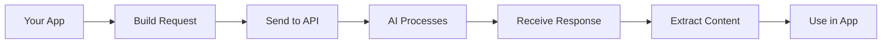
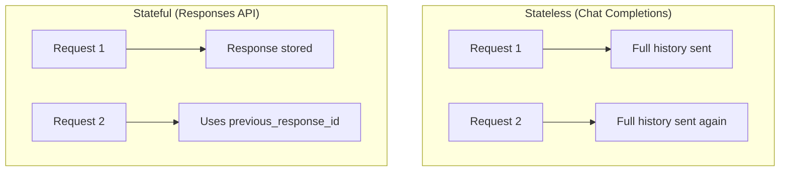

# Basic Completion Requests

## Introduction

Completion requests are the foundation of working with AI APIs. This lesson covers the fundamental patterns for sending prompts to AI models and receiving generated responses—the building blocks for all AI-powered features.

### What We'll Cover

This lesson contains 6 topic files covering:

1. **[Single-Turn Completions](./01-single-turn-completions.md)** — Simple prompt-response patterns, stateless requests
2. **[Multi-Turn Conversations](./02-multi-turn-conversations.md)** — Building message arrays, context management
3. **[Message History Management](./03-message-history.md)** — Storing, pruning, and summarizing conversations
4. **[System Prompts](./04-system-prompts.md)** — Defining AI behavior and personas
5. **[Response Parsing](./05-response-parsing.md)** — Extracting content from API responses
6. **[Extracting Generated Content](./06-extracting-content.md)** — Handling output arrays and structured data

### Prerequisites

- Understanding of [API Authentication](../01-api-authentication/00-api-authentication.md)
- Familiarity with [Request Structure](../02-request-structure/00-request-structure.md)
- Basic Python or JavaScript knowledge

---

## The Completion Flow

Every AI API interaction follows this pattern:



### Basic Request Example

```python
from openai import OpenAI

client = OpenAI()

# Simplest possible request
response = client.responses.create(
    model="gpt-4.1",
    input="What is the capital of France?"
)

# Get the answer
print(response.output_text)
# "Paris is the capital of France."
```

### Request Components

| Component | Purpose | Example |
|-----------|---------|---------|
| Model | Which AI to use | `gpt-4.1`, `claude-sonnet-4` |
| Input | What to process | `"Explain recursion"` |
| Instructions | How to behave | `"Be concise"` |
| Parameters | Control generation | `temperature=0.7` |

---

## API Comparison

### OpenAI Responses API (Modern)

```python
response = client.responses.create(
    model="gpt-4.1",
    instructions="You are a helpful assistant.",
    input="Hello!"
)
print(response.output_text)
```

### OpenAI Chat Completions (Legacy)

```python
response = client.chat.completions.create(
    model="gpt-4o",
    messages=[
        {"role": "system", "content": "You are a helpful assistant."},
        {"role": "user", "content": "Hello!"}
    ]
)
print(response.choices[0].message.content)
```

### Anthropic Messages

```python
import anthropic

client = anthropic.Anthropic()
response = client.messages.create(
    model="claude-sonnet-4-20250514",
    max_tokens=1024,
    system="You are a helpful assistant.",
    messages=[
        {"role": "user", "content": "Hello!"}
    ]
)
print(response.content[0].text)
```

---

## Key Concepts

### Single-Turn vs. Multi-Turn

| Pattern | Description | Use Case |
|---------|-------------|----------|
| Single-turn | One prompt → one response | Translations, summaries, Q&A |
| Multi-turn | Ongoing conversation | Chatbots, assistants |

### Stateless vs. Stateful



### Output Formats

| Provider | Access Pattern |
|----------|----------------|
| OpenAI Responses | `response.output_text` |
| OpenAI Chat | `response.choices[0].message.content` |
| Anthropic | `response.content[0].text` |

---

## Quick Reference

### Minimum Required Fields

| Provider | Required |
|----------|----------|
| OpenAI Responses | `model`, `input` |
| OpenAI Chat | `model`, `messages` |
| Anthropic | `model`, `messages`, `max_tokens` |

### Common Parameters

| Parameter | Purpose | Default |
|-----------|---------|---------|
| `temperature` | Randomness | 1.0 |
| `max_tokens` | Output limit | Model max |
| `stream` | Real-time output | false |

---

## Lesson Files

Work through each topic in order:

| # | Topic | Key Concepts |
|---|-------|--------------|
| 01 | [Single-Turn Completions](./01-single-turn-completions.md) | One-shot requests, content generation |
| 02 | [Multi-Turn Conversations](./02-multi-turn-conversations.md) | Message arrays, context accumulation |
| 03 | [Message History Management](./03-message-history.md) | Pruning, summarization, storage |
| 04 | [System Prompts](./04-system-prompts.md) | Behavior definition, personas |
| 05 | [Response Parsing](./05-response-parsing.md) | Metadata, usage statistics |
| 06 | [Extracting Generated Content](./06-extracting-content.md) | Output arrays, structured outputs |

---

## What You'll Build

By the end of this lesson, you'll be able to:

✅ Make single-turn completion requests to any AI API  
✅ Build and manage multi-turn conversations  
✅ Efficiently handle message history and context  
✅ Craft effective system prompts  
✅ Parse responses and extract generated content  
✅ Handle different output formats across providers

**Start with:** [Single-Turn Completions](./01-single-turn-completions.md)

---

## Further Reading

- [OpenAI Responses API](https://platform.openai.com/docs/api-reference/responses) — Official documentation
- [OpenAI Chat Completions](https://platform.openai.com/docs/guides/text-generation) — Text generation guide
- [Anthropic Messages](https://docs.anthropic.com/en/api/messages) — Claude API reference
