# Single-Turn Completions

## Introduction

Single-turn completions are the simplest form of AI API interaction: you send one prompt and receive one response. No conversation history, no context management—just a clean request-response pattern.

### What We'll Cover

- Simple prompt-response pattern
- Stateless request characteristics
- One-shot task examples
- Content generation patterns
- String input shortcuts
- Best practices for single-turn requests

### Prerequisites

- API authentication configured
- Understanding of request structure

---

## The Simplest Request

### OpenAI Responses API

```python
from openai import OpenAI

client = OpenAI()

response = client.responses.create(
    model="gpt-4.1",
    input="What is photosynthesis?"
)

print(response.output_text)
```

**Output:**
```
Photosynthesis is the process by which plants convert sunlight, 
carbon dioxide, and water into glucose and oxygen...
```

### OpenAI Chat Completions

```python
response = client.chat.completions.create(
    model="gpt-4o",
    messages=[
        {"role": "user", "content": "What is photosynthesis?"}
    ]
)

print(response.choices[0].message.content)
```

### Anthropic

```python
import anthropic

client = anthropic.Anthropic()

response = client.messages.create(
    model="claude-sonnet-4-20250514",
    max_tokens=1024,
    messages=[
        {"role": "user", "content": "What is photosynthesis?"}
    ]
)

print(response.content[0].text)
```

---

## Characteristics of Single-Turn Requests

### Stateless Nature

Each request is independent:

```mermaid
flowchart TD
    A[Request 1: What is Python?] --> B[Response about Python]
    C[Request 2: Tell me more] --> D["More about what?" ❌]
    
    style D fill:#ffebee
```



The API doesn't remember previous requests. Each call starts fresh.

### Benefits of Stateless

| Benefit | Description |
|---------|-------------|
| Simplicity | No state management needed |
| Scalability | Requests can go to any server |
| Predictability | Same input = consistent output |
| Caching | Easy to cache identical requests |

### Limitations

| Limitation | Workaround |
|------------|------------|
| No context | Include all context in prompt |
| No follow-ups | Use multi-turn pattern |
| Repetitive | Cache or batch similar requests |

---

## One-Shot Task Patterns

Single-turn requests excel at discrete tasks:

### Translation

```python
response = client.responses.create(
    model="gpt-4.1",
    input="Translate to French: 'Hello, how are you?'"
)
# "Bonjour, comment allez-vous ?"
```

### Summarization

```python
article = """
Long article text here...
"""

response = client.responses.create(
    model="gpt-4.1",
    input=f"Summarize this article in 3 bullet points:\n\n{article}"
)
```

### Classification

```python
response = client.responses.create(
    model="gpt-4.1",
    input="""Classify this email as 'spam', 'promotional', or 'important':

Subject: Urgent: Your account needs verification
Body: Click here to verify your account immediately..."""
)
# "spam"
```

### Code Generation

```python
response = client.responses.create(
    model="gpt-4.1",
    input="Write a Python function that calculates the factorial of a number"
)
```

### Data Extraction

```python
response = client.responses.create(
    model="gpt-4.1",
    input="""Extract the name, email, and phone number from this text:

Contact John Smith at john.smith@email.com or call 555-123-4567 for details."""
)
```

---

## Content Generation Examples

### Creative Writing

```python
# Short story
response = client.responses.create(
    model="gpt-4.1",
    input="Write a 100-word mystery story about a missing painting",
    temperature=0.9
)

# Product description
response = client.responses.create(
    model="gpt-4.1",
    instructions="You are a marketing copywriter.",
    input="Write a compelling product description for wireless earbuds"
)
```

### Technical Content

```python
# Documentation
response = client.responses.create(
    model="gpt-4.1",
    instructions="You are a technical writer. Be clear and precise.",
    input="Document the following Python function:\n\n" + code
)

# Explanation
response = client.responses.create(
    model="gpt-4.1",
    input="Explain how HTTPS encryption works to a beginner",
    temperature=0.3
)
```

### Structured Output

```python
# JSON response
response = client.responses.create(
    model="gpt-4.1",
    input="""Extract information from this job listing and return as JSON:

Senior Python Developer at TechCorp. 
Remote work available. Salary: $120k-$150k.
Requirements: 5+ years Python, AWS experience.""",
    text={
        "format": {
            "type": "json_schema",
            "json_schema": {
                "name": "job_listing",
                "schema": {
                    "type": "object",
                    "properties": {
                        "title": {"type": "string"},
                        "company": {"type": "string"},
                        "salary_min": {"type": "number"},
                        "salary_max": {"type": "number"},
                        "remote": {"type": "boolean"}
                    }
                }
            }
        }
    }
)
```

---

## String Input Shortcuts

The Responses API accepts simple string inputs:

### Direct String

```python
# Most concise form
response = client.responses.create(
    model="gpt-4.1",
    input="What is 2 + 2?"
)
```

### With Instructions

```python
# Add behavior via instructions
response = client.responses.create(
    model="gpt-4.1",
    instructions="Respond with only the number, no explanation.",
    input="What is 2 + 2?"
)
# "4"
```

### Multiline Prompts

```python
# Multi-line input with f-strings
context = "The user is learning Python."
question = "What are decorators?"

response = client.responses.create(
    model="gpt-4.1",
    input=f"""Context: {context}

Question: {question}

Provide a clear, beginner-friendly explanation."""
)
```

---

## HTTP Request Format

For raw HTTP requests:

```python
import requests

response = requests.post(
    "https://api.openai.com/v1/responses",
    headers={
        "Authorization": f"Bearer {api_key}",
        "Content-Type": "application/json"
    },
    json={
        "model": "gpt-4.1",
        "input": "What is the speed of light?"
    }
)

data = response.json()
print(data["output"][0]["content"][0]["text"])
```

### cURL Example

```bash
curl https://api.openai.com/v1/responses \
  -H "Authorization: Bearer $OPENAI_API_KEY" \
  -H "Content-Type: application/json" \
  -d '{
    "model": "gpt-4.1",
    "input": "What is the speed of light?"
  }'
```

---

## Optimizing Single-Turn Requests

### Temperature Settings

| Task Type | Temperature | Why |
|-----------|-------------|-----|
| Factual Q&A | 0.0-0.3 | Consistent, accurate |
| Summarization | 0.3-0.5 | Focused but natural |
| Creative writing | 0.7-1.0 | Varied, interesting |
| Brainstorming | 1.0-1.5 | Diverse ideas |

### Prompt Engineering

```python
# ❌ Vague
response = client.responses.create(
    model="gpt-4.1",
    input="Tell me about Python"
)

# ✅ Specific
response = client.responses.create(
    model="gpt-4.1",
    input="""Explain 3 key features of Python that make it good for beginners:
1. [Feature 1]
2. [Feature 2]
3. [Feature 3]

Keep each explanation under 50 words."""
)
```

### Output Control

```python
# Limit response length
response = client.responses.create(
    model="gpt-4.1",
    input="Summarize the French Revolution",
    max_output_tokens=200
)

# Stop at specific point
response = client.responses.create(
    model="gpt-4.1",
    input="List 5 programming languages:\n1.",
    stop=["\n6."]
)
```

---

## Error Handling

Always handle potential errors:

```python
from openai import OpenAI, APIError, RateLimitError

client = OpenAI()

def single_turn_request(prompt: str) -> str:
    """Make a single-turn request with error handling."""
    try:
        response = client.responses.create(
            model="gpt-4.1",
            input=prompt
        )
        return response.output_text
        
    except RateLimitError:
        print("Rate limited. Wait and retry.")
        raise
    except APIError as e:
        print(f"API error: {e}")
        raise
    except Exception as e:
        print(f"Unexpected error: {e}")
        raise
```

---

## Caching Single-Turn Responses

Since single-turn requests are stateless, caching is straightforward:

```python
import hashlib
from functools import lru_cache

def cache_key(prompt: str, model: str) -> str:
    """Generate cache key from prompt and model."""
    content = f"{model}:{prompt}"
    return hashlib.sha256(content.encode()).hexdigest()

# Simple in-memory cache
_cache = {}

def cached_completion(prompt: str, model: str = "gpt-4.1") -> str:
    """Get completion with caching."""
    key = cache_key(prompt, model)
    
    if key in _cache:
        return _cache[key]
    
    response = client.responses.create(
        model=model,
        input=prompt,
        temperature=0  # Deterministic for caching
    )
    
    result = response.output_text
    _cache[key] = result
    return result
```

---

## Hands-on Exercise

### Your Task

Create a `SingleTurnClient` class that wraps single-turn completions with:
1. Automatic retry on rate limits
2. Response caching
3. Token usage tracking

### Requirements

1. Accept model and default parameters
2. Track total tokens used across calls
3. Cache identical requests
4. Retry up to 3 times on rate limits

### Expected Result

```python
client = SingleTurnClient(model="gpt-4.1")

# First call - makes API request
response1 = client.complete("What is Python?")

# Second identical call - returns cached
response2 = client.complete("What is Python?")

# Check usage
print(f"Total tokens: {client.total_tokens}")
```

<details>
<summary>💡 Hints</summary>

- Use a dictionary for caching
- Track tokens from `response.usage`
- Use `time.sleep()` for retry delays
</details>

<details>
<summary>✅ Solution</summary>

```python
import time
import hashlib
from openai import OpenAI, RateLimitError

class SingleTurnClient:
    def __init__(self, model: str = "gpt-4.1", **defaults):
        self.client = OpenAI()
        self.model = model
        self.defaults = defaults
        self.cache = {}
        self.total_tokens = 0
    
    def _cache_key(self, prompt: str) -> str:
        content = f"{self.model}:{prompt}"
        return hashlib.sha256(content.encode()).hexdigest()
    
    def complete(self, prompt: str, use_cache: bool = True, **kwargs) -> str:
        # Check cache
        key = self._cache_key(prompt)
        if use_cache and key in self.cache:
            return self.cache[key]
        
        # Merge defaults with kwargs
        params = {**self.defaults, **kwargs}
        
        # Retry loop
        for attempt in range(3):
            try:
                response = self.client.responses.create(
                    model=self.model,
                    input=prompt,
                    **params
                )
                
                # Track tokens
                if hasattr(response, 'usage'):
                    self.total_tokens += response.usage.total_tokens
                
                # Cache and return
                result = response.output_text
                self.cache[key] = result
                return result
                
            except RateLimitError:
                if attempt < 2:
                    time.sleep(2 ** attempt)  # Exponential backoff
                else:
                    raise
        
        raise Exception("Max retries exceeded")

# Test
client = SingleTurnClient(model="gpt-4.1", temperature=0.3)
print(client.complete("What is 2+2?"))
print(f"Tokens used: {client.total_tokens}")
```

</details>

---

## Summary

✅ Single-turn requests are stateless: one prompt, one response  
✅ Best for discrete tasks: translation, summarization, classification  
✅ Use the `input` parameter for simple string prompts  
✅ Add `instructions` to define AI behavior  
✅ Adjust temperature based on task type  
✅ Cache identical requests to reduce API calls and costs

**Next:** [Multi-Turn Conversations](./02-multi-turn-conversations.md)

---

## Further Reading

- [OpenAI Text Generation](https://platform.openai.com/docs/guides/text-generation) — Text generation guide
- [Prompt Engineering](https://platform.openai.com/docs/guides/prompt-engineering) — Crafting effective prompts
- [Best Practices](https://platform.openai.com/docs/guides/gpt-best-practices) — API usage patterns

<!-- 
Sources Consulted:
- OpenAI Responses API: https://platform.openai.com/docs/api-reference/responses/create
- OpenAI Text Generation: https://platform.openai.com/docs/guides/text-generation
-->
