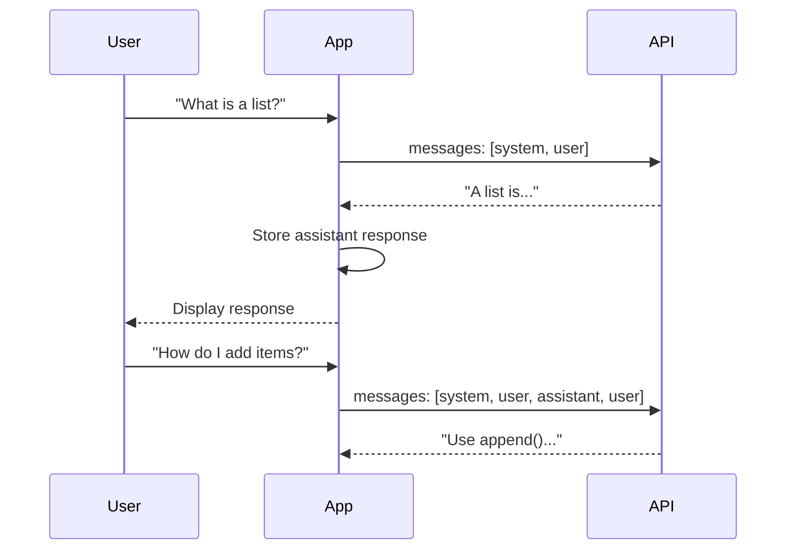
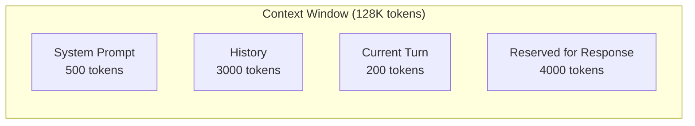

# Multi-Turn Conversations

## Introduction

Multi-turn conversations enable back-and-forth dialogue with AI models. Unlike single-turn requests, multi-turn interactions maintain context across exchanges, enabling follow-up questions, clarifications, and complex discussions.

### What We'll Cover

- Building message arrays
- Maintaining conversation context
- Turn-taking patterns
- Context accumulation
- `previous_response_id` for automatic chaining
- Provider comparison for multi-turn

### Prerequisites

- Single-turn completion knowledge
- Understanding of message roles

---

## The Multi-Turn Pattern

### Problem: Stateless APIs

```python
# Request 1
response = client.responses.create(
    model="gpt-4.1",
    input="My name is Alice"
)
# "Nice to meet you, Alice!"

# Request 2 - context is lost!
response = client.responses.create(
    model="gpt-4.1",
    input="What is my name?"
)
# "I don't know your name. You haven't told me."
```

### Solution 1: Manual Message Arrays

```python
# Build message history
messages = [
    {"role": "system", "content": "You are a helpful assistant."},
    {"role": "user", "content": "My name is Alice"},
    {"role": "assistant", "content": "Nice to meet you, Alice!"},
    {"role": "user", "content": "What is my name?"}
]

response = client.chat.completions.create(
    model="gpt-4o",
    messages=messages
)
# "Your name is Alice!"
```

### Solution 2: Responses API Chaining

```python
# First message
response1 = client.responses.create(
    model="gpt-4.1",
    input="My name is Alice",
    store=True  # Enable conversation storage
)

# Continue conversation
response2 = client.responses.create(
    model="gpt-4.1",
    input="What is my name?",
    previous_response_id=response1.id  # Link to previous
)
# "Your name is Alice!"
```

---

## Building Message Arrays

### Chat Completions Format

```python
messages = [
    # System message (optional, sets behavior)
    {"role": "system", "content": "You are a Python tutor."},
    
    # Turn 1
    {"role": "user", "content": "What is a list?"},
    {"role": "assistant", "content": "A list is a mutable sequence..."},
    
    # Turn 2
    {"role": "user", "content": "How do I add items?"},
    {"role": "assistant", "content": "Use append() or extend()..."},
    
    # Current turn (what we're asking now)
    {"role": "user", "content": "Show me an example"}
]
```

### Conversation Flow



---

## Conversation Manager Class

```python
from dataclasses import dataclass, field
from typing import List, Dict, Optional

@dataclass
class ConversationManager:
    """Manage multi-turn conversation state."""
    
    system_prompt: str = "You are a helpful assistant."
    messages: List[Dict[str, str]] = field(default_factory=list)
    model: str = "gpt-4o"
    
    def __post_init__(self):
        if self.system_prompt:
            self.messages = [
                {"role": "system", "content": self.system_prompt}
            ]
    
    def add_user_message(self, content: str):
        self.messages.append({"role": "user", "content": content})
    
    def add_assistant_message(self, content: str):
        self.messages.append({"role": "assistant", "content": content})
    
    def get_response(self, client, user_input: str) -> str:
        """Send message and get response."""
        self.add_user_message(user_input)
        
        response = client.chat.completions.create(
            model=self.model,
            messages=self.messages
        )
        
        assistant_content = response.choices[0].message.content
        self.add_assistant_message(assistant_content)
        
        return assistant_content
    
    def get_messages(self) -> List[Dict]:
        return self.messages.copy()
    
    def clear(self):
        """Reset conversation, keep system prompt."""
        self.__post_init__()

# Usage
from openai import OpenAI
client = OpenAI()

conv = ConversationManager(system_prompt="You are a friendly tutor.")
print(conv.get_response(client, "What is Python?"))
print(conv.get_response(client, "Why is it popular?"))
print(conv.get_response(client, "Show me a simple example"))
```

---

## Responses API Chaining

The modern approach uses `previous_response_id`:

```python
class ResponsesConversation:
    """Conversation using Responses API chaining."""
    
    def __init__(self, client, model: str = "gpt-4.1"):
        self.client = client
        self.model = model
        self.instructions = "You are a helpful assistant."
        self.last_response_id = None
    
    def send(self, message: str) -> str:
        """Send message and continue conversation."""
        kwargs = {
            "model": self.model,
            "input": message,
            "store": True
        }
        
        if self.instructions:
            kwargs["instructions"] = self.instructions
        
        if self.last_response_id:
            kwargs["previous_response_id"] = self.last_response_id
        
        response = self.client.responses.create(**kwargs)
        self.last_response_id = response.id
        
        return response.output_text
    
    def reset(self):
        """Start a new conversation."""
        self.last_response_id = None

# Usage
conv = ResponsesConversation(client)
print(conv.send("My name is Bob"))
print(conv.send("What's my name?"))  # Remembers context automatically
```

### Benefits of Response Chaining

| Feature | Manual Arrays | `previous_response_id` |
|---------|---------------|------------------------|
| Token usage | Resend full history | Only new content |
| Context management | You manage | API manages |
| Complexity | Higher | Lower |
| Flexibility | Full control | Simpler but less control |

---

## Turn-Taking Patterns

### Strict Alternation

Most APIs expect alternating user/assistant turns:

```python
# ✅ Correct: Alternating turns
messages = [
    {"role": "user", "content": "Hello"},
    {"role": "assistant", "content": "Hi there!"},
    {"role": "user", "content": "How are you?"},
    {"role": "assistant", "content": "I'm doing well!"},
    {"role": "user", "content": "Great!"}  # Current turn
]

# ❌ Wrong: Consecutive user messages
messages = [
    {"role": "user", "content": "Hello"},
    {"role": "user", "content": "Are you there?"},  # Error!
]
```

### Handling Non-Alternating Input

```python
def normalize_messages(messages: List[Dict]) -> List[Dict]:
    """Ensure strict user/assistant alternation."""
    normalized = []
    
    for msg in messages:
        if not normalized:
            normalized.append(msg)
            continue
        
        last_role = normalized[-1]["role"]
        current_role = msg["role"]
        
        # Skip system messages in alternation check
        if current_role == "system" or last_role == "system":
            normalized.append(msg)
            continue
        
        # Merge consecutive same-role messages
        if current_role == last_role:
            normalized[-1]["content"] += "\n" + msg["content"]
        else:
            normalized.append(msg)
    
    return normalized
```

---

## Context Accumulation

As conversations grow, manage context carefully:

### Token Budget

```python
import tiktoken

def count_tokens(messages: List[Dict], model: str = "gpt-4o") -> int:
    """Count tokens in message array."""
    encoding = tiktoken.encoding_for_model(model)
    
    tokens = 0
    for message in messages:
        tokens += 4  # Message overhead
        tokens += len(encoding.encode(message["content"]))
    tokens += 2  # Reply priming
    
    return tokens

def fits_context(messages: List[Dict], max_tokens: int = 8000) -> bool:
    """Check if messages fit in context window."""
    return count_tokens(messages) < max_tokens
```

### Context Window Visualization



---

## Provider Comparison

### OpenAI Chat Completions

```python
# Full history in every request
response = client.chat.completions.create(
    model="gpt-4o",
    messages=[
        {"role": "system", "content": "You are helpful."},
        {"role": "user", "content": "Hi"},
        {"role": "assistant", "content": "Hello!"},
        {"role": "user", "content": "What's 2+2?"}
    ]
)
```

### OpenAI Responses API

```python
# Automatic context via chaining
response = client.responses.create(
    model="gpt-4.1",
    input="What's 2+2?",
    previous_response_id="resp_abc123"
)
```

### Anthropic

```python
# Similar to Chat Completions
response = client.messages.create(
    model="claude-sonnet-4-20250514",
    max_tokens=1024,
    system="You are helpful.",
    messages=[
        {"role": "user", "content": "Hi"},
        {"role": "assistant", "content": "Hello!"},
        {"role": "user", "content": "What's 2+2?"}
    ]
)
```

---

## Real-World Chatbot Pattern

```python
from openai import OpenAI
from dataclasses import dataclass, field
from typing import List, Dict

@dataclass
class Chatbot:
    """Production-ready chatbot with conversation management."""
    
    client: OpenAI
    model: str = "gpt-4.1"
    system_prompt: str = "You are a helpful assistant."
    max_history_tokens: int = 4000
    messages: List[Dict] = field(default_factory=list)
    
    def __post_init__(self):
        self.messages = [
            {"role": "system", "content": self.system_prompt}
        ]
    
    def chat(self, user_input: str) -> str:
        """Process user input and return response."""
        # Add user message
        self.messages.append({"role": "user", "content": user_input})
        
        # Trim if needed
        self._trim_history()
        
        # Get response
        response = self.client.chat.completions.create(
            model=self.model,
            messages=self.messages
        )
        
        assistant_message = response.choices[0].message.content
        self.messages.append({"role": "assistant", "content": assistant_message})
        
        return assistant_message
    
    def _trim_history(self):
        """Keep history within token budget."""
        # Simple approach: keep system + last N turns
        if len(self.messages) > 20:
            system = self.messages[0]
            recent = self.messages[-18:]  # Keep last 9 turns
            self.messages = [system] + recent
    
    def clear_history(self):
        """Start fresh conversation."""
        self.__post_init__()

# Usage
client = OpenAI()
bot = Chatbot(
    client=client,
    system_prompt="You are a helpful coding assistant."
)

while True:
    user_input = input("You: ")
    if user_input.lower() in ['quit', 'exit']:
        break
    
    response = bot.chat(user_input)
    print(f"Bot: {response}")
```

---

## Hands-on Exercise

### Your Task

Build a `ConversationSession` class that supports both Chat Completions and Responses API.

### Requirements

1. Support switching between API styles
2. Track conversation history
3. Provide summary of conversation
4. Handle both manual messages and response chaining

### Expected Result

```python
# Chat Completions style
session = ConversationSession(client, mode="chat")
session.send("My favorite color is blue")
print(session.send("What's my favorite color?"))

# Responses API style
session = ConversationSession(client, mode="responses")
session.send("My favorite color is green")
print(session.send("What's my favorite color?"))

# Get conversation summary
print(session.summary())
```

<details>
<summary>💡 Hints</summary>

- Store messages for both modes
- Track response IDs for responses mode
- Summary can just return recent messages
</details>

<details>
<summary>✅ Solution</summary>

```python
from dataclasses import dataclass, field
from typing import List, Dict, Optional

@dataclass
class ConversationSession:
    client: any
    mode: str = "chat"  # "chat" or "responses"
    model: str = "gpt-4.1"
    system_prompt: str = "You are a helpful assistant."
    messages: List[Dict] = field(default_factory=list)
    last_response_id: Optional[str] = None
    
    def __post_init__(self):
        if self.mode == "chat":
            self.messages = [
                {"role": "system", "content": self.system_prompt}
            ]
    
    def send(self, message: str) -> str:
        if self.mode == "chat":
            return self._send_chat(message)
        else:
            return self._send_responses(message)
    
    def _send_chat(self, message: str) -> str:
        self.messages.append({"role": "user", "content": message})
        
        response = self.client.chat.completions.create(
            model=self.model.replace("4.1", "4o"),  # Chat uses gpt-4o
            messages=self.messages
        )
        
        reply = response.choices[0].message.content
        self.messages.append({"role": "assistant", "content": reply})
        return reply
    
    def _send_responses(self, message: str) -> str:
        kwargs = {
            "model": self.model,
            "input": message,
            "instructions": self.system_prompt,
            "store": True
        }
        
        if self.last_response_id:
            kwargs["previous_response_id"] = self.last_response_id
        
        response = self.client.responses.create(**kwargs)
        self.last_response_id = response.id
        
        # Track for summary
        self.messages.append({"role": "user", "content": message})
        self.messages.append({"role": "assistant", "content": response.output_text})
        
        return response.output_text
    
    def summary(self) -> str:
        """Return conversation summary."""
        lines = []
        for msg in self.messages:
            if msg["role"] != "system":
                prefix = "User" if msg["role"] == "user" else "Assistant"
                lines.append(f"{prefix}: {msg['content'][:100]}...")
        return "\n".join(lines[-6:])  # Last 3 turns
    
    def reset(self):
        self.__post_init__()
        self.last_response_id = None

# Usage
from openai import OpenAI
client = OpenAI()

session = ConversationSession(client, mode="responses")
print(session.send("Hi, I'm learning Python"))
print(session.send("What should I learn first?"))
print("\n--- Summary ---")
print(session.summary())
```

</details>

---

## Summary

✅ Multi-turn conversations maintain context across exchanges  
✅ Chat Completions requires sending full message history each time  
✅ Responses API uses `previous_response_id` for automatic chaining  
✅ Messages must alternate between user and assistant roles  
✅ Monitor token usage as conversations grow  
✅ Use conversation manager classes for cleaner code

**Next:** [Message History Management](./03-message-history.md)

---

## Further Reading

- [OpenAI Chat Guide](https://platform.openai.com/docs/guides/text-generation) — Multi-turn patterns
- [Responses API Chaining](https://platform.openai.com/docs/api-reference/responses) — Using previous_response_id
- [Context Window Management](https://platform.openai.com/docs/models) — Model context limits

<!-- 
Sources Consulted:
- OpenAI Responses API: https://platform.openai.com/docs/api-reference/responses/create
- OpenAI Chat Completions: https://platform.openai.com/docs/api-reference/chat/create
-->
