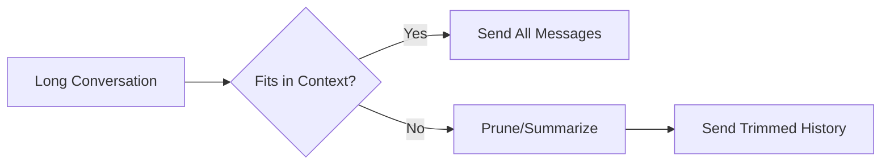

# Message History Management

## Introduction

As conversations grow, managing message history becomes critical. This lesson covers strategies for storing, pruning, and summarizing conversation history to stay within context limits while preserving important context.

### What We'll Cover

- Storing conversation history
- Pruning old messages
- Summarizing long conversations
- Session management patterns
- Context compaction
- Persistent conversation storage

### Prerequisites

- Multi-turn conversation basics
- Understanding of token limits

---

## The Context Window Challenge

Every model has a maximum context window:

| Model | Context Window | Approx. Words |
|-------|----------------|---------------|
| gpt-4.1 | 1,000,000 tokens | ~750,000 |
| gpt-4o | 128,000 tokens | ~96,000 |
| claude-sonnet-4 | 200,000 tokens | ~150,000 |
| gpt-4.1-mini | 1,000,000 tokens | ~750,000 |



---

## Storing Conversation History

### In-Memory Storage

```python
from dataclasses import dataclass, field
from typing import List, Dict
from datetime import datetime

@dataclass
class Message:
    role: str
    content: str
    timestamp: datetime = field(default_factory=datetime.now)
    tokens: int = 0

@dataclass
class ConversationStore:
    """In-memory conversation storage."""
    
    messages: List[Message] = field(default_factory=list)
    system_prompt: str = ""
    
    def add(self, role: str, content: str, tokens: int = 0):
        self.messages.append(Message(role, content, tokens=tokens))
    
    def get_messages(self) -> List[Dict]:
        """Get messages in API format."""
        result = []
        if self.system_prompt:
            result.append({"role": "system", "content": self.system_prompt})
        
        for msg in self.messages:
            result.append({"role": msg.role, "content": msg.content})
        
        return result
    
    def clear(self):
        self.messages = []
```

### Database Storage

```python
import sqlite3
from contextlib import contextmanager

class ConversationDatabase:
    """SQLite-based conversation storage."""
    
    def __init__(self, db_path: str = "conversations.db"):
        self.db_path = db_path
        self._init_db()
    
    def _init_db(self):
        with self._connection() as conn:
            conn.execute("""
                CREATE TABLE IF NOT EXISTS messages (
                    id INTEGER PRIMARY KEY,
                    session_id TEXT NOT NULL,
                    role TEXT NOT NULL,
                    content TEXT NOT NULL,
                    tokens INTEGER DEFAULT 0,
                    created_at TIMESTAMP DEFAULT CURRENT_TIMESTAMP
                )
            """)
            conn.execute("""
                CREATE INDEX IF NOT EXISTS idx_session 
                ON messages(session_id)
            """)
    
    @contextmanager
    def _connection(self):
        conn = sqlite3.connect(self.db_path)
        try:
            yield conn
            conn.commit()
        finally:
            conn.close()
    
    def add_message(self, session_id: str, role: str, content: str, tokens: int = 0):
        with self._connection() as conn:
            conn.execute(
                "INSERT INTO messages (session_id, role, content, tokens) VALUES (?, ?, ?, ?)",
                (session_id, role, content, tokens)
            )
    
    def get_messages(self, session_id: str, limit: int = None) -> List[Dict]:
        with self._connection() as conn:
            query = "SELECT role, content FROM messages WHERE session_id = ? ORDER BY id"
            if limit:
                query += f" DESC LIMIT {limit}"
                rows = conn.execute(query, (session_id,)).fetchall()
                rows = list(reversed(rows))
            else:
                rows = conn.execute(query, (session_id,)).fetchall()
            
            return [{"role": r[0], "content": r[1]} for r in rows]
    
    def clear_session(self, session_id: str):
        with self._connection() as conn:
            conn.execute("DELETE FROM messages WHERE session_id = ?", (session_id,))
```

---

## Pruning Strategies

### Strategy 1: Keep Last N Messages

```python
def prune_keep_last_n(messages: List[Dict], n: int = 10) -> List[Dict]:
    """Keep system prompt + last N messages."""
    if not messages:
        return messages
    
    # Check for system message
    if messages[0]["role"] == "system":
        system = [messages[0]]
        rest = messages[1:]
    else:
        system = []
        rest = messages
    
    # Keep last N
    return system + rest[-n:]

# Usage
messages = [...50 messages...]
trimmed = prune_keep_last_n(messages, n=20)  # System + last 20
```

### Strategy 2: Token-Based Pruning

```python
import tiktoken

def prune_by_tokens(
    messages: List[Dict], 
    max_tokens: int = 8000,
    model: str = "gpt-4o"
) -> List[Dict]:
    """Remove oldest messages until under token limit."""
    encoding = tiktoken.encoding_for_model(model)
    
    def count_tokens(msgs):
        total = 0
        for msg in msgs:
            total += len(encoding.encode(msg["content"])) + 4
        return total
    
    # Extract system message
    if messages and messages[0]["role"] == "system":
        system = [messages[0]]
        rest = messages[1:]
    else:
        system = []
        rest = messages
    
    # Remove oldest until fits
    while rest and count_tokens(system + rest) > max_tokens:
        rest = rest[1:]  # Remove oldest (first) message
    
    return system + rest
```

### Strategy 3: Sliding Window

```python
def sliding_window_prune(
    messages: List[Dict],
    window_size: int = 20,
    keep_first: int = 2
) -> List[Dict]:
    """Keep first few messages and a sliding window of recent ones."""
    if len(messages) <= window_size:
        return messages
    
    # System + first context messages + recent window
    if messages[0]["role"] == "system":
        system = [messages[0]]
        rest = messages[1:]
    else:
        system = []
        rest = messages
    
    first_context = rest[:keep_first]
    recent = rest[-(window_size - keep_first):]
    
    return system + first_context + recent
```

---

## Summarization Strategies

When pruning loses important context, summarize instead:

### Summarize Older Messages

```python
from openai import OpenAI

def summarize_conversation(
    client: OpenAI,
    messages: List[Dict],
    max_summary_tokens: int = 500
) -> str:
    """Create a summary of the conversation so far."""
    
    # Format messages for summarization
    formatted = "\n".join([
        f"{m['role'].upper()}: {m['content']}"
        for m in messages
        if m['role'] != 'system'
    ])
    
    response = client.responses.create(
        model="gpt-4.1-mini",  # Use faster model for summarization
        instructions="Create a concise summary of the key points from this conversation.",
        input=f"Summarize this conversation:\n\n{formatted}",
        max_output_tokens=max_summary_tokens
    )
    
    return response.output_text
```

### Rolling Summarization

```python
@dataclass
class SummarizingConversation:
    """Conversation that summarizes old messages."""
    
    client: OpenAI
    model: str = "gpt-4.1"
    system_prompt: str = "You are a helpful assistant."
    messages: List[Dict] = field(default_factory=list)
    summary: str = ""
    max_messages: int = 20
    
    def __post_init__(self):
        self.messages = []
    
    def add_message(self, role: str, content: str):
        self.messages.append({"role": role, "content": content})
        
        # Summarize if too long
        if len(self.messages) > self.max_messages:
            self._summarize_old()
    
    def _summarize_old(self):
        """Summarize older messages and keep recent ones."""
        # Take older half
        split = len(self.messages) // 2
        old_messages = self.messages[:split]
        
        # Summarize
        new_summary = summarize_conversation(self.client, old_messages)
        
        # Merge with existing summary
        if self.summary:
            self.summary = f"{self.summary}\n\nLater: {new_summary}"
        else:
            self.summary = new_summary
        
        # Keep only recent messages
        self.messages = self.messages[split:]
    
    def get_messages(self) -> List[Dict]:
        """Get messages with summary as context."""
        result = [{"role": "system", "content": self.system_prompt}]
        
        if self.summary:
            result.append({
                "role": "system",
                "content": f"Previous conversation summary:\n{self.summary}"
            })
        
        result.extend(self.messages)
        return result
```

---

## Session Management

### Session-Based Conversations

```python
import uuid
from typing import Optional

class SessionManager:
    """Manage multiple conversation sessions."""
    
    def __init__(self, db: ConversationDatabase):
        self.db = db
        self.active_sessions = {}
    
    def create_session(self, user_id: str) -> str:
        """Create new conversation session."""
        session_id = str(uuid.uuid4())
        self.active_sessions[session_id] = {
            "user_id": user_id,
            "created_at": datetime.now()
        }
        return session_id
    
    def get_session_messages(self, session_id: str, limit: int = 50) -> List[Dict]:
        """Get messages for a session."""
        return self.db.get_messages(session_id, limit=limit)
    
    def add_to_session(self, session_id: str, role: str, content: str):
        """Add message to session."""
        self.db.add_message(session_id, role, content)
    
    def end_session(self, session_id: str):
        """Mark session as ended."""
        if session_id in self.active_sessions:
            del self.active_sessions[session_id]
    
    def get_user_sessions(self, user_id: str) -> List[str]:
        """Get all sessions for a user."""
        return [
            sid for sid, data in self.active_sessions.items()
            if data["user_id"] == user_id
        ]
```

### Redis Session Storage

```python
import redis
import json
from typing import List, Dict

class RedisSessionStore:
    """High-performance session storage with Redis."""
    
    def __init__(self, host: str = "localhost", port: int = 6379):
        self.redis = redis.Redis(host=host, port=port, decode_responses=True)
        self.ttl = 86400 * 7  # 7 days
    
    def _key(self, session_id: str) -> str:
        return f"conv:{session_id}"
    
    def add_message(self, session_id: str, role: str, content: str):
        key = self._key(session_id)
        message = json.dumps({"role": role, "content": content})
        self.redis.rpush(key, message)
        self.redis.expire(key, self.ttl)
    
    def get_messages(self, session_id: str, limit: int = None) -> List[Dict]:
        key = self._key(session_id)
        if limit:
            messages = self.redis.lrange(key, -limit, -1)
        else:
            messages = self.redis.lrange(key, 0, -1)
        
        return [json.loads(m) for m in messages]
    
    def clear_session(self, session_id: str):
        self.redis.delete(self._key(session_id))
```

---

## Context Compaction with Responses API

The Responses API offers automatic context management:

```python
# Store conversation
response1 = client.responses.create(
    model="gpt-4.1",
    input="Let's discuss machine learning",
    store=True
)

# Many messages later...
# Use previous_response_id to continue
response_n = client.responses.create(
    model="gpt-4.1",
    input="Summarize what we discussed",
    previous_response_id=response1.id
)
```

### Benefits of Responses API Storage

| Feature | Manual Management | Responses API |
|---------|-------------------|---------------|
| Token counting | You handle | Automatic |
| Context pruning | You implement | API handles |
| Storage | Your database | OpenAI stores |
| Retrieval | Query your DB | Use response ID |

---

## Complete History Manager

```python
from dataclasses import dataclass, field
from typing import List, Dict, Optional
from enum import Enum

class PruneStrategy(Enum):
    LAST_N = "last_n"
    TOKEN_LIMIT = "token_limit"
    SUMMARIZE = "summarize"

@dataclass
class HistoryManager:
    """Complete conversation history management."""
    
    client: OpenAI
    strategy: PruneStrategy = PruneStrategy.LAST_N
    max_messages: int = 30
    max_tokens: int = 8000
    system_prompt: str = "You are a helpful assistant."
    _messages: List[Dict] = field(default_factory=list)
    _summary: str = ""
    
    def add(self, role: str, content: str):
        self._messages.append({"role": role, "content": content})
        self._maybe_prune()
    
    def get_messages(self) -> List[Dict]:
        """Get messages ready for API call."""
        result = [{"role": "system", "content": self.system_prompt}]
        
        if self._summary:
            result.append({
                "role": "system",
                "content": f"Summary of earlier conversation:\n{self._summary}"
            })
        
        result.extend(self._messages)
        return result
    
    def _maybe_prune(self):
        if self.strategy == PruneStrategy.LAST_N:
            if len(self._messages) > self.max_messages:
                self._messages = self._messages[-self.max_messages:]
        
        elif self.strategy == PruneStrategy.TOKEN_LIMIT:
            self._messages = prune_by_tokens(
                self._messages, 
                self.max_tokens
            )
        
        elif self.strategy == PruneStrategy.SUMMARIZE:
            if len(self._messages) > self.max_messages:
                self._summarize_and_prune()
    
    def _summarize_and_prune(self):
        split = len(self._messages) // 2
        old = self._messages[:split]
        
        summary = summarize_conversation(self.client, old)
        if self._summary:
            self._summary = f"{self._summary}\n{summary}"
        else:
            self._summary = summary
        
        self._messages = self._messages[split:]
    
    def clear(self):
        self._messages = []
        self._summary = ""
```

---

## Hands-on Exercise

### Your Task

Build a `SmartConversation` class that:
1. Tracks token usage per message
2. Automatically prunes when approaching limit
3. Saves important messages (marked by user)
4. Provides conversation statistics

### Requirements

1. Count tokens for each message
2. Never exceed configurable token limit
3. Allow marking messages as "important" (never pruned)
4. Track total messages, pruned count, and token usage

### Expected Result

```python
conv = SmartConversation(client, max_tokens=4000)
conv.add_user("Tell me about Python", important=True)
conv.add_assistant("Python is a programming language...")
# ... many more messages ...
print(conv.stats())
# {"total_messages": 50, "pruned": 30, "tokens_used": 3800}
```

<details>
<summary>💡 Hints</summary>

- Use tiktoken for token counting
- Store importance flag with each message
- Prune non-important messages first
</details>

<details>
<summary>✅ Solution</summary>

```python
import tiktoken
from dataclasses import dataclass, field
from typing import List, Dict

@dataclass
class SmartMessage:
    role: str
    content: str
    tokens: int
    important: bool = False

@dataclass
class SmartConversation:
    client: any
    max_tokens: int = 4000
    model: str = "gpt-4o"
    _messages: List[SmartMessage] = field(default_factory=list)
    _pruned_count: int = 0
    
    def __post_init__(self):
        self.encoding = tiktoken.encoding_for_model(self.model)
    
    def _count_tokens(self, text: str) -> int:
        return len(self.encoding.encode(text)) + 4
    
    def _total_tokens(self) -> int:
        return sum(m.tokens for m in self._messages)
    
    def add_user(self, content: str, important: bool = False):
        self._add("user", content, important)
    
    def add_assistant(self, content: str, important: bool = False):
        self._add("assistant", content, important)
    
    def _add(self, role: str, content: str, important: bool):
        tokens = self._count_tokens(content)
        self._messages.append(SmartMessage(role, content, tokens, important))
        self._prune_if_needed()
    
    def _prune_if_needed(self):
        while self._total_tokens() > self.max_tokens:
            # Find first non-important message
            for i, msg in enumerate(self._messages):
                if not msg.important:
                    self._messages.pop(i)
                    self._pruned_count += 1
                    break
            else:
                # All important - remove oldest anyway
                self._messages.pop(0)
                self._pruned_count += 1
    
    def get_messages(self) -> List[Dict]:
        return [{"role": m.role, "content": m.content} for m in self._messages]
    
    def stats(self) -> Dict:
        return {
            "total_messages": len(self._messages) + self._pruned_count,
            "current_messages": len(self._messages),
            "pruned": self._pruned_count,
            "tokens_used": self._total_tokens(),
            "important_count": sum(1 for m in self._messages if m.important)
        }

# Test
from openai import OpenAI
client = OpenAI()

conv = SmartConversation(client, max_tokens=500)
conv.add_user("This is very important context", important=True)
for i in range(20):
    conv.add_assistant(f"Response number {i} with some content here")
    conv.add_user(f"Follow up question {i}")

print(conv.stats())
```

</details>

---

## Summary

✅ Store messages in memory for short sessions, database for persistence  
✅ Prune by count, tokens, or with summarization  
✅ Keep system prompts and important context when pruning  
✅ Use rolling summarization for very long conversations  
✅ Session management enables multi-user applications  
✅ Responses API handles context automatically with `store` and `previous_response_id`

**Next:** [System Prompts](./04-system-prompts.md)

---

## Further Reading

- [Token Counting](https://platform.openai.com/tokenizer) — OpenAI tokenizer
- [tiktoken Library](https://github.com/openai/tiktoken) — Token counting in Python
- [Context Window Guide](https://platform.openai.com/docs/models) — Model limits

<!-- 
Sources Consulted:
- OpenAI Responses API: https://platform.openai.com/docs/api-reference/responses
- tiktoken: https://github.com/openai/tiktoken
-->
