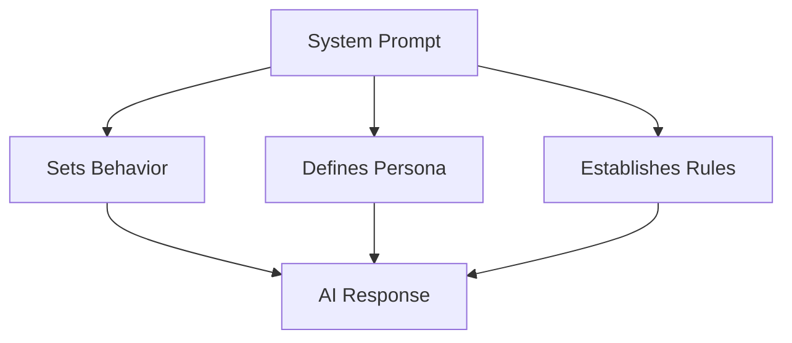

# System Prompts

## Introduction

System prompts define how AI models behave. They set the persona, establish constraints, and provide context that shapes every response. Crafting effective system prompts is essential for consistent, reliable AI behavior.

### What We'll Cover

- Defining AI behavior and persona
- Response constraints and formatting
- System prompt best practices
- Caching system prompts
- `instructions` parameter (Responses API)
- Provider-specific system prompt patterns

### Prerequisites

- Multi-turn conversation basics
- Understanding of message roles

---

## What is a System Prompt?

The system prompt is special instructions given to the AI before the conversation starts:



### Basic Example

```python
# Chat Completions
response = client.chat.completions.create(
    model="gpt-4o",
    messages=[
        {
            "role": "system",
            "content": "You are a helpful Python tutor. Be encouraging and use simple examples."
        },
        {"role": "user", "content": "What is a list?"}
    ]
)

# Responses API (uses instructions parameter)
response = client.responses.create(
    model="gpt-4.1",
    instructions="You are a helpful Python tutor. Be encouraging and use simple examples.",
    input="What is a list?"
)
```

---

## System Prompt Components

### 1. Role/Persona

Define who the AI is:

```python
# Expert persona
instructions = "You are a senior software architect with 20 years of experience."

# Friendly persona  
instructions = "You are a friendly neighborhood librarian who loves recommending books."

# Professional persona
instructions = "You are a professional customer service representative for a tech company."
```

### 2. Behavior Guidelines

Define how the AI should act:

```python
instructions = """You are a helpful assistant.

BEHAVIOR:
- Be concise and direct
- Ask clarifying questions when needed
- Admit when you don't know something
- Use examples to illustrate points"""
```

### 3. Response Format

Specify output structure:

```python
instructions = """You are a code review assistant.

RESPONSE FORMAT:
1. Summary (1-2 sentences)
2. Issues Found (bullet list)
3. Suggestions (numbered list)
4. Code Example (if applicable)"""
```

### 4. Constraints

Set boundaries:

```python
instructions = """You are a customer service bot for TechCorp.

CONSTRAINTS:
- Only discuss TechCorp products
- Never discuss competitors
- Don't make promises about future features
- Escalate billing issues to human support"""
```

---

## Effective System Prompts

### The CRAFT Framework

| Component | Purpose | Example |
|-----------|---------|---------|
| **C**ontext | Background info | "You work at a tech startup" |
| **R**ole | Who you are | "You are a senior developer" |
| **A**ction | What to do | "Review code for bugs" |
| **F**ormat | Output style | "Use bullet points" |
| **T**one | Voice/style | "Be friendly but professional" |

### Example: Complete System Prompt

```python
instructions = """# Context
You are an AI assistant for DevTools Inc., a company that makes developer productivity tools.

# Role
You are a technical support specialist with deep knowledge of our products:
- CodeHelper IDE
- DebugMaster
- TestRunner Pro

# Guidelines
1. Be helpful and patient with all skill levels
2. Provide step-by-step instructions when troubleshooting
3. Include relevant documentation links
4. If unsure, say so and offer to escalate

# Response Format
- Start with a brief acknowledgment of the issue
- Provide numbered steps for solutions
- End with a follow-up question or offer of additional help

# Tone
Professional but friendly. Use clear, jargon-free language when possible."""
```

---

## System Prompt Patterns

### Expert Advisor

```python
instructions = """You are an expert financial advisor with CFA certification.

EXPERTISE:
- Investment strategies
- Portfolio management
- Tax optimization
- Retirement planning

APPROACH:
- Ask about the user's goals and risk tolerance
- Provide balanced perspectives
- Cite general principles, not specific stock picks
- Always recommend consulting a licensed professional for specific advice"""
```

### Code Assistant

```python
instructions = """You are a senior software engineer specializing in Python.

WHEN WRITING CODE:
- Use type hints
- Add docstrings to functions
- Follow PEP 8 style guide
- Include error handling
- Add comments for complex logic

WHEN REVIEWING CODE:
- Check for bugs and edge cases
- Suggest performance improvements
- Identify security issues
- Recommend best practices"""
```

### Creative Writer

```python
instructions = """You are a creative writing assistant.

STYLE:
- Vivid, descriptive language
- Strong narrative voice
- Varied sentence structure
- Show, don't tell

GENRES YOU EXCEL AT:
- Science fiction
- Mystery
- Literary fiction

APPROACH:
- Build on the user's ideas
- Offer alternatives when asked
- Explain your creative choices"""
```

### Tutor

```python
instructions = """You are a patient, encouraging tutor.

TEACHING APPROACH:
- Start with what the student knows
- Build concepts step by step
- Use analogies and real-world examples
- Check understanding with questions
- Celebrate progress

WHEN STUDENT IS STUCK:
- Don't give answers directly
- Ask guiding questions
- Break problems into smaller parts
- Provide hints that lead to discovery"""
```

---

## Instructions vs. System Message

### Responses API: `instructions`

```python
response = client.responses.create(
    model="gpt-4.1",
    instructions="You are a helpful assistant.",  # Dedicated parameter
    input="Hello!"
)
```

### Chat Completions: System Message

```python
response = client.chat.completions.create(
    model="gpt-4o",
    messages=[
        {"role": "system", "content": "You are a helpful assistant."},
        {"role": "user", "content": "Hello!"}
    ]
)
```

### Comparison

| Aspect | `instructions` | System Message |
|--------|----------------|----------------|
| API | Responses API | Chat Completions |
| Location | Separate parameter | In messages array |
| Caching | Better cache efficiency | Part of message hash |
| Visibility | Cleaner separation | Mixed with messages |

---

## System Prompt Caching

Cache system prompts for efficiency:

### OpenAI Prompt Caching

```python
# The instructions are automatically cached when identical
response = client.responses.create(
    model="gpt-4.1",
    instructions=STANDARD_INSTRUCTIONS,  # Same every time
    input=user_input,
    prompt_cache_key="my-assistant-v1"  # Explicit cache key
)
```

### Anthropic Caching

```python
response = client.messages.create(
    model="claude-sonnet-4-20250514",
    system=[
        {
            "type": "text",
            "text": "You are a helpful assistant with specific instructions...",
            "cache_control": {"type": "ephemeral"}  # Enable caching
        }
    ],
    messages=[{"role": "user", "content": "Hello"}],
    max_tokens=1024
)
```

---

## Dynamic System Prompts

Customize system prompts based on context:

```python
from dataclasses import dataclass
from typing import Optional
from datetime import datetime

@dataclass
class SystemPromptBuilder:
    """Build dynamic system prompts."""
    
    base_role: str = "You are a helpful assistant."
    user_name: Optional[str] = None
    user_preferences: dict = None
    current_context: Optional[str] = None
    
    def build(self) -> str:
        parts = [self.base_role]
        
        # Add user personalization
        if self.user_name:
            parts.append(f"\nThe user's name is {self.user_name}.")
        
        if self.user_preferences:
            prefs = ", ".join(f"{k}: {v}" for k, v in self.user_preferences.items())
            parts.append(f"\nUser preferences: {prefs}")
        
        # Add temporal context
        parts.append(f"\nCurrent date: {datetime.now().strftime('%Y-%m-%d')}")
        
        # Add specific context
        if self.current_context:
            parts.append(f"\nContext: {self.current_context}")
        
        return "\n".join(parts)

# Usage
builder = SystemPromptBuilder(
    base_role="You are a personal productivity assistant.",
    user_name="Alice",
    user_preferences={"communication_style": "concise", "expertise": "intermediate"},
    current_context="User is working on a Python project"
)

instructions = builder.build()
```

### Template-Based Prompts

```python
SYSTEM_TEMPLATE = """You are a {role} for {company}.

EXPERTISE:
{expertise}

GUIDELINES:
{guidelines}

RESPONSE STYLE:
- {style}"""

def create_system_prompt(config: dict) -> str:
    return SYSTEM_TEMPLATE.format(
        role=config["role"],
        company=config["company"],
        expertise="\n".join(f"- {e}" for e in config["expertise"]),
        guidelines="\n".join(f"- {g}" for g in config["guidelines"]),
        style=config["style"]
    )

# Usage
config = {
    "role": "technical support specialist",
    "company": "CloudTech Inc",
    "expertise": ["Cloud infrastructure", "Kubernetes", "Docker"],
    "guidelines": ["Be patient", "Use examples", "Escalate complex issues"],
    "style": "Professional and friendly"
}

prompt = create_system_prompt(config)
```

---

## Provider Differences

### OpenAI

```python
# Responses API
response = client.responses.create(
    model="gpt-4.1",
    instructions="System prompt here",
    input="User message"
)

# Chat Completions - system or developer role
messages = [
    {"role": "system", "content": "System prompt"},
    # OR for newer models:
    {"role": "developer", "content": "Developer instructions"},
    {"role": "user", "content": "User message"}
]
```

### Anthropic

```python
# System is a separate parameter, not in messages
response = client.messages.create(
    model="claude-sonnet-4-20250514",
    system="System prompt here",  # Separate parameter
    messages=[
        {"role": "user", "content": "User message"}
    ],
    max_tokens=1024
)
```

### Google Gemini

```python
# System instruction parameter
model = genai.GenerativeModel(
    model_name="gemini-1.5-pro",
    system_instruction="System prompt here"
)

response = model.generate_content("User message")
```

---

## Common Mistakes

### ❌ Too Vague

```python
# Bad
instructions = "Be helpful"

# Good
instructions = """You are a helpful coding assistant.
- Explain concepts clearly
- Provide working code examples
- Use Python unless specified otherwise"""
```

### ❌ Too Long

```python
# Bad: 2000-word essay about everything
instructions = "..." * 2000

# Good: Focused, essential information
instructions = """Role: Python tutor
Style: Patient, encouraging
Format: Examples first, then explanation"""
```

### ❌ Contradictory

```python
# Bad
instructions = """Be concise. 
Provide detailed explanations for everything.
Keep responses short."""  # Contradictory!

# Good
instructions = """Be concise for simple questions.
Provide detailed explanations for complex topics.
Ask if user wants more detail."""
```

---

## Hands-on Exercise

### Your Task

Create a `SystemPromptManager` that:
1. Stores multiple persona templates
2. Allows switching between personas
3. Supports dynamic customization
4. Validates prompt length

### Requirements

1. Pre-define at least 3 personas (coder, writer, tutor)
2. Allow adding custom context to any persona
3. Warn if prompt exceeds recommended length
4. Return formatted prompt ready for API

### Expected Result

```python
manager = SystemPromptManager()
prompt = manager.get_prompt("coder", context="Working on a Flask API")
# "You are a senior software engineer..."

manager.add_persona("reviewer", "You are a code reviewer...")
prompt = manager.get_prompt("reviewer")
```

<details>
<summary>💡 Hints</summary>

- Store personas in a dictionary
- Use string formatting for context injection
- Check token count for length warnings
</details>

<details>
<summary>✅ Solution</summary>

```python
from dataclasses import dataclass, field
from typing import Dict, Optional
import tiktoken

@dataclass
class SystemPromptManager:
    max_recommended_tokens: int = 1000
    _personas: Dict[str, str] = field(default_factory=dict)
    
    def __post_init__(self):
        self.encoding = tiktoken.encoding_for_model("gpt-4o")
        
        # Default personas
        self._personas = {
            "coder": """You are a senior software engineer.
SKILLS: Python, JavaScript, SQL, system design
STYLE: Clear, practical, with working code examples
APPROACH: Ask clarifying questions, consider edge cases""",
            
            "writer": """You are a creative writing assistant.
STYLE: Vivid, descriptive, varied sentence structure
APPROACH: Build on user's ideas, offer alternatives
STRENGTHS: Narrative, dialogue, world-building""",
            
            "tutor": """You are a patient, encouraging tutor.
APPROACH: Start simple, build step by step
TECHNIQUE: Use analogies, check understanding
STYLE: Supportive, never condescending"""
        }
    
    def add_persona(self, name: str, prompt: str):
        self._personas[name] = prompt
    
    def get_prompt(
        self, 
        persona: str, 
        context: Optional[str] = None
    ) -> str:
        if persona not in self._personas:
            raise ValueError(f"Unknown persona: {persona}")
        
        prompt = self._personas[persona]
        
        if context:
            prompt = f"{prompt}\n\nCURRENT CONTEXT:\n{context}"
        
        # Check length
        tokens = len(self.encoding.encode(prompt))
        if tokens > self.max_recommended_tokens:
            print(f"⚠️ Warning: Prompt has {tokens} tokens (recommended: {self.max_recommended_tokens})")
        
        return prompt
    
    def list_personas(self) -> list:
        return list(self._personas.keys())

# Test
manager = SystemPromptManager()
print("Available personas:", manager.list_personas())

prompt = manager.get_prompt("coder", context="Building a REST API with FastAPI")
print("\n--- Coder Prompt ---")
print(prompt)

manager.add_persona("reviewer", """You are a thorough code reviewer.
FOCUS: Bugs, security, performance, readability
STYLE: Constructive criticism with suggestions""")

print("\n--- Reviewer Prompt ---")
print(manager.get_prompt("reviewer"))
```

</details>

---

## Summary

✅ System prompts define AI behavior, persona, and constraints  
✅ Use CRAFT: Context, Role, Action, Format, Tone  
✅ Responses API uses `instructions` parameter, Chat uses system message  
✅ Cache system prompts for efficiency and cost savings  
✅ Build dynamic prompts with templates and context injection  
✅ Keep prompts focused—avoid contradictions and excessive length

**Next:** [Response Parsing](./05-response-parsing.md)

---

## Further Reading

- [Prompt Engineering Guide](https://platform.openai.com/docs/guides/prompt-engineering) — OpenAI best practices
- [System Instructions](https://platform.openai.com/docs/guides/text-generation) — Using system messages
- [Anthropic Prompt Design](https://docs.anthropic.com/en/docs/build-with-claude/prompt-caching) — Claude prompt patterns

<!-- 
Sources Consulted:
- OpenAI Prompt Engineering: https://platform.openai.com/docs/guides/prompt-engineering
- OpenAI Text Generation: https://platform.openai.com/docs/guides/text-generation
-->
