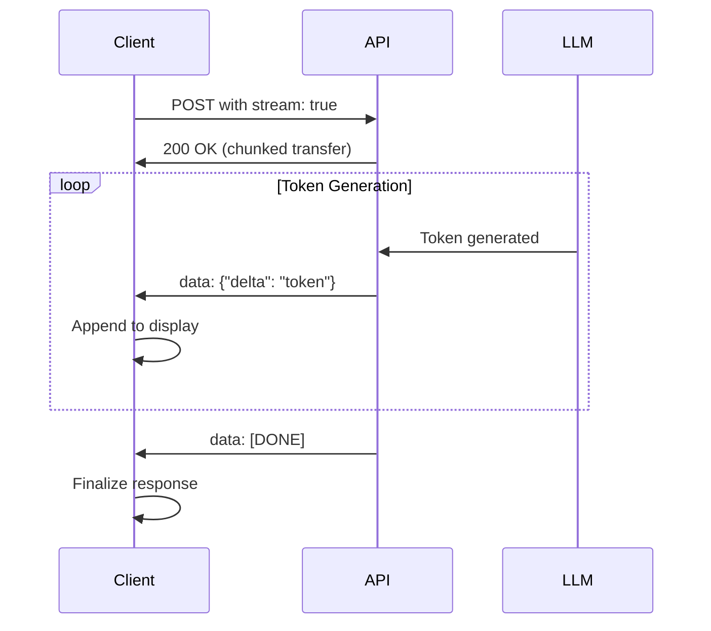

# Streaming Responses

## Overview

Streaming transforms user experience from waiting for complete responses to seeing content appear word-by-word in real time. This lesson covers the protocols, APIs, and patterns for implementing streaming in AI applications.

### What You'll Learn

| Topic | Description |
|-------|-------------|
| **Why Streaming Matters** | Perceived responsiveness and user engagement |
| **SSE Protocol** | Server-Sent Events format and handling |
| **ReadableStream API** | Browser and Node.js streaming |
| **Delta Handling** | Accumulating content chunks |
| **Stream Events** | Modern semantic streaming events |
| **Advanced Patterns** | Function calls, structured outputs, realtime |

### Prerequisites

- Basic completion requests
- Response structure understanding
- JavaScript async/await patterns

---

## Streaming Flow



---

## Lesson Structure

### [01. Why Streaming Matters](./01-why-streaming.md)
Perceived responsiveness, user engagement, and when to use streaming.

### [02. Server-Sent Events (SSE)](./02-sse-protocol.md)
Event stream format, data lines, and connection handling.

### [03. ReadableStream API](./03-readablestream-api.md)
Reading chunks in browser and Node.js environments.

### [04. Parsing Streamed Chunks](./04-parsing-chunks.md)
Buffer management, JSON parsing, and split character handling.

### [05. Delta Content Handling](./05-delta-handling.md)
Accumulating deltas, display strategies, and final assembly.

### [06. Stream Termination](./06-stream-termination.md)
Connection cleanup and resource management.

### [07. Handling Interruptions](./07-handling-interruptions.md)
AbortController, user cancellation, and error recovery.

### [08. Semantic Streaming Events](./08-semantic-events.md)
Modern event types for Responses API (2024-2025).

### [09. Streaming Function Calls](./09-streaming-function-calls.md)
Accumulating tool call arguments in streams.

### [10. Advanced Streaming Patterns](./10-advanced-patterns.md)
Structured outputs, reasoning tokens, WebSocket, and WebRTC.

---

## Quick Reference

### Enable Streaming

```python
# Python SDK
stream = client.responses.create(
    model="gpt-4.1",
    input="Write a story",
    stream=True
)
```

```javascript
// JavaScript SDK
const stream = await openai.responses.create({
    model: "gpt-4.1",
    input: "Write a story",
    stream: true
});
```

### Basic Stream Processing

```python
for event in stream:
    if event.type == "response.output_text.delta":
        print(event.delta, end="", flush=True)
```

---

## Key Concepts Preview

| Concept | Description |
|---------|-------------|
| **SSE** | Protocol for server-to-client streaming |
| **Delta** | Incremental content chunk |
| **Event Types** | `response.created`, `response.output_text.delta`, etc. |
| **AbortController** | Cancel streams on demand |
| **[DONE]** | Stream termination marker |

---

**Next:** [Why Streaming Matters](./01-why-streaming.md)
