# Why Streaming Matters

## Introduction

When users submit a prompt, they expect immediate feedback. Streaming transforms the experience from staring at a loading spinner for 10+ seconds to seeing the response appear word-by-word in real time, just like watching someone type.

### What We'll Cover

- Perceived responsiveness and its impact on UX
- User engagement during content generation
- When to use streaming vs. waiting for completion
- Time-to-first-token metrics

### Prerequisites

- Basic understanding of LLM request/response flow
- HTTP request fundamentals

---

## The UX Problem Without Streaming

### The Wait Time Issue

Large language models can take 5-30 seconds to generate a response:

```mermaid
gantt
    title Non-Streaming Response Timeline
    dateFormat ss
    axisFormat %S
    
    section User Experience
    Submit prompt          :done, 00, 01
    Show loading spinner   :active, 01, 12
    Display complete response :11, 13
    User can read           :13, 20
```



**User perception:**
- "Is it working?"
- "Did my request fail?"
- "How much longer?"

### Streaming Changes Everything

```mermaid
gantt
    title Streaming Response Timeline
    dateFormat ss
    axisFormat %S
    
    section User Experience
    Submit prompt          :done, 00, 01
    First token appears    :done, 01, 02
    User starts reading    :02, 13
    Response complete      :crit, 12, 13
```



**User perception:**
- Immediate confirmation it's working
- Start reading right away
- Time feels shorter (even though it's the same)

---

## Key Benefits of Streaming

### 1. Perceived Responsiveness

Research shows users perceive loading time differently based on visual feedback:

| Scenario | Actual Time | Perceived Time |
|----------|-------------|----------------|
| No feedback | 10 seconds | "Forever" |
| Loading spinner | 10 seconds | 15-20 seconds |
| Progressive content | 10 seconds | 5-7 seconds |

```python
# Time to first token vs total time
import time

# Without streaming - user waits for ALL content
start = time.time()
response = client.responses.create(model="gpt-4.1", input=prompt)
print(response.output_text)  # 8 seconds later
total_time = time.time() - start
print(f"User waited {total_time:.1f}s before seeing anything")

# With streaming - user sees content immediately
start = time.time()
stream = client.responses.create(model="gpt-4.1", input=prompt, stream=True)
first_token = True
for event in stream:
    if event.type == "response.output_text.delta":
        if first_token:
            print(f"First token in {time.time() - start:.2f}s")
            first_token = False
        print(event.delta, end="", flush=True)
```

**Output:**
```
First token in 0.34s
Once upon a time, in a kingdom far away...
```

### 2. User Engagement During Generation

Streaming keeps users actively engaged:

```javascript
// Users can start reading and processing information immediately
async function streamWithEngagement(prompt) {
    const stream = await openai.responses.create({
        model: "gpt-4.1",
        input: prompt,
        stream: true
    });
    
    let wordCount = 0;
    
    for await (const event of stream) {
        if (event.type === "response.output_text.delta") {
            process.stdout.write(event.delta);
            
            // Track engagement - user is actively reading
            wordCount += event.delta.split(' ').length;
        }
    }
    
    console.log(`\n\nUser engaged with ${wordCount} words as they appeared`);
}
```

### 3. Progress Indication

Streaming naturally provides progress feedback:

```python
class StreamProgress:
    def __init__(self, estimated_tokens=500):
        self.tokens_received = 0
        self.estimated_tokens = estimated_tokens
    
    def update(self, delta):
        # Rough token estimate (chars / 4)
        self.tokens_received += len(delta) // 4
        progress = min(100, (self.tokens_received / self.estimated_tokens) * 100)
        return progress

progress = StreamProgress(estimated_tokens=500)

for event in stream:
    if event.type == "response.output_text.delta":
        print(event.delta, end="", flush=True)
        pct = progress.update(event.delta)
        # Update progress bar in UI
```

### 4. Early Error Detection

Streaming reveals issues faster:

```python
def stream_with_early_detection(prompt):
    """Detect content issues early in stream."""
    stream = client.responses.create(
        model="gpt-4.1",
        input=prompt,
        stream=True
    )
    
    content = ""
    
    for event in stream:
        if event.type == "response.output_text.delta":
            content += event.delta
            
            # Early detection of issues
            if len(content) < 100:
                if "I cannot" in content or "I'm unable" in content:
                    print("⚠️ Model may refuse this request")
                if "As an AI" in content:
                    print("💡 Consider adjusting prompt to avoid disclaimers")
```

---

## When to Use Streaming

### ✅ Use Streaming For

| Use Case | Why |
|----------|-----|
| **Chat interfaces** | Users expect real-time responses |
| **Long-form content** | Stories, articles, explanations |
| **Code generation** | See code as it's written |
| **Live assistants** | Voice or real-time applications |
| **User-facing apps** | Any interactive experience |

### ❌ Avoid Streaming For

| Use Case | Why |
|----------|-----|
| **Background processing** | No user waiting; adds complexity |
| **Batch operations** | Processing many requests programmatically |
| **Structured outputs** | Need complete JSON for parsing |
| **Short responses** | Overhead outweighs benefit |
| **Server-to-server** | No UX benefit |

---

## Time-to-First-Token (TTFT)

### What is TTFT?

Time-to-First-Token measures how quickly the first content appears:

```python
import time

def measure_ttft(model: str, prompt: str) -> float:
    """Measure time to first token."""
    start = time.time()
    
    stream = client.responses.create(
        model=model,
        input=prompt,
        stream=True
    )
    
    for event in stream:
        if event.type == "response.output_text.delta":
            ttft = time.time() - start
            # Consume rest of stream
            for _ in stream:
                pass
            return ttft
    
    return -1  # No content received

# Compare models
models = ["gpt-4.1-nano", "gpt-4.1-mini", "gpt-4.1"]
for model in models:
    ttft = measure_ttft(model, "Say hello")
    print(f"{model}: {ttft*1000:.0f}ms TTFT")
```

**Output:**
```
gpt-4.1-nano: 180ms TTFT
gpt-4.1-mini: 340ms TTFT
gpt-4.1: 520ms TTFT
```

### TTFT vs Total Generation Time

```python
def measure_full_metrics(model: str, prompt: str):
    """Measure TTFT and total time."""
    start = time.time()
    ttft = None
    content = ""
    
    stream = client.responses.create(
        model=model,
        input=prompt,
        stream=True
    )
    
    for event in stream:
        if event.type == "response.output_text.delta":
            if ttft is None:
                ttft = time.time() - start
            content += event.delta
    
    total_time = time.time() - start
    
    return {
        "ttft_ms": ttft * 1000,
        "total_ms": total_time * 1000,
        "tokens": len(content) // 4,  # Rough estimate
        "tokens_per_second": len(content) // 4 / total_time
    }

metrics = measure_full_metrics("gpt-4.1", "Write a paragraph about AI")
print(f"Time to first token: {metrics['ttft_ms']:.0f}ms")
print(f"Total time: {metrics['total_ms']:.0f}ms")
print(f"Throughput: {metrics['tokens_per_second']:.0f} tokens/sec")
```

---

## Streaming Impact on Architecture

### Client-Side Considerations

```javascript
// Browser considerations for streaming
class StreamingUI {
    constructor(outputElement) {
        this.output = outputElement;
        this.buffer = "";
    }
    
    async stream(prompt) {
        // Clear previous output
        this.output.textContent = "";
        this.output.classList.add("streaming");
        
        try {
            const response = await fetch("/api/chat", {
                method: "POST",
                body: JSON.stringify({ prompt }),
                headers: { "Content-Type": "application/json" }
            });
            
            const reader = response.body.getReader();
            const decoder = new TextDecoder();
            
            while (true) {
                const { done, value } = await reader.read();
                if (done) break;
                
                const text = decoder.decode(value);
                this.buffer += text;
                
                // Update UI frequently but not too often
                this.scheduleRender();
            }
        } finally {
            this.output.classList.remove("streaming");
        }
    }
    
    scheduleRender() {
        if (!this.renderPending) {
            this.renderPending = true;
            requestAnimationFrame(() => {
                this.output.textContent = this.buffer;
                this.renderPending = false;
            });
        }
    }
}
```

### Server-Side Proxying

```python
# FastAPI streaming endpoint
from fastapi import FastAPI
from fastapi.responses import StreamingResponse
from openai import OpenAI

app = FastAPI()
client = OpenAI()

@app.post("/api/chat")
async def chat_stream(request: dict):
    async def generate():
        stream = client.responses.create(
            model="gpt-4.1",
            input=request["prompt"],
            stream=True
        )
        
        for event in stream:
            if event.type == "response.output_text.delta":
                yield event.delta
    
    return StreamingResponse(
        generate(),
        media_type="text/plain"
    )
```

---

## Hands-on Exercise

### Your Task

Build a TTFT comparison tool that measures and displays streaming performance.

### Requirements

1. Measure TTFT for 3 different prompt lengths
2. Calculate tokens per second
3. Display results in a formatted table

### Expected Result

```
| Prompt Length | TTFT (ms) | Total (ms) | Tokens/sec |
|---------------|-----------|------------|------------|
| Short (10)    |       180 |        890 |         45 |
| Medium (50)   |       210 |       1240 |         62 |
| Long (200)    |       340 |       3100 |         78 |
```

<details>
<summary>💡 Hints</summary>

- Create prompts of different lengths
- Use a consistent model for comparison
- Calculate throughput after stream completes
</details>

<details>
<summary>✅ Solution</summary>

```python
import time
from openai import OpenAI

client = OpenAI()

def measure_streaming_metrics(prompt: str) -> dict:
    """Measure comprehensive streaming metrics."""
    start = time.time()
    ttft = None
    content = ""
    
    stream = client.responses.create(
        model="gpt-4.1-mini",
        input=prompt,
        stream=True
    )
    
    for event in stream:
        if event.type == "response.output_text.delta":
            if ttft is None:
                ttft = (time.time() - start) * 1000
            content += event.delta
    
    total_time = (time.time() - start) * 1000
    token_estimate = len(content) // 4
    tokens_per_sec = token_estimate / (total_time / 1000) if total_time > 0 else 0
    
    return {
        "ttft_ms": ttft or 0,
        "total_ms": total_time,
        "tokens": token_estimate,
        "tokens_per_sec": tokens_per_sec
    }

def run_benchmark():
    """Run streaming benchmark with different prompt lengths."""
    prompts = [
        ("Short (10)", "Say hello."),
        ("Medium (50)", "Explain what streaming responses are in AI APIs."),
        ("Long (200)", "Write a detailed explanation of how streaming works in large language models, including the technical implementation details, benefits for user experience, and common patterns used in production applications. Include code examples.")
    ]
    
    # Header
    print("| Prompt Length | TTFT (ms) | Total (ms) | Tokens/sec |")
    print("|---------------|-----------|------------|------------|")
    
    for label, prompt in prompts:
        metrics = measure_streaming_metrics(prompt)
        print(f"| {label:13} | {metrics['ttft_ms']:9.0f} | {metrics['total_ms']:10.0f} | {metrics['tokens_per_sec']:10.0f} |")

if __name__ == "__main__":
    run_benchmark()
```

</details>

---

## Summary

✅ Streaming reduces perceived wait time dramatically  
✅ Users engage with content as it appears, improving experience  
✅ Time-to-First-Token (TTFT) is a key metric for responsiveness  
✅ Use streaming for all user-facing, interactive applications  
✅ Avoid streaming for batch processing and structured outputs

**Next:** [Server-Sent Events (SSE)](./02-sse-protocol.md)

---

## Further Reading

- [Streaming Guide](https://platform.openai.com/docs/guides/streaming) — OpenAI streaming documentation
- [Perceived Performance](https://web.dev/articles/performance-perception) — web.dev on user perception
- [TTFT Benchmarks](https://artificialanalysis.ai/) — Model performance comparisons

<!-- 
Sources Consulted:
- OpenAI Streaming: https://platform.openai.com/docs/guides/streaming
- web.dev Performance: https://web.dev/articles/performance-perception
-->
