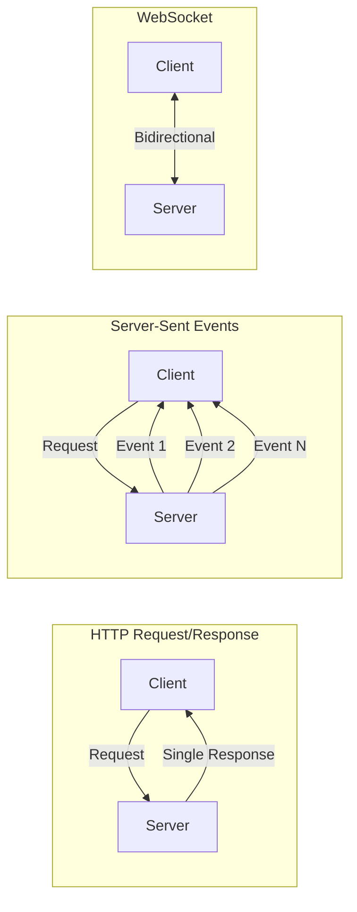

# Server-Sent Events (SSE) Protocol

## Introduction

Server-Sent Events (SSE) is the protocol that powers AI API streaming. Unlike WebSocket's bidirectional communication, SSE provides a simple, HTTP-based way for servers to push data to clients—perfect for streaming LLM responses.

### What We'll Cover

- SSE protocol fundamentals
- Event stream format and data lines
- Event types and custom events
- Connection keep-alive mechanisms
- Browser and server implementation

### Prerequisites

- HTTP request/response basics
- Understanding of content types

---

## SSE vs Other Protocols



| Protocol | Direction | Use Case |
|----------|-----------|----------|
| HTTP | Request → Response | Traditional APIs |
| SSE | Server → Client | Streaming responses, notifications |
| WebSocket | Bidirectional | Chat, real-time collaboration |

---

## Event Stream Format

### Content Type

SSE uses a specific MIME type:

```http
Content-Type: text/event-stream
```

### Basic Format

Each event consists of field:value pairs, separated by newlines:

```
data: Hello, world!

data: This is another message

```

> **Note:** A blank line (`\n\n`) separates events.

### Complete Event Structure

```
id: 1
event: message
data: {"content": "Hello"}
retry: 3000

id: 2
event: message
data: {"content": "World"}

```

---

## Field Types

### The `data` Field

Contains the actual payload:

```
data: Simple text message

data: {"json": "also works"}

data: Multi-line messages
data: span multiple data fields
data: and are concatenated

```

### The `event` Field

Names custom event types:

```
event: response.created
data: {"id": "resp_123"}

event: response.output_text.delta
data: {"delta": "Hello"}

event: response.completed
data: {"status": "done"}

```

### The `id` Field

Provides event IDs for reconnection:

```
id: evt_001
data: First message

id: evt_002
data: Second message

```

### The `retry` Field

Sets reconnection delay in milliseconds:

```
retry: 5000
data: Reconnect after 5 seconds if disconnected

```

---

## Parsing SSE in JavaScript

### Browser EventSource API

```javascript
// Native browser API for SSE
const source = new EventSource("/api/stream");

source.onopen = () => {
    console.log("Connection opened");
};

source.onmessage = (event) => {
    console.log("Received:", event.data);
};

source.onerror = (error) => {
    console.error("Error:", error);
    source.close();
};
```

### Custom Event Handlers

```javascript
const source = new EventSource("/api/stream");

// Handle named events
source.addEventListener("response.output_text.delta", (event) => {
    const data = JSON.parse(event.data);
    document.getElementById("output").textContent += data.delta;
});

source.addEventListener("response.completed", (event) => {
    console.log("Stream complete");
    source.close();
});

source.addEventListener("error", (event) => {
    console.error("Stream error:", event);
    source.close();
});
```

### Manual Parsing with Fetch

For more control, parse SSE manually:

```javascript
async function parseSSE(response) {
    const reader = response.body.getReader();
    const decoder = new TextDecoder();
    let buffer = "";
    
    while (true) {
        const { done, value } = await reader.read();
        if (done) break;
        
        buffer += decoder.decode(value, { stream: true });
        
        // Split on double newline (event boundary)
        const events = buffer.split("\n\n");
        // Keep incomplete event in buffer
        buffer = events.pop();
        
        for (const event of events) {
            const parsed = parseEvent(event);
            if (parsed) {
                handleEvent(parsed);
            }
        }
    }
}

function parseEvent(eventString) {
    const lines = eventString.split("\n");
    const event = { data: [] };
    
    for (const line of lines) {
        if (line.startsWith("data: ")) {
            event.data.push(line.slice(6));
        } else if (line.startsWith("event: ")) {
            event.event = line.slice(7);
        } else if (line.startsWith("id: ")) {
            event.id = line.slice(4);
        }
    }
    
    // Join multi-line data
    event.data = event.data.join("\n");
    
    // Skip empty data
    if (!event.data) return null;
    
    return event;
}

function handleEvent({ event, data, id }) {
    console.log(`Event: ${event || "message"}, ID: ${id}`);
    
    // Parse JSON data if applicable
    if (data.startsWith("{")) {
        const json = JSON.parse(data);
        console.log("Data:", json);
    } else {
        console.log("Data:", data);
    }
}
```

---

## Parsing SSE in Python

### Basic Stream Processing

```python
import httpx

def parse_sse_stream(url: str, headers: dict):
    """Parse SSE stream manually."""
    with httpx.stream("POST", url, headers=headers, json={...}) as response:
        buffer = ""
        
        for chunk in response.iter_text():
            buffer += chunk
            
            while "\n\n" in buffer:
                event_str, buffer = buffer.split("\n\n", 1)
                event = parse_event(event_str)
                if event:
                    yield event

def parse_event(event_string: str) -> dict:
    """Parse a single SSE event."""
    lines = event_string.strip().split("\n")
    event = {"data": []}
    
    for line in lines:
        if line.startswith("data: "):
            event["data"].append(line[6:])
        elif line.startswith("event: "):
            event["event"] = line[7:]
        elif line.startswith("id: "):
            event["id"] = line[4:]
    
    event["data"] = "\n".join(event["data"])
    return event if event["data"] else None

# Usage
for event in parse_sse_stream(url, headers):
    print(f"Event: {event.get('event', 'message')}")
    print(f"Data: {event['data']}")
```

### OpenAI SDK Handles SSE

The SDK abstracts SSE parsing:

```python
from openai import OpenAI

client = OpenAI()

stream = client.responses.create(
    model="gpt-4.1",
    input="Hello!",
    stream=True
)

# SDK handles SSE parsing internally
for event in stream:
    print(f"Event type: {event.type}")
    if event.type == "response.output_text.delta":
        print(f"Delta: {event.delta}")
```

---

## The `data: [DONE]` Termination

OpenAI streams end with a special marker:

```
data: {"id":"resp_123","object":"response",...}

data: {"choices":[{"delta":{"content":"Hello"}}]}

data: {"choices":[{"delta":{"content":" world"}}]}

data: [DONE]

```

### Handling Termination

```javascript
function processLine(line) {
    // Check for stream termination
    if (line === "data: [DONE]") {
        console.log("Stream completed");
        return { done: true };
    }
    
    // Remove "data: " prefix
    if (!line.startsWith("data: ")) {
        return null;
    }
    
    const data = line.slice(6);
    
    // Skip empty data
    if (!data.trim()) {
        return null;
    }
    
    try {
        return { data: JSON.parse(data) };
    } catch (e) {
        console.error("Failed to parse:", data);
        return null;
    }
}
```

---

## Connection Keep-Alive

### Server-Side Configuration

```python
# FastAPI SSE endpoint
from fastapi import FastAPI
from fastapi.responses import StreamingResponse

app = FastAPI()

@app.post("/api/stream")
async def stream_response():
    async def generate():
        for i in range(10):
            yield f"data: Message {i}\n\n"
            await asyncio.sleep(0.5)
        yield "data: [DONE]\n\n"
    
    return StreamingResponse(
        generate(),
        media_type="text/event-stream",
        headers={
            "Cache-Control": "no-cache",
            "Connection": "keep-alive",
            "X-Accel-Buffering": "no"  # Disable nginx buffering
        }
    )
```

### Heartbeat Messages

Prevent timeout with periodic comments:

```python
async def generate_with_heartbeat():
    import asyncio
    
    async def heartbeat():
        """Send periodic heartbeat."""
        while True:
            yield ": heartbeat\n\n"
            await asyncio.sleep(15)
    
    async def content():
        """Generate actual content."""
        for item in slow_generator():
            yield f"data: {json.dumps(item)}\n\n"
    
    # Merge heartbeat and content streams
    ...
```

> **Note:** Lines starting with `:` are SSE comments—sent but ignored by clients.

---

## Automatic Reconnection

### EventSource Built-in Reconnection

```javascript
const source = new EventSource("/api/stream");

// Browser automatically reconnects on disconnect
source.onerror = (event) => {
    console.log("Connection lost, will retry...");
    // Browser retries automatically
};
```

### Custom Reconnection with Fetch

```javascript
class RobustSSEClient {
    constructor(url, options = {}) {
        this.url = url;
        this.retryDelay = options.retryDelay || 3000;
        this.maxRetries = options.maxRetries || 5;
        this.retryCount = 0;
        this.lastEventId = null;
    }
    
    async connect(onEvent, onError) {
        try {
            const headers = {};
            if (this.lastEventId) {
                headers["Last-Event-ID"] = this.lastEventId;
            }
            
            const response = await fetch(this.url, { headers });
            this.retryCount = 0; // Reset on successful connection
            
            await this.processStream(response, onEvent);
        } catch (error) {
            if (this.retryCount < this.maxRetries) {
                this.retryCount++;
                console.log(`Retry ${this.retryCount}/${this.maxRetries} in ${this.retryDelay}ms`);
                setTimeout(() => this.connect(onEvent, onError), this.retryDelay);
            } else {
                onError(error);
            }
        }
    }
    
    async processStream(response, onEvent) {
        const reader = response.body.getReader();
        const decoder = new TextDecoder();
        let buffer = "";
        
        while (true) {
            const { done, value } = await reader.read();
            if (done) break;
            
            buffer += decoder.decode(value, { stream: true });
            const events = buffer.split("\n\n");
            buffer = events.pop();
            
            for (const eventStr of events) {
                const event = this.parseEvent(eventStr);
                if (event) {
                    if (event.id) this.lastEventId = event.id;
                    onEvent(event);
                }
            }
        }
    }
    
    parseEvent(str) {
        // ... parsing logic
    }
}
```

---

## Browser Compatibility

| Browser | EventSource Support | Notes |
|---------|---------------------|-------|
| Chrome | ✅ Full | All versions |
| Firefox | ✅ Full | All versions |
| Safari | ✅ Full | All versions |
| Edge | ✅ Full | All versions |
| IE | ❌ None | Use polyfill |

> **Note:** For IE support or POST requests, use fetch-based SSE parsing instead of EventSource.

---

## Hands-on Exercise

### Your Task

Build an SSE parser that handles OpenAI-style streaming events.

### Requirements

1. Parse `data:` lines correctly
2. Handle `data: [DONE]` termination
3. Support multi-line data fields
4. Extract event IDs when present

### Expected Result

```python
parser = SSEParser()
for event in parser.parse(raw_stream):
    print(f"Type: {event.type}, Data: {event.data}")
```

<details>
<summary>💡 Hints</summary>

- Buffer incomplete lines
- Watch for double newlines as event separators
- Check for `[DONE]` before JSON parsing
</details>

<details>
<summary>✅ Solution</summary>

```python
from dataclasses import dataclass
from typing import Generator, Optional
import json

@dataclass
class SSEEvent:
    type: str  # event type or "message"
    data: str  # raw data string
    id: Optional[str] = None
    json: Optional[dict] = None  # Parsed JSON if applicable

class SSEParser:
    def parse(self, stream) -> Generator[SSEEvent, None, None]:
        """Parse SSE stream from any iterable of chunks."""
        buffer = ""
        
        for chunk in stream:
            buffer += chunk
            
            # Process complete events (separated by \n\n)
            while "\n\n" in buffer:
                event_str, buffer = buffer.split("\n\n", 1)
                event = self._parse_event(event_str)
                if event:
                    yield event
    
    def _parse_event(self, event_str: str) -> Optional[SSEEvent]:
        """Parse a single SSE event string."""
        lines = event_str.strip().split("\n")
        
        event_type = "message"
        event_id = None
        data_lines = []
        
        for line in lines:
            # Skip comments
            if line.startswith(":"):
                continue
            
            if line.startswith("data: "):
                content = line[6:]
                
                # Check for termination
                if content == "[DONE]":
                    return SSEEvent(type="done", data="[DONE]")
                
                data_lines.append(content)
            
            elif line.startswith("event: "):
                event_type = line[7:]
            
            elif line.startswith("id: "):
                event_id = line[4:]
        
        # Join multi-line data
        data = "\n".join(data_lines)
        
        if not data:
            return None
        
        # Try to parse as JSON
        json_data = None
        if data.startswith("{") or data.startswith("["):
            try:
                json_data = json.loads(data)
            except json.JSONDecodeError:
                pass
        
        return SSEEvent(
            type=event_type,
            data=data,
            id=event_id,
            json=json_data
        )

# Test
sample_stream = [
    'event: response.created\ndata: {"id": "resp_123"}\n\n',
    'event: response.output_text.delta\ndata: {"delta": "Hello"}\n\n',
    'event: response.output_text.delta\ndata: {"delta": " World"}\n\n',
    'data: [DONE]\n\n'
]

parser = SSEParser()
for event in parser.parse(sample_stream):
    print(f"Type: {event.type}")
    if event.json:
        print(f"  JSON: {event.json}")
    else:
        print(f"  Data: {event.data}")
```

**Output:**
```
Type: response.created
  JSON: {'id': 'resp_123'}
Type: response.output_text.delta
  JSON: {'delta': 'Hello'}
Type: response.output_text.delta
  JSON: {'delta': ' World'}
Type: done
  Data: [DONE]
```

</details>

---

## Summary

✅ SSE is an HTTP-based protocol for server-to-client streaming  
✅ Events use `data:`, `event:`, `id:`, and `retry:` fields  
✅ Double newlines (`\n\n`) separate events  
✅ OpenAI streams end with `data: [DONE]`  
✅ EventSource API provides automatic reconnection  
✅ SDKs abstract SSE parsing—you work with typed events

**Next:** [ReadableStream API](./03-readablestream-api.md)

---

## Further Reading

- [MDN Server-Sent Events](https://developer.mozilla.org/en-US/docs/Web/API/Server-sent_events) — Complete SSE reference
- [SSE Specification](https://html.spec.whatwg.org/multipage/server-sent-events.html) — WHATWG spec
- [EventSource API](https://developer.mozilla.org/en-US/docs/Web/API/EventSource) — Browser API reference

<!-- 
Sources Consulted:
- MDN SSE: https://developer.mozilla.org/en-US/docs/Web/API/Server-sent_events
- WHATWG HTML Spec: https://html.spec.whatwg.org/multipage/server-sent-events.html
-->
