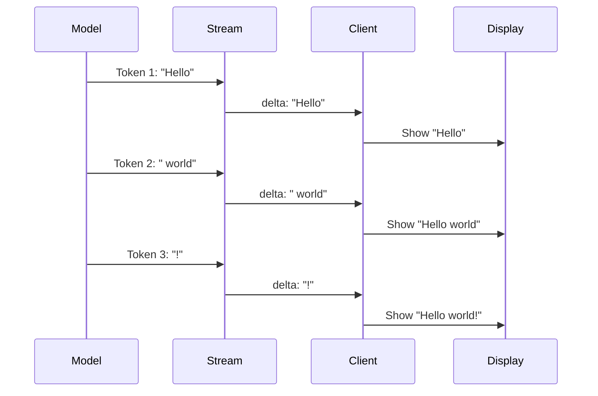

# Delta Content Handling

## Introduction

When streaming, content arrives as incremental "deltas"—small pieces of text that must be accumulated into the final response. This lesson covers delta extraction, accumulation strategies, real-time display, and final message assembly.

### What We'll Cover

- Delta vs. full content in streaming
- Accumulating deltas efficiently
- Real-time display techniques
- Final message assembly
- Provider-specific delta formats

### Prerequisites

- SSE parsing basics
- Stream chunk handling

---

## Delta Concept



---

## Delta Formats by Provider

### OpenAI Chat Completions

```json
{
  "choices": [{
    "index": 0,
    "delta": {
      "content": "Hello"
    },
    "finish_reason": null
  }]
}
```

### OpenAI Responses API

```json
{
  "type": "response.output_text.delta",
  "delta": "Hello"
}
```

### Anthropic

```json
{
  "type": "content_block_delta",
  "index": 0,
  "delta": {
    "type": "text_delta",
    "text": "Hello"
  }
}
```

### Google Gemini

```json
{
  "candidates": [{
    "content": {
      "parts": [{
        "text": "Hello"
      }]
    }
  }]
}
```

---

## Basic Delta Accumulator

### JavaScript Implementation

```javascript
class DeltaAccumulator {
    constructor() {
        this.content = "";
        this.chunks = [];
    }
    
    addDelta(delta) {
        if (delta) {
            this.chunks.push(delta);
            this.content += delta;
        }
        return this.content;
    }
    
    getText() {
        return this.content;
    }
    
    getChunks() {
        return [...this.chunks];
    }
    
    clear() {
        this.content = "";
        this.chunks = [];
    }
}

// Usage
const acc = new DeltaAccumulator();

acc.addDelta("Hello");     // "Hello"
acc.addDelta(" world");    // "Hello world"
acc.addDelta("!");         // "Hello world!"

console.log(acc.getText());  // "Hello world!"
```

### Python Implementation

```python
class DeltaAccumulator:
    def __init__(self):
        self.content = ""
        self.chunks = []
    
    def add(self, delta: str) -> str:
        if delta:
            self.chunks.append(delta)
            self.content += delta
        return self.content
    
    def get_text(self) -> str:
        return self.content
    
    def get_chunks(self) -> list:
        return self.chunks.copy()
    
    def clear(self):
        self.content = ""
        self.chunks = []

# Usage
acc = DeltaAccumulator()

for event in stream:
    if event.type == "response.output_text.delta":
        current = acc.add(event.delta)
        print(current, end="\r")  # Overwrite line

print()  # Final newline
print(f"Final: {acc.get_text()}")
```

---

## Provider-Agnostic Extractor

```javascript
class UniversalDeltaExtractor {
    extract(event) {
        // OpenAI Responses API
        if (event.type === "response.output_text.delta") {
            return event.delta;
        }
        
        // OpenAI Chat Completions
        if (event.choices?.[0]?.delta?.content !== undefined) {
            return event.choices[0].delta.content;
        }
        
        // Anthropic
        if (event.type === "content_block_delta" && event.delta?.text) {
            return event.delta.text;
        }
        
        // Google Gemini
        if (event.candidates?.[0]?.content?.parts?.[0]?.text) {
            return event.candidates[0].content.parts[0].text;
        }
        
        // Direct delta field
        if (typeof event.delta === "string") {
            return event.delta;
        }
        
        return null;
    }
}

// Usage
const extractor = new UniversalDeltaExtractor();
const accumulator = new DeltaAccumulator();

for await (const event of stream) {
    const delta = extractor.extract(event);
    if (delta) {
        accumulator.addDelta(delta);
        process.stdout.write(delta);
    }
}
```

---

## Real-Time Display Strategies

### Strategy 1: Immediate Append

Best for terminals and simple UIs:

```javascript
async function displayImmediate(stream) {
    for await (const event of stream) {
        if (event.type === "response.output_text.delta") {
            process.stdout.write(event.delta);
        }
    }
    console.log(); // Final newline
}
```

### Strategy 2: Batched Updates

Reduces DOM operations in browsers:

```javascript
class BatchedDisplay {
    constructor(element, options = {}) {
        this.element = element;
        this.batchInterval = options.batchInterval || 50; // ms
        this.pendingText = "";
        this.timer = null;
    }
    
    addDelta(delta) {
        this.pendingText += delta;
        
        if (!this.timer) {
            this.timer = setTimeout(() => this.flush(), this.batchInterval);
        }
    }
    
    flush() {
        if (this.pendingText) {
            this.element.textContent += this.pendingText;
            this.pendingText = "";
        }
        this.timer = null;
    }
    
    finish() {
        if (this.timer) {
            clearTimeout(this.timer);
        }
        this.flush();
    }
}

// Usage
const display = new BatchedDisplay(document.getElementById("output"));

for await (const event of stream) {
    if (event.type === "response.output_text.delta") {
        display.addDelta(event.delta);
    }
}
display.finish();
```

### Strategy 3: RequestAnimationFrame

Syncs with browser render cycle:

```javascript
class RAFDisplay {
    constructor(element) {
        this.element = element;
        this.content = "";
        this.scheduled = false;
    }
    
    addDelta(delta) {
        this.content += delta;
        this.scheduleRender();
    }
    
    scheduleRender() {
        if (!this.scheduled) {
            this.scheduled = true;
            requestAnimationFrame(() => {
                this.element.textContent = this.content;
                this.scheduled = false;
            });
        }
    }
}
```

---

## Handling Word Boundaries

Sometimes you want to display word-by-word:

```javascript
class WordBufferedDisplay {
    constructor(onWord) {
        this.buffer = "";
        this.onWord = onWord;
    }
    
    addDelta(delta) {
        this.buffer += delta;
        
        // Check for word boundaries
        const words = this.buffer.split(/(\s+)/);
        
        // Keep the last incomplete word in buffer
        this.buffer = words.pop() || "";
        
        // Emit complete words
        for (const word of words) {
            if (word) {
                this.onWord(word);
            }
        }
    }
    
    flush() {
        if (this.buffer) {
            this.onWord(this.buffer);
            this.buffer = "";
        }
    }
}

// Usage - smooth word appearance
const display = new WordBufferedDisplay((word) => {
    const span = document.createElement("span");
    span.textContent = word;
    span.className = "fade-in";
    output.appendChild(span);
});

for await (const event of stream) {
    if (event.type === "response.output_text.delta") {
        display.addDelta(event.delta);
    }
}
display.flush();
```

---

## Sentence-Level Buffering

For TTS or paced reading:

```python
import re

class SentenceBuffer:
    def __init__(self, on_sentence):
        self.buffer = ""
        self.on_sentence = on_sentence
        self.sentence_end = re.compile(r'[.!?]\s+')
    
    def add(self, delta: str):
        self.buffer += delta
        
        while True:
            match = self.sentence_end.search(self.buffer)
            if not match:
                break
            
            end_pos = match.end()
            sentence = self.buffer[:end_pos].strip()
            self.buffer = self.buffer[end_pos:]
            
            if sentence:
                self.on_sentence(sentence)
    
    def flush(self):
        if self.buffer.strip():
            self.on_sentence(self.buffer.strip())
            self.buffer = ""

# Usage for TTS
def speak(sentence):
    print(f"🔊 Speaking: {sentence}")
    # tts_engine.speak(sentence)

buffer = SentenceBuffer(speak)

for event in stream:
    if event.type == "response.output_text.delta":
        buffer.add(event.delta)

buffer.flush()
```

---

## Multi-Content Block Handling

Anthropic and others may have multiple content blocks:

```javascript
class MultiBlockAccumulator {
    constructor() {
        this.blocks = {};  // index -> content
        this.currentIndex = 0;
    }
    
    addDelta(event) {
        const index = event.index ?? this.currentIndex;
        
        if (!this.blocks[index]) {
            this.blocks[index] = "";
        }
        
        if (event.delta?.text) {
            this.blocks[index] += event.delta.text;
        } else if (event.delta) {
            this.blocks[index] += event.delta;
        }
    }
    
    getText(index = 0) {
        return this.blocks[index] || "";
    }
    
    getAllText() {
        return Object.values(this.blocks).join("");
    }
    
    getBlockCount() {
        return Object.keys(this.blocks).length;
    }
}
```

---

## Final Message Assembly

### Complete Message Construction

```javascript
class StreamingMessage {
    constructor() {
        this.id = null;
        this.role = "assistant";
        this.content = "";
        this.toolCalls = [];
        this.finishReason = null;
        this.usage = null;
        this.startTime = Date.now();
        this.endTime = null;
    }
    
    processEvent(event) {
        switch (event.type) {
            case "response.created":
                this.id = event.response?.id;
                break;
            
            case "response.output_text.delta":
                this.content += event.delta;
                break;
            
            case "response.function_call_arguments.delta":
                this.handleFunctionDelta(event);
                break;
            
            case "response.completed":
                this.finishReason = "stop";
                this.usage = event.response?.usage;
                this.endTime = Date.now();
                break;
        }
    }
    
    handleFunctionDelta(event) {
        // Implementation for tool calls
    }
    
    toMessage() {
        return {
            id: this.id,
            role: this.role,
            content: this.content,
            tool_calls: this.toolCalls.length > 0 ? this.toolCalls : undefined,
            finish_reason: this.finishReason,
            usage: this.usage,
            duration_ms: this.endTime ? this.endTime - this.startTime : null
        };
    }
}

// Usage
const message = new StreamingMessage();

for await (const event of stream) {
    message.processEvent(event);
    
    // Display as we go
    if (event.type === "response.output_text.delta") {
        process.stdout.write(event.delta);
    }
}

console.log("\n\nFinal message:", message.toMessage());
```

---

## Performance Optimization

### String Concatenation Efficiency

For very long outputs, array joining is faster:

```javascript
class OptimizedAccumulator {
    constructor() {
        this.chunks = [];
        this._cached = null;
    }
    
    addDelta(delta) {
        this.chunks.push(delta);
        this._cached = null;  // Invalidate cache
    }
    
    getText() {
        if (this._cached === null) {
            this._cached = this.chunks.join("");
        }
        return this._cached;
    }
    
    // For streaming display, provide partial text without full join
    getLastNChars(n) {
        let result = "";
        for (let i = this.chunks.length - 1; i >= 0 && result.length < n; i--) {
            result = this.chunks[i] + result;
        }
        return result.slice(-n);
    }
}
```

### Memory-Efficient Streaming

For very long streams, limit history:

```python
from collections import deque

class BoundedAccumulator:
    def __init__(self, max_chunks=1000):
        self.chunks = deque(maxlen=max_chunks)
        self.overflow_chars = 0
    
    def add(self, delta: str):
        if len(self.chunks) >= self.chunks.maxlen:
            oldest = self.chunks[0]
            self.overflow_chars += len(oldest)
        
        self.chunks.append(delta)
    
    def get_recent_text(self) -> str:
        return "".join(self.chunks)
    
    def get_stats(self):
        return {
            "chunks": len(self.chunks),
            "chars_in_memory": sum(len(c) for c in self.chunks),
            "chars_overflow": self.overflow_chars
        }
```

---

## Hands-on Exercise

### Your Task

Build a `TypewriterDisplay` that shows streaming text with a typewriter effect.

### Requirements

1. Display characters with configurable delay
2. Handle fast incoming deltas (buffer them)
3. Support pause/resume
4. Call completion callback when done

### Expected Result

```javascript
const typewriter = new TypewriterDisplay({
    element: document.getElementById("output"),
    charDelay: 30,
    onComplete: () => console.log("Done!")
});

for await (const delta of streamDeltas()) {
    typewriter.addText(delta);
}
typewriter.finish();
```

<details>
<summary>💡 Hints</summary>

- Use a queue for pending characters
- `setInterval` or recursive `setTimeout` for timing
- Track paused state separately
</details>

<details>
<summary>✅ Solution</summary>

```javascript
class TypewriterDisplay {
    constructor(options = {}) {
        this.element = options.element;
        this.charDelay = options.charDelay || 30;
        this.onComplete = options.onComplete || (() => {});
        
        this.queue = [];
        this.isTyping = false;
        this.isPaused = false;
        this.isFinished = false;
        this.displayedText = "";
    }
    
    addText(text) {
        // Add each character to queue
        for (const char of text) {
            this.queue.push(char);
        }
        
        // Start typing if not already
        if (!this.isTyping && !this.isPaused) {
            this.startTyping();
        }
    }
    
    startTyping() {
        if (this.isTyping) return;
        this.isTyping = true;
        this.typeNext();
    }
    
    typeNext() {
        if (this.isPaused) {
            this.isTyping = false;
            return;
        }
        
        if (this.queue.length === 0) {
            this.isTyping = false;
            
            if (this.isFinished) {
                this.onComplete();
            }
            return;
        }
        
        const char = this.queue.shift();
        this.displayedText += char;
        
        if (this.element) {
            this.element.textContent = this.displayedText;
        } else {
            process.stdout.write(char);
        }
        
        setTimeout(() => this.typeNext(), this.charDelay);
    }
    
    pause() {
        this.isPaused = true;
    }
    
    resume() {
        if (this.isPaused) {
            this.isPaused = false;
            if (this.queue.length > 0) {
                this.startTyping();
            } else if (this.isFinished) {
                this.onComplete();
            }
        }
    }
    
    finish() {
        this.isFinished = true;
        
        // If nothing left in queue and not typing, call complete
        if (this.queue.length === 0 && !this.isTyping) {
            this.onComplete();
        }
    }
    
    // Skip to end immediately
    skip() {
        const remaining = this.queue.join("");
        this.queue = [];
        this.displayedText += remaining;
        
        if (this.element) {
            this.element.textContent = this.displayedText;
        } else {
            process.stdout.write(remaining);
        }
        
        if (this.isFinished) {
            this.onComplete();
        }
    }
    
    getText() {
        return this.displayedText + this.queue.join("");
    }
}

// Test
async function test() {
    const typewriter = new TypewriterDisplay({
        charDelay: 20,
        onComplete: () => console.log("\n✅ Complete!")
    });
    
    // Simulate streaming deltas
    const deltas = ["Hello", " world", "! How ", "are you", " today?"];
    
    for (const delta of deltas) {
        typewriter.addText(delta);
        await new Promise(r => setTimeout(r, 100));
    }
    
    typewriter.finish();
    
    // Wait for typing to complete
    await new Promise(r => setTimeout(r, 2000));
}

test();
```

</details>

---

## Summary

✅ Deltas are incremental text chunks that form the complete response  
✅ Different providers use different delta formats—abstract extraction  
✅ Batch DOM updates to reduce browser repaints  
✅ Use word or sentence buffering for smoother UX  
✅ Handle multiple content blocks for providers like Anthropic  
✅ Assemble final message with metadata after stream completes

**Next:** [Stream Termination](./06-stream-termination.md)

---

## Further Reading

- [Streaming Best Practices](https://platform.openai.com/docs/guides/streaming) — OpenAI guide
- [RequestAnimationFrame](https://developer.mozilla.org/en-US/docs/Web/API/window/requestAnimationFrame) — MDN reference
- [String Performance](https://blog.chromium.org/2008/04/hidden-performance-killers.html) — V8 optimizations

<!-- 
Sources Consulted:
- OpenAI Streaming: https://platform.openai.com/docs/guides/streaming
- MDN RAF: https://developer.mozilla.org/en-US/docs/Web/API/window/requestAnimationFrame
-->
