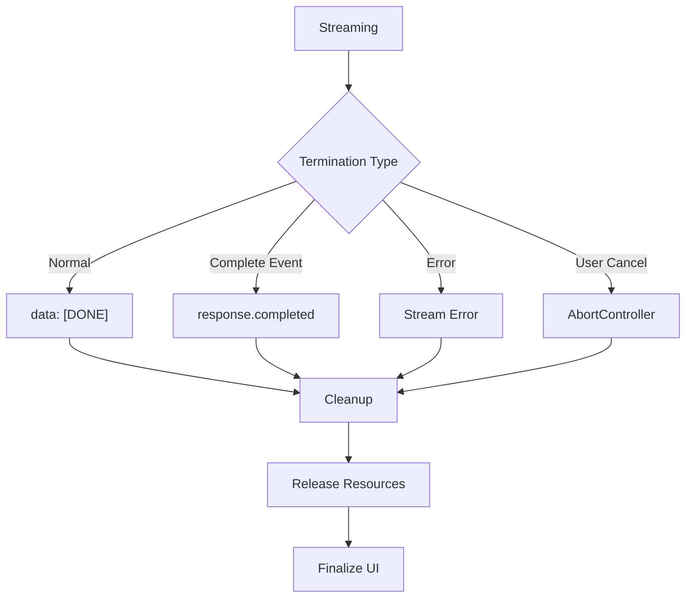

# Stream Termination and Cleanup

## Introduction

Properly terminating streams and cleaning up resources is crucial for application stability. Memory leaks, dangling connections, and inconsistent UI states often result from improper stream termination handling.

### What We'll Cover

- Detecting stream completion
- Closing connections properly
- Releasing resources
- Finalizing UI state
- Cleanup patterns for different environments

### Prerequisites

- Delta content handling
- ReadableStream basics

---

## Stream Completion Signals

### How Streams End



### Termination Indicators

| Provider | Normal End | Error End |
|----------|-----------|-----------|
| OpenAI Chat | `data: [DONE]` | HTTP error / stream error |
| OpenAI Responses | `response.completed` event | `error` event |
| Anthropic | `message_stop` event | `error` event |
| Google | `finishReason: "STOP"` | Error in response |

---

## Detecting Stream End

### Chat Completions Pattern

```javascript
async function streamChatCompletion(client, messages) {
    const stream = await client.chat.completions.create({
        model: "gpt-4o",
        messages,
        stream: true
    });
    
    let content = "";
    let finishReason = null;
    
    try {
        for await (const chunk of stream) {
            const choice = chunk.choices[0];
            
            if (choice.delta?.content) {
                content += choice.delta.content;
                process.stdout.write(choice.delta.content);
            }
            
            if (choice.finish_reason) {
                finishReason = choice.finish_reason;
                console.log(`\n[Stream ended: ${finishReason}]`);
            }
        }
    } finally {
        // Stream automatically closes when iteration completes
        console.log("Stream processing complete");
    }
    
    return { content, finishReason };
}
```

### Responses API Pattern

```python
from openai import OpenAI

client = OpenAI()

def stream_response(prompt: str):
    stream = client.responses.create(
        model="gpt-4.1",
        input=prompt,
        stream=True
    )
    
    content = ""
    completed = False
    usage = None
    
    try:
        for event in stream:
            if event.type == "response.output_text.delta":
                content += event.delta
                print(event.delta, end="", flush=True)
            
            elif event.type == "response.completed":
                completed = True
                usage = event.response.usage
                print(f"\n[Completed: {usage.total_tokens} tokens]")
    
    finally:
        # Ensure stream resources are released
        print("Cleanup complete")
    
    return {
        "content": content,
        "completed": completed,
        "usage": usage
    }
```

---

## Reader Lock Management

### Always Release Locks

```javascript
async function safeStreamRead(stream) {
    const reader = stream.getReader();
    
    try {
        while (true) {
            const { done, value } = await reader.read();
            if (done) break;
            
            processChunk(value);
        }
    } finally {
        // CRITICAL: Always release the lock
        reader.releaseLock();
    }
}
```

### Using `using` Declaration (TC39 Proposal)

Future JavaScript will have automatic cleanup:

```javascript
// When available in JavaScript
async function withAutoCleanup(stream) {
    using reader = stream.getReader();  // Auto-releases
    
    for await (const chunk of reader) {
        processChunk(chunk);
    }
    // reader.releaseLock() called automatically
}
```

### Python Context Manager

```python
from contextlib import contextmanager

class StreamManager:
    def __init__(self, client):
        self.client = client
        self.stream = None
    
    @contextmanager
    def stream_response(self, **kwargs):
        self.stream = self.client.responses.create(
            stream=True,
            **kwargs
        )
        
        try:
            yield self.stream
        finally:
            # Ensure stream is fully consumed or closed
            if self.stream:
                try:
                    for _ in self.stream:
                        pass  # Drain remaining events
                except:
                    pass

# Usage
manager = StreamManager(client)

with manager.stream_response(model="gpt-4.1", input="Hello") as stream:
    for event in stream:
        if event.type == "response.output_text.delta":
            print(event.delta, end="")
```

---

## Connection Cleanup

### HTTP/2 Connection Management

```javascript
class ConnectionManager {
    constructor(options = {}) {
        this.activeStreams = new Map();
        this.maxConcurrent = options.maxConcurrent || 100;
    }
    
    async createStream(url, body) {
        const id = crypto.randomUUID();
        const controller = new AbortController();
        
        this.activeStreams.set(id, {
            controller,
            startTime: Date.now()
        });
        
        try {
            const response = await fetch(url, {
                method: "POST",
                body: JSON.stringify(body),
                signal: controller.signal
            });
            
            return {
                id,
                stream: response.body,
                abort: () => controller.abort()
            };
        } catch (error) {
            this.cleanup(id);
            throw error;
        }
    }
    
    cleanup(id) {
        const stream = this.activeStreams.get(id);
        if (stream) {
            // Abort if still active
            if (!stream.controller.signal.aborted) {
                stream.controller.abort();
            }
            this.activeStreams.delete(id);
        }
    }
    
    cleanupAll() {
        for (const [id] of this.activeStreams) {
            this.cleanup(id);
        }
    }
    
    getActiveCount() {
        return this.activeStreams.size;
    }
}
```

### Cleanup on Page Unload

```javascript
const connectionManager = new ConnectionManager();

// Browser cleanup
window.addEventListener("beforeunload", () => {
    connectionManager.cleanupAll();
});

// Also handle visibility change
document.addEventListener("visibilitychange", () => {
    if (document.hidden) {
        // Optionally cancel non-critical streams
        connectionManager.cleanupAll();
    }
});
```

---

## UI State Finalization

### State Machine for Streaming UI

```javascript
class StreamingUIState {
    constructor(element) {
        this.element = element;
        this.state = "idle";  // idle | streaming | complete | error
        this.content = "";
    }
    
    setState(newState) {
        this.state = newState;
        this.updateUI();
    }
    
    updateUI() {
        // Remove old state classes
        this.element.classList.remove("idle", "streaming", "complete", "error");
        this.element.classList.add(this.state);
        
        switch (this.state) {
            case "idle":
                this.element.innerHTML = "";
                break;
            case "streaming":
                this.showCursor();
                break;
            case "complete":
                this.hideCursor();
                this.enableInteraction();
                break;
            case "error":
                this.showError();
                break;
        }
    }
    
    addContent(delta) {
        this.content += delta;
        this.element.querySelector(".content").textContent = this.content;
    }
    
    showCursor() {
        if (!this.element.querySelector(".cursor")) {
            const cursor = document.createElement("span");
            cursor.className = "cursor";
            cursor.textContent = "▊";
            this.element.appendChild(cursor);
        }
    }
    
    hideCursor() {
        const cursor = this.element.querySelector(".cursor");
        if (cursor) cursor.remove();
    }
    
    enableInteraction() {
        // Enable copy button, etc.
        this.element.querySelectorAll("button").forEach(btn => {
            btn.disabled = false;
        });
    }
    
    showError() {
        this.element.innerHTML = `
            <div class="error-message">
                <p>An error occurred</p>
                <button onclick="retry()">Retry</button>
            </div>
        `;
    }
}

// Usage
const ui = new StreamingUIState(document.getElementById("response"));

ui.setState("streaming");

for await (const event of stream) {
    if (event.type === "response.output_text.delta") {
        ui.addContent(event.delta);
    } else if (event.type === "response.completed") {
        ui.setState("complete");
    } else if (event.type === "error") {
        ui.setState("error");
    }
}
```

---

## Error Recovery During Cleanup

### Graceful Degradation

```python
class RobustStreamHandler:
    def __init__(self, client):
        self.client = client
        self.content = ""
        self.errors = []
    
    def stream(self, **kwargs):
        stream = None
        
        try:
            stream = self.client.responses.create(
                stream=True,
                **kwargs
            )
            
            for event in stream:
                try:
                    self._handle_event(event)
                except Exception as e:
                    # Log but continue
                    self.errors.append(str(e))
        
        except Exception as e:
            self.errors.append(f"Stream error: {e}")
        
        finally:
            self._cleanup(stream)
        
        return {
            "content": self.content,
            "errors": self.errors,
            "success": len(self.errors) == 0
        }
    
    def _handle_event(self, event):
        if event.type == "response.output_text.delta":
            self.content += event.delta
    
    def _cleanup(self, stream):
        """Ensure stream is fully drained."""
        if stream:
            try:
                for _ in stream:
                    pass
            except:
                pass  # Ignore cleanup errors
```

### Timeout Protection

```javascript
async function streamWithTimeout(stream, timeoutMs = 30000) {
    const reader = stream.getReader();
    
    const timeout = (ms) => new Promise((_, reject) => {
        setTimeout(() => reject(new Error("Stream timeout")), ms);
    });
    
    try {
        while (true) {
            const result = await Promise.race([
                reader.read(),
                timeout(timeoutMs)
            ]);
            
            if (result.done) break;
            processChunk(result.value);
        }
    } catch (error) {
        if (error.message === "Stream timeout") {
            console.error("Stream timed out - forcing cleanup");
        }
        throw error;
    } finally {
        reader.releaseLock();
    }
}
```

---

## Complete Cleanup Pattern

```javascript
class ManagedStream {
    constructor(options = {}) {
        this.timeout = options.timeout || 60000;
        this.onCleanup = options.onCleanup || (() => {});
        
        this.reader = null;
        this.controller = null;
        this.timeoutId = null;
        this.isCleanedUp = false;
    }
    
    async *process(response) {
        if (!response.ok) {
            throw new Error(`HTTP ${response.status}`);
        }
        
        this.reader = response.body.getReader();
        this.controller = new AbortController();
        
        // Set timeout
        this.timeoutId = setTimeout(() => {
            this.abort("Timeout");
        }, this.timeout);
        
        const decoder = new TextDecoder();
        
        try {
            while (true) {
                const { done, value } = await this.reader.read();
                
                if (done) {
                    yield { type: "done" };
                    break;
                }
                
                // Reset timeout on activity
                clearTimeout(this.timeoutId);
                this.timeoutId = setTimeout(() => {
                    this.abort("Timeout");
                }, this.timeout);
                
                const text = decoder.decode(value, { stream: true });
                yield { type: "chunk", text };
            }
        } finally {
            this.cleanup();
        }
    }
    
    abort(reason = "User cancelled") {
        if (!this.isCleanedUp && this.reader) {
            this.reader.cancel(reason);
        }
        this.cleanup();
    }
    
    cleanup() {
        if (this.isCleanedUp) return;
        
        this.isCleanedUp = true;
        
        // Clear timeout
        if (this.timeoutId) {
            clearTimeout(this.timeoutId);
            this.timeoutId = null;
        }
        
        // Release reader lock
        if (this.reader) {
            try {
                this.reader.releaseLock();
            } catch {
                // Already released
            }
            this.reader = null;
        }
        
        // Call cleanup callback
        this.onCleanup();
    }
}

// Usage
const managed = new ManagedStream({
    timeout: 30000,
    onCleanup: () => {
        console.log("Resources released");
        updateUI("complete");
    }
});

const response = await fetch("/api/stream");

for await (const event of managed.process(response)) {
    if (event.type === "chunk") {
        process.stdout.write(event.text);
    }
}
```

---

## Hands-on Exercise

### Your Task

Build a `StreamSession` class that manages the full lifecycle of a streaming request.

### Requirements

1. Track session state (pending, streaming, complete, error, cancelled)
2. Support timeout and cancellation
3. Emit lifecycle events (start, delta, complete, error)
4. Ensure cleanup in all scenarios

### Expected Result

```javascript
const session = new StreamSession({
    timeout: 30000,
    onStateChange: (state) => console.log("State:", state)
});

session.on("delta", (text) => process.stdout.write(text));
session.on("complete", () => console.log("\nDone!"));

await session.start("/api/stream", { prompt: "Hello" });
```

<details>
<summary>💡 Hints</summary>

- Use EventEmitter pattern for events
- Track state transitions carefully
- Cleanup should be idempotent
</details>

<details>
<summary>✅ Solution</summary>

```javascript
class StreamSession {
    constructor(options = {}) {
        this.timeout = options.timeout || 60000;
        this.onStateChange = options.onStateChange || (() => {});
        
        this.state = "pending";
        this.listeners = new Map();
        this.content = "";
        this.error = null;
        
        // Resources to cleanup
        this.reader = null;
        this.controller = null;
        this.timeoutId = null;
    }
    
    on(event, callback) {
        if (!this.listeners.has(event)) {
            this.listeners.set(event, []);
        }
        this.listeners.get(event).push(callback);
        return this;
    }
    
    emit(event, data) {
        const callbacks = this.listeners.get(event) || [];
        for (const cb of callbacks) {
            try {
                cb(data);
            } catch (e) {
                console.error(`Event listener error: ${e}`);
            }
        }
    }
    
    setState(newState) {
        if (this.state !== newState) {
            this.state = newState;
            this.onStateChange(newState);
            this.emit("stateChange", newState);
        }
    }
    
    async start(url, body) {
        if (this.state !== "pending") {
            throw new Error(`Cannot start in state: ${this.state}`);
        }
        
        this.controller = new AbortController();
        
        try {
            // Start timeout
            this.timeoutId = setTimeout(() => {
                this.cancel("Timeout");
            }, this.timeout);
            
            const response = await fetch(url, {
                method: "POST",
                headers: { "Content-Type": "application/json" },
                body: JSON.stringify(body),
                signal: this.controller.signal
            });
            
            if (!response.ok) {
                throw new Error(`HTTP ${response.status}`);
            }
            
            this.setState("streaming");
            this.emit("start", { id: Date.now() });
            
            await this.processStream(response);
            
            this.setState("complete");
            this.emit("complete", { content: this.content });
            
        } catch (error) {
            if (error.name === "AbortError") {
                this.setState("cancelled");
                this.emit("cancelled", { partial: this.content });
            } else {
                this.error = error;
                this.setState("error");
                this.emit("error", error);
            }
        } finally {
            this.cleanup();
        }
        
        return {
            state: this.state,
            content: this.content,
            error: this.error
        };
    }
    
    async processStream(response) {
        this.reader = response.body.getReader();
        const decoder = new TextDecoder();
        let buffer = "";
        
        while (true) {
            const { done, value } = await this.reader.read();
            
            if (done) break;
            
            // Reset timeout on activity
            this.resetTimeout();
            
            buffer += decoder.decode(value, { stream: true });
            
            // Extract and emit deltas
            while (buffer.includes("\n\n")) {
                const idx = buffer.indexOf("\n\n");
                const eventStr = buffer.slice(0, idx);
                buffer = buffer.slice(idx + 2);
                
                const delta = this.extractDelta(eventStr);
                if (delta === "[DONE]") {
                    return;
                }
                if (delta) {
                    this.content += delta;
                    this.emit("delta", delta);
                }
            }
        }
    }
    
    extractDelta(eventStr) {
        for (const line of eventStr.split("\n")) {
            if (line.startsWith("data: ")) {
                const content = line.slice(6);
                if (content === "[DONE]") return "[DONE]";
                
                try {
                    const data = JSON.parse(content);
                    return data.delta || data.choices?.[0]?.delta?.content || null;
                } catch {
                    return null;
                }
            }
        }
        return null;
    }
    
    resetTimeout() {
        if (this.timeoutId) {
            clearTimeout(this.timeoutId);
            this.timeoutId = setTimeout(() => {
                this.cancel("Timeout");
            }, this.timeout);
        }
    }
    
    cancel(reason = "User cancelled") {
        if (this.state === "streaming") {
            this.controller?.abort();
        }
    }
    
    cleanup() {
        // Clear timeout
        if (this.timeoutId) {
            clearTimeout(this.timeoutId);
            this.timeoutId = null;
        }
        
        // Release reader
        if (this.reader) {
            try {
                this.reader.releaseLock();
            } catch {}
            this.reader = null;
        }
        
        this.controller = null;
    }
}

// Test
async function test() {
    const session = new StreamSession({
        timeout: 30000,
        onStateChange: (state) => console.log(`[State: ${state}]`)
    });
    
    session
        .on("start", () => console.log("Started!"))
        .on("delta", (text) => process.stdout.write(text))
        .on("complete", () => console.log("\n✅ Complete"))
        .on("error", (e) => console.log("\n❌ Error:", e.message));
    
    await session.start("/api/stream", { prompt: "Hello" });
}
```

</details>

---

## Summary

✅ Detect stream end via `[DONE]`, `response.completed`, or `finish_reason`  
✅ Always release reader locks in finally blocks  
✅ Manage connections with proper abort handling  
✅ Finalize UI state when stream completes  
✅ Handle cleanup in all scenarios: success, error, cancellation  
✅ Use timeouts to prevent hanging streams

**Next:** [Handling Interruptions](./07-handling-interruptions.md)

---

## Further Reading

- [AbortController](https://developer.mozilla.org/en-US/docs/Web/API/AbortController) — MDN reference
- [Memory Management](https://developer.mozilla.org/en-US/docs/Web/JavaScript/Memory_Management) — JS garbage collection
- [Stream Cleanup](https://streams.spec.whatwg.org/#rs-cancel) — WHATWG streams spec

<!-- 
Sources Consulted:
- MDN AbortController: https://developer.mozilla.org/en-US/docs/Web/API/AbortController
- WHATWG Streams: https://streams.spec.whatwg.org/
-->
