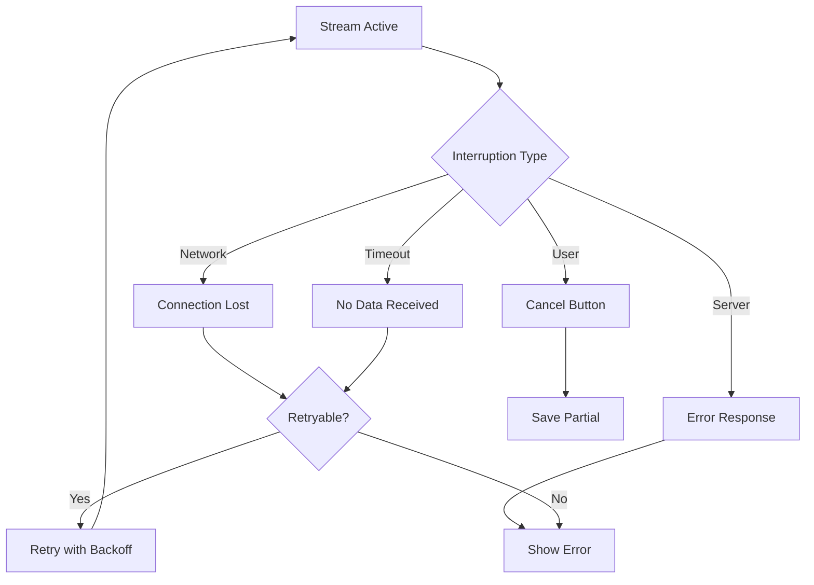

# Handling Stream Interruptions

## Introduction

Streams can be interrupted by network failures, user cancellation, or server issues. This lesson covers robust error handling patterns, the AbortController API, and strategies for recovering from or gracefully handling partial responses.

### What We'll Cover

- Network error recovery
- User cancellation with AbortController
- Partial response handling
- Retry strategies for streams
- Graceful degradation patterns

### Prerequisites

- Stream termination basics
- JavaScript async patterns

---

## Types of Interruptions



---

## AbortController Fundamentals

### Creating and Using

```javascript
const controller = new AbortController();
const signal = controller.signal;

// Pass signal to fetch
const response = await fetch(url, {
    method: "POST",
    signal: signal
});

// Later, to cancel:
controller.abort();
```

### Handling Abort in Stream

```javascript
async function streamWithAbort(url, signal) {
    const response = await fetch(url, { signal });
    const reader = response.body.getReader();
    
    try {
        while (true) {
            const { done, value } = await reader.read();
            if (done) break;
            
            // Check if aborted during processing
            if (signal.aborted) {
                throw new DOMException("Aborted", "AbortError");
            }
            
            processChunk(value);
        }
    } catch (error) {
        if (error.name === "AbortError") {
            console.log("Stream cancelled by user");
            return { cancelled: true };
        }
        throw error;
    } finally {
        reader.releaseLock();
    }
}
```

---

## User Cancellation UI Pattern

```javascript
class CancellableStream {
    constructor(options = {}) {
        this.onCancel = options.onCancel || (() => {});
        this.controller = null;
        this.content = "";
    }
    
    async stream(url, body) {
        this.controller = new AbortController();
        
        try {
            const response = await fetch(url, {
                method: "POST",
                headers: { "Content-Type": "application/json" },
                body: JSON.stringify(body),
                signal: this.controller.signal
            });
            
            for await (const chunk of this.readStream(response)) {
                this.content += chunk;
                yield chunk;
            }
            
        } catch (error) {
            if (error.name === "AbortError") {
                this.onCancel(this.content);
                return;
            }
            throw error;
        } finally {
            this.controller = null;
        }
    }
    
    cancel() {
        if (this.controller) {
            this.controller.abort();
        }
    }
    
    async *readStream(response) {
        const reader = response.body.getReader();
        const decoder = new TextDecoder();
        
        try {
            while (true) {
                const { done, value } = await reader.read();
                if (done) break;
                yield decoder.decode(value, { stream: true });
            }
        } finally {
            reader.releaseLock();
        }
    }
}

// UI Integration
const streamClient = new CancellableStream({
    onCancel: (partial) => {
        console.log("Cancelled with partial content:", partial);
        savePartial(partial);
    }
});

// Cancel button handler
cancelButton.addEventListener("click", () => {
    streamClient.cancel();
});
```

---

## Network Error Recovery

### Detecting Network Errors

```javascript
function isNetworkError(error) {
    return (
        error.name === "TypeError" ||  // Failed to fetch
        error.message.includes("network") ||
        error.message.includes("Failed to fetch") ||
        error.message.includes("Network request failed")
    );
}

function isRetryableError(error) {
    // Network errors are retryable
    if (isNetworkError(error)) return true;
    
    // Certain HTTP status codes are retryable
    if (error.status) {
        return [408, 429, 500, 502, 503, 504].includes(error.status);
    }
    
    return false;
}
```

### Retry with Exponential Backoff

```javascript
async function streamWithRetry(url, body, options = {}) {
    const maxRetries = options.maxRetries || 3;
    const baseDelay = options.baseDelay || 1000;
    
    let lastError;
    let partialContent = "";
    
    for (let attempt = 0; attempt <= maxRetries; attempt++) {
        try {
            const response = await fetch(url, {
                method: "POST",
                headers: { "Content-Type": "application/json" },
                body: JSON.stringify(body)
            });
            
            if (!response.ok) {
                const error = new Error(`HTTP ${response.status}`);
                error.status = response.status;
                throw error;
            }
            
            // Process stream
            for await (const chunk of readStream(response)) {
                partialContent += chunk;
                yield chunk;
            }
            
            // Success - exit retry loop
            return;
            
        } catch (error) {
            lastError = error;
            
            // Check if retryable
            if (!isRetryableError(error) || attempt === maxRetries) {
                throw error;
            }
            
            // Calculate backoff delay
            const delay = baseDelay * Math.pow(2, attempt);
            const jitter = Math.random() * 1000;
            
            console.log(`Retry ${attempt + 1}/${maxRetries} in ${delay}ms...`);
            await new Promise(r => setTimeout(r, delay + jitter));
        }
    }
    
    throw lastError;
}
```

---

## Partial Response Handling

### Saving Partial Content

```javascript
class PartialResponseHandler {
    constructor(storageKey = "partial_response") {
        this.storageKey = storageKey;
    }
    
    save(content, metadata = {}) {
        const data = {
            content,
            metadata,
            timestamp: Date.now()
        };
        localStorage.setItem(this.storageKey, JSON.stringify(data));
    }
    
    load() {
        const stored = localStorage.getItem(this.storageKey);
        if (!stored) return null;
        
        try {
            const data = JSON.parse(stored);
            
            // Check if expired (24 hours)
            if (Date.now() - data.timestamp > 24 * 60 * 60 * 1000) {
                this.clear();
                return null;
            }
            
            return data;
        } catch {
            return null;
        }
    }
    
    clear() {
        localStorage.removeItem(this.storageKey);
    }
}

// Usage
const partialHandler = new PartialResponseHandler();

async function streamWithPartialRecovery(url, body) {
    let content = "";
    
    // Check for previous partial
    const partial = partialHandler.load();
    if (partial) {
        const resume = confirm("Resume previous response?");
        if (resume) {
            content = partial.content;
            displayContent(content);
        }
    }
    
    try {
        for await (const chunk of streamRequest(url, body)) {
            content += chunk;
            displayContent(content);
            
            // Periodically save
            if (content.length % 1000 < 50) {
                partialHandler.save(content);
            }
        }
        
        // Complete - clear partial
        partialHandler.clear();
        
    } catch (error) {
        // Save partial on error
        partialHandler.save(content, {
            error: error.message,
            prompt: body.prompt
        });
        throw error;
    }
}
```

### Intelligent Partial Display

```javascript
class SmartPartialDisplay {
    constructor(element) {
        this.element = element;
    }
    
    display(content, isPartial = false) {
        // Find natural break point for partial content
        let displayContent = content;
        let suffix = "";
        
        if (isPartial) {
            displayContent = this.findNaturalBreak(content);
            if (displayContent.length < content.length) {
                suffix = "...";
            }
        }
        
        this.element.innerHTML = `
            ${this.formatContent(displayContent)}
            ${suffix}
            ${isPartial ? this.partialIndicator() : ""}
        `;
    }
    
    findNaturalBreak(content) {
        // Try to break at sentence end
        const sentences = content.match(/[^.!?]*[.!?]+/g) || [];
        if (sentences.length > 0) {
            return sentences.join("");
        }
        
        // Try to break at paragraph
        const lastPara = content.lastIndexOf("\n\n");
        if (lastPara > content.length * 0.5) {
            return content.slice(0, lastPara);
        }
        
        // Try to break at word boundary
        const lastSpace = content.lastIndexOf(" ");
        if (lastSpace > content.length * 0.8) {
            return content.slice(0, lastSpace);
        }
        
        return content;
    }
    
    formatContent(content) {
        return content.replace(/\n/g, "<br>");
    }
    
    partialIndicator() {
        return `
            <div class="partial-indicator">
                <span class="badge">Partial Response</span>
                <span>Stream was interrupted</span>
            </div>
        `;
    }
}
```

---

## Timeout Handling

### Stream Inactivity Timeout

```javascript
class StreamWithTimeout {
    constructor(options = {}) {
        this.inactivityTimeout = options.inactivityTimeout || 30000;
        this.totalTimeout = options.totalTimeout || 300000;
        this.timeoutId = null;
        this.totalTimeoutId = null;
    }
    
    async *stream(response) {
        const reader = response.body.getReader();
        const decoder = new TextDecoder();
        
        // Set total timeout
        this.totalTimeoutId = setTimeout(() => {
            reader.cancel("Total timeout exceeded");
        }, this.totalTimeout);
        
        try {
            while (true) {
                // Reset inactivity timeout
                this.resetInactivityTimeout(reader);
                
                const { done, value } = await reader.read();
                
                if (done) break;
                
                yield decoder.decode(value, { stream: true });
            }
        } finally {
            this.clearTimeouts();
            reader.releaseLock();
        }
    }
    
    resetInactivityTimeout(reader) {
        if (this.timeoutId) {
            clearTimeout(this.timeoutId);
        }
        
        this.timeoutId = setTimeout(() => {
            reader.cancel("Inactivity timeout");
        }, this.inactivityTimeout);
    }
    
    clearTimeouts() {
        if (this.timeoutId) clearTimeout(this.timeoutId);
        if (this.totalTimeoutId) clearTimeout(this.totalTimeoutId);
    }
}
```

### Python Timeout Pattern

```python
import asyncio
from contextlib import asynccontextmanager

class TimeoutStream:
    def __init__(self, timeout: float = 30.0):
        self.timeout = timeout
    
    @asynccontextmanager
    async def with_timeout(self, async_gen):
        """Wrap async generator with timeout per chunk."""
        try:
            async for item in async_gen:
                try:
                    yield await asyncio.wait_for(
                        asyncio.coroutine(lambda: item)(),
                        timeout=self.timeout
                    )
                except asyncio.TimeoutError:
                    raise TimeoutError(f"No data received for {self.timeout}s")
        finally:
            pass

# Usage
async def stream_with_timeout():
    stream = client.responses.create(
        model="gpt-4.1",
        input="Write a long story",
        stream=True
    )
    
    timeout_handler = TimeoutStream(timeout=30.0)
    
    try:
        async with timeout_handler.with_timeout(stream) as timed_stream:
            async for event in timed_stream:
                print(event.delta, end="")
    except TimeoutError as e:
        print(f"\nStream timed out: {e}")
```

---

## Graceful Degradation

### Fallback to Non-Streaming

```javascript
async function smartRequest(url, body, options = {}) {
    const preferStream = options.stream !== false;
    
    if (preferStream) {
        try {
            // Try streaming first
            return await streamRequest(url, { ...body, stream: true });
        } catch (error) {
            console.warn("Streaming failed, falling back:", error);
            // Fall through to non-streaming
        }
    }
    
    // Non-streaming fallback
    const response = await fetch(url, {
        method: "POST",
        headers: { "Content-Type": "application/json" },
        body: JSON.stringify({ ...body, stream: false })
    });
    
    const data = await response.json();
    return { content: data.output_text, streamed: false };
}
```

### Progressive Fallback Chain

```python
class ResilientClient:
    def __init__(self, client):
        self.client = client
        self.fallback_order = ["stream", "normal", "smaller_model"]
    
    def request(self, **kwargs):
        errors = []
        
        for strategy in self.fallback_order:
            try:
                return self._execute_strategy(strategy, kwargs)
            except Exception as e:
                errors.append((strategy, str(e)))
                continue
        
        raise Exception(f"All strategies failed: {errors}")
    
    def _execute_strategy(self, strategy: str, kwargs: dict):
        if strategy == "stream":
            return self._streaming_request(kwargs)
        elif strategy == "normal":
            return self._normal_request(kwargs)
        elif strategy == "smaller_model":
            return self._smaller_model_request(kwargs)
    
    def _streaming_request(self, kwargs):
        stream = self.client.responses.create(
            stream=True,
            **kwargs
        )
        
        content = ""
        for event in stream:
            if event.type == "response.output_text.delta":
                content += event.delta
        
        return {"content": content, "strategy": "stream"}
    
    def _normal_request(self, kwargs):
        response = self.client.responses.create(
            stream=False,
            **kwargs
        )
        return {"content": response.output_text, "strategy": "normal"}
    
    def _smaller_model_request(self, kwargs):
        modified_kwargs = {**kwargs}
        modified_kwargs["model"] = "gpt-4.1-mini"  # Fallback model
        
        response = self.client.responses.create(
            stream=False,
            **modified_kwargs
        )
        return {"content": response.output_text, "strategy": "smaller_model"}
```

---

## Complete Error Handler

```javascript
class StreamErrorHandler {
    constructor(options = {}) {
        this.maxRetries = options.maxRetries || 3;
        this.onRetry = options.onRetry || (() => {});
        this.onPartial = options.onPartial || (() => {});
        this.onError = options.onError || console.error;
    }
    
    async handle(streamFn) {
        let attempt = 0;
        let partialContent = "";
        
        while (attempt <= this.maxRetries) {
            const controller = new AbortController();
            
            try {
                for await (const chunk of streamFn(controller.signal)) {
                    partialContent += chunk;
                    yield chunk;
                }
                
                // Success
                return;
                
            } catch (error) {
                const errorInfo = this.classifyError(error);
                
                if (errorInfo.cancelled) {
                    this.onPartial(partialContent);
                    return;
                }
                
                if (errorInfo.retryable && attempt < this.maxRetries) {
                    attempt++;
                    this.onRetry({
                        attempt,
                        error: errorInfo,
                        partial: partialContent
                    });
                    
                    await this.backoff(attempt);
                    continue;
                }
                
                // Non-retryable or max retries reached
                this.onError({
                    error: errorInfo,
                    partial: partialContent,
                    attempts: attempt + 1
                });
                
                throw error;
            }
        }
    }
    
    classifyError(error) {
        return {
            message: error.message,
            name: error.name,
            cancelled: error.name === "AbortError",
            network: this.isNetworkError(error),
            timeout: error.message?.includes("timeout"),
            retryable: this.isRetryable(error),
            status: error.status
        };
    }
    
    isNetworkError(error) {
        return (
            error.name === "TypeError" ||
            error.message?.toLowerCase().includes("network") ||
            error.message?.includes("Failed to fetch")
        );
    }
    
    isRetryable(error) {
        if (this.isNetworkError(error)) return true;
        if (error.status && [429, 500, 502, 503, 504].includes(error.status)) return true;
        if (error.message?.includes("timeout")) return true;
        return false;
    }
    
    async backoff(attempt) {
        const delay = Math.min(1000 * Math.pow(2, attempt), 30000);
        const jitter = Math.random() * 1000;
        await new Promise(r => setTimeout(r, delay + jitter));
    }
}

// Usage
const handler = new StreamErrorHandler({
    maxRetries: 3,
    onRetry: ({ attempt }) => console.log(`Retrying (${attempt}/3)...`),
    onPartial: (content) => savePartial(content),
    onError: ({ error, partial }) => {
        console.error("Stream failed:", error.message);
        if (partial) {
            displayPartial(partial);
        }
    }
});

for await (const chunk of handler.handle(myStreamFn)) {
    process.stdout.write(chunk);
}
```

---

## Hands-on Exercise

### Your Task

Build a `ResilientStreamClient` with automatic retry and user cancellation support.

### Requirements

1. Support AbortController cancellation
2. Retry on network errors with exponential backoff
3. Save and optionally resume partial content
4. Emit events for state changes

### Expected Result

```javascript
const client = new ResilientStreamClient({
    maxRetries: 3,
    savePartial: true
});

client.on("retry", ({ attempt }) => console.log(`Retry ${attempt}`));
client.on("partial", ({ content }) => console.log("Saved partial"));

const result = await client.stream(url, body);
```

<details>
<summary>💡 Hints</summary>

- Combine AbortController with retry logic
- Check signal.aborted before retrying
- Store partial content on each chunk
</details>

<details>
<summary>✅ Solution</summary>

```javascript
class ResilientStreamClient {
    constructor(options = {}) {
        this.maxRetries = options.maxRetries || 3;
        this.baseDelay = options.baseDelay || 1000;
        this.savePartial = options.savePartial || false;
        this.storageKey = options.storageKey || "resilient_stream_partial";
        
        this.listeners = new Map();
        this.controller = null;
    }
    
    on(event, callback) {
        if (!this.listeners.has(event)) {
            this.listeners.set(event, []);
        }
        this.listeners.get(event).push(callback);
        return this;
    }
    
    emit(event, data) {
        (this.listeners.get(event) || []).forEach(cb => cb(data));
    }
    
    async stream(url, body) {
        this.controller = new AbortController();
        
        let attempt = 0;
        let content = "";
        let lastError = null;
        
        while (attempt <= this.maxRetries) {
            try {
                // Check for cancellation before attempt
                if (this.controller.signal.aborted) {
                    this.emit("cancelled", { content });
                    return { cancelled: true, content };
                }
                
                const response = await fetch(url, {
                    method: "POST",
                    headers: { "Content-Type": "application/json" },
                    body: JSON.stringify(body),
                    signal: this.controller.signal
                });
                
                if (!response.ok) {
                    const error = new Error(`HTTP ${response.status}`);
                    error.status = response.status;
                    throw error;
                }
                
                this.emit("connected", { attempt });
                
                // Read stream
                const reader = response.body.getReader();
                const decoder = new TextDecoder();
                
                try {
                    while (true) {
                        const { done, value } = await reader.read();
                        if (done) break;
                        
                        const chunk = decoder.decode(value, { stream: true });
                        content += chunk;
                        
                        this.emit("chunk", { chunk, total: content.length });
                        
                        // Periodic save
                        if (this.savePartial && content.length % 500 < 50) {
                            this.saveContent(content);
                        }
                    }
                } finally {
                    reader.releaseLock();
                }
                
                // Success
                this.clearSavedContent();
                this.emit("complete", { content });
                return { success: true, content };
                
            } catch (error) {
                lastError = error;
                
                // Handle cancellation
                if (error.name === "AbortError") {
                    if (this.savePartial) {
                        this.saveContent(content);
                    }
                    this.emit("cancelled", { content });
                    return { cancelled: true, content };
                }
                
                // Check if retryable
                if (!this.isRetryable(error) || attempt >= this.maxRetries) {
                    if (this.savePartial) {
                        this.saveContent(content);
                    }
                    this.emit("error", { error, content, attempts: attempt + 1 });
                    throw error;
                }
                
                // Retry
                attempt++;
                const delay = this.calculateDelay(attempt);
                
                this.emit("retry", { 
                    attempt, 
                    maxRetries: this.maxRetries,
                    delay,
                    error: error.message 
                });
                
                await this.sleep(delay);
            }
        }
        
        throw lastError;
    }
    
    cancel() {
        if (this.controller) {
            this.controller.abort();
        }
    }
    
    isRetryable(error) {
        if (error.name === "TypeError") return true;
        if (error.message?.includes("network")) return true;
        if (error.status && [429, 500, 502, 503, 504].includes(error.status)) return true;
        return false;
    }
    
    calculateDelay(attempt) {
        const exponential = this.baseDelay * Math.pow(2, attempt - 1);
        const jitter = Math.random() * 1000;
        return Math.min(exponential + jitter, 30000);
    }
    
    sleep(ms) {
        return new Promise(r => setTimeout(r, ms));
    }
    
    saveContent(content) {
        try {
            localStorage.setItem(this.storageKey, JSON.stringify({
                content,
                timestamp: Date.now()
            }));
            this.emit("partial", { content, saved: true });
        } catch {}
    }
    
    loadSavedContent() {
        try {
            const saved = localStorage.getItem(this.storageKey);
            if (saved) {
                const data = JSON.parse(saved);
                // Expire after 1 hour
                if (Date.now() - data.timestamp < 3600000) {
                    return data.content;
                }
            }
        } catch {}
        return null;
    }
    
    clearSavedContent() {
        try {
            localStorage.removeItem(this.storageKey);
        } catch {}
    }
}

// Test
async function test() {
    const client = new ResilientStreamClient({
        maxRetries: 3,
        savePartial: true
    });
    
    client
        .on("connected", () => console.log("✅ Connected"))
        .on("chunk", ({ total }) => console.log(`📥 ${total} bytes`))
        .on("retry", ({ attempt, delay }) => 
            console.log(`🔄 Retry ${attempt} in ${delay}ms`))
        .on("partial", () => console.log("💾 Saved partial"))
        .on("complete", () => console.log("🎉 Complete"))
        .on("error", ({ error }) => console.log("❌ Error:", error.message));
    
    // Cancel button simulation
    setTimeout(() => {
        console.log("🛑 User cancelled");
        client.cancel();
    }, 5000);
    
    try {
        const result = await client.stream("/api/stream", { prompt: "Hello" });
        console.log("Result:", result);
    } catch (error) {
        console.error("Failed:", error.message);
    }
}
```

</details>

---

## Summary

✅ Use AbortController for user-initiated cancellation  
✅ Detect and classify errors (network, timeout, server)  
✅ Implement exponential backoff for retries  
✅ Save partial content for recovery options  
✅ Provide graceful degradation to non-streaming  
✅ Always cleanup resources even on error

**Next:** [Semantic Streaming Events](./08-semantic-events.md)

---

## Further Reading

- [AbortController](https://developer.mozilla.org/en-US/docs/Web/API/AbortController) — MDN reference
- [Fetch API Errors](https://developer.mozilla.org/en-US/docs/Web/API/Fetch_API/Using_Fetch#checking_that_the_fetch_was_successful) — Error handling
- [Retry Patterns](https://aws.amazon.com/blogs/architecture/exponential-backoff-and-jitter/) — AWS best practices

<!-- 
Sources Consulted:
- MDN AbortController: https://developer.mozilla.org/en-US/docs/Web/API/AbortController
- AWS Retry Patterns: https://aws.amazon.com/blogs/architecture/exponential-backoff-and-jitter/
-->
