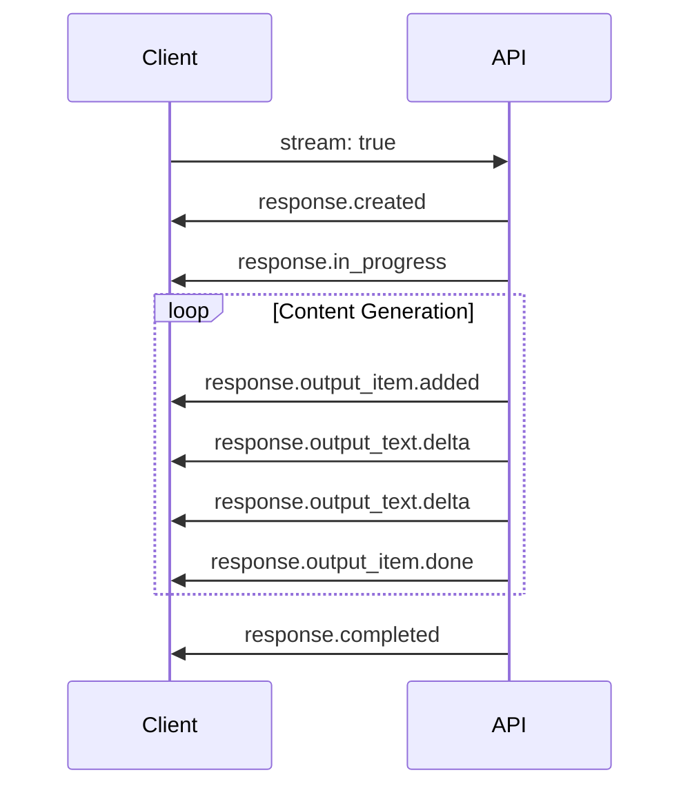

# Semantic Streaming Events

## Introduction

Modern AI APIs have evolved beyond simple text deltas to provide rich, semantic streaming events. These events carry structured meaning—response creation, content deltas, function calls, and completion signals—making stream handling more precise and feature-rich.

### What We'll Cover

- OpenAI Responses API event types
- Event lifecycle and ordering
- Handling text, tool, and reasoning events
- The `stream_options` parameter
- Error events in streams

### Prerequisites

- Basic streaming concepts
- Delta handling fundamentals

---

## Event-Driven Streaming



---

## OpenAI Responses API Events

### Core Event Types

| Event Type | Description |
|------------|-------------|
| `response.created` | Response object initialized |
| `response.in_progress` | Generation started |
| `response.output_item.added` | New output item (message, tool call) |
| `response.output_text.delta` | Text content chunk |
| `response.output_item.done` | Output item completed |
| `response.completed` | Full response finished |
| `response.failed` | Generation failed |
| `error` | Stream error occurred |

### Event Structure

```python
# response.created
{
    "type": "response.created",
    "response": {
        "id": "resp_abc123",
        "object": "response",
        "status": "in_progress",
        "model": "gpt-4.1"
    }
}

# response.output_text.delta
{
    "type": "response.output_text.delta",
    "item_id": "item_abc",
    "output_index": 0,
    "content_index": 0,
    "delta": "Hello"
}

# response.completed
{
    "type": "response.completed",
    "response": {
        "id": "resp_abc123",
        "status": "completed",
        "output": [...],
        "usage": {
            "input_tokens": 10,
            "output_tokens": 50
        }
    }
}
```

---

## Handling Semantic Events

### Basic Event Handler

```python
from openai import OpenAI

client = OpenAI()

stream = client.responses.create(
    model="gpt-4.1",
    input="Write a short poem",
    stream=True
)

for event in stream:
    match event.type:
        case "response.created":
            print(f"Started: {event.response.id}")
        
        case "response.output_text.delta":
            print(event.delta, end="", flush=True)
        
        case "response.completed":
            print(f"\nTokens: {event.response.usage.total_tokens}")
        
        case "error":
            print(f"Error: {event.error.message}")
```

### JavaScript Event Handler

```javascript
const stream = await openai.responses.create({
    model: "gpt-4.1",
    input: "Write a short poem",
    stream: true
});

for await (const event of stream) {
    switch (event.type) {
        case "response.created":
            console.log("Started:", event.response.id);
            break;
        
        case "response.output_text.delta":
            process.stdout.write(event.delta);
            break;
        
        case "response.output_item.added":
            console.log("\n[New item:", event.item.type, "]");
            break;
        
        case "response.output_item.done":
            console.log("[Item complete]");
            break;
        
        case "response.completed":
            console.log("\nCompleted:", event.response.usage.total_tokens, "tokens");
            break;
        
        case "response.failed":
            console.error("Failed:", event.response.error);
            break;
    }
}
```

---

## Function Call Events

### Tool Call Streaming Events

```python
# Tool call events in order:
# 1. response.output_item.added (type: function_call)
# 2. response.function_call_arguments.delta (multiple)
# 3. response.output_item.done

stream = client.responses.create(
    model="gpt-4.1",
    input="What's the weather in Paris?",
    tools=[{
        "type": "function",
        "function": {
            "name": "get_weather",
            "parameters": {"type": "object", "properties": {"location": {"type": "string"}}}
        }
    }],
    stream=True
)

tool_calls = {}

for event in stream:
    if event.type == "response.output_item.added":
        if event.item.type == "function_call":
            tool_calls[event.item.call_id] = {
                "name": event.item.name,
                "arguments": ""
            }
    
    elif event.type == "response.function_call_arguments.delta":
        # Accumulate argument chunks
        tool_calls[event.call_id]["arguments"] += event.delta
    
    elif event.type == "response.output_item.done":
        if event.item.type == "function_call":
            call = tool_calls[event.item.call_id]
            print(f"Tool call complete: {call['name']}({call['arguments']})")
```

### Complete Tool Call Handler

```javascript
class StreamingToolHandler {
    constructor() {
        this.toolCalls = new Map();
        this.textContent = "";
    }
    
    handleEvent(event) {
        switch (event.type) {
            case "response.output_item.added":
                this.handleItemAdded(event);
                break;
            
            case "response.output_text.delta":
                this.textContent += event.delta;
                break;
            
            case "response.function_call_arguments.delta":
                this.handleArgumentDelta(event);
                break;
            
            case "response.output_item.done":
                this.handleItemDone(event);
                break;
        }
    }
    
    handleItemAdded(event) {
        if (event.item.type === "function_call") {
            this.toolCalls.set(event.item.call_id, {
                name: event.item.name,
                arguments: "",
                status: "streaming"
            });
        }
    }
    
    handleArgumentDelta(event) {
        const call = this.toolCalls.get(event.call_id);
        if (call) {
            call.arguments += event.delta;
        }
    }
    
    handleItemDone(event) {
        if (event.item.type === "function_call") {
            const call = this.toolCalls.get(event.item.call_id);
            if (call) {
                call.status = "complete";
                call.parsedArguments = JSON.parse(call.arguments);
            }
        }
    }
    
    getCompletedToolCalls() {
        return Array.from(this.toolCalls.values())
            .filter(c => c.status === "complete");
    }
}
```

---

## Reasoning Events

### Streaming Reasoning Models

```python
stream = client.responses.create(
    model="o3",
    input="Solve: What is 15% of 240?",
    reasoning={"effort": "high", "summary": "detailed"},
    stream=True
)

reasoning_text = ""
answer_text = ""

for event in stream:
    if event.type == "response.reasoning.delta":
        reasoning_text += event.delta
        print(f"🤔 {event.delta}", end="")
    
    elif event.type == "response.output_text.delta":
        answer_text += event.delta
        print(f"💡 {event.delta}", end="")
    
    elif event.type == "response.reasoning.done":
        print(f"\n[Reasoning complete: {len(reasoning_text)} chars]")
```

### Structured Reasoning Handler

```javascript
class ReasoningStreamHandler {
    constructor(options = {}) {
        this.onReasoning = options.onReasoning || (() => {});
        this.onAnswer = options.onAnswer || (() => {});
        this.onComplete = options.onComplete || (() => {});
        
        this.reasoning = "";
        this.answer = "";
        this.phase = "waiting";
    }
    
    handleEvent(event) {
        switch (event.type) {
            case "response.output_item.added":
                if (event.item.type === "reasoning") {
                    this.phase = "reasoning";
                } else if (event.item.type === "message") {
                    this.phase = "answering";
                }
                break;
            
            case "response.reasoning.delta":
                this.reasoning += event.delta;
                this.onReasoning(event.delta, this.reasoning);
                break;
            
            case "response.output_text.delta":
                if (this.phase === "answering") {
                    this.answer += event.delta;
                    this.onAnswer(event.delta, this.answer);
                }
                break;
            
            case "response.completed":
                this.onComplete({
                    reasoning: this.reasoning,
                    answer: this.answer,
                    usage: event.response.usage
                });
                break;
        }
    }
}

// Usage
const handler = new ReasoningStreamHandler({
    onReasoning: (delta) => {
        reasoningDiv.textContent += delta;
    },
    onAnswer: (delta) => {
        answerDiv.textContent += delta;
    },
    onComplete: ({ usage }) => {
        console.log("Total tokens:", usage.total_tokens);
    }
});

for await (const event of stream) {
    handler.handleEvent(event);
}
```

---

## The `stream_options` Parameter

### Including Usage in Stream

By default, usage is only in the final event. Use `stream_options` to get it:

```python
stream = client.chat.completions.create(
    model="gpt-4o",
    messages=[{"role": "user", "content": "Hello"}],
    stream=True,
    stream_options={
        "include_usage": True
    }
)

for chunk in stream:
    if chunk.choices:
        delta = chunk.choices[0].delta
        if delta.content:
            print(delta.content, end="")
    
    # Usage appears in the final chunk
    if chunk.usage:
        print(f"\nUsage: {chunk.usage}")
```

### Responses API Stream Options

```python
stream = client.responses.create(
    model="gpt-4.1",
    input="Hello",
    stream=True
    # Usage automatically included in response.completed event
)
```

---

## Error Events

### Handling Stream Errors

```python
for event in stream:
    if event.type == "error":
        error = event.error
        print(f"Error code: {error.code}")
        print(f"Error message: {error.message}")
        
        # Handle specific error types
        if error.code == "rate_limit_exceeded":
            handle_rate_limit()
        elif error.code == "context_length_exceeded":
            handle_context_overflow()
        else:
            raise Exception(f"Stream error: {error.message}")
    
    elif event.type == "response.failed":
        print(f"Response failed: {event.response.error}")
        break
```

### Error Recovery Pattern

```javascript
async function streamWithErrorRecovery(params) {
    const results = [];
    let errorOccurred = false;
    
    try {
        const stream = await openai.responses.create({
            ...params,
            stream: true
        });
        
        for await (const event of stream) {
            switch (event.type) {
                case "response.output_text.delta":
                    results.push(event.delta);
                    break;
                
                case "error":
                    errorOccurred = true;
                    console.error("Stream error:", event.error);
                    
                    // Attempt to continue if partial content exists
                    if (results.length > 0) {
                        console.log("Returning partial content");
                        return {
                            content: results.join(""),
                            partial: true,
                            error: event.error
                        };
                    }
                    throw new Error(event.error.message);
                
                case "response.failed":
                    throw new Error(`Response failed: ${event.response.error?.message}`);
            }
        }
        
        return {
            content: results.join(""),
            partial: false
        };
        
    } catch (error) {
        if (results.length > 0) {
            return {
                content: results.join(""),
                partial: true,
                error: error.message
            };
        }
        throw error;
    }
}
```

---

## Complete Event State Machine

```javascript
class StreamStateMachine {
    constructor() {
        this.state = "idle";
        this.response = null;
        this.items = [];
        this.currentItem = null;
        this.content = "";
    }
    
    transition(event) {
        const transitions = {
            idle: {
                "response.created": () => {
                    this.state = "created";
                    this.response = event.response;
                }
            },
            created: {
                "response.in_progress": () => {
                    this.state = "generating";
                }
            },
            generating: {
                "response.output_item.added": () => {
                    this.currentItem = {
                        id: event.item.id,
                        type: event.item.type,
                        content: ""
                    };
                    this.items.push(this.currentItem);
                },
                "response.output_text.delta": () => {
                    if (this.currentItem) {
                        this.currentItem.content += event.delta;
                    }
                    this.content += event.delta;
                },
                "response.function_call_arguments.delta": () => {
                    if (this.currentItem) {
                        this.currentItem.content += event.delta;
                    }
                },
                "response.output_item.done": () => {
                    if (this.currentItem) {
                        this.currentItem.complete = true;
                    }
                },
                "response.completed": () => {
                    this.state = "completed";
                    this.response = event.response;
                },
                "response.failed": () => {
                    this.state = "failed";
                    this.error = event.response.error;
                },
                "error": () => {
                    this.state = "error";
                    this.error = event.error;
                }
            }
        };
        
        const handler = transitions[this.state]?.[event.type];
        if (handler) {
            handler();
        }
        
        return this.state;
    }
    
    getResult() {
        return {
            state: this.state,
            responseId: this.response?.id,
            content: this.content,
            items: this.items,
            usage: this.response?.usage,
            error: this.error
        };
    }
}

// Usage
const sm = new StreamStateMachine();

for await (const event of stream) {
    sm.transition(event);
    
    if (event.type === "response.output_text.delta") {
        process.stdout.write(event.delta);
    }
}

console.log("\nFinal state:", sm.getResult());
```

---

## Hands-on Exercise

### Your Task

Build an event aggregator that collects and summarizes all events from a stream.

### Requirements

1. Track all event types received
2. Count occurrences of each type
3. Measure time between events
4. Provide summary statistics

### Expected Result

```javascript
const aggregator = new EventAggregator();

for await (const event of stream) {
    aggregator.record(event);
}

console.log(aggregator.getSummary());
// {
//   totalEvents: 45,
//   byType: { "response.output_text.delta": 42, ... },
//   duration: 3250,
//   avgInterval: 72
// }
```

<details>
<summary>💡 Hints</summary>

- Use `Date.now()` for timing
- Keep a running count per event type
- Calculate intervals between consecutive events
</details>

<details>
<summary>✅ Solution</summary>

```javascript
class EventAggregator {
    constructor() {
        this.events = [];
        this.byType = new Map();
        this.startTime = null;
        this.endTime = null;
        this.intervals = [];
        this.lastEventTime = null;
    }
    
    record(event) {
        const now = Date.now();
        
        // Track first event
        if (!this.startTime) {
            this.startTime = now;
        }
        this.endTime = now;
        
        // Track interval
        if (this.lastEventTime) {
            this.intervals.push(now - this.lastEventTime);
        }
        this.lastEventTime = now;
        
        // Store event
        this.events.push({
            type: event.type,
            timestamp: now,
            data: event
        });
        
        // Count by type
        const count = this.byType.get(event.type) || 0;
        this.byType.set(event.type, count + 1);
    }
    
    getSummary() {
        const duration = this.endTime - this.startTime;
        const avgInterval = this.intervals.length > 0
            ? this.intervals.reduce((a, b) => a + b, 0) / this.intervals.length
            : 0;
        
        return {
            totalEvents: this.events.length,
            byType: Object.fromEntries(this.byType),
            duration,
            avgInterval: Math.round(avgInterval),
            minInterval: this.intervals.length > 0 ? Math.min(...this.intervals) : 0,
            maxInterval: this.intervals.length > 0 ? Math.max(...this.intervals) : 0,
            eventsPerSecond: duration > 0 ? (this.events.length / duration * 1000).toFixed(2) : 0
        };
    }
    
    getEventsByType(type) {
        return this.events.filter(e => e.type === type);
    }
    
    getTimeline() {
        return this.events.map(e => ({
            type: e.type,
            relativeTime: e.timestamp - this.startTime
        }));
    }
    
    // Get content extraction for delta events
    extractContent() {
        return this.events
            .filter(e => e.type === "response.output_text.delta")
            .map(e => e.data.delta)
            .join("");
    }
}

// Test
async function test() {
    const aggregator = new EventAggregator();
    
    const stream = await openai.responses.create({
        model: "gpt-4.1",
        input: "Write a haiku about coding",
        stream: true
    });
    
    for await (const event of stream) {
        aggregator.record(event);
        
        if (event.type === "response.output_text.delta") {
            process.stdout.write(event.delta);
        }
    }
    
    console.log("\n\n=== Event Summary ===");
    console.log(JSON.stringify(aggregator.getSummary(), null, 2));
    
    console.log("\n=== Timeline ===");
    console.log(aggregator.getTimeline().slice(0, 5));
    
    console.log("\n=== Content ===");
    console.log(aggregator.extractContent());
}

test();
```

</details>

---

## Summary

✅ Semantic events provide structured streaming information  
✅ Key events: `response.created`, `response.output_text.delta`, `response.completed`  
✅ Tool calls stream with `function_call_arguments.delta` events  
✅ Reasoning models provide `reasoning.delta` events  
✅ Use `stream_options.include_usage` for token counts  
✅ Handle `error` and `response.failed` events gracefully

**Next:** [Streaming Function Calls](./09-streaming-function-calls.md)

---

## Further Reading

- [Responses API Streaming](https://platform.openai.com/docs/api-reference/responses-streaming) — OpenAI reference
- [Streaming Events](https://platform.openai.com/docs/guides/streaming) — Event documentation
- [Function Calling](https://platform.openai.com/docs/guides/function-calling) — Tool streaming

<!-- 
Sources Consulted:
- OpenAI Responses API: https://platform.openai.com/docs/api-reference/responses
- OpenAI Streaming: https://platform.openai.com/docs/guides/streaming
-->
