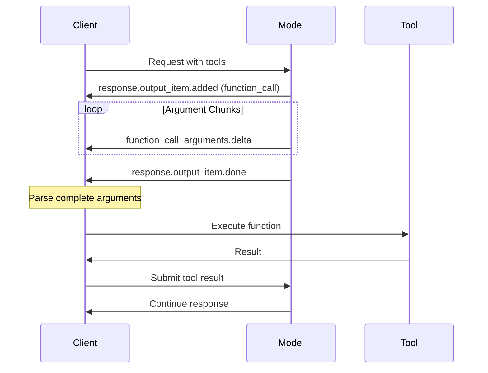

# Streaming Function Calls

## Introduction

When AI models call tools during streaming, the function name appears first, followed by argument chunks that must be accumulated before execution. This lesson covers streaming tool call patterns, parallel calls, and robust handling strategies.

### What We'll Cover

- Function call argument deltas
- Accumulating argument chunks
- Detecting function call completion
- Handling multiple parallel tool calls
- Executing tools during stream

### Prerequisites

- Semantic streaming events
- Function calling basics

---

## Tool Call Streaming Flow



---

## Basic Tool Call Streaming

### Chat Completions Format

```python
from openai import OpenAI
import json

client = OpenAI()

stream = client.chat.completions.create(
    model="gpt-4o",
    messages=[{"role": "user", "content": "What's the weather in Paris and London?"}],
    tools=[{
        "type": "function",
        "function": {
            "name": "get_weather",
            "parameters": {
                "type": "object",
                "properties": {"location": {"type": "string"}},
                "required": ["location"]
            }
        }
    }],
    stream=True
)

tool_calls = {}

for chunk in stream:
    delta = chunk.choices[0].delta
    
    if delta.tool_calls:
        for tc in delta.tool_calls:
            idx = tc.index
            
            # Initialize tool call on first appearance
            if idx not in tool_calls:
                tool_calls[idx] = {
                    "id": tc.id,
                    "name": tc.function.name,
                    "arguments": ""
                }
            
            # Accumulate argument deltas
            if tc.function.arguments:
                tool_calls[idx]["arguments"] += tc.function.arguments

# Parse and execute
for idx, call in tool_calls.items():
    args = json.loads(call["arguments"])
    print(f"Execute: {call['name']}({args})")
```

### Responses API Format

```python
stream = client.responses.create(
    model="gpt-4.1",
    input="What's the weather in Paris and London?",
    tools=[{
        "type": "function",
        "function": {
            "name": "get_weather",
            "parameters": {"type": "object", "properties": {"location": {"type": "string"}}}
        }
    }],
    stream=True
)

tool_calls = {}

for event in stream:
    if event.type == "response.output_item.added":
        if event.item.type == "function_call":
            tool_calls[event.item.call_id] = {
                "name": event.item.name,
                "arguments": "",
                "complete": False
            }
    
    elif event.type == "response.function_call_arguments.delta":
        if event.call_id in tool_calls:
            tool_calls[event.call_id]["arguments"] += event.delta
    
    elif event.type == "response.output_item.done":
        if event.item.type == "function_call":
            tool_calls[event.item.call_id]["complete"] = True
```

---

## Complete Tool Call Handler

```javascript
class StreamingToolCallHandler {
    constructor() {
        this.toolCalls = new Map();
        this.textContent = "";
        this.completedCalls = [];
    }
    
    handleEvent(event) {
        switch (event.type) {
            // Text content
            case "response.output_text.delta":
                this.textContent += event.delta;
                return { type: "text_delta", delta: event.delta };
            
            // Tool call started
            case "response.output_item.added":
                if (event.item.type === "function_call") {
                    this.toolCalls.set(event.item.call_id, {
                        id: event.item.call_id,
                        name: event.item.name,
                        arguments: "",
                        status: "streaming"
                    });
                    return { type: "tool_started", name: event.item.name };
                }
                break;
            
            // Argument chunk
            case "response.function_call_arguments.delta":
                const call = this.toolCalls.get(event.call_id);
                if (call) {
                    call.arguments += event.delta;
                    return { 
                        type: "tool_arguments_delta", 
                        callId: event.call_id,
                        delta: event.delta,
                        accumulated: call.arguments
                    };
                }
                break;
            
            // Tool call complete
            case "response.output_item.done":
                if (event.item.type === "function_call") {
                    const completedCall = this.toolCalls.get(event.item.call_id);
                    if (completedCall) {
                        completedCall.status = "complete";
                        try {
                            completedCall.parsedArguments = JSON.parse(completedCall.arguments);
                        } catch (e) {
                            completedCall.parseError = e.message;
                        }
                        this.completedCalls.push(completedCall);
                        return { type: "tool_complete", call: completedCall };
                    }
                }
                break;
        }
        
        return null;
    }
    
    getPendingCalls() {
        return Array.from(this.toolCalls.values())
            .filter(c => c.status === "streaming");
    }
    
    getCompletedCalls() {
        return this.completedCalls;
    }
    
    getTextContent() {
        return this.textContent;
    }
}
```

---

## Parallel Tool Calls

### Handling Multiple Simultaneous Calls

```python
from dataclasses import dataclass, field
from typing import Dict, List, Optional
import json

@dataclass
class StreamingToolCall:
    call_id: str
    name: str
    arguments: str = ""
    complete: bool = False
    parsed_args: Optional[dict] = None
    
    def add_delta(self, delta: str):
        self.arguments += delta
    
    def finalize(self):
        self.complete = True
        try:
            self.parsed_args = json.loads(self.arguments)
        except json.JSONDecodeError:
            self.parsed_args = None

class ParallelToolHandler:
    def __init__(self):
        self.calls: Dict[str, StreamingToolCall] = {}
        self.order: List[str] = []  # Track order for execution
    
    def handle_event(self, event) -> Optional[str]:
        if event.type == "response.output_item.added":
            if event.item.type == "function_call":
                call_id = event.item.call_id
                self.calls[call_id] = StreamingToolCall(
                    call_id=call_id,
                    name=event.item.name
                )
                self.order.append(call_id)
                return f"Tool call started: {event.item.name}"
        
        elif event.type == "response.function_call_arguments.delta":
            if event.call_id in self.calls:
                self.calls[event.call_id].add_delta(event.delta)
        
        elif event.type == "response.output_item.done":
            if event.item.type == "function_call":
                if event.item.call_id in self.calls:
                    self.calls[event.item.call_id].finalize()
                    return f"Tool call complete: {event.item.name}"
        
        return None
    
    def get_ready_calls(self) -> List[StreamingToolCall]:
        """Get all completed calls ready for execution."""
        return [c for c in self.calls.values() if c.complete]
    
    def execute_all(self, executor: callable):
        """Execute all ready calls and return results."""
        results = []
        for call in self.get_ready_calls():
            if call.parsed_args is not None:
                result = executor(call.name, call.parsed_args)
                results.append({
                    "call_id": call.call_id,
                    "name": call.name,
                    "result": result
                })
        return results

# Usage
handler = ParallelToolHandler()

for event in stream:
    status = handler.handle_event(event)
    if status:
        print(status)

# Execute all tool calls
def execute_tool(name: str, args: dict):
    if name == "get_weather":
        return {"temperature": 72, "condition": "sunny"}
    return {"error": "Unknown tool"}

results = handler.execute_all(execute_tool)
print("Results:", results)
```

---

## Progressive Tool Execution

### Execute Tools As They Complete

```javascript
class ProgressiveToolExecutor {
    constructor(options = {}) {
        this.executors = options.executors || {};
        this.pendingCalls = new Map();
        this.results = new Map();
        this.onResult = options.onResult || (() => {});
    }
    
    async handleEvent(event) {
        if (event.type === "response.output_item.added" && 
            event.item.type === "function_call") {
            
            this.pendingCalls.set(event.item.call_id, {
                name: event.item.name,
                arguments: ""
            });
        }
        
        else if (event.type === "response.function_call_arguments.delta") {
            const call = this.pendingCalls.get(event.call_id);
            if (call) {
                call.arguments += event.delta;
            }
        }
        
        else if (event.type === "response.output_item.done" &&
                 event.item.type === "function_call") {
            
            const call = this.pendingCalls.get(event.item.call_id);
            if (call) {
                // Execute immediately when complete
                await this.executeCall(event.item.call_id, call);
            }
        }
    }
    
    async executeCall(callId, call) {
        const executor = this.executors[call.name];
        
        if (!executor) {
            this.results.set(callId, {
                error: `No executor for ${call.name}`
            });
            return;
        }
        
        try {
            const args = JSON.parse(call.arguments);
            const result = await executor(args);
            
            this.results.set(callId, {
                success: true,
                result
            });
            
            this.onResult(callId, call.name, result);
            
        } catch (error) {
            this.results.set(callId, {
                success: false,
                error: error.message
            });
        }
        
        this.pendingCalls.delete(callId);
    }
    
    getAllResults() {
        return Object.fromEntries(this.results);
    }
}

// Usage
const executor = new ProgressiveToolExecutor({
    executors: {
        get_weather: async ({ location }) => {
            // Simulate API call
            await new Promise(r => setTimeout(r, 500));
            return { temp: 72, condition: "sunny", location };
        },
        get_time: async ({ timezone }) => {
            return { time: new Date().toISOString(), timezone };
        }
    },
    onResult: (callId, name, result) => {
        console.log(`✓ ${name} completed:`, result);
    }
});

for await (const event of stream) {
    await executor.handleEvent(event);
    
    if (event.type === "response.output_text.delta") {
        process.stdout.write(event.delta);
    }
}

console.log("\nAll results:", executor.getAllResults());
```

---

## Submitting Tool Results

### Continuing After Tool Execution

```python
# First stream - get tool calls
stream = client.responses.create(
    model="gpt-4.1",
    input="What's the weather in Paris?",
    tools=[weather_tool],
    stream=True
)

# Collect tool calls
handler = ParallelToolHandler()
for event in stream:
    handler.handle_event(event)

# Execute tools
tool_outputs = []
for call in handler.get_ready_calls():
    result = execute_weather(call.parsed_args["location"])
    tool_outputs.append({
        "call_id": call.call_id,
        "output": json.dumps(result)
    })

# Continue with tool results
continuation = client.responses.create(
    model="gpt-4.1",
    previous_response_id=stream.response.id,  # Link to previous
    input=tool_outputs,  # Tool results
    stream=True
)

for event in continuation:
    if event.type == "response.output_text.delta":
        print(event.delta, end="")
```

### JavaScript Tool Result Submission

```javascript
async function executeToolsAndContinue(initialStream, executeTools) {
    // Collect tool calls from stream
    const handler = new StreamingToolCallHandler();
    let responseId = null;
    
    for await (const event of initialStream) {
        handler.handleEvent(event);
        
        if (event.type === "response.created") {
            responseId = event.response.id;
        }
        
        if (event.type === "response.output_text.delta") {
            process.stdout.write(event.delta);
        }
    }
    
    const toolCalls = handler.getCompletedCalls();
    
    // If no tool calls, we're done
    if (toolCalls.length === 0) {
        return handler.getTextContent();
    }
    
    // Execute tools
    const toolOutputs = await Promise.all(
        toolCalls.map(async (call) => {
            const result = await executeTools(call.name, call.parsedArguments);
            return {
                call_id: call.id,
                output: JSON.stringify(result)
            };
        })
    );
    
    // Continue stream with results
    const continuation = await openai.responses.create({
        model: "gpt-4.1",
        previous_response_id: responseId,
        input: toolOutputs,
        stream: true
    });
    
    let finalContent = handler.getTextContent();
    
    for await (const event of continuation) {
        if (event.type === "response.output_text.delta") {
            finalContent += event.delta;
            process.stdout.write(event.delta);
        }
    }
    
    return finalContent;
}
```

---

## Handling Tool Call Errors

```javascript
class RobustToolHandler {
    constructor(options = {}) {
        this.calls = new Map();
        this.timeout = options.timeout || 30000;
        this.onError = options.onError || console.error;
    }
    
    handleEvent(event) {
        if (event.type === "response.output_item.added" &&
            event.item.type === "function_call") {
            
            this.calls.set(event.item.call_id, {
                id: event.item.call_id,
                name: event.item.name,
                arguments: "",
                startTime: Date.now()
            });
        }
        
        else if (event.type === "response.function_call_arguments.delta") {
            const call = this.calls.get(event.call_id);
            if (call) {
                call.arguments += event.delta;
            }
        }
        
        else if (event.type === "response.output_item.done" &&
                 event.item.type === "function_call") {
            
            const call = this.calls.get(event.item.call_id);
            if (call) {
                call.complete = true;
                this.parseArguments(call);
            }
        }
    }
    
    parseArguments(call) {
        try {
            call.parsedArgs = JSON.parse(call.arguments);
            call.parseError = null;
        } catch (error) {
            call.parseError = error.message;
            this.onError({
                type: "parse_error",
                callId: call.id,
                name: call.name,
                arguments: call.arguments,
                error: error.message
            });
        }
    }
    
    async executeWithTimeout(call, executor) {
        const timeoutPromise = new Promise((_, reject) => {
            setTimeout(() => reject(new Error("Tool execution timeout")), this.timeout);
        });
        
        try {
            const result = await Promise.race([
                executor(call.name, call.parsedArgs),
                timeoutPromise
            ]);
            
            return { success: true, result };
            
        } catch (error) {
            this.onError({
                type: "execution_error",
                callId: call.id,
                name: call.name,
                error: error.message
            });
            
            return { 
                success: false, 
                error: error.message,
                // Provide fallback for model
                result: { error: `Tool ${call.name} failed: ${error.message}` }
            };
        }
    }
    
    getCallsWithErrors() {
        return Array.from(this.calls.values())
            .filter(c => c.parseError || c.executionError);
    }
}
```

---

## Hands-on Exercise

### Your Task

Build a streaming tool executor that handles multiple parallel tool calls with progress tracking.

### Requirements

1. Track tool call progress as arguments stream
2. Execute tools in parallel when complete
3. Show progress percentage for each call
4. Handle execution errors gracefully

### Expected Result

```javascript
const executor = new ProgressTrackingExecutor({ executors: {...} });

for await (const event of stream) {
    const update = executor.handleEvent(event);
    if (update) {
        console.log(`[${update.callId}] ${update.progress}%`);
    }
}

// Output:
// [call_1] 25%
// [call_1] 50%
// [call_2] 10%
// [call_1] 100% - Executing...
// [call_2] 50%
// [call_1] ✓ Complete
```

<details>
<summary>💡 Hints</summary>

- Estimate progress by argument length vs expected
- Use Promise.all for parallel execution
- Track state per call
</details>

<details>
<summary>✅ Solution</summary>

```javascript
class ProgressTrackingExecutor {
    constructor(options = {}) {
        this.executors = options.executors || {};
        this.expectedArgLength = options.expectedArgLength || 100;
        this.calls = new Map();
        this.onProgress = options.onProgress || (() => {});
    }
    
    handleEvent(event) {
        if (event.type === "response.output_item.added" &&
            event.item.type === "function_call") {
            
            const callId = event.item.call_id;
            this.calls.set(callId, {
                id: callId,
                name: event.item.name,
                arguments: "",
                progress: 0,
                status: "streaming"
            });
            
            return {
                callId,
                name: event.item.name,
                progress: 0,
                status: "started"
            };
        }
        
        if (event.type === "response.function_call_arguments.delta") {
            const call = this.calls.get(event.call_id);
            if (call) {
                call.arguments += event.delta;
                
                // Estimate progress based on argument length
                const progress = Math.min(
                    99,
                    Math.round((call.arguments.length / this.expectedArgLength) * 100)
                );
                
                if (progress !== call.progress) {
                    call.progress = progress;
                    
                    const update = {
                        callId: event.call_id,
                        name: call.name,
                        progress,
                        status: "streaming"
                    };
                    
                    this.onProgress(update);
                    return update;
                }
            }
        }
        
        if (event.type === "response.output_item.done" &&
            event.item.type === "function_call") {
            
            const call = this.calls.get(event.item.call_id);
            if (call) {
                call.progress = 100;
                call.status = "complete";
                
                // Parse arguments
                try {
                    call.parsedArgs = JSON.parse(call.arguments);
                } catch (e) {
                    call.parseError = e.message;
                    call.status = "error";
                }
                
                const update = {
                    callId: event.item.call_id,
                    name: call.name,
                    progress: 100,
                    status: call.status
                };
                
                this.onProgress(update);
                return update;
            }
        }
        
        return null;
    }
    
    async executeAll() {
        const completeCalls = Array.from(this.calls.values())
            .filter(c => c.status === "complete" && c.parsedArgs);
        
        const executions = completeCalls.map(async (call) => {
            const executor = this.executors[call.name];
            
            if (!executor) {
                call.result = { error: `Unknown tool: ${call.name}` };
                call.status = "failed";
                return call;
            }
            
            call.status = "executing";
            this.onProgress({
                callId: call.id,
                name: call.name,
                progress: 100,
                status: "executing"
            });
            
            try {
                call.result = await executor(call.parsedArgs);
                call.status = "success";
            } catch (error) {
                call.result = { error: error.message };
                call.status = "failed";
            }
            
            this.onProgress({
                callId: call.id,
                name: call.name,
                progress: 100,
                status: call.status
            });
            
            return call;
        });
        
        return Promise.all(executions);
    }
    
    getToolOutputs() {
        return Array.from(this.calls.values())
            .filter(c => c.result)
            .map(c => ({
                call_id: c.id,
                output: JSON.stringify(c.result)
            }));
    }
}

// Test
async function test() {
    const executor = new ProgressTrackingExecutor({
        executors: {
            get_weather: async ({ location }) => {
                await new Promise(r => setTimeout(r, 500));
                return { temp: 72, location };
            },
            get_time: async ({ timezone }) => {
                await new Promise(r => setTimeout(r, 300));
                return { time: "12:00", timezone };
            }
        },
        onProgress: (update) => {
            const icon = update.status === "success" ? "✓" : 
                         update.status === "executing" ? "⏳" : "";
            console.log(`[${update.callId}] ${update.name}: ${update.progress}% ${icon}`);
        }
    });
    
    // Simulate events
    const events = [
        { type: "response.output_item.added", item: { type: "function_call", call_id: "c1", name: "get_weather" } },
        { type: "response.function_call_arguments.delta", call_id: "c1", delta: '{"locat' },
        { type: "response.function_call_arguments.delta", call_id: "c1", delta: 'ion":"Paris"}' },
        { type: "response.output_item.done", item: { type: "function_call", call_id: "c1" } },
        { type: "response.output_item.added", item: { type: "function_call", call_id: "c2", name: "get_time" } },
        { type: "response.function_call_arguments.delta", call_id: "c2", delta: '{"timezone":"UTC"}' },
        { type: "response.output_item.done", item: { type: "function_call", call_id: "c2" } }
    ];
    
    for (const event of events) {
        executor.handleEvent(event);
    }
    
    console.log("\n--- Executing tools ---");
    await executor.executeAll();
    
    console.log("\n--- Tool Outputs ---");
    console.log(executor.getToolOutputs());
}

test();
```

</details>

---

## Summary

✅ Tool calls stream with `output_item.added` followed by `function_call_arguments.delta`  
✅ Accumulate argument chunks until `output_item.done`  
✅ Handle multiple parallel tool calls with proper tracking  
✅ Execute tools progressively or after stream completes  
✅ Submit tool results with `previous_response_id` to continue  
✅ Handle parsing and execution errors gracefully

**Next:** [Advanced Streaming Patterns](./10-advanced-patterns.md)

---

## Further Reading

- [Function Calling](https://platform.openai.com/docs/guides/function-calling) — OpenAI guide
- [Parallel Tool Use](https://platform.openai.com/docs/guides/function-calling#parallel-function-calling) — Parallel calls
- [Streaming Events](https://platform.openai.com/docs/api-reference/responses-streaming) — Event reference

<!-- 
Sources Consulted:
- OpenAI Function Calling: https://platform.openai.com/docs/guides/function-calling
- OpenAI Streaming: https://platform.openai.com/docs/api-reference/responses-streaming
-->
