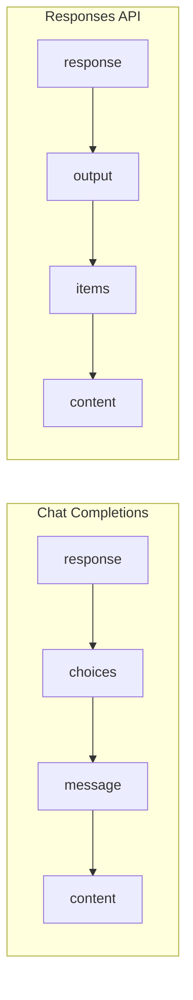

# Response Handling

## Introduction

Understanding API response structures is essential for building reliable AI applications. This lesson explores how to parse, validate, and extract useful data from completion responses across different providers.

### What We'll Cover

- Response structure anatomy (fields, arrays, objects)
- Token usage tracking and cost calculation
- Detailed usage breakdowns (cached, reasoning, audio)
- Finish reasons and their implications
- Handling incomplete responses
- Content extraction patterns
- Response metadata and annotations

### Prerequisites

- Completed basic completion lessons
- Understanding of JSON structures
- Familiarity with async/await

---

## Lesson Structure

This lesson is organized into the following topics:

| File | Topic | Description |
|------|-------|-------------|
| [01-response-anatomy.md](./01-response-anatomy.md) | Response Structure | Top-level fields, choices, output arrays |
| [02-token-usage.md](./02-token-usage.md) | Token Tracking | Usage counting and cost calculation |
| [03-usage-details.md](./03-usage-details.md) | Detailed Breakdowns | Cached, reasoning, audio tokens |
| [04-finish-reasons.md](./04-finish-reasons.md) | Finish Reasons | Stop, length, filter, tool_calls |
| [05-incomplete-responses.md](./05-incomplete-responses.md) | Incomplete Handling | Truncation detection and recovery |
| [06-content-extraction.md](./06-content-extraction.md) | Extraction Patterns | Safe navigation and validation |
| [07-response-metadata.md](./07-response-metadata.md) | Metadata Fields | Annotations, refusals, service tier |

---

## Response Comparison



---

## Quick Reference

### Chat Completions Response

```json
{
  "id": "chatcmpl-abc123",
  "object": "chat.completion",
  "created": 1234567890,
  "model": "gpt-4.1",
  "choices": [{
    "index": 0,
    "message": { "role": "assistant", "content": "Hello!" },
    "finish_reason": "stop"
  }],
  "usage": {
    "prompt_tokens": 10,
    "completion_tokens": 5,
    "total_tokens": 15
  }
}
```

### Responses API Output

```json
{
  "id": "resp_abc123",
  "object": "response",
  "created_at": 1234567890,
  "model": "gpt-4.1",
  "output": [{
    "type": "message",
    "role": "assistant",
    "content": [{ "type": "output_text", "text": "Hello!" }]
  }],
  "usage": {
    "input_tokens": 10,
    "output_tokens": 5,
    "total_tokens": 15
  }
}
```

---

## Navigation

**Next:** [Response Structure Anatomy](./01-response-anatomy.md)

**Unit:** [AI API Integration](../00-overview.md)
