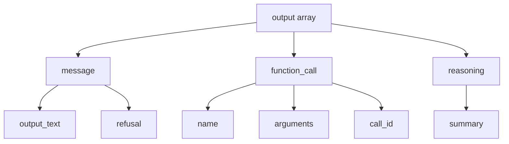

# Response Structure Anatomy

## Introduction

Every AI API response follows a specific structure. Understanding this anatomy lets you reliably extract content, check status, and handle edge cases. This lesson compares response formats across major providers.

### What We'll Cover

- Top-level response fields
- Choices array structure (Chat Completions)
- Output array structure (Responses API)
- Message vs delta objects
- Item types in responses

### Prerequisites

- Basic API request experience
- JSON parsing fundamentals

---

## Top-Level Response Fields

### Chat Completions Format

```json
{
  "id": "chatcmpl-BFxVQ3wsjtN7XKO85dXyLcTd0",
  "object": "chat.completion",
  "created": 1743123456,
  "model": "gpt-4.1-2025-04-14",
  "choices": [...],
  "usage": {...},
  "service_tier": "default"
}
```

| Field | Type | Description |
|-------|------|-------------|
| `id` | string | Unique identifier for this completion |
| `object` | string | Always `"chat.completion"` |
| `created` | integer | Unix timestamp when generated |
| `model` | string | Actual model used (may include version) |
| `choices` | array | Array of completion choices |
| `usage` | object | Token usage statistics |
| `service_tier` | string | `"default"` or `"scale"` tier used |

### Responses API Format

```json
{
  "id": "resp_67ccf18ef5fc8190b16dbee19bc54e5f",
  "object": "response",
  "created_at": 1741484430,
  "model": "gpt-4.1-2025-04-14",
  "output": [...],
  "usage": {...},
  "status": "completed",
  "error": null
}
```

| Field | Type | Description |
|-------|------|-------------|
| `id` | string | Unique response identifier (starts with `resp_`) |
| `object` | string | Always `"response"` |
| `created_at` | integer | Unix timestamp |
| `model` | string | Model version used |
| `output` | array | Array of output items |
| `status` | string | `"completed"`, `"failed"`, `"in_progress"` |
| `error` | object/null | Error details if failed |

---

## Choices Array (Chat Completions)

The `choices` array contains one or more completion options:

```python
from openai import OpenAI

client = OpenAI()

response = client.chat.completions.create(
    model="gpt-4.1",
    messages=[{"role": "user", "content": "Say hello"}],
    n=2  # Request 2 choices
)

for i, choice in enumerate(response.choices):
    print(f"Choice {i}: {choice.message.content}")
    print(f"  Finish reason: {choice.finish_reason}")
    print(f"  Index: {choice.index}")
```

### Choice Structure

```json
{
  "index": 0,
  "message": {
    "role": "assistant",
    "content": "Hello! How can I assist you today?",
    "refusal": null
  },
  "logprobs": null,
  "finish_reason": "stop"
}
```

| Field | Type | Description |
|-------|------|-------------|
| `index` | integer | Position in choices array |
| `message` | object | The assistant's message |
| `finish_reason` | string | Why generation stopped |
| `logprobs` | object/null | Token probabilities (if requested) |

---

## Output Array (Responses API)

The Responses API uses an `output` array with typed items:

```python
response = client.responses.create(
    model="gpt-4.1",
    input="Explain recursion"
)

for item in response.output:
    print(f"Type: {item.type}")
    
    if item.type == "message":
        for content in item.content:
            if content.type == "output_text":
                print(f"Text: {content.text}")
```

### Output Item Types



### Message Item

```json
{
  "type": "message",
  "id": "msg_abc123",
  "role": "assistant",
  "content": [
    {
      "type": "output_text",
      "text": "Recursion is when a function calls itself..."
    }
  ]
}
```

### Function Call Item

```json
{
  "type": "function_call",
  "id": "fc_abc123",
  "call_id": "call_xyz789",
  "name": "get_weather",
  "arguments": "{\"location\": \"Tokyo\"}"
}
```

### Reasoning Item

```json
{
  "type": "reasoning",
  "id": "rs_abc123",
  "summary": [
    {
      "type": "summary_text",
      "text": "I need to break down the recursion concept..."
    }
  ]
}
```

---

## Message vs Delta Objects

### Complete Message (Non-streaming)

```python
# Non-streaming returns complete message
response = client.chat.completions.create(
    model="gpt-4.1",
    messages=[{"role": "user", "content": "Hello"}],
    stream=False  # Default
)

message = response.choices[0].message
print(message.content)  # Full content
print(message.role)     # "assistant"
```

### Delta Object (Streaming)

```python
# Streaming returns deltas
stream = client.chat.completions.create(
    model="gpt-4.1",
    messages=[{"role": "user", "content": "Hello"}],
    stream=True
)

accumulated = ""
for chunk in stream:
    delta = chunk.choices[0].delta
    
    # Delta may have partial content
    if delta.content:
        accumulated += delta.content
        print(delta.content, end="", flush=True)
    
    # Role only appears in first chunk
    if delta.role:
        print(f"Role: {delta.role}")
```

### Delta Structure

```json
// First chunk
{
  "choices": [{
    "index": 0,
    "delta": { "role": "assistant", "content": "" },
    "finish_reason": null
  }]
}

// Middle chunks
{
  "choices": [{
    "index": 0,
    "delta": { "content": "Hello" },
    "finish_reason": null
  }]
}

// Final chunk
{
  "choices": [{
    "index": 0,
    "delta": {},
    "finish_reason": "stop"
  }]
}
```

---

## Anthropic Response Structure

### Messages API Response

```python
import anthropic

client = anthropic.Anthropic()

response = client.messages.create(
    model="claude-sonnet-4-20250514",
    max_tokens=1024,
    messages=[{"role": "user", "content": "Hello"}]
)

print(response.id)           # msg_abc123
print(response.model)        # claude-sonnet-4-20250514
print(response.stop_reason)  # end_turn, max_tokens, etc.
print(response.content[0].text)  # The response text
```

### Anthropic Response Fields

```json
{
  "id": "msg_01XFDUDYJgAACzvnptvVoYEL",
  "type": "message",
  "role": "assistant",
  "content": [
    {
      "type": "text",
      "text": "Hello! How can I help you today?"
    }
  ],
  "model": "claude-sonnet-4-20250514",
  "stop_reason": "end_turn",
  "stop_sequence": null,
  "usage": {
    "input_tokens": 10,
    "output_tokens": 12
  }
}
```

---

## Provider Comparison

| Field | OpenAI Chat | OpenAI Responses | Anthropic |
|-------|-------------|------------------|-----------|
| ID prefix | `chatcmpl-` | `resp_` | `msg_` |
| Content location | `choices[0].message.content` | `output[0].content[0].text` | `content[0].text` |
| Finish indicator | `finish_reason` | `status` | `stop_reason` |
| Token usage | `usage.prompt_tokens` | `usage.input_tokens` | `usage.input_tokens` |

---

## Universal Response Parser

```python
from dataclasses import dataclass
from typing import Optional, List

@dataclass
class NormalizedResponse:
    id: str
    model: str
    content: str
    finish_reason: str
    input_tokens: int
    output_tokens: int
    raw: dict

class ResponseParser:
    @staticmethod
    def parse(response, provider: str) -> NormalizedResponse:
        if provider == "openai_chat":
            return ResponseParser._parse_chat_completions(response)
        elif provider == "openai_responses":
            return ResponseParser._parse_responses_api(response)
        elif provider == "anthropic":
            return ResponseParser._parse_anthropic(response)
        else:
            raise ValueError(f"Unknown provider: {provider}")
    
    @staticmethod
    def _parse_chat_completions(response) -> NormalizedResponse:
        choice = response.choices[0]
        return NormalizedResponse(
            id=response.id,
            model=response.model,
            content=choice.message.content or "",
            finish_reason=choice.finish_reason,
            input_tokens=response.usage.prompt_tokens,
            output_tokens=response.usage.completion_tokens,
            raw=response.model_dump()
        )
    
    @staticmethod
    def _parse_responses_api(response) -> NormalizedResponse:
        content = ""
        for item in response.output:
            if item.type == "message":
                for c in item.content:
                    if c.type == "output_text":
                        content += c.text
        
        return NormalizedResponse(
            id=response.id,
            model=response.model,
            content=content,
            finish_reason=response.status,
            input_tokens=response.usage.input_tokens,
            output_tokens=response.usage.output_tokens,
            raw=response.model_dump()
        )
    
    @staticmethod
    def _parse_anthropic(response) -> NormalizedResponse:
        content = ""
        for block in response.content:
            if block.type == "text":
                content += block.text
        
        return NormalizedResponse(
            id=response.id,
            model=response.model,
            content=content,
            finish_reason=response.stop_reason,
            input_tokens=response.usage.input_tokens,
            output_tokens=response.usage.output_tokens,
            raw=response.model_dump()
        )
```

---

## JavaScript Implementation

```javascript
class ResponseParser {
    static parse(response, provider) {
        const parsers = {
            openai_chat: this.parseChatCompletions,
            openai_responses: this.parseResponsesAPI,
            anthropic: this.parseAnthropic
        };
        
        const parser = parsers[provider];
        if (!parser) throw new Error(`Unknown provider: ${provider}`);
        
        return parser(response);
    }
    
    static parseChatCompletions(response) {
        const choice = response.choices[0];
        return {
            id: response.id,
            model: response.model,
            content: choice.message.content || "",
            finishReason: choice.finish_reason,
            inputTokens: response.usage.prompt_tokens,
            outputTokens: response.usage.completion_tokens,
            raw: response
        };
    }
    
    static parseResponsesAPI(response) {
        let content = "";
        for (const item of response.output) {
            if (item.type === "message") {
                for (const c of item.content) {
                    if (c.type === "output_text") {
                        content += c.text;
                    }
                }
            }
        }
        
        return {
            id: response.id,
            model: response.model,
            content,
            finishReason: response.status,
            inputTokens: response.usage.input_tokens,
            outputTokens: response.usage.output_tokens,
            raw: response
        };
    }
    
    static parseAnthropic(response) {
        const content = response.content
            .filter(block => block.type === "text")
            .map(block => block.text)
            .join("");
        
        return {
            id: response.id,
            model: response.model,
            content,
            finishReason: response.stop_reason,
            inputTokens: response.usage.input_tokens,
            outputTokens: response.usage.output_tokens,
            raw: response
        };
    }
}
```

---

## Hands-on Exercise

### Your Task

Create a response inspector that displays all fields in a structured format.

### Requirements

1. Make an API request
2. Extract and display all top-level fields
3. Show content extraction path
4. Display token usage

### Expected Result

```
Response Inspector
==================
ID: chatcmpl-abc123
Model: gpt-4.1-2025-04-14
Created: 2025-01-15 10:30:00

Content Path: choices[0].message.content
Content: Hello! How can I help you today?

Usage:
  Input tokens: 12
  Output tokens: 8
  Total tokens: 20

Finish Reason: stop
```

<details>
<summary>💡 Hints</summary>

- Use `datetime.fromtimestamp()` for created
- Access nested fields with dot notation on SDK objects
- Check if fields exist before accessing
</details>

<details>
<summary>✅ Solution</summary>

```python
from datetime import datetime
from openai import OpenAI

def inspect_response(response, provider="openai_chat"):
    """Display all response fields in structured format."""
    
    print("Response Inspector")
    print("=" * 40)
    
    # Top-level fields
    print(f"ID: {response.id}")
    print(f"Model: {response.model}")
    
    # Created timestamp
    created = getattr(response, "created", None) or getattr(response, "created_at", None)
    if created:
        dt = datetime.fromtimestamp(created)
        print(f"Created: {dt.strftime('%Y-%m-%d %H:%M:%S')}")
    
    print()
    
    # Content extraction
    if provider == "openai_chat":
        path = "choices[0].message.content"
        content = response.choices[0].message.content
    elif provider == "openai_responses":
        path = "output[0].content[0].text"
        content = ""
        for item in response.output:
            if item.type == "message":
                for c in item.content:
                    if c.type == "output_text":
                        content = c.text
                        break
    else:
        path = "content[0].text"
        content = response.content[0].text
    
    print(f"Content Path: {path}")
    print(f"Content: {content[:100]}{'...' if len(content) > 100 else ''}")
    print()
    
    # Usage
    print("Usage:")
    if hasattr(response.usage, "prompt_tokens"):
        print(f"  Input tokens: {response.usage.prompt_tokens}")
        print(f"  Output tokens: {response.usage.completion_tokens}")
        print(f"  Total tokens: {response.usage.total_tokens}")
    else:
        print(f"  Input tokens: {response.usage.input_tokens}")
        print(f"  Output tokens: {response.usage.output_tokens}")
        print(f"  Total tokens: {response.usage.total_tokens}")
    
    print()
    
    # Finish reason
    if hasattr(response, "choices"):
        print(f"Finish Reason: {response.choices[0].finish_reason}")
    elif hasattr(response, "status"):
        print(f"Status: {response.status}")
    elif hasattr(response, "stop_reason"):
        print(f"Stop Reason: {response.stop_reason}")


# Test it
client = OpenAI()

response = client.chat.completions.create(
    model="gpt-4.1",
    messages=[{"role": "user", "content": "Say hello"}]
)

inspect_response(response, "openai_chat")
```

</details>

---

## Summary

✅ Chat Completions uses `choices` array with `message` objects  
✅ Responses API uses `output` array with typed items  
✅ Streaming returns `delta` objects with incremental content  
✅ Different providers have different field names for similar concepts  
✅ Universal parsers normalize responses for multi-provider apps

**Next:** [Token Usage Tracking](./02-token-usage.md)

---

## Further Reading

- [Chat Completions Response](https://platform.openai.com/docs/api-reference/chat/object) — OpenAI reference
- [Responses API Object](https://platform.openai.com/docs/api-reference/responses/object) — OpenAI reference
- [Anthropic Messages](https://docs.anthropic.com/en/api/messages) — Claude API reference

<!-- 
Sources Consulted:
- OpenAI Chat Completions: https://platform.openai.com/docs/api-reference/chat/object
- OpenAI Responses API: https://platform.openai.com/docs/api-reference/responses/object
-->
