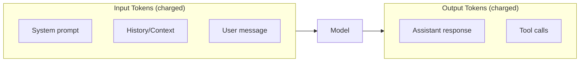

# Token Usage Tracking

## Introduction

Token usage directly determines API costs. Understanding how to track, log, and calculate costs from usage data is essential for budgeting and optimizing AI applications.

### What We'll Cover

- Understanding the usage object
- Prompt vs completion tokens
- Cost calculation formulas
- Usage logging strategies
- Building cost dashboards

### Prerequisites

- Response structure knowledge
- Basic API usage

---

## The Usage Object

Every API response includes token counts:

### Chat Completions Usage

```python
from openai import OpenAI

client = OpenAI()

response = client.chat.completions.create(
    model="gpt-4.1",
    messages=[{"role": "user", "content": "What is Python?"}]
)

usage = response.usage
print(f"Prompt tokens: {usage.prompt_tokens}")
print(f"Completion tokens: {usage.completion_tokens}")
print(f"Total tokens: {usage.total_tokens}")
```

**Output:**
```
Prompt tokens: 12
Completion tokens: 45
Total tokens: 57
```

### Responses API Usage

```python
response = client.responses.create(
    model="gpt-4.1",
    input="Explain machine learning"
)

usage = response.usage
print(f"Input tokens: {usage.input_tokens}")
print(f"Output tokens: {usage.output_tokens}")
print(f"Total tokens: {usage.total_tokens}")
```

### Anthropic Usage

```python
import anthropic

client = anthropic.Anthropic()

response = client.messages.create(
    model="claude-sonnet-4-20250514",
    max_tokens=1024,
    messages=[{"role": "user", "content": "Hello"}]
)

print(f"Input tokens: {response.usage.input_tokens}")
print(f"Output tokens: {response.usage.output_tokens}")
```

---

## Token Terminology



| Provider | Input Name | Output Name |
|----------|------------|-------------|
| OpenAI Chat | `prompt_tokens` | `completion_tokens` |
| OpenAI Responses | `input_tokens` | `output_tokens` |
| Anthropic | `input_tokens` | `output_tokens` |

---

## Cost Calculation

### 2025 Pricing (per 1M tokens)

| Model | Input | Output |
|-------|-------|--------|
| GPT-4.1 | $2.00 | $8.00 |
| GPT-4.1-mini | $0.40 | $1.60 |
| GPT-4.1-nano | $0.10 | $0.40 |
| Claude Sonnet 4 | $3.00 | $15.00 |
| Claude Haiku 3.5 | $0.80 | $4.00 |

### Cost Calculator

```python
from dataclasses import dataclass
from typing import Dict

@dataclass
class ModelPricing:
    input_per_million: float
    output_per_million: float

PRICING: Dict[str, ModelPricing] = {
    "gpt-4.1": ModelPricing(2.00, 8.00),
    "gpt-4.1-mini": ModelPricing(0.40, 1.60),
    "gpt-4.1-nano": ModelPricing(0.10, 0.40),
    "claude-sonnet-4-20250514": ModelPricing(3.00, 15.00),
    "claude-3-5-haiku-20241022": ModelPricing(0.80, 4.00),
}

def calculate_cost(
    model: str,
    input_tokens: int,
    output_tokens: int
) -> float:
    """Calculate cost in USD for token usage."""
    pricing = PRICING.get(model)
    if not pricing:
        # Try model family matching
        for key, price in PRICING.items():
            if model.startswith(key.split("-")[0]):
                pricing = price
                break
    
    if not pricing:
        raise ValueError(f"Unknown model: {model}")
    
    input_cost = (input_tokens / 1_000_000) * pricing.input_per_million
    output_cost = (output_tokens / 1_000_000) * pricing.output_per_million
    
    return input_cost + output_cost


# Usage
cost = calculate_cost(
    model="gpt-4.1",
    input_tokens=1000,
    output_tokens=500
)
print(f"Cost: ${cost:.6f}")  # $0.006000
```

### JavaScript Version

```javascript
const PRICING = {
    "gpt-4.1": { input: 2.00, output: 8.00 },
    "gpt-4.1-mini": { input: 0.40, output: 1.60 },
    "gpt-4.1-nano": { input: 0.10, output: 0.40 },
    "claude-sonnet-4-20250514": { input: 3.00, output: 15.00 },
    "claude-3-5-haiku-20241022": { input: 0.80, output: 4.00 },
};

function calculateCost(model, inputTokens, outputTokens) {
    const pricing = PRICING[model];
    if (!pricing) {
        throw new Error(`Unknown model: ${model}`);
    }
    
    const inputCost = (inputTokens / 1_000_000) * pricing.input;
    const outputCost = (outputTokens / 1_000_000) * pricing.output;
    
    return inputCost + outputCost;
}

// Usage
const cost = calculateCost("gpt-4.1", 1000, 500);
console.log(`Cost: $${cost.toFixed(6)}`);
```

---

## Usage Logging

### Database Schema

```sql
CREATE TABLE api_usage (
    id SERIAL PRIMARY KEY,
    timestamp TIMESTAMP DEFAULT NOW(),
    request_id VARCHAR(100),
    model VARCHAR(100) NOT NULL,
    input_tokens INTEGER NOT NULL,
    output_tokens INTEGER NOT NULL,
    total_tokens INTEGER NOT NULL,
    cost_usd DECIMAL(10, 8),
    user_id VARCHAR(100),
    endpoint VARCHAR(100),
    latency_ms INTEGER
);

CREATE INDEX idx_usage_timestamp ON api_usage(timestamp);
CREATE INDEX idx_usage_user ON api_usage(user_id);
CREATE INDEX idx_usage_model ON api_usage(model);
```

### Logging Implementation

```python
import sqlite3
from datetime import datetime
from contextlib import contextmanager

class UsageLogger:
    def __init__(self, db_path: str = "usage.db"):
        self.db_path = db_path
        self._init_db()
    
    def _init_db(self):
        with self._get_connection() as conn:
            conn.execute("""
                CREATE TABLE IF NOT EXISTS api_usage (
                    id INTEGER PRIMARY KEY AUTOINCREMENT,
                    timestamp TEXT DEFAULT CURRENT_TIMESTAMP,
                    request_id TEXT,
                    model TEXT NOT NULL,
                    input_tokens INTEGER NOT NULL,
                    output_tokens INTEGER NOT NULL,
                    total_tokens INTEGER NOT NULL,
                    cost_usd REAL,
                    user_id TEXT,
                    endpoint TEXT,
                    latency_ms INTEGER
                )
            """)
    
    @contextmanager
    def _get_connection(self):
        conn = sqlite3.connect(self.db_path)
        try:
            yield conn
            conn.commit()
        finally:
            conn.close()
    
    def log(
        self,
        response,
        model: str,
        user_id: str = None,
        endpoint: str = None,
        latency_ms: int = None
    ):
        """Log usage from API response."""
        # Extract usage (handle both API styles)
        usage = response.usage
        input_tokens = getattr(usage, "prompt_tokens", None) or usage.input_tokens
        output_tokens = getattr(usage, "completion_tokens", None) or usage.output_tokens
        total_tokens = usage.total_tokens
        
        # Calculate cost
        cost = calculate_cost(model, input_tokens, output_tokens)
        
        with self._get_connection() as conn:
            conn.execute("""
                INSERT INTO api_usage 
                (request_id, model, input_tokens, output_tokens, 
                 total_tokens, cost_usd, user_id, endpoint, latency_ms)
                VALUES (?, ?, ?, ?, ?, ?, ?, ?, ?)
            """, (
                response.id,
                model,
                input_tokens,
                output_tokens,
                total_tokens,
                cost,
                user_id,
                endpoint,
                latency_ms
            ))
        
        return {
            "input_tokens": input_tokens,
            "output_tokens": output_tokens,
            "cost_usd": cost
        }
```

### Usage with Wrapper

```python
import time
from openai import OpenAI

client = OpenAI()
logger = UsageLogger()

def tracked_completion(
    model: str,
    messages: list,
    user_id: str = None,
    **kwargs
):
    """Make completion with automatic usage logging."""
    start = time.time()
    
    response = client.chat.completions.create(
        model=model,
        messages=messages,
        **kwargs
    )
    
    latency = int((time.time() - start) * 1000)
    
    usage_info = logger.log(
        response=response,
        model=model,
        user_id=user_id,
        endpoint="chat.completions",
        latency_ms=latency
    )
    
    print(f"📊 Tokens: {usage_info['input_tokens']} in / "
          f"{usage_info['output_tokens']} out = ${usage_info['cost_usd']:.6f}")
    
    return response


# Usage
response = tracked_completion(
    model="gpt-4.1",
    messages=[{"role": "user", "content": "Hello!"}],
    user_id="user_123"
)
```

---

## Aggregating Usage

```python
class UsageAnalytics:
    def __init__(self, logger: UsageLogger):
        self.logger = logger
    
    def get_daily_summary(self, date: str = None):
        """Get usage summary for a specific date."""
        date = date or datetime.now().strftime("%Y-%m-%d")
        
        with self.logger._get_connection() as conn:
            cursor = conn.execute("""
                SELECT 
                    model,
                    COUNT(*) as requests,
                    SUM(input_tokens) as total_input,
                    SUM(output_tokens) as total_output,
                    SUM(cost_usd) as total_cost,
                    AVG(latency_ms) as avg_latency
                FROM api_usage
                WHERE DATE(timestamp) = ?
                GROUP BY model
            """, (date,))
            
            return [dict(zip(
                ["model", "requests", "total_input", 
                 "total_output", "total_cost", "avg_latency"],
                row
            )) for row in cursor.fetchall()]
    
    def get_user_usage(self, user_id: str, days: int = 30):
        """Get usage summary for a user."""
        with self.logger._get_connection() as conn:
            cursor = conn.execute("""
                SELECT 
                    DATE(timestamp) as date,
                    SUM(total_tokens) as tokens,
                    SUM(cost_usd) as cost
                FROM api_usage
                WHERE user_id = ?
                AND timestamp >= DATE('now', ?)
                GROUP BY DATE(timestamp)
                ORDER BY date DESC
            """, (user_id, f"-{days} days"))
            
            return cursor.fetchall()
    
    def get_cost_by_model(self, start_date: str, end_date: str):
        """Get cost breakdown by model."""
        with self.logger._get_connection() as conn:
            cursor = conn.execute("""
                SELECT 
                    model,
                    SUM(cost_usd) as total_cost,
                    SUM(input_tokens) as input_tokens,
                    SUM(output_tokens) as output_tokens
                FROM api_usage
                WHERE DATE(timestamp) BETWEEN ? AND ?
                GROUP BY model
                ORDER BY total_cost DESC
            """, (start_date, end_date))
            
            return cursor.fetchall()
```

---

## Real-time Cost Monitoring

```python
from collections import defaultdict
import threading

class RealTimeCostMonitor:
    def __init__(self, budget_limit: float = 100.0):
        self.budget_limit = budget_limit
        self.current_spend = 0.0
        self.spend_by_user = defaultdict(float)
        self.lock = threading.Lock()
        self.callbacks = []
    
    def record(self, cost: float, user_id: str = None):
        """Record a cost and check budget."""
        with self.lock:
            self.current_spend += cost
            if user_id:
                self.spend_by_user[user_id] += cost
            
            # Check budget threshold
            if self.current_spend >= self.budget_limit * 0.8:
                self._trigger_alert("80% of budget used")
            
            if self.current_spend >= self.budget_limit:
                self._trigger_alert("Budget limit reached!")
                raise BudgetExceededError(
                    f"Budget of ${self.budget_limit} exceeded"
                )
    
    def on_alert(self, callback):
        """Register alert callback."""
        self.callbacks.append(callback)
    
    def _trigger_alert(self, message: str):
        for callback in self.callbacks:
            callback(message, self.current_spend, self.budget_limit)
    
    def get_remaining(self) -> float:
        return self.budget_limit - self.current_spend


class BudgetExceededError(Exception):
    pass


# Usage
monitor = RealTimeCostMonitor(budget_limit=50.0)

monitor.on_alert(lambda msg, spent, limit: 
    print(f"⚠️ {msg}: ${spent:.2f} / ${limit:.2f}"))

# After each request
usage_info = logger.log(response, model="gpt-4.1")
monitor.record(usage_info["cost_usd"], user_id="user_123")

print(f"Remaining budget: ${monitor.get_remaining():.2f}")
```

---

## Token Estimation

Estimate costs before making requests:

```python
import tiktoken

def estimate_tokens(text: str, model: str = "gpt-4.1") -> int:
    """Estimate token count for text."""
    try:
        encoding = tiktoken.encoding_for_model(model)
    except KeyError:
        encoding = tiktoken.get_encoding("cl100k_base")
    
    return len(encoding.encode(text))

def estimate_request_cost(
    model: str,
    messages: list,
    expected_output_tokens: int = 500
) -> dict:
    """Estimate cost before making a request."""
    # Count input tokens
    input_tokens = 0
    for msg in messages:
        input_tokens += estimate_tokens(msg.get("content", ""))
        input_tokens += 4  # Role + formatting overhead
    
    input_tokens += 3  # Conversation overhead
    
    # Calculate costs
    pricing = PRICING.get(model, PRICING["gpt-4.1"])
    input_cost = (input_tokens / 1_000_000) * pricing.input_per_million
    output_cost = (expected_output_tokens / 1_000_000) * pricing.output_per_million
    
    return {
        "estimated_input_tokens": input_tokens,
        "estimated_output_tokens": expected_output_tokens,
        "estimated_input_cost": input_cost,
        "estimated_output_cost": output_cost,
        "estimated_total_cost": input_cost + output_cost
    }


# Usage
estimate = estimate_request_cost(
    model="gpt-4.1",
    messages=[
        {"role": "system", "content": "You are a helpful assistant."},
        {"role": "user", "content": "Explain quantum computing in detail."}
    ],
    expected_output_tokens=1000
)

print(f"Estimated cost: ${estimate['estimated_total_cost']:.4f}")
```

---

## Hands-on Exercise

### Your Task

Build a usage tracker that logs all requests and provides cost summaries.

### Requirements

1. Log each request with tokens and cost
2. Calculate daily totals
3. Show cost breakdown by model
4. Alert when spending exceeds threshold

### Expected Result

```
Daily Summary (2025-01-15)
==========================
GPT-4.1: 50 requests, $2.45
GPT-4.1-mini: 200 requests, $0.80
Total: $3.25

⚠️ Alert: 65% of daily budget used
```

<details>
<summary>💡 Hints</summary>

- Use SQLite for simple persistence
- Calculate cost at log time
- Aggregate with SQL GROUP BY
</details>

<details>
<summary>✅ Solution</summary>

```python
import sqlite3
from datetime import datetime

class UsageTracker:
    def __init__(self, daily_budget: float = 10.0):
        self.db = sqlite3.connect(":memory:")  # Use file for persistence
        self.daily_budget = daily_budget
        self._init_db()
    
    def _init_db(self):
        self.db.execute("""
            CREATE TABLE usage (
                id INTEGER PRIMARY KEY,
                timestamp TEXT,
                model TEXT,
                input_tokens INTEGER,
                output_tokens INTEGER,
                cost REAL
            )
        """)
    
    def log(self, model: str, input_tokens: int, output_tokens: int):
        pricing = {
            "gpt-4.1": (2.0, 8.0),
            "gpt-4.1-mini": (0.4, 1.6),
        }
        
        rates = pricing.get(model, (2.0, 8.0))
        cost = (input_tokens / 1e6 * rates[0]) + (output_tokens / 1e6 * rates[1])
        
        self.db.execute(
            "INSERT INTO usage (timestamp, model, input_tokens, output_tokens, cost) VALUES (?, ?, ?, ?, ?)",
            (datetime.now().isoformat(), model, input_tokens, output_tokens, cost)
        )
        self.db.commit()
        
        # Check budget
        daily_total = self.get_daily_total()
        pct = (daily_total / self.daily_budget) * 100
        
        if pct >= 50:
            print(f"⚠️ Alert: {pct:.0f}% of daily budget used")
        
        return cost
    
    def get_daily_total(self) -> float:
        today = datetime.now().strftime("%Y-%m-%d")
        cursor = self.db.execute(
            "SELECT COALESCE(SUM(cost), 0) FROM usage WHERE DATE(timestamp) = ?",
            (today,)
        )
        return cursor.fetchone()[0]
    
    def daily_summary(self):
        today = datetime.now().strftime("%Y-%m-%d")
        
        print(f"\nDaily Summary ({today})")
        print("=" * 30)
        
        cursor = self.db.execute("""
            SELECT model, COUNT(*), SUM(cost)
            FROM usage 
            WHERE DATE(timestamp) = ?
            GROUP BY model
        """, (today,))
        
        total = 0
        for model, count, cost in cursor.fetchall():
            print(f"{model}: {count} requests, ${cost:.2f}")
            total += cost
        
        print(f"Total: ${total:.2f}")
        remaining = self.daily_budget - total
        print(f"Remaining: ${remaining:.2f}")


# Test it
tracker = UsageTracker(daily_budget=5.0)

# Simulate requests
tracker.log("gpt-4.1", 500, 200)
tracker.log("gpt-4.1", 1000, 500)
tracker.log("gpt-4.1-mini", 2000, 800)

tracker.daily_summary()
```

</details>

---

## Summary

✅ Usage objects contain input and output token counts  
✅ Cost = (input_tokens × input_rate) + (output_tokens × output_rate)  
✅ Log every request for billing visibility  
✅ Aggregate usage by day, user, and model  
✅ Set budget alerts to prevent overspending

**Next:** [Token Usage Details](./03-usage-details.md)

---

## Further Reading

- [OpenAI Pricing](https://openai.com/pricing) — Current token rates
- [Anthropic Pricing](https://www.anthropic.com/pricing) — Claude model rates
- [tiktoken Library](https://github.com/openai/tiktoken) — Token counting

<!-- 
Sources Consulted:
- OpenAI Pricing: https://openai.com/pricing
- OpenAI Usage API: https://platform.openai.com/docs/api-reference/chat/object
-->
