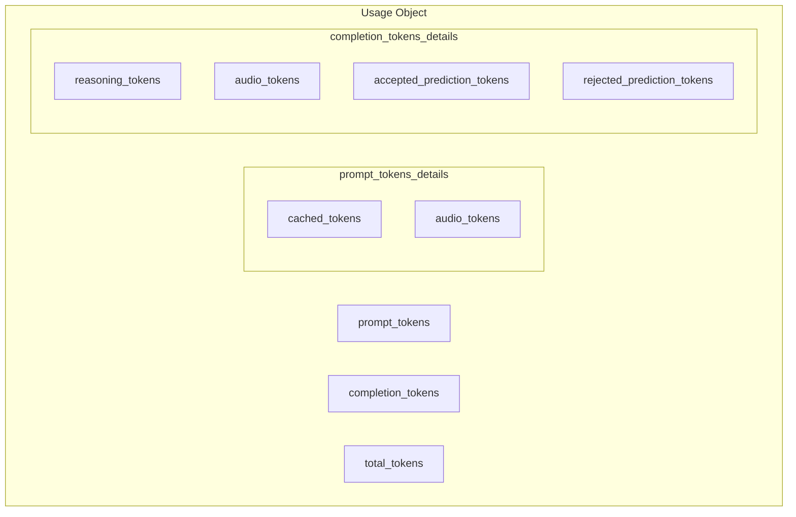

# Token Usage Details

## Introduction

Modern AI APIs provide detailed breakdowns of token usage beyond simple input/output counts. Understanding cached tokens, reasoning tokens, and audio tokens helps optimize costs and debug performance.

### What We'll Cover

- Cached token tracking
- Reasoning token details
- Audio token usage
- Prediction token metrics
- Accessing detailed usage data

### Prerequisites

- Basic token usage concepts
- Familiarity with advanced models (O-series, audio)

---

## Detailed Usage Structure

The `usage` object now includes detailed breakdowns:

```json
{
  "usage": {
    "prompt_tokens": 1500,
    "completion_tokens": 500,
    "total_tokens": 2000,
    "prompt_tokens_details": {
      "cached_tokens": 1024,
      "audio_tokens": 0
    },
    "completion_tokens_details": {
      "reasoning_tokens": 200,
      "audio_tokens": 0,
      "accepted_prediction_tokens": 0,
      "rejected_prediction_tokens": 0
    }
  }
}
```



---

## Cached Tokens

Prompt caching automatically caches repeated prompts, reducing costs:

### How Caching Works

```python
from openai import OpenAI

client = OpenAI()

# Long system prompt (will be cached after first request)
system_prompt = """You are an expert financial analyst...
[Assume this is 2000+ tokens of detailed instructions]
"""

# First request - no cache
response1 = client.chat.completions.create(
    model="gpt-4.1",
    messages=[
        {"role": "system", "content": system_prompt},
        {"role": "user", "content": "Analyze Apple stock"}
    ]
)

print(f"First request cached: {response1.usage.prompt_tokens_details.cached_tokens}")
# Output: 0 (nothing cached yet)

# Second request - cache hit
response2 = client.chat.completions.create(
    model="gpt-4.1",
    messages=[
        {"role": "system", "content": system_prompt},  # Same prompt
        {"role": "user", "content": "Analyze Microsoft stock"}
    ]
)

print(f"Second request cached: {response2.usage.prompt_tokens_details.cached_tokens}")
# Output: 2048 (system prompt cached)
```

### Cache Savings Calculation

```python
def calculate_cache_savings(usage, model: str = "gpt-4.1") -> dict:
    """Calculate cost savings from prompt caching."""
    
    # Pricing per 1M tokens
    PRICES = {
        "gpt-4.1": {"input": 2.00, "cached": 0.50},  # 75% discount
        "gpt-4.1-mini": {"input": 0.40, "cached": 0.10},
    }
    
    prices = PRICES.get(model, PRICES["gpt-4.1"])
    
    # Get token counts
    total_input = usage.prompt_tokens
    cached = usage.prompt_tokens_details.cached_tokens
    uncached = total_input - cached
    
    # Calculate costs
    uncached_cost = (uncached / 1_000_000) * prices["input"]
    cached_cost = (cached / 1_000_000) * prices["cached"]
    
    # What it would have cost without caching
    full_cost = (total_input / 1_000_000) * prices["input"]
    actual_cost = uncached_cost + cached_cost
    
    return {
        "total_input_tokens": total_input,
        "cached_tokens": cached,
        "uncached_tokens": uncached,
        "actual_cost": actual_cost,
        "would_have_cost": full_cost,
        "savings": full_cost - actual_cost,
        "cache_hit_rate": (cached / total_input * 100) if total_input > 0 else 0
    }


# Usage
savings = calculate_cache_savings(response2.usage, "gpt-4.1")
print(f"Cache hit rate: {savings['cache_hit_rate']:.1f}%")
print(f"Savings: ${savings['savings']:.4f}")
```

---

## Reasoning Tokens

O-series models report reasoning tokens used during "thinking":

### Tracking Reasoning Usage

```python
response = client.chat.completions.create(
    model="o3-mini",
    messages=[{"role": "user", "content": "What is 127 * 89?"}],
    reasoning_effort="medium"
)

usage = response.usage
details = usage.completion_tokens_details

print(f"Total completion: {usage.completion_tokens}")
print(f"Reasoning tokens: {details.reasoning_tokens}")
print(f"Output tokens: {usage.completion_tokens - details.reasoning_tokens}")
```

**Output:**
```
Total completion: 350
Reasoning tokens: 300
Output tokens: 50
```

### Reasoning Cost Calculation

```python
def calculate_reasoning_cost(usage, model: str) -> dict:
    """Calculate cost breakdown for reasoning models."""
    
    # O-series pricing (per 1M tokens)
    O_PRICING = {
        "o3-mini": {"input": 1.10, "output": 4.40, "reasoning": 4.40},
        "o3": {"input": 10.00, "output": 40.00, "reasoning": 40.00},
        "o4-mini": {"input": 1.10, "output": 4.40, "reasoning": 4.40},
    }
    
    prices = O_PRICING.get(model)
    if not prices:
        raise ValueError(f"Unknown model: {model}")
    
    details = usage.completion_tokens_details
    reasoning = details.reasoning_tokens if details else 0
    output = usage.completion_tokens - reasoning
    
    input_cost = (usage.prompt_tokens / 1e6) * prices["input"]
    reasoning_cost = (reasoning / 1e6) * prices["reasoning"]
    output_cost = (output / 1e6) * prices["output"]
    
    return {
        "input_tokens": usage.prompt_tokens,
        "reasoning_tokens": reasoning,
        "output_tokens": output,
        "input_cost": input_cost,
        "reasoning_cost": reasoning_cost,
        "output_cost": output_cost,
        "total_cost": input_cost + reasoning_cost + output_cost
    }
```

### Responses API Reasoning

```python
# Responses API with reasoning
response = client.responses.create(
    model="o3",
    input="Prove that √2 is irrational",
    reasoning={"effort": "high", "summary": "detailed"}
)

print(f"Input: {response.usage.input_tokens}")
print(f"Output: {response.usage.output_tokens}")

# Detailed breakdown
details = response.usage.output_tokens_details
if details:
    print(f"Reasoning: {details.reasoning_tokens}")
```

---

## Audio Tokens

For audio models, token usage includes audio-specific counts:

### Audio Input Tokens

```python
import base64

# Transcribe audio
with open("recording.mp3", "rb") as f:
    audio_data = base64.b64encode(f.read()).decode()

response = client.chat.completions.create(
    model="gpt-4o-audio-preview",
    messages=[{
        "role": "user",
        "content": [
            {"type": "input_audio", "input_audio": {
                "data": audio_data,
                "format": "mp3"
            }},
            {"type": "text", "text": "Summarize this audio"}
        ]
    }]
)

details = response.usage.prompt_tokens_details
print(f"Text tokens: {response.usage.prompt_tokens - details.audio_tokens}")
print(f"Audio tokens: {details.audio_tokens}")
```

### Audio Output Tokens

```python
response = client.chat.completions.create(
    model="gpt-4o-audio-preview",
    modalities=["text", "audio"],
    audio={"voice": "alloy", "format": "mp3"},
    messages=[{"role": "user", "content": "Tell me a joke"}]
)

output_details = response.usage.completion_tokens_details
print(f"Text output: {response.usage.completion_tokens - output_details.audio_tokens}")
print(f"Audio output: {output_details.audio_tokens}")
```

### Audio Pricing

| Model | Text Input | Audio Input | Text Output | Audio Output |
|-------|------------|-------------|-------------|--------------|
| GPT-4o Audio | $2.50/1M | $100/1M | $10/1M | $200/1M |

```python
def calculate_audio_cost(usage, model: str = "gpt-4o-audio-preview") -> dict:
    """Calculate cost for audio requests."""
    
    # Per 1M tokens
    AUDIO_PRICING = {
        "gpt-4o-audio-preview": {
            "text_input": 2.50,
            "audio_input": 100.00,
            "text_output": 10.00,
            "audio_output": 200.00
        }
    }
    
    prices = AUDIO_PRICING.get(model)
    if not prices:
        return None
    
    prompt_details = usage.prompt_tokens_details
    completion_details = usage.completion_tokens_details
    
    audio_in = prompt_details.audio_tokens if prompt_details else 0
    text_in = usage.prompt_tokens - audio_in
    
    audio_out = completion_details.audio_tokens if completion_details else 0
    text_out = usage.completion_tokens - audio_out
    
    return {
        "text_input": text_in,
        "audio_input": audio_in,
        "text_output": text_out,
        "audio_output": audio_out,
        "cost": (
            (text_in / 1e6) * prices["text_input"] +
            (audio_in / 1e6) * prices["audio_input"] +
            (text_out / 1e6) * prices["text_output"] +
            (audio_out / 1e6) * prices["audio_output"]
        )
    }
```

---

## Prediction Tokens

When using predicted outputs, track acceptance rates:

### Understanding Predictions

```python
# Predicted output for editing
response = client.chat.completions.create(
    model="gpt-4.1",
    messages=[
        {"role": "user", "content": "Change the color from blue to red"},
        {"role": "user", "content": "div { color: blue; background: white; }"}
    ],
    prediction={
        "type": "content",
        "content": "div { color: red; background: white; }"
    }
)

details = response.usage.completion_tokens_details
print(f"Accepted predictions: {details.accepted_prediction_tokens}")
print(f"Rejected predictions: {details.rejected_prediction_tokens}")
```

### Prediction Efficiency

```python
def calculate_prediction_efficiency(usage) -> dict:
    """Calculate how effective predicted output was."""
    
    details = usage.completion_tokens_details
    if not details:
        return {"efficiency": 0, "message": "No prediction data"}
    
    accepted = details.accepted_prediction_tokens or 0
    rejected = details.rejected_prediction_tokens or 0
    total_predicted = accepted + rejected
    
    if total_predicted == 0:
        return {"efficiency": 0, "message": "No predictions used"}
    
    efficiency = (accepted / total_predicted) * 100
    
    # Predictions are discounted (typically free for accepted)
    output_tokens = usage.completion_tokens
    tokens_saved = accepted  # These weren't generated from scratch
    
    return {
        "accepted": accepted,
        "rejected": rejected,
        "total_predicted": total_predicted,
        "efficiency": efficiency,
        "tokens_saved": tokens_saved,
        "message": f"{efficiency:.1f}% prediction accuracy"
    }
```

---

## Complete Usage Analyzer

```python
from dataclasses import dataclass
from typing import Optional

@dataclass
class DetailedUsageReport:
    # Basic counts
    input_tokens: int
    output_tokens: int
    total_tokens: int
    
    # Prompt details
    cached_tokens: int = 0
    audio_input_tokens: int = 0
    
    # Completion details
    reasoning_tokens: int = 0
    audio_output_tokens: int = 0
    accepted_predictions: int = 0
    rejected_predictions: int = 0
    
    # Calculated
    cache_hit_rate: float = 0.0
    prediction_accuracy: float = 0.0


class UsageAnalyzer:
    """Analyze detailed token usage from responses."""
    
    @staticmethod
    def analyze(response) -> DetailedUsageReport:
        usage = response.usage
        
        # Basic counts
        report = DetailedUsageReport(
            input_tokens=getattr(usage, "prompt_tokens", 0) or getattr(usage, "input_tokens", 0),
            output_tokens=getattr(usage, "completion_tokens", 0) or getattr(usage, "output_tokens", 0),
            total_tokens=usage.total_tokens
        )
        
        # Prompt details
        prompt_details = getattr(usage, "prompt_tokens_details", None)
        if prompt_details:
            report.cached_tokens = getattr(prompt_details, "cached_tokens", 0) or 0
            report.audio_input_tokens = getattr(prompt_details, "audio_tokens", 0) or 0
        
        # Completion details
        completion_details = getattr(usage, "completion_tokens_details", None)
        if completion_details:
            report.reasoning_tokens = getattr(completion_details, "reasoning_tokens", 0) or 0
            report.audio_output_tokens = getattr(completion_details, "audio_tokens", 0) or 0
            report.accepted_predictions = getattr(completion_details, "accepted_prediction_tokens", 0) or 0
            report.rejected_predictions = getattr(completion_details, "rejected_prediction_tokens", 0) or 0
        
        # Calculate rates
        if report.input_tokens > 0:
            report.cache_hit_rate = (report.cached_tokens / report.input_tokens) * 100
        
        total_predictions = report.accepted_predictions + report.rejected_predictions
        if total_predictions > 0:
            report.prediction_accuracy = (report.accepted_predictions / total_predictions) * 100
        
        return report
    
    @staticmethod
    def format_report(report: DetailedUsageReport) -> str:
        lines = [
            "Token Usage Report",
            "=" * 40,
            f"Input tokens:     {report.input_tokens:,}",
            f"Output tokens:    {report.output_tokens:,}",
            f"Total tokens:     {report.total_tokens:,}",
        ]
        
        if report.cached_tokens > 0:
            lines.append(f"\n📦 Cached tokens: {report.cached_tokens:,} ({report.cache_hit_rate:.1f}%)")
        
        if report.reasoning_tokens > 0:
            lines.append(f"\n🧠 Reasoning:     {report.reasoning_tokens:,}")
        
        if report.audio_input_tokens > 0 or report.audio_output_tokens > 0:
            lines.append(f"\n🔊 Audio in:      {report.audio_input_tokens:,}")
            lines.append(f"🔊 Audio out:     {report.audio_output_tokens:,}")
        
        if report.accepted_predictions > 0 or report.rejected_predictions > 0:
            lines.append(f"\n✅ Predictions accepted: {report.accepted_predictions:,}")
            lines.append(f"❌ Predictions rejected: {report.rejected_predictions:,}")
            lines.append(f"📊 Accuracy: {report.prediction_accuracy:.1f}%")
        
        return "\n".join(lines)


# Usage
response = client.chat.completions.create(
    model="gpt-4.1",
    messages=[{"role": "user", "content": "Hello"}]
)

report = UsageAnalyzer.analyze(response)
print(UsageAnalyzer.format_report(report))
```

---

## JavaScript Implementation

```javascript
class UsageAnalyzer {
    static analyze(response) {
        const usage = response.usage;
        
        const report = {
            inputTokens: usage.prompt_tokens || usage.input_tokens || 0,
            outputTokens: usage.completion_tokens || usage.output_tokens || 0,
            totalTokens: usage.total_tokens,
            cachedTokens: 0,
            audioInputTokens: 0,
            reasoningTokens: 0,
            audioOutputTokens: 0,
            acceptedPredictions: 0,
            rejectedPredictions: 0,
            cacheHitRate: 0,
            predictionAccuracy: 0
        };
        
        // Prompt details
        const promptDetails = usage.prompt_tokens_details;
        if (promptDetails) {
            report.cachedTokens = promptDetails.cached_tokens || 0;
            report.audioInputTokens = promptDetails.audio_tokens || 0;
        }
        
        // Completion details
        const completionDetails = usage.completion_tokens_details;
        if (completionDetails) {
            report.reasoningTokens = completionDetails.reasoning_tokens || 0;
            report.audioOutputTokens = completionDetails.audio_tokens || 0;
            report.acceptedPredictions = completionDetails.accepted_prediction_tokens || 0;
            report.rejectedPredictions = completionDetails.rejected_prediction_tokens || 0;
        }
        
        // Calculate rates
        if (report.inputTokens > 0) {
            report.cacheHitRate = (report.cachedTokens / report.inputTokens) * 100;
        }
        
        const totalPredictions = report.acceptedPredictions + report.rejectedPredictions;
        if (totalPredictions > 0) {
            report.predictionAccuracy = (report.acceptedPredictions / totalPredictions) * 100;
        }
        
        return report;
    }
    
    static formatReport(report) {
        let output = `Token Usage Report
========================================
Input tokens:     ${report.inputTokens.toLocaleString()}
Output tokens:    ${report.outputTokens.toLocaleString()}
Total tokens:     ${report.totalTokens.toLocaleString()}`;
        
        if (report.cachedTokens > 0) {
            output += `\n\n📦 Cached: ${report.cachedTokens.toLocaleString()} (${report.cacheHitRate.toFixed(1)}%)`;
        }
        
        if (report.reasoningTokens > 0) {
            output += `\n\n🧠 Reasoning: ${report.reasoningTokens.toLocaleString()}`;
        }
        
        return output;
    }
}
```

---

## Hands-on Exercise

### Your Task

Build a usage dashboard that shows detailed token breakdowns.

### Requirements

1. Parse detailed usage from responses
2. Show cache hit rates
3. Calculate cost with all token types
4. Display reasoning tokens separately

### Expected Result

```
📊 Usage Dashboard
==================
Standard Tokens
  Input:  1,200 (800 cached = 66.7%)
  Output: 450

Special Tokens
  🧠 Reasoning: 200 tokens
  🔊 Audio: 0 tokens

Cost Breakdown
  Input:   $0.0008 (cached: $0.0004)
  Output:  $0.0036
  Total:   $0.0044
```

<details>
<summary>💡 Hints</summary>

- Check for `prompt_tokens_details` existence
- Cached tokens are billed at reduced rate
- Reasoning tokens count toward output
</details>

<details>
<summary>✅ Solution</summary>

```python
def usage_dashboard(response, model: str = "gpt-4.1"):
    """Display comprehensive usage dashboard."""
    usage = response.usage
    
    # Pricing
    PRICING = {
        "gpt-4.1": {"input": 2.0, "cached": 0.5, "output": 8.0},
    }
    prices = PRICING.get(model, PRICING["gpt-4.1"])
    
    # Extract details
    prompt_details = getattr(usage, "prompt_tokens_details", None)
    completion_details = getattr(usage, "completion_tokens_details", None)
    
    input_tokens = usage.prompt_tokens
    output_tokens = usage.completion_tokens
    
    cached = prompt_details.cached_tokens if prompt_details else 0
    uncached = input_tokens - cached
    reasoning = completion_details.reasoning_tokens if completion_details else 0
    audio_in = prompt_details.audio_tokens if prompt_details else 0
    audio_out = completion_details.audio_tokens if completion_details else 0
    
    # Calculate costs
    cached_cost = (cached / 1e6) * prices["cached"]
    uncached_cost = (uncached / 1e6) * prices["input"]
    output_cost = (output_tokens / 1e6) * prices["output"]
    
    # Display
    print("📊 Usage Dashboard")
    print("=" * 40)
    
    print("\nStandard Tokens")
    cache_rate = (cached / input_tokens * 100) if input_tokens > 0 else 0
    print(f"  Input:  {input_tokens:,}", end="")
    if cached > 0:
        print(f" ({cached:,} cached = {cache_rate:.1f}%)")
    else:
        print()
    print(f"  Output: {output_tokens:,}")
    
    if reasoning > 0 or audio_in > 0 or audio_out > 0:
        print("\nSpecial Tokens")
        if reasoning > 0:
            print(f"  🧠 Reasoning: {reasoning:,} tokens")
        if audio_in > 0 or audio_out > 0:
            print(f"  🔊 Audio: {audio_in:,} in / {audio_out:,} out")
    
    print("\nCost Breakdown")
    print(f"  Input:   ${uncached_cost:.4f}", end="")
    if cached > 0:
        print(f" (cached: ${cached_cost:.4f})")
    else:
        print()
    print(f"  Output:  ${output_cost:.4f}")
    print(f"  Total:   ${uncached_cost + cached_cost + output_cost:.4f}")


# Test
response = client.chat.completions.create(
    model="gpt-4.1",
    messages=[{"role": "user", "content": "Hello world"}]
)
usage_dashboard(response)
```

</details>

---

## Summary

✅ `prompt_tokens_details.cached_tokens` shows cache hits (75% discount)  
✅ `completion_tokens_details.reasoning_tokens` tracks O-series thinking  
✅ Audio tokens are billed at different rates than text  
✅ Prediction tokens show speculative decoding efficiency  
✅ Analyze all details for accurate cost calculations

**Next:** [Finish Reasons](./04-finish-reasons.md)

---

## Further Reading

- [Prompt Caching](https://platform.openai.com/docs/guides/prompt-caching) — OpenAI caching guide
- [Reasoning Models](https://platform.openai.com/docs/guides/reasoning) — O-series usage
- [Audio Models](https://platform.openai.com/docs/guides/audio) — Audio token details

<!-- 
Sources Consulted:
- OpenAI Prompt Caching: https://platform.openai.com/docs/guides/prompt-caching
- OpenAI Reasoning: https://platform.openai.com/docs/guides/reasoning
-->
