```mermaid
flowchart TD
    R[Response Received] --> FR{finish_reason?}
    
    FR -->|stop| Complete[✅ Complete]
    FR -->|length| Truncated[⚠️ Truncated]
    FR -->|content_filter| Filtered[🚫 Filtered]
    FR -->|tool_calls| Tools[🔧 Execute Tools]
    
    Truncated --> Continue[Request Continuation]
    Filtered --> Fallback[Show Fallback Message]
    Tools --> Execute[Run Functions]
    Execute --> Submit[Submit Results]
    Submit --> R
```

# Finish Reasons

## Introduction

Every API response includes a finish reason explaining why generation stopped. Understanding these reasons is essential for handling truncated responses, content filtering, and tool call workflows.

### What We'll Cover

- Standard finish reasons
- Provider-specific values
- Handling each reason appropriately
- Building finish reason handlers

### Prerequisites

- Response structure basics
- Understanding of token limits

---

## Standard Finish Reasons

### OpenAI Chat Completions

| Finish Reason | Meaning | Action Required |
|---------------|---------|-----------------|
| `stop` | Natural completion | None - response is complete |
| `length` | Max tokens reached | May need continuation |
| `content_filter` | Policy violation | Handle refusal gracefully |
| `tool_calls` | Function call requested | Execute tools, continue |

### Responses API Status

| Status | Meaning |
|--------|---------|
| `completed` | Successfully finished |
| `failed` | Error during generation |
| `incomplete` | Truncated (with reason) |
| `in_progress` | Still generating (async) |

### Anthropic Stop Reasons

| Stop Reason | Meaning |
|-------------|---------|
| `end_turn` | Natural completion |
| `max_tokens` | Token limit reached |
| `stop_sequence` | Custom stop matched |
| `tool_use` | Tool call requested |

---

## Detecting Finish Reasons

```python
from openai import OpenAI

client = OpenAI()

response = client.chat.completions.create(
    model="gpt-4.1",
    messages=[{"role": "user", "content": "Hello"}],
    max_tokens=100
)

finish_reason = response.choices[0].finish_reason
print(f"Finish reason: {finish_reason}")
```



---

## Stop - Natural Completion

The model finished generating normally:

```python
def handle_stop(response):
    """Handle natural completion."""
    content = response.choices[0].message.content
    
    # Response is complete, use directly
    return {
        "status": "complete",
        "content": content,
        "truncated": False
    }


# Check and handle
if response.choices[0].finish_reason == "stop":
    result = handle_stop(response)
    print(result["content"])
```

---

## Length - Token Limit Reached

The response was cut off due to `max_tokens`:

```python
def handle_length(response, client, messages):
    """Handle truncated response due to token limit."""
    
    partial_content = response.choices[0].message.content
    
    # Option 1: Notify user
    return {
        "status": "truncated",
        "content": partial_content,
        "message": "Response was cut off due to length limit"
    }


def continue_generation(client, messages, partial_response):
    """Request continuation of truncated response."""
    
    # Add the partial response to history
    messages_with_partial = messages + [
        {"role": "assistant", "content": partial_response},
        {"role": "user", "content": "Please continue from where you left off."}
    ]
    
    continuation = client.chat.completions.create(
        model="gpt-4.1",
        messages=messages_with_partial,
        max_tokens=1000
    )
    
    return partial_response + continuation.choices[0].message.content


# Usage
if response.choices[0].finish_reason == "length":
    print("⚠️ Response truncated, requesting continuation...")
    
    full_content = continue_generation(
        client, 
        messages, 
        response.choices[0].message.content
    )
    print(full_content)
```

### Auto-Continue Pattern

```python
def complete_with_continuation(
    client,
    messages: list,
    max_tokens: int = 1000,
    max_continuations: int = 3
) -> str:
    """Get complete response, automatically continuing if truncated."""
    
    full_content = ""
    current_messages = messages.copy()
    continuations = 0
    
    while continuations <= max_continuations:
        response = client.chat.completions.create(
            model="gpt-4.1",
            messages=current_messages,
            max_tokens=max_tokens
        )
        
        content = response.choices[0].message.content
        finish_reason = response.choices[0].finish_reason
        
        full_content += content
        
        if finish_reason == "stop":
            break  # Natural completion
        
        if finish_reason == "length":
            # Prepare for continuation
            current_messages = [
                *messages,
                {"role": "assistant", "content": full_content},
                {"role": "user", "content": "Continue exactly from where you stopped."}
            ]
            continuations += 1
            print(f"📝 Continuation {continuations}...")
        else:
            # Other finish reason, stop
            break
    
    return full_content
```

---

## Content Filter - Policy Violation

Response blocked due to content policy:

```python
def handle_content_filter(response):
    """Handle content filter activation."""
    
    message = response.choices[0].message
    
    # Check for refusal field (newer API)
    if hasattr(message, "refusal") and message.refusal:
        return {
            "status": "filtered",
            "reason": "policy_violation",
            "refusal": message.refusal,
            "content": None
        }
    
    # Generic filter response
    return {
        "status": "filtered",
        "reason": "content_policy",
        "content": None,
        "message": "The request was filtered due to content policy."
    }


# Usage
if response.choices[0].finish_reason == "content_filter":
    result = handle_content_filter(response)
    print(f"❌ Request filtered: {result.get('refusal', result.get('message'))}")
```

### User-Friendly Handling

```python
def safe_completion(client, messages: list) -> dict:
    """Make completion with user-friendly filter handling."""
    
    try:
        response = client.chat.completions.create(
            model="gpt-4.1",
            messages=messages
        )
        
        finish_reason = response.choices[0].finish_reason
        
        if finish_reason == "content_filter":
            return {
                "success": False,
                "content": None,
                "error": "I'm not able to help with that request. "
                        "Please try rephrasing your question."
            }
        
        return {
            "success": True,
            "content": response.choices[0].message.content,
            "finish_reason": finish_reason
        }
    
    except Exception as e:
        return {
            "success": False,
            "content": None,
            "error": f"Request failed: {str(e)}"
        }
```

---

## Tool Calls - Function Requested

Model wants to call a function:

```python
def handle_tool_calls(response, tool_functions: dict):
    """Handle function call requests from the model."""
    
    message = response.choices[0].message
    
    if not message.tool_calls:
        return None
    
    tool_results = []
    
    for tool_call in message.tool_calls:
        function_name = tool_call.function.name
        function_args = json.loads(tool_call.function.arguments)
        
        # Execute the function
        if function_name in tool_functions:
            try:
                result = tool_functions[function_name](**function_args)
                tool_results.append({
                    "tool_call_id": tool_call.id,
                    "role": "tool",
                    "content": json.dumps(result)
                })
            except Exception as e:
                tool_results.append({
                    "tool_call_id": tool_call.id,
                    "role": "tool",
                    "content": json.dumps({"error": str(e)})
                })
        else:
            tool_results.append({
                "tool_call_id": tool_call.id,
                "role": "tool",
                "content": json.dumps({"error": f"Unknown function: {function_name}"})
            })
    
    return tool_results


# Full tool call loop
def complete_with_tools(client, messages: list, tools: list, tool_functions: dict):
    """Complete request with automatic tool execution."""
    
    current_messages = messages.copy()
    max_iterations = 10
    
    for _ in range(max_iterations):
        response = client.chat.completions.create(
            model="gpt-4.1",
            messages=current_messages,
            tools=tools
        )
        
        finish_reason = response.choices[0].finish_reason
        message = response.choices[0].message
        
        if finish_reason == "stop":
            return message.content
        
        if finish_reason == "tool_calls":
            # Add assistant message with tool calls
            current_messages.append(message.model_dump())
            
            # Execute tools and add results
            tool_results = handle_tool_calls(response, tool_functions)
            current_messages.extend(tool_results)
        else:
            # Unexpected finish reason
            return message.content
    
    raise Exception("Max tool iterations exceeded")
```

---

## Responses API Incomplete Reasons

```python
response = client.responses.create(
    model="gpt-4.1",
    input="Write a very long story...",
    max_output_tokens=100
)

if response.status == "incomplete":
    reason = response.incomplete_details.reason
    
    match reason:
        case "max_output_tokens":
            print("Hit token limit")
        case "content_filter":
            print("Content filtered")
        case _:
            print(f"Incomplete: {reason}")
```

---

## Universal Finish Handler

```python
from enum import Enum
from dataclasses import dataclass
from typing import Optional, Callable

class FinishStatus(Enum):
    COMPLETE = "complete"
    TRUNCATED = "truncated"
    FILTERED = "filtered"
    TOOL_CALL = "tool_call"
    ERROR = "error"

@dataclass
class ResponseResult:
    status: FinishStatus
    content: Optional[str]
    requires_action: bool = False
    action_data: Optional[dict] = None
    message: Optional[str] = None


class FinishReasonHandler:
    """Universal handler for finish reasons across providers."""
    
    def __init__(self):
        self.handlers = {}
    
    def register(self, reason: str, handler: Callable):
        """Register a handler for a specific finish reason."""
        self.handlers[reason] = handler
    
    def handle(self, response, provider: str = "openai") -> ResponseResult:
        """Handle response based on finish reason."""
        
        # Extract finish reason based on provider
        if provider == "openai":
            finish_reason = response.choices[0].finish_reason
            content = response.choices[0].message.content
            message = response.choices[0].message
        elif provider == "openai_responses":
            finish_reason = response.status
            content = self._extract_responses_content(response)
            message = response
        elif provider == "anthropic":
            finish_reason = response.stop_reason
            content = response.content[0].text if response.content else None
            message = response
        else:
            raise ValueError(f"Unknown provider: {provider}")
        
        # Map to standard status
        status_map = {
            # OpenAI
            "stop": FinishStatus.COMPLETE,
            "length": FinishStatus.TRUNCATED,
            "content_filter": FinishStatus.FILTERED,
            "tool_calls": FinishStatus.TOOL_CALL,
            # Responses API
            "completed": FinishStatus.COMPLETE,
            "incomplete": FinishStatus.TRUNCATED,
            "failed": FinishStatus.ERROR,
            # Anthropic
            "end_turn": FinishStatus.COMPLETE,
            "max_tokens": FinishStatus.TRUNCATED,
            "tool_use": FinishStatus.TOOL_CALL,
        }
        
        status = status_map.get(finish_reason, FinishStatus.ERROR)
        
        # Check for custom handler
        if finish_reason in self.handlers:
            return self.handlers[finish_reason](response, content, message)
        
        # Default handling
        return ResponseResult(
            status=status,
            content=content,
            requires_action=status in [FinishStatus.TRUNCATED, FinishStatus.TOOL_CALL],
            message=f"Finish reason: {finish_reason}"
        )
    
    def _extract_responses_content(self, response) -> str:
        content = ""
        for item in response.output:
            if item.type == "message":
                for c in item.content:
                    if c.type == "output_text":
                        content += c.text
        return content


# Usage
handler = FinishReasonHandler()

# Custom handler for truncation
handler.register("length", lambda r, c, m: ResponseResult(
    status=FinishStatus.TRUNCATED,
    content=c,
    requires_action=True,
    action_data={"type": "continue"},
    message="Response was truncated, continuation available"
))

result = handler.handle(response, "openai")

if result.status == FinishStatus.COMPLETE:
    print(result.content)
elif result.status == FinishStatus.TRUNCATED:
    print(f"⚠️ {result.message}")
    print(f"Partial: {result.content[:100]}...")
```

---

## JavaScript Implementation

```javascript
const FinishStatus = {
    COMPLETE: 'complete',
    TRUNCATED: 'truncated',
    FILTERED: 'filtered',
    TOOL_CALL: 'tool_call',
    ERROR: 'error'
};

class FinishReasonHandler {
    constructor() {
        this.statusMap = {
            // OpenAI
            stop: FinishStatus.COMPLETE,
            length: FinishStatus.TRUNCATED,
            content_filter: FinishStatus.FILTERED,
            tool_calls: FinishStatus.TOOL_CALL,
            // Anthropic
            end_turn: FinishStatus.COMPLETE,
            max_tokens: FinishStatus.TRUNCATED,
            tool_use: FinishStatus.TOOL_CALL
        };
    }
    
    handle(response, provider = 'openai') {
        let finishReason, content;
        
        if (provider === 'openai') {
            finishReason = response.choices[0].finish_reason;
            content = response.choices[0].message.content;
        } else if (provider === 'anthropic') {
            finishReason = response.stop_reason;
            content = response.content[0]?.text || null;
        }
        
        const status = this.statusMap[finishReason] || FinishStatus.ERROR;
        
        return {
            status,
            content,
            requiresAction: [FinishStatus.TRUNCATED, FinishStatus.TOOL_CALL].includes(status),
            finishReason
        };
    }
    
    isComplete(response, provider = 'openai') {
        const result = this.handle(response, provider);
        return result.status === FinishStatus.COMPLETE;
    }
    
    needsContinuation(response, provider = 'openai') {
        const result = this.handle(response, provider);
        return result.status === FinishStatus.TRUNCATED;
    }
}

// Usage
const handler = new FinishReasonHandler();
const result = handler.handle(response, 'openai');

switch (result.status) {
    case FinishStatus.COMPLETE:
        console.log('✅ Complete:', result.content);
        break;
    case FinishStatus.TRUNCATED:
        console.log('⚠️ Truncated, need continuation');
        break;
    case FinishStatus.FILTERED:
        console.log('🚫 Content filtered');
        break;
    case FinishStatus.TOOL_CALL:
        console.log('🔧 Tool call requested');
        break;
}
```

---

## Hands-on Exercise

### Your Task

Build a robust response handler that properly handles all finish reasons.

### Requirements

1. Check finish reason from response
2. Handle `stop` (return content)
3. Handle `length` (notify and offer continuation)
4. Handle `content_filter` (return friendly message)
5. Handle `tool_calls` (return tool call data)

### Expected Result

```python
result = handle_response(response)
# For stop: {"status": "complete", "content": "..."}
# For length: {"status": "truncated", "partial": "...", "action": "continue"}
# For filter: {"status": "filtered", "message": "Unable to process..."}
# For tools: {"status": "tool_call", "calls": [...]}
```

<details>
<summary>💡 Hints</summary>

- Check `response.choices[0].finish_reason`
- For tool_calls, access `message.tool_calls`
- Use match/case or if/elif chains
</details>

<details>
<summary>✅ Solution</summary>

```python
import json

def handle_response(response) -> dict:
    """Handle API response based on finish reason."""
    
    choice = response.choices[0]
    finish_reason = choice.finish_reason
    message = choice.message
    
    match finish_reason:
        case "stop":
            return {
                "status": "complete",
                "content": message.content,
                "truncated": False
            }
        
        case "length":
            return {
                "status": "truncated",
                "partial": message.content,
                "action": "continue",
                "message": "Response was cut off. Would you like to continue?"
            }
        
        case "content_filter":
            refusal = getattr(message, "refusal", None)
            return {
                "status": "filtered",
                "content": None,
                "message": refusal or "I'm unable to help with that request.",
                "original_content": message.content
            }
        
        case "tool_calls":
            calls = []
            for tc in message.tool_calls:
                calls.append({
                    "id": tc.id,
                    "function": tc.function.name,
                    "arguments": json.loads(tc.function.arguments)
                })
            
            return {
                "status": "tool_call",
                "calls": calls,
                "action": "execute_tools"
            }
        
        case _:
            return {
                "status": "unknown",
                "finish_reason": finish_reason,
                "content": message.content
            }


# Test with different scenarios
def test_handler():
    # Simulated responses would go here
    pass
```

</details>

---

## Summary

✅ `stop` means natural, complete response  
✅ `length` indicates truncation - consider continuation  
✅ `content_filter` requires graceful fallback messaging  
✅ `tool_calls` triggers function execution loop  
✅ Different providers use different terminology for same concepts

**Next:** [Handling Incomplete Responses](./05-incomplete-responses.md)

---

## Further Reading

- [Chat Completions Object](https://platform.openai.com/docs/api-reference/chat/object) — OpenAI finish reasons
- [Anthropic Stop Reasons](https://docs.anthropic.com/en/api/messages) — Claude stop handling
- [Content Moderation](https://platform.openai.com/docs/guides/moderation) — Filter details

<!-- 
Sources Consulted:
- OpenAI Chat Object: https://platform.openai.com/docs/api-reference/chat/object
- Anthropic Messages: https://docs.anthropic.com/en/api/messages
-->
