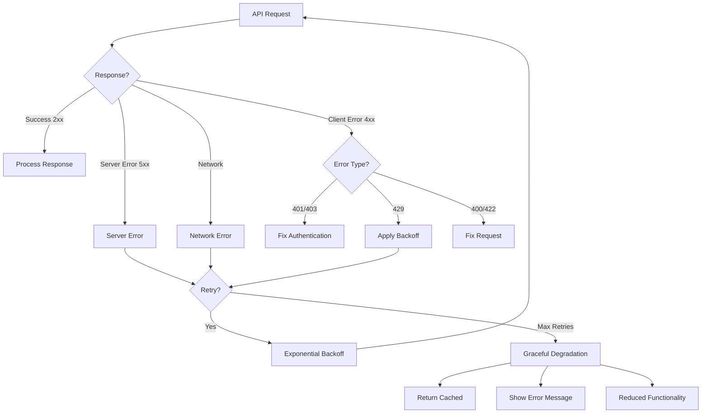

# Error Handling

## Introduction

Robust error handling is essential for building reliable AI applications. APIs fail for many reasons: rate limits, invalid requests, server issues, and more. This lesson covers comprehensive strategies for handling errors gracefully.

### What We'll Cover

- Common API errors and HTTP status codes
- Error response parsing across providers
- Retry strategies with exponential backoff
- Graceful degradation patterns
- User-friendly error messaging
- Circuit breaker patterns
- Model-specific error handling

### Prerequisites

- Basic API request experience
- Understanding of HTTP status codes
- Exception handling in Python/JavaScript

---

## Lesson Structure

This lesson is organized into the following topics:

| File | Topic | Description |
|------|-------|-------------|
| [01-common-errors.md](./01-common-errors.md) | Common API Errors | 4xx and 5xx status codes |
| [02-error-response-parsing.md](./02-error-response-parsing.md) | Error Parsing | Extracting error details |
| [03-retry-strategies.md](./03-retry-strategies.md) | Retry with Backoff | Exponential backoff patterns |
| [04-graceful-degradation.md](./04-graceful-degradation.md) | Graceful Degradation | Fallbacks and reduced functionality |
| [05-user-friendly-messages.md](./05-user-friendly-messages.md) | User Messaging | Translating errors for users |
| [06-circuit-breaker.md](./06-circuit-breaker.md) | Circuit Breaker | Preventing cascade failures |
| [07-model-specific-errors.md](./07-model-specific-errors.md) | Model-Specific Errors | Reasoning, streaming, MCP errors |
| [08-error-quick-reference.md](./08-error-quick-reference.md) | Quick Reference | Status code cheat sheet |

---

## Error Handling Flow

---

## Quick Reference

### HTTP Status Codes

| Code | Meaning | Retryable | Action |
|------|---------|-----------|--------|
| 400 | Bad Request | ❌ | Fix request parameters |
| 401 | Unauthorized | ❌ | Check API key |
| 403 | Forbidden | ❌ | Check permissions |
| 404 | Not Found | ❌ | Check endpoint URL |
| 429 | Rate Limited | ✅ | Backoff and retry |
| 500 | Server Error | ✅ | Retry with backoff |
| 503 | Unavailable | ✅ | Retry with backoff |

### Error Handling Checklist

- [ ] Catch all HTTP errors
- [ ] Parse error response body
- [ ] Log errors with context
- [ ] Implement retry for transient errors
- [ ] Show user-friendly messages
- [ ] Track error rates for monitoring

---

## Navigation

**Next:** [Common API Errors](./01-common-errors.md)

**Unit:** [AI API Integration](../00-overview.md)
