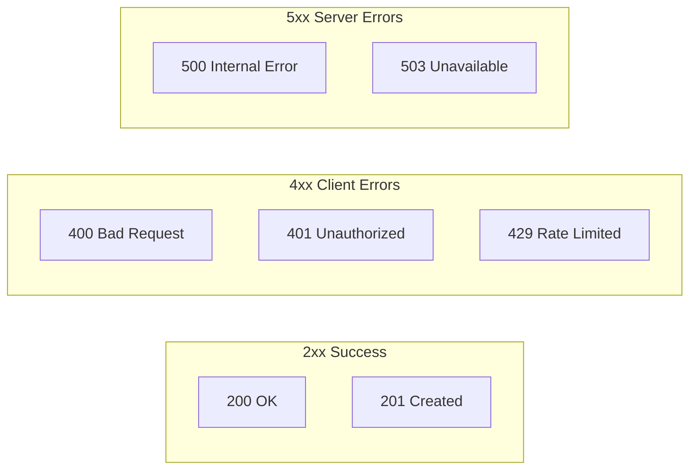

# Common API Errors

## Introduction

AI APIs return specific HTTP status codes and error messages when requests fail. Understanding these errors helps you implement appropriate handling strategies.

### What We'll Cover

- HTTP status code categories
- Common 4xx client errors
- Common 5xx server errors
- Provider-specific error codes
- Network and timeout errors

### Prerequisites

- Basic HTTP knowledge
- API request experience

---

## HTTP Status Code Categories



| Range | Category | Meaning | Your Fault? |
|-------|----------|---------|-------------|
| 2xx | Success | Request succeeded | N/A |
| 4xx | Client Error | Your request has issues | ✅ Yes |
| 5xx | Server Error | Server-side problem | ❌ No |

---

## Client Errors (4xx)

### 400 Bad Request

Invalid request format or parameters:

```python
from openai import OpenAI, BadRequestError

client = OpenAI()

try:
    response = client.chat.completions.create(
        model="gpt-4.1",
        messages=[{"role": "invalid", "content": "Hello"}]  # Bad role
    )
except BadRequestError as e:
    print(f"Bad request: {e.message}")
    # Fix: Use valid role (system, user, assistant)
```

**Common causes:**
- Invalid JSON format
- Missing required fields
- Invalid parameter values
- Unsupported model name

### 401 Unauthorized

Invalid or missing API key:

```python
from openai import AuthenticationError

try:
    response = client.chat.completions.create(
        model="gpt-4.1",
        messages=[{"role": "user", "content": "Hello"}]
    )
except AuthenticationError as e:
    print(f"Auth error: {e.message}")
    # Check: OPENAI_API_KEY environment variable
```

**Common causes:**
- Missing API key
- Invalid/expired API key
- Wrong API key format
- Key from wrong project

### 403 Forbidden

No permission to access resource:

```python
from openai import PermissionDeniedError

try:
    response = client.chat.completions.create(
        model="o3",  # May require special access
        messages=[{"role": "user", "content": "Hello"}]
    )
except PermissionDeniedError as e:
    print(f"Permission denied: {e.message}")
    # Check: Model access permissions
```

**Common causes:**
- Model not available to your account
- Tier restrictions
- Region restrictions
- Organization permissions

### 404 Not Found

Resource doesn't exist:

```python
from openai import NotFoundError

try:
    # Wrong endpoint or model name
    response = client.chat.completions.create(
        model="gpt-5-turbo",  # Doesn't exist
        messages=[{"role": "user", "content": "Hello"}]
    )
except NotFoundError as e:
    print(f"Not found: {e.message}")
```

**Common causes:**
- Typo in model name
- Wrong API endpoint
- Deleted resource (fine-tuned model, assistant)

### 422 Unprocessable Entity

Request understood but validation failed:

```python
from openai import UnprocessableEntityError

try:
    response = client.chat.completions.create(
        model="gpt-4.1",
        messages=[{"role": "user", "content": "Hello"}],
        temperature=5.0  # Out of range (0-2)
    )
except UnprocessableEntityError as e:
    print(f"Validation error: {e.message}")
```

**Common causes:**
- Parameter out of valid range
- Incompatible parameter combination
- Content too long

### 429 Too Many Requests

Rate limit exceeded:

```python
from openai import RateLimitError

try:
    response = client.chat.completions.create(
        model="gpt-4.1",
        messages=[{"role": "user", "content": "Hello"}]
    )
except RateLimitError as e:
    print(f"Rate limited: {e.message}")
    
    # Check for retry-after header
    retry_after = e.response.headers.get("retry-after")
    if retry_after:
        print(f"Retry after: {retry_after} seconds")
```

**Common causes:**
- Too many requests per minute
- Token quota exceeded
- Concurrent request limit hit

---

## Server Errors (5xx)

### 500 Internal Server Error

Server-side error:

```python
from openai import InternalServerError

try:
    response = client.chat.completions.create(
        model="gpt-4.1",
        messages=[{"role": "user", "content": "Hello"}]
    )
except InternalServerError as e:
    print(f"Server error: {e.message}")
    # Action: Retry with backoff
```

**What to do:**
- Retry with exponential backoff
- Log for monitoring
- Alert if persistent

### 503 Service Unavailable

Service temporarily overloaded:

```python
from openai import APIStatusError

try:
    response = client.chat.completions.create(
        model="gpt-4.1",
        messages=[{"role": "user", "content": "Hello"}]
    )
except APIStatusError as e:
    if e.status_code == 503:
        print("Service temporarily unavailable")
        # Retry with longer backoff
```

**What to do:**
- Wait and retry
- Use exponential backoff with jitter
- Consider fallback model

---

## Network Errors

### Connection Errors

```python
from openai import APIConnectionError

try:
    response = client.chat.completions.create(
        model="gpt-4.1",
        messages=[{"role": "user", "content": "Hello"}]
    )
except APIConnectionError as e:
    print(f"Connection error: {e}")
    # Check: Network connectivity, DNS, firewall
```

### Timeout Errors

```python
from openai import APITimeoutError

try:
    response = client.chat.completions.create(
        model="gpt-4.1",
        messages=[{"role": "user", "content": "Hello"}],
        timeout=30.0  # 30 second timeout
    )
except APITimeoutError as e:
    print(f"Request timed out: {e}")
    # Action: Retry or increase timeout
```

---

## Provider Comparison

### OpenAI Exception Hierarchy

```python
from openai import (
    OpenAIError,           # Base class
    APIError,              # All API errors
    APIConnectionError,    # Network issues
    APITimeoutError,       # Timeout
    APIStatusError,        # HTTP status errors
    BadRequestError,       # 400
    AuthenticationError,   # 401
    PermissionDeniedError, # 403
    NotFoundError,         # 404
    UnprocessableEntityError, # 422
    RateLimitError,        # 429
    InternalServerError,   # 500+
)
```

### Anthropic Exception Hierarchy

```python
from anthropic import (
    AnthropicError,        # Base class
    APIError,              # All API errors
    APIConnectionError,    # Network issues
    APITimeoutError,       # Timeout
    APIStatusError,        # HTTP status errors
    BadRequestError,       # 400
    AuthenticationError,   # 401
    PermissionDeniedError, # 403
    NotFoundError,         # 404
    RateLimitError,        # 429
    InternalServerError,   # 500
    OverloadedError,       # 529 (Anthropic-specific)
)
```

### JavaScript Error Handling

```javascript
import OpenAI from 'openai';

const client = new OpenAI();

try {
    const response = await client.chat.completions.create({
        model: 'gpt-4.1',
        messages: [{ role: 'user', content: 'Hello' }]
    });
} catch (error) {
    if (error instanceof OpenAI.APIError) {
        console.log(`Status: ${error.status}`);
        console.log(`Message: ${error.message}`);
        console.log(`Code: ${error.code}`);
        
        switch (error.status) {
            case 400:
                console.log('Bad request - fix parameters');
                break;
            case 401:
                console.log('Auth error - check API key');
                break;
            case 429:
                console.log('Rate limited - backoff and retry');
                break;
            case 500:
            case 503:
                console.log('Server error - retry');
                break;
        }
    } else {
        console.log('Unexpected error:', error);
    }
}
```

---

## Comprehensive Error Handler

```python
from openai import (
    OpenAI,
    APIError,
    APIConnectionError,
    APITimeoutError,
    BadRequestError,
    AuthenticationError,
    PermissionDeniedError,
    NotFoundError,
    RateLimitError,
    InternalServerError,
)
from dataclasses import dataclass
from typing import Optional
from enum import Enum

class ErrorCategory(Enum):
    AUTHENTICATION = "authentication"
    PERMISSION = "permission"
    VALIDATION = "validation"
    RATE_LIMIT = "rate_limit"
    SERVER = "server"
    NETWORK = "network"
    UNKNOWN = "unknown"

@dataclass
class ClassifiedError:
    category: ErrorCategory
    status_code: Optional[int]
    message: str
    retryable: bool
    original_error: Exception


def classify_error(error: Exception) -> ClassifiedError:
    """Classify an API error for appropriate handling."""
    
    if isinstance(error, AuthenticationError):
        return ClassifiedError(
            category=ErrorCategory.AUTHENTICATION,
            status_code=401,
            message="Invalid API key",
            retryable=False,
            original_error=error
        )
    
    if isinstance(error, PermissionDeniedError):
        return ClassifiedError(
            category=ErrorCategory.PERMISSION,
            status_code=403,
            message="Access denied",
            retryable=False,
            original_error=error
        )
    
    if isinstance(error, (BadRequestError, NotFoundError)):
        return ClassifiedError(
            category=ErrorCategory.VALIDATION,
            status_code=getattr(error, "status_code", 400),
            message=str(error.message),
            retryable=False,
            original_error=error
        )
    
    if isinstance(error, RateLimitError):
        return ClassifiedError(
            category=ErrorCategory.RATE_LIMIT,
            status_code=429,
            message="Rate limit exceeded",
            retryable=True,
            original_error=error
        )
    
    if isinstance(error, InternalServerError):
        return ClassifiedError(
            category=ErrorCategory.SERVER,
            status_code=getattr(error, "status_code", 500),
            message="Server error",
            retryable=True,
            original_error=error
        )
    
    if isinstance(error, (APIConnectionError, APITimeoutError)):
        return ClassifiedError(
            category=ErrorCategory.NETWORK,
            status_code=None,
            message="Network error",
            retryable=True,
            original_error=error
        )
    
    return ClassifiedError(
        category=ErrorCategory.UNKNOWN,
        status_code=None,
        message=str(error),
        retryable=False,
        original_error=error
    )


# Usage
try:
    response = client.chat.completions.create(
        model="gpt-4.1",
        messages=[{"role": "user", "content": "Hello"}]
    )
except Exception as e:
    error = classify_error(e)
    
    if error.retryable:
        print(f"Retryable error: {error.message}")
    else:
        print(f"Non-retryable error: {error.message}")
```

---

## Hands-on Exercise

### Your Task

Build an error classifier that categorizes API errors appropriately.

### Requirements

1. Catch different error types
2. Classify as retryable or not
3. Extract status code and message
4. Return appropriate action

### Expected Result

```python
result = handle_error(error)
# {
#   "category": "rate_limit",
#   "retryable": True,
#   "status_code": 429,
#   "action": "backoff_retry",
#   "message": "Rate limit exceeded"
# }
```

<details>
<summary>💡 Hints</summary>

- Use isinstance() to check error types
- Check for status_code attribute
- Map errors to retry strategies
</details>

<details>
<summary>✅ Solution</summary>

```python
def handle_error(error: Exception) -> dict:
    """Classify and handle API error."""
    
    # Default response
    result = {
        "category": "unknown",
        "retryable": False,
        "status_code": None,
        "action": "fail",
        "message": str(error)
    }
    
    # Get status code if available
    status = getattr(error, "status_code", None)
    result["status_code"] = status
    
    # Classify by error type
    if isinstance(error, AuthenticationError):
        result.update({
            "category": "authentication",
            "action": "check_api_key",
            "message": "Invalid or missing API key"
        })
    
    elif isinstance(error, PermissionDeniedError):
        result.update({
            "category": "permission",
            "action": "check_access",
            "message": "Access denied to this resource"
        })
    
    elif isinstance(error, BadRequestError):
        result.update({
            "category": "validation",
            "action": "fix_request",
            "message": error.message
        })
    
    elif isinstance(error, RateLimitError):
        result.update({
            "category": "rate_limit",
            "retryable": True,
            "action": "backoff_retry",
            "message": "Rate limit exceeded"
        })
    
    elif isinstance(error, (InternalServerError,)):
        result.update({
            "category": "server",
            "retryable": True,
            "action": "retry",
            "message": "Server error - will retry"
        })
    
    elif isinstance(error, APIConnectionError):
        result.update({
            "category": "network",
            "retryable": True,
            "action": "retry",
            "message": "Network connection failed"
        })
    
    elif isinstance(error, APITimeoutError):
        result.update({
            "category": "timeout",
            "retryable": True,
            "action": "retry_with_longer_timeout",
            "message": "Request timed out"
        })
    
    return result


# Test with different errors
try:
    response = client.chat.completions.create(
        model="gpt-4.1",
        messages=[{"role": "user", "content": "Hello"}]
    )
except Exception as e:
    result = handle_error(e)
    print(f"Category: {result['category']}")
    print(f"Retryable: {result['retryable']}")
    print(f"Action: {result['action']}")
```

</details>

---

## Summary

✅ 4xx errors are client issues - fix your request  
✅ 5xx errors are server issues - retry with backoff  
✅ 429 rate limits are retryable after waiting  
✅ Network errors should trigger retry logic  
✅ Always extract and log error details

**Next:** [Error Response Parsing](./02-error-response-parsing.md)

---

## Further Reading

- [OpenAI Error Codes](https://platform.openai.com/docs/guides/error-codes) — Official reference
- [Anthropic Errors](https://docs.anthropic.com/en/api/errors) — Claude error handling
- [HTTP Status Codes](https://developer.mozilla.org/en-US/docs/Web/HTTP/Status) — MDN reference

<!-- 
Sources Consulted:
- OpenAI Error Codes: https://platform.openai.com/docs/guides/error-codes
- Anthropic Errors: https://docs.anthropic.com/en/api/errors
-->
