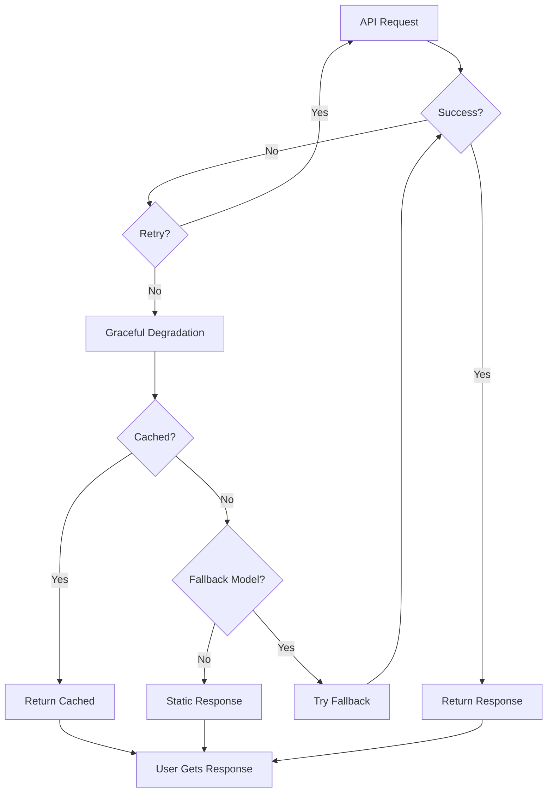

# Graceful Degradation

## Introduction

When AI APIs fail completely, your application should continue functioning at a reduced capacity rather than crashing. Graceful degradation provides fallback behaviors that maintain user experience during outages.

### What We'll Cover

- Fallback response strategies
- Cached response usage
- Model fallback chains
- Feature reduction modes
- Provider failover patterns

### Prerequisites

- Error handling basics
- Retry strategies

---

## Why Graceful Degradation



---

## Fallback Response Strategies

### Static Fallback Messages

```python
from dataclasses import dataclass
from typing import Optional

@dataclass
class FallbackResponse:
    content: str
    is_fallback: bool = True
    source: str = "static"

# Define fallback responses by intent
FALLBACK_RESPONSES = {
    "greeting": FallbackResponse(
        content="Hello! I'm currently experiencing some issues, but I'll try to help."
    ),
    "help": FallbackResponse(
        content="I apologize, but I'm having trouble processing requests right now. "
                "Please try again in a few minutes."
    ),
    "error": FallbackResponse(
        content="I encountered an issue processing your request. "
                "Our team has been notified."
    ),
    "default": FallbackResponse(
        content="I'm temporarily unavailable. Please try again shortly."
    )
}

def get_fallback_response(intent: str = "default") -> FallbackResponse:
    """Get appropriate fallback response for the intent."""
    return FALLBACK_RESPONSES.get(intent, FALLBACK_RESPONSES["default"])
```

### Intent Detection for Fallbacks

```python
import re

def detect_intent(user_message: str) -> str:
    """Simple intent detection for fallback selection."""
    
    message_lower = user_message.lower()
    
    if re.search(r"^(hi|hello|hey|greetings)", message_lower):
        return "greeting"
    
    if re.search(r"(help|assist|support|how do i)", message_lower):
        return "help"
    
    return "default"


def get_response_with_fallback(user_message: str, client) -> dict:
    """Get AI response with graceful fallback."""
    
    try:
        response = client.chat.completions.create(
            model="gpt-4.1",
            messages=[{"role": "user", "content": user_message}]
        )
        return {
            "content": response.choices[0].message.content,
            "is_fallback": False,
            "source": "api"
        }
    except Exception as e:
        intent = detect_intent(user_message)
        fallback = get_fallback_response(intent)
        return {
            "content": fallback.content,
            "is_fallback": True,
            "source": fallback.source,
            "error": str(e)
        }
```

---

## Cached Response Usage

### Response Cache Implementation

```python
import hashlib
import json
from datetime import datetime, timedelta
from typing import Optional, Dict, Any

class ResponseCache:
    """Cache for API responses with TTL."""
    
    def __init__(self, default_ttl: int = 3600):
        self._cache: Dict[str, Dict[str, Any]] = {}
        self.default_ttl = default_ttl
    
    def _hash_request(self, messages: list, model: str) -> str:
        """Create cache key from request parameters."""
        content = json.dumps({"messages": messages, "model": model}, sort_keys=True)
        return hashlib.sha256(content.encode()).hexdigest()[:16]
    
    def get(self, messages: list, model: str) -> Optional[str]:
        """Get cached response if valid."""
        key = self._hash_request(messages, model)
        entry = self._cache.get(key)
        
        if not entry:
            return None
        
        if datetime.now() > entry["expires"]:
            del self._cache[key]
            return None
        
        return entry["response"]
    
    def set(self, messages: list, model: str, response: str, ttl: int = None):
        """Cache a response."""
        key = self._hash_request(messages, model)
        self._cache[key] = {
            "response": response,
            "expires": datetime.now() + timedelta(seconds=ttl or self.default_ttl),
            "cached_at": datetime.now()
        }
    
    def clear_expired(self):
        """Remove expired entries."""
        now = datetime.now()
        self._cache = {
            k: v for k, v in self._cache.items()
            if v["expires"] > now
        }


# Global cache instance
response_cache = ResponseCache(default_ttl=1800)  # 30 minutes
```

### Using Cache as Fallback

```python
def get_response_with_cache_fallback(
    client,
    messages: list,
    model: str = "gpt-4.1"
) -> dict:
    """Get response with cache fallback on errors."""
    
    try:
        response = client.chat.completions.create(
            model=model,
            messages=messages
        )
        
        content = response.choices[0].message.content
        
        # Cache successful responses
        response_cache.set(messages, model, content)
        
        return {
            "content": content,
            "source": "api",
            "is_fallback": False
        }
    
    except Exception as e:
        # Try cache
        cached = response_cache.get(messages, model)
        
        if cached:
            return {
                "content": cached,
                "source": "cache",
                "is_fallback": True,
                "cache_note": "Using cached response due to API error"
            }
        
        # No cache available
        return {
            "content": FALLBACK_RESPONSES["error"].content,
            "source": "static",
            "is_fallback": True,
            "error": str(e)
        }
```

---

## Model Fallback Chains

### Ordered Model Fallbacks

```python
from openai import RateLimitError, InternalServerError

# Define fallback chains by capability
MODEL_FALLBACK_CHAINS = {
    "reasoning": ["o3", "o4-mini", "gpt-4.1"],
    "standard": ["gpt-4.1", "gpt-4.1-mini", "gpt-4.1-nano"],
    "fast": ["gpt-4.1-mini", "gpt-4.1-nano"],
}

def get_response_with_model_fallback(
    client,
    messages: list,
    chain: str = "standard",
    max_retries_per_model: int = 2
) -> dict:
    """Try models in fallback chain until one succeeds."""
    
    models = MODEL_FALLBACK_CHAINS.get(chain, MODEL_FALLBACK_CHAINS["standard"])
    last_error = None
    
    for model in models:
        for attempt in range(max_retries_per_model):
            try:
                response = client.chat.completions.create(
                    model=model,
                    messages=messages
                )
                
                return {
                    "content": response.choices[0].message.content,
                    "model_used": model,
                    "was_fallback": model != models[0],
                    "source": "api"
                }
            
            except (RateLimitError, InternalServerError) as e:
                last_error = e
                continue
            
            except Exception as e:
                # Non-retryable error, try next model
                last_error = e
                break
    
    # All models failed
    return {
        "content": FALLBACK_RESPONSES["error"].content,
        "source": "static",
        "is_fallback": True,
        "error": str(last_error),
        "models_tried": models
    }
```

---

## Provider Failover

### Multi-Provider Client

```python
from openai import OpenAI
import anthropic
from abc import ABC, abstractmethod

class AIProvider(ABC):
    """Abstract base for AI providers."""
    
    @abstractmethod
    def complete(self, messages: list) -> str:
        pass

class OpenAIProvider(AIProvider):
    def __init__(self, model: str = "gpt-4.1"):
        self.client = OpenAI()
        self.model = model
    
    def complete(self, messages: list) -> str:
        response = self.client.chat.completions.create(
            model=self.model,
            messages=messages
        )
        return response.choices[0].message.content

class AnthropicProvider(AIProvider):
    def __init__(self, model: str = "claude-sonnet-4-20250514"):
        self.client = anthropic.Anthropic()
        self.model = model
    
    def complete(self, messages: list) -> str:
        # Convert OpenAI format to Anthropic
        system = None
        anthropic_messages = []
        
        for msg in messages:
            if msg["role"] == "system":
                system = msg["content"]
            else:
                anthropic_messages.append({
                    "role": msg["role"],
                    "content": msg["content"]
                })
        
        response = self.client.messages.create(
            model=self.model,
            max_tokens=1024,
            system=system or "",
            messages=anthropic_messages
        )
        return response.content[0].text
```

### Provider Failover Manager

```python
class ProviderFailover:
    """Manage failover between AI providers."""
    
    def __init__(self):
        self.providers = [
            ("openai", OpenAIProvider()),
            ("anthropic", AnthropicProvider()),
        ]
    
    def complete(self, messages: list) -> dict:
        """Try providers in order until one succeeds."""
        
        errors = []
        
        for name, provider in self.providers:
            try:
                content = provider.complete(messages)
                return {
                    "content": content,
                    "provider": name,
                    "was_failover": name != self.providers[0][0],
                    "source": "api"
                }
            except Exception as e:
                errors.append(f"{name}: {e}")
                continue
        
        # All providers failed
        return {
            "content": FALLBACK_RESPONSES["error"].content,
            "source": "static",
            "is_fallback": True,
            "errors": errors
        }


# Usage
failover = ProviderFailover()
result = failover.complete([{"role": "user", "content": "Hello"}])
```

---

## Feature Reduction Mode

### Degraded Service Levels

```python
from enum import Enum
from typing import Callable

class ServiceLevel(Enum):
    FULL = "full"
    REDUCED = "reduced"
    MINIMAL = "minimal"
    OFFLINE = "offline"

class DegradedService:
    """Service that adapts based on API availability."""
    
    def __init__(self, client):
        self.client = client
        self.level = ServiceLevel.FULL
        self.consecutive_failures = 0
        self.failure_threshold = 3
    
    def _determine_level(self):
        """Adjust service level based on failures."""
        if self.consecutive_failures >= self.failure_threshold * 3:
            self.level = ServiceLevel.OFFLINE
        elif self.consecutive_failures >= self.failure_threshold * 2:
            self.level = ServiceLevel.MINIMAL
        elif self.consecutive_failures >= self.failure_threshold:
            self.level = ServiceLevel.REDUCED
        else:
            self.level = ServiceLevel.FULL
    
    def _record_success(self):
        self.consecutive_failures = max(0, self.consecutive_failures - 1)
        self._determine_level()
    
    def _record_failure(self):
        self.consecutive_failures += 1
        self._determine_level()
    
    def get_response(self, user_message: str) -> dict:
        """Get response based on current service level."""
        
        if self.level == ServiceLevel.OFFLINE:
            return {
                "content": "Service temporarily unavailable. Please try again later.",
                "service_level": "offline",
                "is_fallback": True
            }
        
        if self.level == ServiceLevel.MINIMAL:
            # Only allow simple queries
            return {
                "content": "Running in limited mode. Complex requests unavailable.",
                "service_level": "minimal",
                "is_fallback": True
            }
        
        # Try API for FULL or REDUCED
        try:
            model = "gpt-4.1" if self.level == ServiceLevel.FULL else "gpt-4.1-mini"
            
            response = self.client.chat.completions.create(
                model=model,
                messages=[{"role": "user", "content": user_message}],
                max_tokens=500 if self.level == ServiceLevel.REDUCED else 2000
            )
            
            self._record_success()
            
            return {
                "content": response.choices[0].message.content,
                "service_level": self.level.value,
                "is_fallback": False
            }
        
        except Exception as e:
            self._record_failure()
            
            return {
                "content": get_fallback_response(detect_intent(user_message)).content,
                "service_level": self.level.value,
                "is_fallback": True,
                "error": str(e)
            }
```

---

## JavaScript Implementation

```javascript
class GracefulDegradation {
    constructor(openaiClient, options = {}) {
        this.client = openaiClient;
        this.cache = new Map();
        this.cacheTTL = options.cacheTTL || 1800000; // 30 minutes
        this.fallbackModels = options.fallbackModels || ['gpt-4.1', 'gpt-4.1-mini'];
    }
    
    hashRequest(messages) {
        return JSON.stringify(messages);
    }
    
    getCached(messages) {
        const key = this.hashRequest(messages);
        const entry = this.cache.get(key);
        
        if (!entry) return null;
        if (Date.now() > entry.expires) {
            this.cache.delete(key);
            return null;
        }
        
        return entry.response;
    }
    
    setCache(messages, response) {
        const key = this.hashRequest(messages);
        this.cache.set(key, {
            response,
            expires: Date.now() + this.cacheTTL
        });
    }
    
    async getResponse(messages) {
        // Try each model in order
        for (const model of this.fallbackModels) {
            try {
                const response = await this.client.chat.completions.create({
                    model,
                    messages
                });
                
                const content = response.choices[0].message.content;
                this.setCache(messages, content);
                
                return {
                    content,
                    model,
                    source: 'api',
                    isFallback: model !== this.fallbackModels[0]
                };
            } catch (error) {
                console.warn(`Model ${model} failed:`, error.message);
                continue;
            }
        }
        
        // All models failed, try cache
        const cached = this.getCached(messages);
        if (cached) {
            return {
                content: cached,
                source: 'cache',
                isFallback: true
            };
        }
        
        // Last resort: static fallback
        return {
            content: "I'm temporarily unavailable. Please try again shortly.",
            source: 'static',
            isFallback: true
        };
    }
}

// Usage
const degradation = new GracefulDegradation(openai);
const result = await degradation.getResponse([
    { role: 'user', content: 'Hello' }
]);
console.log(`Response (${result.source}): ${result.content}`);
```

---

## Hands-on Exercise

### Your Task

Create a resilient response function with three fallback layers.

### Requirements

1. Try primary model first
2. Fall back to cheaper model on error
3. Use cached response if available
4. Return static fallback as last resort
5. Track which source was used

### Expected Result

```python
result = get_resilient_response(messages)
print(result["source"])  # "api", "cache", or "static"
print(result["is_fallback"])  # True/False
```

<details>
<summary>💡 Hints</summary>

- Use a try/except chain for each layer
- Check cache before static fallback
- Return consistent response format
</details>

<details>
<summary>✅ Solution</summary>

```python
def get_resilient_response(
    client,
    messages: list,
    cache: ResponseCache = None,
    primary_model: str = "gpt-4.1",
    fallback_model: str = "gpt-4.1-mini"
) -> dict:
    """Multi-layer fallback response system."""
    
    cache = cache or response_cache
    
    # Layer 1: Try primary model
    try:
        response = client.chat.completions.create(
            model=primary_model,
            messages=messages
        )
        content = response.choices[0].message.content
        cache.set(messages, primary_model, content)
        
        return {
            "content": content,
            "source": "api",
            "model": primary_model,
            "is_fallback": False
        }
    except Exception as e:
        print(f"Primary model failed: {e}")
    
    # Layer 2: Try fallback model
    try:
        response = client.chat.completions.create(
            model=fallback_model,
            messages=messages
        )
        content = response.choices[0].message.content
        cache.set(messages, fallback_model, content)
        
        return {
            "content": content,
            "source": "api",
            "model": fallback_model,
            "is_fallback": True
        }
    except Exception as e:
        print(f"Fallback model failed: {e}")
    
    # Layer 3: Try cache
    cached = cache.get(messages, primary_model) or cache.get(messages, fallback_model)
    if cached:
        return {
            "content": cached,
            "source": "cache",
            "is_fallback": True
        }
    
    # Layer 4: Static fallback
    user_message = next(
        (m["content"] for m in messages if m["role"] == "user"),
        ""
    )
    intent = detect_intent(user_message)
    fallback = get_fallback_response(intent)
    
    return {
        "content": fallback.content,
        "source": "static",
        "is_fallback": True
    }


# Test
result = get_resilient_response(
    client,
    [{"role": "user", "content": "What's the weather?"}]
)

print(f"Source: {result['source']}")
print(f"Fallback: {result['is_fallback']}")
print(f"Content: {result['content'][:100]}...")
```

</details>

---

## Summary

✅ Static fallback messages maintain user experience during outages  
✅ Response caching provides recent answers when API is unavailable  
✅ Model fallback chains try cheaper alternatives before failing  
✅ Provider failover switches between OpenAI and Anthropic  
✅ Feature reduction modes gracefully limit functionality

**Next:** [User-Friendly Error Messages](./05-user-friendly-messages.md)

---

## Further Reading

- [Graceful Degradation Patterns](https://docs.aws.amazon.com/wellarchitected/latest/reliability-pillar/graceful-degradation.html) — AWS reliability
- [Fault Tolerance](https://learn.microsoft.com/en-us/azure/architecture/framework/resiliency/design-patterns) — Azure patterns
- [Circuit Breaker Pattern](https://martinfowler.com/bliki/CircuitBreaker.html) — Martin Fowler

<!-- 
Sources Consulted:
- AWS Graceful Degradation: https://docs.aws.amazon.com/wellarchitected/latest/reliability-pillar/graceful-degradation.html
- Azure Resiliency: https://learn.microsoft.com/en-us/azure/architecture/framework/resiliency/
-->
