# Circuit Breaker Pattern

## Introduction

When an API repeatedly fails, continuing to send requests wastes resources and delays error handling. The circuit breaker pattern stops calling failing services, allowing them time to recover while providing fast failure responses.

### What We'll Cover

- Circuit breaker states and transitions
- Failure thresholds and recovery
- Implementing a circuit breaker
- Half-open testing strategy
- Per-endpoint circuit breakers

### Prerequisites

- Retry strategies
- Graceful degradation

---

## Circuit Breaker States

```mermaid
stateDiagram-v2
    [*] --> Closed
    
    Closed --> Open: Failures ≥ Threshold
    Closed --> Closed: Success (reset count)
    
    Open --> HalfOpen: Timeout expires
    
    HalfOpen --> Closed: Test request succeeds
    HalfOpen --> Open: Test request fails
```



| State | Behavior | Requests Allowed |
|-------|----------|------------------|
| **Closed** | Normal operation | All requests pass through |
| **Open** | Circuit tripped | All requests fail immediately |
| **Half-Open** | Testing recovery | One test request allowed |

---

## Basic Circuit Breaker

```python
import time
from enum import Enum
from threading import Lock
from typing import Callable, Optional

class CircuitState(Enum):
    CLOSED = "closed"
    OPEN = "open"
    HALF_OPEN = "half_open"

class CircuitBreaker:
    """Circuit breaker for protecting API calls."""
    
    def __init__(
        self,
        failure_threshold: int = 5,
        recovery_timeout: float = 60.0,
        success_threshold: int = 2
    ):
        self.failure_threshold = failure_threshold
        self.recovery_timeout = recovery_timeout
        self.success_threshold = success_threshold
        
        self._state = CircuitState.CLOSED
        self._failure_count = 0
        self._success_count = 0
        self._last_failure_time: Optional[float] = None
        self._lock = Lock()
    
    @property
    def state(self) -> CircuitState:
        """Get current state, checking for timeout transition."""
        with self._lock:
            if self._state == CircuitState.OPEN:
                if self._should_attempt_reset():
                    self._state = CircuitState.HALF_OPEN
            return self._state
    
    def _should_attempt_reset(self) -> bool:
        """Check if enough time has passed to try recovery."""
        if self._last_failure_time is None:
            return True
        return time.time() - self._last_failure_time >= self.recovery_timeout
    
    def call(self, func: Callable, *args, **kwargs):
        """Execute function through circuit breaker."""
        
        current_state = self.state
        
        if current_state == CircuitState.OPEN:
            raise CircuitOpenError(
                f"Circuit is open. Retry after {self._time_until_retry():.1f}s"
            )
        
        try:
            result = func(*args, **kwargs)
            self._record_success()
            return result
        except Exception as e:
            self._record_failure()
            raise
    
    def _record_success(self):
        """Record successful call."""
        with self._lock:
            if self._state == CircuitState.HALF_OPEN:
                self._success_count += 1
                if self._success_count >= self.success_threshold:
                    self._reset()
            else:
                self._failure_count = 0
    
    def _record_failure(self):
        """Record failed call."""
        with self._lock:
            self._failure_count += 1
            self._last_failure_time = time.time()
            
            if self._state == CircuitState.HALF_OPEN:
                self._trip()
            elif self._failure_count >= self.failure_threshold:
                self._trip()
    
    def _trip(self):
        """Open the circuit."""
        self._state = CircuitState.OPEN
        self._success_count = 0
    
    def _reset(self):
        """Close the circuit."""
        self._state = CircuitState.CLOSED
        self._failure_count = 0
        self._success_count = 0
        self._last_failure_time = None
    
    def _time_until_retry(self) -> float:
        """Time remaining until retry allowed."""
        if self._last_failure_time is None:
            return 0
        elapsed = time.time() - self._last_failure_time
        return max(0, self.recovery_timeout - elapsed)


class CircuitOpenError(Exception):
    """Raised when circuit is open."""
    pass
```

---

## Using the Circuit Breaker

```python
from openai import OpenAI, RateLimitError, InternalServerError

client = OpenAI()

# Create circuit breaker for OpenAI API
openai_circuit = CircuitBreaker(
    failure_threshold=5,      # Open after 5 failures
    recovery_timeout=60.0,    # Try again after 60 seconds
    success_threshold=2       # Close after 2 successes
)

def get_completion(prompt: str) -> str:
    """Get completion with circuit breaker protection."""
    
    def make_request():
        response = client.chat.completions.create(
            model="gpt-4.1",
            messages=[{"role": "user", "content": prompt}]
        )
        return response.choices[0].message.content
    
    try:
        return openai_circuit.call(make_request)
    except CircuitOpenError as e:
        # Return fallback when circuit is open
        return f"Service temporarily unavailable. {e}"
    except (RateLimitError, InternalServerError) as e:
        # These are recorded as failures by circuit breaker
        return f"Error: {e}"


# Usage
for i in range(10):
    result = get_completion("Hello")
    print(f"Request {i+1}: {openai_circuit.state.value} - {result[:50]}...")
```

---

## Circuit Breaker with Fallback

```python
class CircuitBreakerWithFallback:
    """Circuit breaker with integrated fallback handling."""
    
    def __init__(
        self,
        failure_threshold: int = 5,
        recovery_timeout: float = 60.0,
        fallback_fn: Callable = None
    ):
        self.breaker = CircuitBreaker(
            failure_threshold=failure_threshold,
            recovery_timeout=recovery_timeout
        )
        self.fallback_fn = fallback_fn
    
    def call(self, func: Callable, *args, **kwargs):
        """Execute with automatic fallback on circuit open."""
        
        try:
            return self.breaker.call(func, *args, **kwargs)
        except CircuitOpenError:
            if self.fallback_fn:
                return self.fallback_fn(*args, **kwargs)
            raise


# Usage with fallback
def fallback_response(prompt: str) -> str:
    return "I'm temporarily unavailable. Please try again later."

protected_api = CircuitBreakerWithFallback(
    failure_threshold=3,
    recovery_timeout=30.0,
    fallback_fn=fallback_response
)

result = protected_api.call(
    lambda p: client.chat.completions.create(
        model="gpt-4.1",
        messages=[{"role": "user", "content": p}]
    ).choices[0].message.content,
    "Hello"
)
```

---

## Per-Endpoint Circuit Breakers

```python
from typing import Dict

class CircuitBreakerRegistry:
    """Manage circuit breakers for different endpoints."""
    
    def __init__(self, default_config: dict = None):
        self._breakers: Dict[str, CircuitBreaker] = {}
        self.default_config = default_config or {
            "failure_threshold": 5,
            "recovery_timeout": 60.0,
            "success_threshold": 2
        }
    
    def get(self, endpoint: str) -> CircuitBreaker:
        """Get or create circuit breaker for endpoint."""
        if endpoint not in self._breakers:
            self._breakers[endpoint] = CircuitBreaker(**self.default_config)
        return self._breakers[endpoint]
    
    def call(self, endpoint: str, func: Callable, *args, **kwargs):
        """Call function through endpoint's circuit breaker."""
        return self.get(endpoint).call(func, *args, **kwargs)
    
    def status(self) -> Dict[str, str]:
        """Get status of all circuit breakers."""
        return {
            endpoint: breaker.state.value
            for endpoint, breaker in self._breakers.items()
        }


# Usage
registry = CircuitBreakerRegistry()

def call_openai(model: str, messages: list):
    endpoint = f"openai/{model}"
    
    def make_request():
        return client.chat.completions.create(
            model=model,
            messages=messages
        )
    
    return registry.call(endpoint, make_request)

# Different endpoints have separate breakers
call_openai("gpt-4.1", [{"role": "user", "content": "Hello"}])
call_openai("gpt-4.1-mini", [{"role": "user", "content": "Hello"}])

print(registry.status())
# {'openai/gpt-4.1': 'closed', 'openai/gpt-4.1-mini': 'closed'}
```

---

## Async Circuit Breaker

```python
import asyncio

class AsyncCircuitBreaker:
    """Async-compatible circuit breaker."""
    
    def __init__(
        self,
        failure_threshold: int = 5,
        recovery_timeout: float = 60.0,
        success_threshold: int = 2
    ):
        self.failure_threshold = failure_threshold
        self.recovery_timeout = recovery_timeout
        self.success_threshold = success_threshold
        
        self._state = CircuitState.CLOSED
        self._failure_count = 0
        self._success_count = 0
        self._last_failure_time: Optional[float] = None
        self._lock = asyncio.Lock()
    
    async def _check_state(self) -> CircuitState:
        """Check and potentially update state."""
        async with self._lock:
            if self._state == CircuitState.OPEN:
                if self._last_failure_time is None:
                    return self._state
                if time.time() - self._last_failure_time >= self.recovery_timeout:
                    self._state = CircuitState.HALF_OPEN
            return self._state
    
    async def call(self, func, *args, **kwargs):
        """Execute async function through circuit breaker."""
        
        current_state = await self._check_state()
        
        if current_state == CircuitState.OPEN:
            raise CircuitOpenError("Circuit is open")
        
        try:
            result = await func(*args, **kwargs)
            await self._record_success()
            return result
        except Exception as e:
            await self._record_failure()
            raise
    
    async def _record_success(self):
        async with self._lock:
            if self._state == CircuitState.HALF_OPEN:
                self._success_count += 1
                if self._success_count >= self.success_threshold:
                    self._state = CircuitState.CLOSED
                    self._failure_count = 0
                    self._success_count = 0
            else:
                self._failure_count = 0
    
    async def _record_failure(self):
        async with self._lock:
            self._failure_count += 1
            self._last_failure_time = time.time()
            
            if self._state == CircuitState.HALF_OPEN:
                self._state = CircuitState.OPEN
                self._success_count = 0
            elif self._failure_count >= self.failure_threshold:
                self._state = CircuitState.OPEN


# Usage with async client
from openai import AsyncOpenAI

async_client = AsyncOpenAI()
async_breaker = AsyncCircuitBreaker()

async def get_async_completion(prompt: str):
    async def request():
        response = await async_client.chat.completions.create(
            model="gpt-4.1",
            messages=[{"role": "user", "content": prompt}]
        )
        return response.choices[0].message.content
    
    return await async_breaker.call(request)
```

---

## JavaScript Implementation

```javascript
class CircuitBreaker {
    constructor({
        failureThreshold = 5,
        recoveryTimeout = 60000,
        successThreshold = 2
    } = {}) {
        this.failureThreshold = failureThreshold;
        this.recoveryTimeout = recoveryTimeout;
        this.successThreshold = successThreshold;
        
        this.state = 'closed';
        this.failureCount = 0;
        this.successCount = 0;
        this.lastFailureTime = null;
    }
    
    checkState() {
        if (this.state === 'open') {
            const elapsed = Date.now() - this.lastFailureTime;
            if (elapsed >= this.recoveryTimeout) {
                this.state = 'half_open';
            }
        }
        return this.state;
    }
    
    async call(fn) {
        const currentState = this.checkState();
        
        if (currentState === 'open') {
            const remaining = this.recoveryTimeout - (Date.now() - this.lastFailureTime);
            throw new CircuitOpenError(`Circuit open. Retry in ${Math.ceil(remaining / 1000)}s`);
        }
        
        try {
            const result = await fn();
            this.recordSuccess();
            return result;
        } catch (error) {
            this.recordFailure();
            throw error;
        }
    }
    
    recordSuccess() {
        if (this.state === 'half_open') {
            this.successCount++;
            if (this.successCount >= this.successThreshold) {
                this.reset();
            }
        } else {
            this.failureCount = 0;
        }
    }
    
    recordFailure() {
        this.failureCount++;
        this.lastFailureTime = Date.now();
        
        if (this.state === 'half_open' || this.failureCount >= this.failureThreshold) {
            this.trip();
        }
    }
    
    trip() {
        this.state = 'open';
        this.successCount = 0;
    }
    
    reset() {
        this.state = 'closed';
        this.failureCount = 0;
        this.successCount = 0;
        this.lastFailureTime = null;
    }
}

class CircuitOpenError extends Error {
    constructor(message) {
        super(message);
        this.name = 'CircuitOpenError';
    }
}

// Usage
const breaker = new CircuitBreaker({
    failureThreshold: 3,
    recoveryTimeout: 30000
});

async function getCompletion(prompt) {
    return breaker.call(async () => {
        const response = await openai.chat.completions.create({
            model: 'gpt-4.1',
            messages: [{ role: 'user', content: prompt }]
        });
        return response.choices[0].message.content;
    });
}
```

---

## Circuit Breaker Metrics

```python
from dataclasses import dataclass, field
from datetime import datetime
from typing import List

@dataclass
class CircuitBreakerMetrics:
    """Track circuit breaker statistics."""
    
    total_calls: int = 0
    successful_calls: int = 0
    failed_calls: int = 0
    rejected_calls: int = 0  # Calls rejected when open
    
    state_changes: List[dict] = field(default_factory=list)
    
    def record_call(self, success: bool):
        self.total_calls += 1
        if success:
            self.successful_calls += 1
        else:
            self.failed_calls += 1
    
    def record_rejection(self):
        self.total_calls += 1
        self.rejected_calls += 1
    
    def record_state_change(self, from_state: str, to_state: str):
        self.state_changes.append({
            "from": from_state,
            "to": to_state,
            "timestamp": datetime.now().isoformat()
        })
    
    @property
    def success_rate(self) -> float:
        actual_calls = self.successful_calls + self.failed_calls
        if actual_calls == 0:
            return 1.0
        return self.successful_calls / actual_calls
    
    def summary(self) -> dict:
        return {
            "total_calls": self.total_calls,
            "successful": self.successful_calls,
            "failed": self.failed_calls,
            "rejected": self.rejected_calls,
            "success_rate": f"{self.success_rate:.1%}",
            "state_changes": len(self.state_changes)
        }


class InstrumentedCircuitBreaker(CircuitBreaker):
    """Circuit breaker with metrics collection."""
    
    def __init__(self, *args, **kwargs):
        super().__init__(*args, **kwargs)
        self.metrics = CircuitBreakerMetrics()
    
    def call(self, func: Callable, *args, **kwargs):
        try:
            if self.state == CircuitState.OPEN:
                self.metrics.record_rejection()
                raise CircuitOpenError("Circuit is open")
            
            result = func(*args, **kwargs)
            self.metrics.record_call(success=True)
            self._record_success()
            return result
        
        except CircuitOpenError:
            raise
        except Exception as e:
            self.metrics.record_call(success=False)
            self._record_failure()
            raise
    
    def _trip(self):
        old_state = self._state.value
        super()._trip()
        self.metrics.record_state_change(old_state, self._state.value)
    
    def _reset(self):
        old_state = self._state.value
        super()._reset()
        self.metrics.record_state_change(old_state, self._state.value)
```

---

## Hands-on Exercise

### Your Task

Implement a circuit breaker with configurable thresholds and metrics.

### Requirements

1. Configurable failure and success thresholds
2. Track call statistics
3. Log state changes
4. Provide status summary

### Expected Result

```python
breaker = CustomCircuitBreaker(failure_threshold=3, recovery_timeout=30)

for i in range(10):
    try:
        breaker.call(potentially_failing_function)
    except Exception as e:
        print(f"Call {i}: {e}")

print(breaker.get_summary())
# {'state': 'open', 'failures': 3, 'success_rate': '0.0%'}
```

<details>
<summary>💡 Hints</summary>

- Track state transitions in a list
- Calculate success rate from successful / (successful + failed)
- Use time.time() for timeout tracking
</details>

<details>
<summary>✅ Solution</summary>

```python
import time
from enum import Enum
from typing import Callable, List, Dict

class State(Enum):
    CLOSED = "closed"
    OPEN = "open"
    HALF_OPEN = "half_open"

class CustomCircuitBreaker:
    def __init__(
        self,
        failure_threshold: int = 5,
        recovery_timeout: float = 60.0,
        success_threshold: int = 2
    ):
        self.failure_threshold = failure_threshold
        self.recovery_timeout = recovery_timeout
        self.success_threshold = success_threshold
        
        self._state = State.CLOSED
        self._failure_count = 0
        self._success_count = 0
        self._last_failure_time = None
        
        # Metrics
        self._total_success = 0
        self._total_failure = 0
        self._total_rejected = 0
        self._state_log: List[Dict] = []
    
    @property
    def state(self) -> State:
        if self._state == State.OPEN:
            if self._last_failure_time:
                if time.time() - self._last_failure_time >= self.recovery_timeout:
                    self._transition_to(State.HALF_OPEN)
        return self._state
    
    def _transition_to(self, new_state: State):
        old = self._state.value
        self._state = new_state
        self._state_log.append({
            "from": old,
            "to": new_state.value,
            "time": time.strftime("%H:%M:%S")
        })
        print(f"Circuit: {old} → {new_state.value}")
    
    def call(self, func: Callable, *args, **kwargs):
        current = self.state
        
        if current == State.OPEN:
            self._total_rejected += 1
            remaining = self.recovery_timeout - (time.time() - self._last_failure_time)
            raise Exception(f"Circuit OPEN. Retry in {remaining:.1f}s")
        
        try:
            result = func(*args, **kwargs)
            self._on_success()
            return result
        except Exception as e:
            self._on_failure()
            raise
    
    def _on_success(self):
        self._total_success += 1
        
        if self._state == State.HALF_OPEN:
            self._success_count += 1
            if self._success_count >= self.success_threshold:
                self._transition_to(State.CLOSED)
                self._failure_count = 0
                self._success_count = 0
        else:
            self._failure_count = 0
    
    def _on_failure(self):
        self._total_failure += 1
        self._failure_count += 1
        self._last_failure_time = time.time()
        
        if self._state == State.HALF_OPEN:
            self._transition_to(State.OPEN)
            self._success_count = 0
        elif self._failure_count >= self.failure_threshold:
            self._transition_to(State.OPEN)
    
    def get_summary(self) -> dict:
        total_executed = self._total_success + self._total_failure
        success_rate = (
            self._total_success / total_executed * 100
            if total_executed > 0 else 100
        )
        
        return {
            "state": self._state.value,
            "failures": self._failure_count,
            "success_rate": f"{success_rate:.1f}%",
            "total_calls": total_executed + self._total_rejected,
            "rejected": self._total_rejected,
            "state_changes": len(self._state_log)
        }


# Test with simulated failures
import random

breaker = CustomCircuitBreaker(failure_threshold=3, recovery_timeout=5)

def flaky_function():
    if random.random() < 0.7:  # 70% failure rate
        raise Exception("API Error")
    return "Success"

for i in range(10):
    try:
        result = breaker.call(flaky_function)
        print(f"Call {i+1}: {result}")
    except Exception as e:
        print(f"Call {i+1}: {e}")

print("\nSummary:", breaker.get_summary())
```

</details>

---

## Summary

✅ Circuit breaker prevents overwhelming failing services  
✅ Three states: Closed (normal), Open (failing fast), Half-Open (testing)  
✅ Failure threshold triggers circuit opening  
✅ Recovery timeout allows periodic health checks  
✅ Success threshold confirms service recovery

**Next:** [Model-Specific Errors](./07-model-specific-errors.md)

---

## Further Reading

- [Circuit Breaker](https://martinfowler.com/bliki/CircuitBreaker.html) — Martin Fowler
- [Resilience4j](https://resilience4j.readme.io/docs/circuitbreaker) — Java implementation
- [Azure Circuit Breaker](https://learn.microsoft.com/en-us/azure/architecture/patterns/circuit-breaker) — Microsoft patterns

<!-- 
Sources Consulted:
- Martin Fowler Circuit Breaker: https://martinfowler.com/bliki/CircuitBreaker.html
- Azure Circuit Breaker Pattern: https://learn.microsoft.com/en-us/azure/architecture/patterns/circuit-breaker
-->
