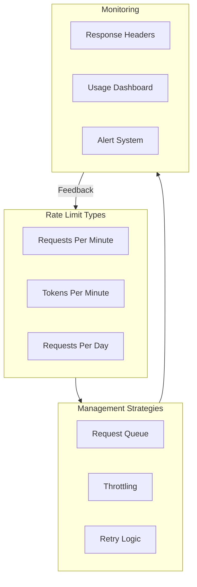

# Rate Limiting & Quotas

## Overview

API rate limiting protects services from abuse while ensuring fair resource distribution. Understanding and managing rate limits is essential for building reliable AI applications that scale without hitting unexpected walls.

### What You'll Learn

This lesson covers the complete landscape of rate limiting for AI APIs, from understanding different limit types to implementing sophisticated management strategies.

---

## Lesson Structure

| # | Topic | Description |
|---|-------|-------------|
| 01 | [Understanding Rate Limits](./01-understanding-rate-limits.md) | RPM, TPM, tiers, and how limits work |
| 02 | [Rate Limit Headers](./02-rate-limit-headers.md) | Reading and interpreting response headers |
| 03 | [Tier-Based Limits](./03-tier-based-limits.md) | OpenAI tier system and promotion |
| 04 | [Quota Management](./04-quota-management.md) | Monthly quotas and spending limits |
| 05 | [Request Queuing](./05-request-queuing.md) | Queue implementation and priorities |
| 06 | [Throttling Strategies](./06-throttling-strategies.md) | Token bucket, sliding window algorithms |
| 07 | [Handling 429 Errors](./07-handling-429-errors.md) | Retry-after and automatic recovery |
| 08 | [Usage Monitoring](./08-usage-monitoring.md) | Tracking, dashboards, and alerts |
| 09 | [Service Tier Routing](./09-service-tier-routing.md) | Auto, flex, and priority tiers |

---

## Rate Limit Concepts



---

## Key Concepts

### Rate Limit Types

| Limit | Description | Typical Range |
|-------|-------------|---------------|
| **RPM** | Requests per minute | 500 - 10,000 |
| **TPM** | Tokens per minute | 30K - 30M |
| **RPD** | Requests per day | 200 - unlimited |
| **IPM** | Images per minute | 7 - 50 |

### Rate Limit Hierarchy

```
Organization Limit
    └── Project Limit (optional)
        └── API Key Limit
            └── Model-Specific Limit
```

---

## Quick Reference

### Response Headers

```
x-ratelimit-limit-requests: 10000
x-ratelimit-remaining-requests: 9500
x-ratelimit-reset-requests: 6s
x-ratelimit-limit-tokens: 1000000
x-ratelimit-remaining-tokens: 950000
x-ratelimit-reset-tokens: 1m
```

### Handling Rate Limits

```python
from openai import RateLimitError
import time

try:
    response = client.chat.completions.create(...)
except RateLimitError as e:
    retry_after = e.response.headers.get("retry-after", 60)
    time.sleep(int(retry_after))
    # Retry request
```

---

## Prerequisites

Before starting this lesson, you should understand:

- Error handling patterns
- HTTP headers and status codes
- Asynchronous programming basics

---

## Learning Path

1. **Start with concepts** — Understand RPM, TPM, and tier systems
2. **Learn to read headers** — Extract rate limit info from responses
3. **Implement queuing** — Build request queues for high-volume apps
4. **Add monitoring** — Track usage and set up alerts
5. **Optimize routing** — Use service tiers strategically

---

## Navigation

**Previous:** [Error Handling](../06-error-handling/00-error-handling.md)

**Next:** [Cost Management](../08-cost-management.md)

**Start Lesson:** [Understanding Rate Limits](./01-understanding-rate-limits.md)
