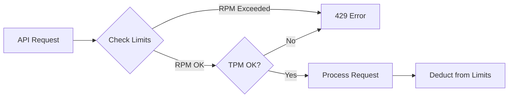

# Understanding Rate Limits

## Introduction

Rate limits protect API services from abuse and ensure fair access for all users. Understanding how different limit types interact helps you design applications that maximize throughput without hitting walls.

### What We'll Cover

- Requests Per Minute (RPM)
- Tokens Per Minute (TPM)
- Requests Per Day (RPD)
- Images and audio limits
- How limits interact

### Prerequisites

- Basic API concepts
- Error handling fundamentals

---

## Rate Limit Types



### Requests Per Minute (RPM)

Limits how many API calls you can make per minute, regardless of size:

```python
# Each of these counts as 1 request toward RPM
client.chat.completions.create(...)  # Request 1
client.chat.completions.create(...)  # Request 2
client.chat.completions.create(...)  # Request 3

# RPM doesn't care about token count
# A 10-token request = 1 RPM
# A 10,000-token request = 1 RPM
```

### Tokens Per Minute (TPM)

Limits total tokens (input + output) processed per minute:

```python
# Example: TPM limit of 60,000 tokens/minute

# Request 1: 5,000 input + 2,000 output = 7,000 tokens
response1 = client.chat.completions.create(
    model="gpt-4.1",
    messages=[{"role": "user", "content": long_document}]  # 5,000 tokens
)
# Output: 2,000 tokens
# Remaining TPM: 53,000

# Request 2: Would use 40,000 tokens total
response2 = client.chat.completions.create(
    model="gpt-4.1",
    messages=[{"role": "user", "content": another_document}]  # 35,000 tokens
)
# Output: 5,000 tokens
# Remaining TPM: 13,000

# Request 3: Needs 20,000 tokens - WOULD EXCEED LIMIT
# This would trigger 429 error
```

### Requests Per Day (RPD)

Daily limits for certain tiers or endpoints:

```python
# Tier 1 accounts: 200 requests per day on some models
# Tier 5 accounts: Usually unlimited RPD

# RPD resets at midnight UTC
from datetime import datetime, timezone

def get_rpd_reset_time():
    """Calculate time until RPD reset."""
    now = datetime.now(timezone.utc)
    midnight = now.replace(hour=0, minute=0, second=0, microsecond=0)
    if now.hour >= 0:
        from datetime import timedelta
        midnight += timedelta(days=1)
    return midnight - now
```

---

## Special Limit Types

### Images Per Minute (IPM)

For vision models processing images:

```python
# IPM counts images, not requests
# A request with 3 images = 3 toward IPM limit

messages = [
    {
        "role": "user",
        "content": [
            {"type": "text", "text": "Compare these images"},
            {"type": "image_url", "image_url": {"url": "..."}},  # Image 1
            {"type": "image_url", "image_url": {"url": "..."}},  # Image 2
            {"type": "image_url", "image_url": {"url": "..."}}   # Image 3
        ]
    }
]

# This single request uses:
# - 1 RPM
# - Tokens based on image sizes
# - 3 IPM
```

### Audio Tokens

For models processing audio input:

```python
# Audio tokens are calculated differently
# ~1 token per ~10ms of audio

# 1 minute of audio ≈ 6,000 audio tokens
# Audio tokens count against TPM limits

response = client.chat.completions.create(
    model="gpt-4o-audio-preview",
    messages=[
        {
            "role": "user",
            "content": [
                {
                    "type": "input_audio",
                    "input_audio": {"data": base64_audio, "format": "wav"}
                }
            ]
        }
    ]
)

# Check audio token usage
usage = response.usage
if hasattr(usage, "prompt_tokens_details"):
    audio_tokens = getattr(usage.prompt_tokens_details, "audio_tokens", 0)
    print(f"Audio tokens used: {audio_tokens}")
```

---

## How Limits Interact

### Parallel Limits

All limits are checked simultaneously:

```python
# You must stay under ALL applicable limits

# Example: Tier 3 limits
# RPM: 5,000 requests/minute
# TPM: 800,000 tokens/minute
# RPD: Unlimited

# Scenario 1: Many small requests
# 6,000 requests × 50 tokens = 300,000 tokens
# Result: RPM exceeded (>5,000), even though TPM is fine

# Scenario 2: Few large requests  
# 100 requests × 10,000 tokens = 1,000,000 tokens
# Result: TPM exceeded (>800,000), even though RPM is fine
```

### Limit Calculation

```python
from dataclasses import dataclass

@dataclass
class RateLimitStatus:
    rpm_used: int
    rpm_limit: int
    tpm_used: int
    tpm_limit: int
    
    @property
    def rpm_remaining(self) -> int:
        return self.rpm_limit - self.rpm_used
    
    @property
    def tpm_remaining(self) -> int:
        return self.tpm_limit - self.tpm_used
    
    @property
    def can_make_request(self) -> bool:
        return self.rpm_remaining > 0 and self.tpm_remaining > 0
    
    def can_fit_tokens(self, estimated_tokens: int) -> bool:
        """Check if a request with estimated tokens would fit."""
        return (
            self.rpm_remaining > 0 and 
            self.tpm_remaining >= estimated_tokens
        )


# Usage
status = RateLimitStatus(
    rpm_used=4500,
    rpm_limit=5000,
    tpm_used=750000,
    tpm_limit=800000
)

print(f"RPM remaining: {status.rpm_remaining}")  # 500
print(f"TPM remaining: {status.tpm_remaining}")  # 50,000
print(f"Can fit 10K tokens: {status.can_fit_tokens(10000)}")  # True
print(f"Can fit 100K tokens: {status.can_fit_tokens(100000)}")  # False
```

---

## Limit Reset Behavior

### Rolling Window

Most limits use a rolling window, not fixed intervals:

```python
import time
from collections import deque
from dataclasses import dataclass, field

@dataclass
class RollingWindowTracker:
    """Track usage over a rolling time window."""
    
    window_seconds: int = 60
    requests: deque = field(default_factory=deque)
    tokens: deque = field(default_factory=deque)
    
    def _cleanup(self):
        """Remove entries outside the window."""
        cutoff = time.time() - self.window_seconds
        
        while self.requests and self.requests[0][0] < cutoff:
            self.requests.popleft()
        
        while self.tokens and self.tokens[0][0] < cutoff:
            self.tokens.popleft()
    
    def record_request(self, token_count: int):
        """Record a request with its token count."""
        now = time.time()
        self.requests.append((now, 1))
        self.tokens.append((now, token_count))
    
    def get_usage(self) -> dict:
        """Get current usage in the window."""
        self._cleanup()
        
        return {
            "requests": sum(r[1] for r in self.requests),
            "tokens": sum(t[1] for t in self.tokens)
        }


# Usage
tracker = RollingWindowTracker(window_seconds=60)

tracker.record_request(5000)
tracker.record_request(3000)

usage = tracker.get_usage()
print(f"Requests in window: {usage['requests']}")  # 2
print(f"Tokens in window: {usage['tokens']}")  # 8000
```

---

## Model-Specific Limits

Different models have different limits:

| Model | Typical RPM | Typical TPM |
|-------|-------------|-------------|
| `gpt-4.1` | 500 - 10,000 | 30K - 10M |
| `gpt-4.1-mini` | 500 - 30,000 | 200K - 150M |
| `o3` | 100 - 1,000 | 10K - 1M |
| `o4-mini` | 100 - 5,000 | 50K - 5M |

```python
# Check limits for specific models
def get_model_limits(model: str, tier: int) -> dict:
    """Get estimated limits based on model and tier."""
    
    # Simplified example - actual limits vary
    base_limits = {
        "gpt-4.1": {"rpm": 500, "tpm": 30000},
        "gpt-4.1-mini": {"rpm": 500, "tpm": 200000},
        "o3": {"rpm": 100, "tpm": 10000},
        "o4-mini": {"rpm": 100, "tpm": 50000}
    }
    
    # Tier multipliers (approximate)
    tier_multipliers = {
        1: 1,
        2: 2,
        3: 10,
        4: 20,
        5: 50
    }
    
    base = base_limits.get(model, {"rpm": 500, "tpm": 30000})
    multiplier = tier_multipliers.get(tier, 1)
    
    return {
        "rpm": base["rpm"] * multiplier,
        "tpm": base["tpm"] * multiplier
    }
```

---

## Hands-on Exercise

### Your Task

Create a rate limit checker that tracks usage and warns before limits.

### Requirements

1. Track both RPM and TPM
2. Use rolling window (60 seconds)
3. Warn at 80% capacity
4. Block at 100% capacity

### Expected Result

```python
checker = RateLimitChecker(rpm_limit=5000, tpm_limit=800000)

result = checker.check_request(estimated_tokens=5000)
print(result)
# {'allowed': True, 'rpm_percent': 0.02, 'tpm_percent': 0.625}
```

<details>
<summary>💡 Hints</summary>

- Use collections.deque for efficient window management
- Store (timestamp, value) tuples
- Clean up old entries before checking
</details>

<details>
<summary>✅ Solution</summary>

```python
import time
from collections import deque
from dataclasses import dataclass, field
from typing import Tuple

@dataclass
class RateLimitChecker:
    rpm_limit: int
    tpm_limit: int
    window_seconds: int = 60
    warn_threshold: float = 0.8
    
    _requests: deque = field(default_factory=deque)
    _tokens: deque = field(default_factory=deque)
    
    def _cleanup(self):
        """Remove old entries outside window."""
        cutoff = time.time() - self.window_seconds
        
        while self._requests and self._requests[0][0] < cutoff:
            self._requests.popleft()
        
        while self._tokens and self._tokens[0][0] < cutoff:
            self._tokens.popleft()
    
    def _get_current_usage(self) -> Tuple[int, int]:
        """Get current request and token counts."""
        self._cleanup()
        requests = len(self._requests)
        tokens = sum(t[1] for t in self._tokens)
        return requests, tokens
    
    def check_request(self, estimated_tokens: int) -> dict:
        """Check if a request can proceed."""
        current_requests, current_tokens = self._get_current_usage()
        
        # Calculate usage after this request
        new_requests = current_requests + 1
        new_tokens = current_tokens + estimated_tokens
        
        rpm_percent = new_requests / self.rpm_limit
        tpm_percent = new_tokens / self.tpm_limit
        
        # Determine status
        allowed = rpm_percent <= 1.0 and tpm_percent <= 1.0
        warning = rpm_percent >= self.warn_threshold or tpm_percent >= self.warn_threshold
        
        result = {
            "allowed": allowed,
            "rpm_percent": round(rpm_percent * 100, 2),
            "tpm_percent": round(tpm_percent * 100, 2),
            "rpm_remaining": max(0, self.rpm_limit - new_requests),
            "tpm_remaining": max(0, self.tpm_limit - new_tokens)
        }
        
        if warning and allowed:
            result["warning"] = "Approaching rate limit"
        
        if not allowed:
            if rpm_percent > 1.0:
                result["blocked_by"] = "RPM limit exceeded"
            else:
                result["blocked_by"] = "TPM limit exceeded"
        
        return result
    
    def record_request(self, token_count: int):
        """Record a completed request."""
        now = time.time()
        self._requests.append((now, 1))
        self._tokens.append((now, token_count))
    
    def get_status(self) -> dict:
        """Get current usage status."""
        requests, tokens = self._get_current_usage()
        
        return {
            "rpm_used": requests,
            "rpm_limit": self.rpm_limit,
            "rpm_percent": round(requests / self.rpm_limit * 100, 2),
            "tpm_used": tokens,
            "tpm_limit": self.tpm_limit,
            "tpm_percent": round(tokens / self.tpm_limit * 100, 2)
        }


# Test
checker = RateLimitChecker(rpm_limit=5000, tpm_limit=800000)

# Simulate some requests
for i in range(100):
    result = checker.check_request(5000)
    if result["allowed"]:
        checker.record_request(5000)
    else:
        print(f"Blocked at request {i}: {result['blocked_by']}")
        break

print("\nFinal status:", checker.get_status())
```

</details>

---

## Summary

✅ RPM limits total requests regardless of size  
✅ TPM limits total tokens (input + output) per minute  
✅ Multiple limits are checked simultaneously  
✅ Different models have different limits  
✅ Limits typically use rolling windows, not fixed intervals

**Next:** [Rate Limit Headers](./02-rate-limit-headers.md)

---

## Further Reading

- [OpenAI Rate Limits](https://platform.openai.com/docs/guides/rate-limits) — Official documentation
- [Rate Limit Headers](https://platform.openai.com/docs/guides/rate-limits/rate-limit-headers) — Header reference
- [Usage Tiers](https://platform.openai.com/docs/guides/rate-limits/usage-tiers) — Tier system

<!-- 
Sources Consulted:
- OpenAI Rate Limits Guide: https://platform.openai.com/docs/guides/rate-limits
- OpenAI Usage Tiers: https://platform.openai.com/docs/guides/rate-limits/usage-tiers
-->
