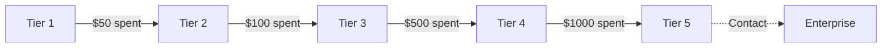

# Tier-Based Rate Limits

## Introduction

OpenAI uses a tier system to scale rate limits based on account history and usage. Understanding tiers helps you plan capacity and know when you can expect higher limits.

### What We'll Cover

- Tier 1-5 system overview
- Limits per tier
- Automatic tier promotion
- Enterprise tier options
- Strategies for tier advancement

### Prerequisites

- Understanding rate limits
- API account setup

---

## Tier System Overview



### Tier Qualification

| Tier | Qualification | Typical Wait |
|------|---------------|--------------|
| **Tier 1** | Account verification | Immediate |
| **Tier 2** | $50+ spent, 7+ days old | Automatic |
| **Tier 3** | $100+ spent, 7+ days old | Automatic |
| **Tier 4** | $500+ spent, 14+ days old | Automatic |
| **Tier 5** | $1,000+ spent, 30+ days old | Automatic |
| **Enterprise** | Contact sales | Custom |

---

## Rate Limits by Tier

### GPT-4.1 Family

| Tier | RPM | TPM | RPD |
|------|-----|-----|-----|
| Tier 1 | 500 | 30,000 | 500 |
| Tier 2 | 5,000 | 450,000 | — |
| Tier 3 | 5,000 | 800,000 | — |
| Tier 4 | 10,000 | 2,000,000 | — |
| Tier 5 | 10,000 | 10,000,000 | — |

### GPT-4.1 Mini

| Tier | RPM | TPM |
|------|-----|-----|
| Tier 1 | 500 | 200,000 |
| Tier 2 | 5,000 | 4,000,000 |
| Tier 3 | 5,000 | 10,000,000 |
| Tier 4 | 10,000 | 50,000,000 |
| Tier 5 | 30,000 | 150,000,000 |

### Reasoning Models (o-series)

| Tier | RPM | TPM |
|------|-----|-----|
| Tier 1 | 100 | 10,000 |
| Tier 2 | 500 | 50,000 |
| Tier 3 | 1,000 | 200,000 |
| Tier 4 | 2,000 | 500,000 |
| Tier 5 | 5,000 | 5,000,000 |

---

## Checking Your Tier

### Via Dashboard

```python
# Tier is visible in OpenAI dashboard under:
# Settings → Limits → Usage tier

# No direct API to query tier, but you can infer from limits:
def estimate_tier_from_limits(rpm: int, tpm: int, model: str = "gpt-4.1") -> str:
    """Estimate tier based on observed limits."""
    
    tier_thresholds = {
        "gpt-4.1": [
            (10000, 10000000, 5),
            (10000, 2000000, 4),
            (5000, 800000, 3),
            (5000, 450000, 2),
            (500, 30000, 1)
        ]
    }
    
    thresholds = tier_thresholds.get(model, tier_thresholds["gpt-4.1"])
    
    for min_rpm, min_tpm, tier in thresholds:
        if rpm >= min_rpm and tpm >= min_tpm:
            return f"Tier {tier}"
    
    return "Tier 1 or below"
```

### From Response Headers

```python
def detect_tier_from_response(response) -> dict:
    """Detect approximate tier from response headers."""
    
    headers = dict(response.headers) if hasattr(response, "headers") else {}
    
    rpm_limit = int(headers.get("x-ratelimit-limit-requests", 0))
    tpm_limit = int(headers.get("x-ratelimit-limit-tokens", 0))
    
    estimated_tier = estimate_tier_from_limits(rpm_limit, tpm_limit)
    
    return {
        "estimated_tier": estimated_tier,
        "rpm_limit": rpm_limit,
        "tpm_limit": tpm_limit
    }
```

---

## Tier Promotion

### Automatic Promotion

Tier promotion happens automatically based on:

1. **Cumulative spending** — Total amount spent on API usage
2. **Account age** — How long the account has existed
3. **Payment history** — Successful payment track record

```python
from dataclasses import dataclass
from datetime import datetime, timedelta

@dataclass
class TierRequirements:
    tier: int
    min_spend: float
    min_age_days: int
    
    def is_met(self, total_spent: float, account_created: datetime) -> bool:
        age_days = (datetime.now() - account_created).days
        return total_spent >= self.min_spend and age_days >= self.min_age_days

TIER_REQUIREMENTS = [
    TierRequirements(tier=2, min_spend=50, min_age_days=7),
    TierRequirements(tier=3, min_spend=100, min_age_days=7),
    TierRequirements(tier=4, min_spend=500, min_age_days=14),
    TierRequirements(tier=5, min_spend=1000, min_age_days=30),
]

def check_next_tier(current_tier: int, total_spent: float, account_created: datetime) -> dict:
    """Check if eligible for next tier."""
    
    next_tier = current_tier + 1
    
    if next_tier > 5:
        return {"eligible": False, "message": "Already at maximum tier"}
    
    requirement = TIER_REQUIREMENTS[next_tier - 2]  # -2 because list is 0-indexed from tier 2
    
    if requirement.is_met(total_spent, account_created):
        return {
            "eligible": True,
            "next_tier": next_tier,
            "message": f"Eligible for Tier {next_tier}"
        }
    
    # Calculate what's needed
    age_days = (datetime.now() - account_created).days
    spend_needed = max(0, requirement.min_spend - total_spent)
    days_needed = max(0, requirement.min_age_days - age_days)
    
    return {
        "eligible": False,
        "next_tier": next_tier,
        "spend_needed": spend_needed,
        "days_needed": days_needed,
        "message": f"Need ${spend_needed:.2f} more and {days_needed} more days"
    }
```

---

## Tier-Aware Rate Limiting

### Adapting to Tier Limits

```python
from dataclasses import dataclass
from typing import Dict

@dataclass
class TierLimits:
    rpm: int
    tpm: int
    rpd: int = -1  # -1 means unlimited

TIER_LIMITS: Dict[int, Dict[str, TierLimits]] = {
    1: {
        "gpt-4.1": TierLimits(rpm=500, tpm=30000, rpd=500),
        "gpt-4.1-mini": TierLimits(rpm=500, tpm=200000),
        "o4-mini": TierLimits(rpm=100, tpm=10000)
    },
    3: {
        "gpt-4.1": TierLimits(rpm=5000, tpm=800000),
        "gpt-4.1-mini": TierLimits(rpm=5000, tpm=10000000),
        "o4-mini": TierLimits(rpm=1000, tpm=200000)
    },
    5: {
        "gpt-4.1": TierLimits(rpm=10000, tpm=10000000),
        "gpt-4.1-mini": TierLimits(rpm=30000, tpm=150000000),
        "o4-mini": TierLimits(rpm=5000, tpm=5000000)
    }
}

class TierAwareRateLimiter:
    """Rate limiter that adapts to account tier."""
    
    def __init__(self, tier: int = 1):
        self.tier = tier
        self._update_limits()
    
    def _update_limits(self):
        """Update limits based on tier."""
        self.limits = TIER_LIMITS.get(self.tier, TIER_LIMITS[1])
    
    def set_tier(self, tier: int):
        """Update tier and recalculate limits."""
        self.tier = tier
        self._update_limits()
    
    def get_limits(self, model: str) -> TierLimits:
        """Get limits for a specific model."""
        return self.limits.get(model, TierLimits(rpm=500, tpm=30000))
    
    def calculate_max_concurrent(self, model: str, avg_tokens_per_request: int) -> int:
        """Calculate max concurrent requests to stay under limits."""
        limits = self.get_limits(model)
        
        # Based on RPM
        rpm_concurrent = limits.rpm // 60  # Requests per second
        
        # Based on TPM
        tpm_concurrent = limits.tpm // 60 // avg_tokens_per_request
        
        # Use the lower of the two
        return min(rpm_concurrent, tpm_concurrent)


# Usage
limiter = TierAwareRateLimiter(tier=3)

limits = limiter.get_limits("gpt-4.1")
print(f"Tier 3 GPT-4.1 limits: {limits.rpm} RPM, {limits.tpm} TPM")

max_concurrent = limiter.calculate_max_concurrent("gpt-4.1", avg_tokens_per_request=2000)
print(f"Max concurrent requests: {max_concurrent}")
```

---

## Strategies for Tier Advancement

### Accelerating Spend

```python
# Options to increase spending (and tier):

# 1. Process more data through the API
# - Backfill historical data
# - Run batch processing jobs
# - Expand use cases

# 2. Use higher-capability models
# - gpt-4.1 instead of gpt-4.1-mini
# - o3 for complex reasoning tasks

# 3. Increase max_tokens for longer outputs
# - More output tokens = more cost = faster tier advancement

# Note: Don't waste money just to advance tiers
# The goal is sustainable usage growth
```

### Using Multiple Accounts (With Caution)

```python
# For organizations needing higher limits before qualifying:

# Option 1: Multiple projects within same org
# - Each project can have separate API keys
# - Limits may be shared or separate (check docs)

# Option 2: Contact sales for Enterprise
# - Custom limits
# - SLAs and support
# - Volume discounts

# ⚠️ Warning: Creating multiple accounts to circumvent limits
# may violate Terms of Service
```

---

## Enterprise Tier

### Custom Limits

```python
# Enterprise tier offers:
# - Custom RPM and TPM limits
# - Dedicated capacity (optional)
# - SLA guarantees
# - Priority support
# - Volume discounts
# - Private model deployments (some cases)

# Contact: sales@openai.com for enterprise pricing

ENTERPRISE_FEATURES = {
    "custom_limits": True,
    "sla_guarantee": True,
    "dedicated_support": True,
    "volume_discounts": True,
    "custom_contracts": True,
    "private_endpoints": "Some cases"
}
```

### When to Consider Enterprise

```python
def should_consider_enterprise(
    monthly_spend: float,
    required_rpm: int,
    required_tpm: int,
    needs_sla: bool
) -> dict:
    """Evaluate if Enterprise tier is appropriate."""
    
    tier5_limits = TIER_LIMITS[5]["gpt-4.1"]
    
    reasons = []
    
    if monthly_spend > 10000:
        reasons.append("High monthly spend - eligible for volume discounts")
    
    if required_rpm > tier5_limits.rpm:
        reasons.append(f"Required RPM ({required_rpm}) exceeds Tier 5 ({tier5_limits.rpm})")
    
    if required_tpm > tier5_limits.tpm:
        reasons.append(f"Required TPM ({required_tpm}) exceeds Tier 5 ({tier5_limits.tpm})")
    
    if needs_sla:
        reasons.append("SLA requirements for production")
    
    return {
        "recommend_enterprise": len(reasons) >= 2,
        "reasons": reasons
    }
```

---

## JavaScript Implementation

```javascript
const TIER_LIMITS = {
    1: {
        'gpt-4.1': { rpm: 500, tpm: 30000, rpd: 500 },
        'gpt-4.1-mini': { rpm: 500, tpm: 200000 }
    },
    3: {
        'gpt-4.1': { rpm: 5000, tpm: 800000 },
        'gpt-4.1-mini': { rpm: 5000, tpm: 10000000 }
    },
    5: {
        'gpt-4.1': { rpm: 10000, tpm: 10000000 },
        'gpt-4.1-mini': { rpm: 30000, tpm: 150000000 }
    }
};

class TierManager {
    constructor(tier = 1) {
        this.tier = tier;
    }
    
    getLimits(model) {
        const tierLimits = TIER_LIMITS[this.tier] || TIER_LIMITS[1];
        return tierLimits[model] || { rpm: 500, tpm: 30000 };
    }
    
    estimateTierFromLimits(rpm, tpm) {
        for (const [tier, models] of Object.entries(TIER_LIMITS).reverse()) {
            const gpt4Limits = models['gpt-4.1'];
            if (rpm >= gpt4Limits.rpm && tpm >= gpt4Limits.tpm) {
                return parseInt(tier);
            }
        }
        return 1;
    }
    
    checkNextTierEligibility(totalSpent, accountAgeDays) {
        const requirements = [
            { tier: 2, minSpend: 50, minDays: 7 },
            { tier: 3, minSpend: 100, minDays: 7 },
            { tier: 4, minSpend: 500, minDays: 14 },
            { tier: 5, minSpend: 1000, minDays: 30 }
        ];
        
        const nextTier = this.tier + 1;
        
        if (nextTier > 5) {
            return { eligible: false, message: 'Already at maximum tier' };
        }
        
        const req = requirements.find(r => r.tier === nextTier);
        
        if (totalSpent >= req.minSpend && accountAgeDays >= req.minDays) {
            return { eligible: true, nextTier };
        }
        
        return {
            eligible: false,
            nextTier,
            spendNeeded: Math.max(0, req.minSpend - totalSpent),
            daysNeeded: Math.max(0, req.minDays - accountAgeDays)
        };
    }
}

// Usage
const manager = new TierManager(3);
console.log(manager.getLimits('gpt-4.1'));
// { rpm: 5000, tpm: 800000 }

console.log(manager.checkNextTierEligibility(400, 20));
// { eligible: false, nextTier: 4, spendNeeded: 100, daysNeeded: 0 }
```

---

## Hands-on Exercise

### Your Task

Create a tier advisor that recommends actions based on current usage.

### Requirements

1. Track current tier and usage
2. Check eligibility for next tier
3. Estimate time to next tier
4. Recommend if Enterprise is appropriate

### Expected Result

```python
advisor = TierAdvisor(
    current_tier=3,
    monthly_spend=800,
    account_age_days=45,
    required_rpm=8000
)

advice = advisor.get_recommendations()
# {
#     "current_tier": 3,
#     "next_tier_eligible": True,
#     "recommendations": ["Eligible for Tier 4", "Consider Tier 5 for higher RPM"]
# }
```

<details>
<summary>💡 Hints</summary>

- Compare required limits against tier limits
- Check both spend and age requirements
- Look ahead to Tier 5 if current needs exceed next tier
</details>

<details>
<summary>✅ Solution</summary>

```python
from dataclasses import dataclass
from typing import List

@dataclass
class TierAdvisor:
    current_tier: int
    monthly_spend: float
    account_age_days: int
    required_rpm: int = 0
    required_tpm: int = 0
    
    def get_recommendations(self) -> dict:
        recommendations = []
        
        # Check next tier eligibility
        next_tier = self.current_tier + 1
        next_eligible = False
        
        if next_tier <= 5:
            requirements = {
                2: (50, 7),
                3: (100, 7),
                4: (500, 14),
                5: (1000, 30)
            }
            
            min_spend, min_days = requirements.get(next_tier, (0, 0))
            
            if self.monthly_spend >= min_spend and self.account_age_days >= min_days:
                next_eligible = True
                recommendations.append(f"Eligible for Tier {next_tier}")
            else:
                spend_needed = max(0, min_spend - self.monthly_spend)
                days_needed = max(0, min_days - self.account_age_days)
                
                if spend_needed > 0:
                    recommendations.append(f"Need ${spend_needed:.0f} more for Tier {next_tier}")
                if days_needed > 0:
                    recommendations.append(f"Need {days_needed} more days for Tier {next_tier}")
        
        # Check if requirements exceed tier limits
        tier_rpms = {1: 500, 2: 5000, 3: 5000, 4: 10000, 5: 10000}
        tier_tpms = {1: 30000, 2: 450000, 3: 800000, 4: 2000000, 5: 10000000}
        
        current_rpm_limit = tier_rpms.get(self.current_tier, 500)
        current_tpm_limit = tier_tpms.get(self.current_tier, 30000)
        
        if self.required_rpm > current_rpm_limit:
            # Find which tier would satisfy requirements
            for tier in range(self.current_tier + 1, 6):
                if tier_rpms[tier] >= self.required_rpm:
                    recommendations.append(f"Tier {tier} required for {self.required_rpm} RPM")
                    break
            else:
                recommendations.append("Required RPM exceeds Tier 5 - consider Enterprise")
        
        if self.required_tpm > current_tpm_limit:
            for tier in range(self.current_tier + 1, 6):
                if tier_tpms[tier] >= self.required_tpm:
                    recommendations.append(f"Tier {tier} required for {self.required_tpm} TPM")
                    break
            else:
                recommendations.append("Required TPM exceeds Tier 5 - consider Enterprise")
        
        # Enterprise recommendation
        enterprise_reasons = []
        
        if self.monthly_spend > 5000:
            enterprise_reasons.append("High spend may qualify for volume discounts")
        
        if self.required_rpm > 10000 or self.required_tpm > 10000000:
            enterprise_reasons.append("Requirements exceed Tier 5 limits")
        
        if len(enterprise_reasons) >= 1:
            recommendations.append("Consider Enterprise tier: " + "; ".join(enterprise_reasons))
        
        return {
            "current_tier": self.current_tier,
            "next_tier": next_tier if next_tier <= 5 else None,
            "next_tier_eligible": next_eligible,
            "recommendations": recommendations,
            "current_limits": {
                "rpm": current_rpm_limit,
                "tpm": current_tpm_limit
            }
        }


# Test
advisor = TierAdvisor(
    current_tier=3,
    monthly_spend=800,
    account_age_days=45,
    required_rpm=8000,
    required_tpm=1500000
)

result = advisor.get_recommendations()
print(f"Current: Tier {result['current_tier']}")
print(f"Limits: {result['current_limits']}")
print(f"Next tier eligible: {result['next_tier_eligible']}")
print("Recommendations:")
for rec in result["recommendations"]:
    print(f"  - {rec}")
```

</details>

---

## Summary

✅ OpenAI uses a 5-tier system with automatic promotion  
✅ Tiers are based on cumulative spend and account age  
✅ Different models have different limits per tier  
✅ Enterprise tier offers custom limits and SLAs  
✅ Monitor usage to plan for tier advancement

**Next:** [Quota Management](./04-quota-management.md)

---

## Further Reading

- [OpenAI Usage Tiers](https://platform.openai.com/docs/guides/rate-limits/usage-tiers) — Official tier docs
- [Rate Limits](https://platform.openai.com/docs/guides/rate-limits) — Complete reference
- [Enterprise Contact](https://openai.com/enterprise) — Enterprise options

<!-- 
Sources Consulted:
- OpenAI Usage Tiers: https://platform.openai.com/docs/guides/rate-limits/usage-tiers
- OpenAI Rate Limits: https://platform.openai.com/docs/guides/rate-limits
-->
