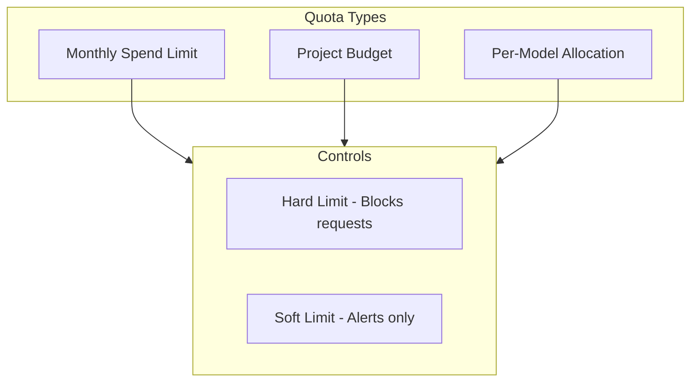

# Quota Management

## Introduction

Beyond per-minute rate limits, APIs enforce spending quotas—monthly limits on total usage. Effective quota management prevents unexpected costs and service interruptions.

### What We'll Cover

- Monthly quota concepts
- Setting spending limits
- Quota exhaustion handling
- Requesting quota increases
- Budget alerts and monitoring

### Prerequisites

- Tier-based rate limits
- API billing basics

---

## Quota Types



### Monthly Spending Limits

```python
# OpenAI allows setting monthly spending limits
# These are "hard limits" - requests fail when reached

# Example: $500/month limit
# Once you hit $500, all API requests return errors
# Until: 1) Next month starts, or 2) You increase the limit

SPENDING_LIMITS = {
    "monthly_hard_limit": 500.00,  # Requests fail at this limit
    "monthly_soft_limit": 400.00,  # Alert at this threshold
    "per_project_limit": 100.00    # Optional per-project limits
}
```

### Quota vs Rate Limit

| Aspect | Rate Limit | Quota |
|--------|------------|-------|
| **Scope** | Per minute/day | Per month |
| **Measure** | Requests/Tokens | Dollars |
| **Reset** | Rolling window | Monthly |
| **When hit** | Wait and retry | Wait for month or increase |

---

## Setting Spending Limits

### Via Dashboard

```python
# Navigate to: platform.openai.com → Settings → Billing → Limits

# You can set:
# 1. Monthly budget (hard limit)
# 2. Email notification threshold (soft limit)

# Example configuration:
BILLING_CONFIG = {
    "hard_limit_usd": 1000,    # Stop all requests at $1000
    "soft_limit_usd": 800,     # Email warning at $800
    "email_notifications": True
}
```

### Programmatic Monitoring

```python
import os
from datetime import datetime, timedelta
from dataclasses import dataclass

@dataclass
class UsageRecord:
    date: str
    tokens: int
    cost: float
    model: str

class QuotaMonitor:
    """Track usage against monthly quota."""
    
    def __init__(self, monthly_limit: float):
        self.monthly_limit = monthly_limit
        self.usage_records: list[UsageRecord] = []
    
    def record_usage(self, tokens: int, cost: float, model: str):
        """Record a usage event."""
        self.usage_records.append(UsageRecord(
            date=datetime.now().isoformat(),
            tokens=tokens,
            cost=cost,
            model=model
        ))
    
    def get_month_usage(self) -> float:
        """Get total spend for current month."""
        now = datetime.now()
        month_start = now.replace(day=1, hour=0, minute=0, second=0, microsecond=0)
        
        return sum(
            r.cost for r in self.usage_records
            if datetime.fromisoformat(r.date) >= month_start
        )
    
    def get_remaining_quota(self) -> float:
        """Get remaining quota for the month."""
        return max(0, self.monthly_limit - self.get_month_usage())
    
    def get_daily_budget(self) -> float:
        """Calculate daily budget to stay under limit."""
        now = datetime.now()
        days_left = (now.replace(month=now.month + 1, day=1) - now).days
        
        if days_left <= 0:
            return 0
        
        return self.get_remaining_quota() / days_left
    
    def check_quota(self, estimated_cost: float) -> dict:
        """Check if a request would exceed quota."""
        
        remaining = self.get_remaining_quota()
        
        if estimated_cost > remaining:
            return {
                "allowed": False,
                "reason": "Would exceed monthly quota",
                "remaining": remaining,
                "requested": estimated_cost
            }
        
        # Check if it would exceed daily budget
        daily_budget = self.get_daily_budget()
        today_usage = self._get_today_usage()
        
        if today_usage + estimated_cost > daily_budget * 1.5:  # 50% buffer
            return {
                "allowed": True,
                "warning": "Approaching daily budget",
                "daily_budget": daily_budget,
                "today_usage": today_usage
            }
        
        return {"allowed": True}
    
    def _get_today_usage(self) -> float:
        """Get usage for today."""
        today = datetime.now().date()
        return sum(
            r.cost for r in self.usage_records
            if datetime.fromisoformat(r.date).date() == today
        )
```

---

## Handling Quota Exhaustion

### Detecting Quota Errors

```python
from openai import OpenAI, RateLimitError

def is_quota_exceeded(error: RateLimitError) -> bool:
    """Check if error is due to quota exhaustion vs rate limit."""
    
    error_message = str(error).lower()
    
    # Quota-related keywords
    quota_indicators = [
        "quota",
        "billing",
        "exceeded your current",
        "spending limit",
        "hard limit"
    ]
    
    return any(indicator in error_message for indicator in quota_indicators)


def handle_api_error(error: Exception) -> dict:
    """Handle API errors with quota detection."""
    
    if isinstance(error, RateLimitError):
        if is_quota_exceeded(error):
            return {
                "error_type": "quota_exceeded",
                "retryable": False,
                "message": "Monthly quota exceeded. Increase limit or wait for next month.",
                "action": "increase_quota"
            }
        else:
            return {
                "error_type": "rate_limited",
                "retryable": True,
                "message": "Rate limit hit. Will retry shortly.",
                "action": "wait_and_retry"
            }
    
    return {
        "error_type": "unknown",
        "retryable": False,
        "message": str(error)
    }
```

### Graceful Degradation

```python
class QuotaAwareClient:
    """Client that handles quota exhaustion gracefully."""
    
    def __init__(self, monthly_limit: float):
        self.client = OpenAI()
        self.monitor = QuotaMonitor(monthly_limit)
        self.fallback_enabled = True
    
    def complete(self, messages: list, **kwargs) -> dict:
        """Make completion with quota awareness."""
        
        # Estimate cost before request
        estimated_tokens = self._estimate_tokens(messages, kwargs.get("max_tokens", 1000))
        estimated_cost = self._estimate_cost(estimated_tokens, kwargs.get("model", "gpt-4.1"))
        
        # Check quota
        check = self.monitor.check_quota(estimated_cost)
        
        if not check["allowed"]:
            if self.fallback_enabled:
                return self._fallback_response(messages, check)
            raise Exception(f"Quota exceeded: {check['reason']}")
        
        # Make request
        try:
            response = self.client.chat.completions.create(
                messages=messages,
                **kwargs
            )
            
            # Record actual usage
            actual_cost = self._calculate_cost(response.usage, kwargs.get("model", "gpt-4.1"))
            self.monitor.record_usage(
                tokens=response.usage.total_tokens,
                cost=actual_cost,
                model=kwargs.get("model", "gpt-4.1")
            )
            
            return {
                "content": response.choices[0].message.content,
                "usage": {
                    "tokens": response.usage.total_tokens,
                    "cost": actual_cost,
                    "remaining_quota": self.monitor.get_remaining_quota()
                }
            }
        
        except RateLimitError as e:
            if is_quota_exceeded(e):
                return self._fallback_response(messages, {"reason": "quota_exceeded"})
            raise
    
    def _estimate_tokens(self, messages: list, max_output: int) -> int:
        """Rough token estimate."""
        input_chars = sum(len(m.get("content", "")) for m in messages)
        input_tokens = input_chars // 4  # Rough estimate
        return input_tokens + max_output
    
    def _estimate_cost(self, tokens: int, model: str) -> float:
        """Estimate cost for tokens."""
        # Simplified pricing (check actual prices)
        prices = {
            "gpt-4.1": 0.002 / 1000,
            "gpt-4.1-mini": 0.0001 / 1000
        }
        return tokens * prices.get(model, 0.002 / 1000)
    
    def _calculate_cost(self, usage, model: str) -> float:
        """Calculate actual cost from usage."""
        input_prices = {"gpt-4.1": 0.002 / 1000, "gpt-4.1-mini": 0.0001 / 1000}
        output_prices = {"gpt-4.1": 0.008 / 1000, "gpt-4.1-mini": 0.0004 / 1000}
        
        input_cost = usage.prompt_tokens * input_prices.get(model, 0.002 / 1000)
        output_cost = usage.completion_tokens * output_prices.get(model, 0.008 / 1000)
        
        return input_cost + output_cost
    
    def _fallback_response(self, messages: list, reason: dict) -> dict:
        """Provide fallback when quota exceeded."""
        return {
            "content": "I'm temporarily unable to process this request due to usage limits. "
                      "Please try again later or contact support.",
            "is_fallback": True,
            "reason": reason
        }
```

---

## Requesting Quota Increases

### Through Dashboard

```python
# For spending limit increases:
# 1. Go to platform.openai.com → Settings → Billing → Limits
# 2. Click "Request limit increase"
# 3. Provide justification

# Typical approval times:
# - Minor increases: 1-2 business days
# - Major increases: 3-5 business days
# - Enterprise-level: Requires sales contact
```

### Preparation for Request

```python
def prepare_quota_increase_request(
    current_limit: float,
    requested_limit: float,
    monthly_usage_history: list[float],
    use_case: str
) -> dict:
    """Prepare data for quota increase request."""
    
    avg_usage = sum(monthly_usage_history) / len(monthly_usage_history) if monthly_usage_history else 0
    growth_rate = 0
    
    if len(monthly_usage_history) >= 2:
        growth_rate = (monthly_usage_history[-1] - monthly_usage_history[0]) / monthly_usage_history[0]
    
    return {
        "current_limit": current_limit,
        "requested_limit": requested_limit,
        "increase_percentage": (requested_limit - current_limit) / current_limit * 100,
        "justification": {
            "average_monthly_usage": avg_usage,
            "usage_growth_rate": f"{growth_rate * 100:.1f}%",
            "use_case": use_case,
            "projected_need": avg_usage * (1 + growth_rate) * 1.5  # 50% buffer
        },
        "recommendation": "Include business context and growth projections"
    }
```

---

## Budget Alerts

### Alert System

```python
from enum import Enum
from typing import Callable
import logging

logger = logging.getLogger(__name__)

class AlertLevel(Enum):
    INFO = "info"
    WARNING = "warning"
    CRITICAL = "critical"

class BudgetAlerts:
    """Monitor budget and trigger alerts."""
    
    def __init__(
        self,
        monthly_limit: float,
        alert_callback: Callable[[AlertLevel, str], None] = None
    ):
        self.monthly_limit = monthly_limit
        self.alert_callback = alert_callback or self._default_alert
        
        # Alert thresholds (percentage of limit)
        self.thresholds = {
            AlertLevel.INFO: 0.5,       # 50%
            AlertLevel.WARNING: 0.75,   # 75%
            AlertLevel.CRITICAL: 0.9    # 90%
        }
        
        self._alerts_sent = set()
    
    def _default_alert(self, level: AlertLevel, message: str):
        """Default alert handler."""
        logger.log(
            logging.INFO if level == AlertLevel.INFO else 
            logging.WARNING if level == AlertLevel.WARNING else 
            logging.CRITICAL,
            message
        )
    
    def check_and_alert(self, current_usage: float):
        """Check usage and send appropriate alerts."""
        
        usage_percent = current_usage / self.monthly_limit
        
        for level, threshold in self.thresholds.items():
            if usage_percent >= threshold and level not in self._alerts_sent:
                message = (
                    f"Budget {level.value}: {usage_percent * 100:.1f}% of monthly limit "
                    f"(${current_usage:.2f} of ${self.monthly_limit:.2f})"
                )
                self.alert_callback(level, message)
                self._alerts_sent.add(level)
    
    def reset_alerts(self):
        """Reset alerts for new billing period."""
        self._alerts_sent.clear()
    
    def get_status(self, current_usage: float) -> dict:
        """Get current budget status."""
        
        remaining = self.monthly_limit - current_usage
        percent_used = current_usage / self.monthly_limit * 100
        
        # Determine current alert level
        level = None
        for alert_level, threshold in sorted(
            self.thresholds.items(), 
            key=lambda x: x[1], 
            reverse=True
        ):
            if percent_used >= threshold * 100:
                level = alert_level
                break
        
        return {
            "used": current_usage,
            "remaining": remaining,
            "percent_used": percent_used,
            "alert_level": level.value if level else "ok",
            "monthly_limit": self.monthly_limit
        }


# Usage with email callback
import smtplib
from email.message import EmailMessage

def email_alert(level: AlertLevel, message: str):
    """Send alert via email."""
    if level in [AlertLevel.WARNING, AlertLevel.CRITICAL]:
        # Send email
        print(f"Would send email: [{level.value}] {message}")

alerts = BudgetAlerts(monthly_limit=1000, alert_callback=email_alert)
```

---

## Per-Project Budgets

```python
from dataclasses import dataclass, field
from typing import Dict

@dataclass
class ProjectBudget:
    name: str
    limit: float
    used: float = 0
    
    @property
    def remaining(self) -> float:
        return max(0, self.limit - self.used)
    
    @property
    def percent_used(self) -> float:
        return self.used / self.limit * 100 if self.limit > 0 else 0

class MultiProjectQuotaManager:
    """Manage quotas across multiple projects."""
    
    def __init__(self, total_monthly_limit: float):
        self.total_limit = total_monthly_limit
        self.projects: Dict[str, ProjectBudget] = {}
        self.unallocated: float = total_monthly_limit
    
    def create_project(self, name: str, limit: float) -> bool:
        """Create a project with budget allocation."""
        
        if limit > self.unallocated:
            return False
        
        self.projects[name] = ProjectBudget(name=name, limit=limit)
        self.unallocated -= limit
        return True
    
    def record_usage(self, project: str, cost: float):
        """Record usage for a project."""
        
        if project not in self.projects:
            raise ValueError(f"Unknown project: {project}")
        
        self.projects[project].used += cost
    
    def can_spend(self, project: str, amount: float) -> bool:
        """Check if project can spend amount."""
        
        if project not in self.projects:
            return False
        
        return self.projects[project].remaining >= amount
    
    def get_summary(self) -> dict:
        """Get summary of all project budgets."""
        
        total_used = sum(p.used for p in self.projects.values())
        
        return {
            "total_limit": self.total_limit,
            "total_used": total_used,
            "unallocated": self.unallocated,
            "projects": {
                name: {
                    "limit": p.limit,
                    "used": p.used,
                    "remaining": p.remaining,
                    "percent_used": p.percent_used
                }
                for name, p in self.projects.items()
            }
        }


# Usage
manager = MultiProjectQuotaManager(total_monthly_limit=2000)

manager.create_project("web-app", limit=1000)
manager.create_project("mobile-app", limit=500)
manager.create_project("internal-tools", limit=300)

manager.record_usage("web-app", 150)
manager.record_usage("mobile-app", 75)

print(manager.get_summary())
```

---

## Hands-on Exercise

### Your Task

Build a quota manager with alerts and per-project budgets.

### Requirements

1. Track overall monthly quota
2. Support multiple projects
3. Alert at 50%, 75%, 90% thresholds
4. Block requests when quota exceeded

### Expected Result

```python
manager = QuotaManager(monthly_limit=1000)
manager.add_project("api", budget=500)
manager.add_project("batch", budget=300)

result = manager.use("api", cost=50)
# {'allowed': True, 'project_remaining': 450, 'total_remaining': 850}

status = manager.get_status()
# {'total_used': 50, 'alert_level': 'ok', 'projects': {...}}
```

<details>
<summary>💡 Hints</summary>

- Track usage per project and total
- Check both project and total limits
- Store which alerts have been sent
</details>

<details>
<summary>✅ Solution</summary>

```python
from dataclasses import dataclass, field
from typing import Dict, Optional, Callable
from enum import Enum

class AlertLevel(Enum):
    OK = "ok"
    INFO = "info"        # 50%
    WARNING = "warning"  # 75%
    CRITICAL = "critical" # 90%

@dataclass
class Project:
    name: str
    budget: float
    used: float = 0
    
    @property
    def remaining(self) -> float:
        return max(0, self.budget - self.used)

class QuotaManager:
    def __init__(
        self,
        monthly_limit: float,
        alert_callback: Optional[Callable] = None
    ):
        self.monthly_limit = monthly_limit
        self.alert_callback = alert_callback or self._default_alert
        self.projects: Dict[str, Project] = {}
        self._alerts_sent: set = set()
    
    def _default_alert(self, level: AlertLevel, message: str):
        print(f"[{level.value.upper()}] {message}")
    
    @property
    def total_used(self) -> float:
        return sum(p.used for p in self.projects.values())
    
    @property
    def total_remaining(self) -> float:
        return max(0, self.monthly_limit - self.total_used)
    
    @property
    def allocated(self) -> float:
        return sum(p.budget for p in self.projects.values())
    
    def add_project(self, name: str, budget: float) -> bool:
        """Add a project with allocated budget."""
        if self.allocated + budget > self.monthly_limit:
            return False
        
        self.projects[name] = Project(name=name, budget=budget)
        return True
    
    def use(self, project: str, cost: float) -> dict:
        """Record usage for a project."""
        if project not in self.projects:
            return {"allowed": False, "error": "Unknown project"}
        
        proj = self.projects[project]
        
        # Check project limit
        if cost > proj.remaining:
            return {
                "allowed": False,
                "error": "Project budget exceeded",
                "project_remaining": proj.remaining
            }
        
        # Check total limit
        if cost > self.total_remaining:
            return {
                "allowed": False,
                "error": "Monthly quota exceeded",
                "total_remaining": self.total_remaining
            }
        
        # Record usage
        proj.used += cost
        
        # Check for alerts
        self._check_alerts()
        
        return {
            "allowed": True,
            "project_remaining": proj.remaining,
            "total_remaining": self.total_remaining
        }
    
    def _check_alerts(self):
        """Check and send alerts."""
        percent = self.total_used / self.monthly_limit * 100
        
        thresholds = [
            (90, AlertLevel.CRITICAL),
            (75, AlertLevel.WARNING),
            (50, AlertLevel.INFO)
        ]
        
        for threshold, level in thresholds:
            if percent >= threshold and level not in self._alerts_sent:
                self.alert_callback(
                    level,
                    f"Usage at {percent:.1f}%: ${self.total_used:.2f} of ${self.monthly_limit:.2f}"
                )
                self._alerts_sent.add(level)
    
    def _get_alert_level(self) -> AlertLevel:
        """Get current alert level."""
        percent = self.total_used / self.monthly_limit * 100
        
        if percent >= 90:
            return AlertLevel.CRITICAL
        elif percent >= 75:
            return AlertLevel.WARNING
        elif percent >= 50:
            return AlertLevel.INFO
        return AlertLevel.OK
    
    def get_status(self) -> dict:
        """Get comprehensive status."""
        return {
            "total_used": self.total_used,
            "total_remaining": self.total_remaining,
            "monthly_limit": self.monthly_limit,
            "percent_used": self.total_used / self.monthly_limit * 100,
            "alert_level": self._get_alert_level().value,
            "projects": {
                name: {
                    "budget": p.budget,
                    "used": p.used,
                    "remaining": p.remaining,
                    "percent_used": p.used / p.budget * 100 if p.budget > 0 else 0
                }
                for name, p in self.projects.items()
            }
        }


# Test
manager = QuotaManager(monthly_limit=1000)

manager.add_project("api", budget=500)
manager.add_project("batch", budget=300)

# Normal usage
print(manager.use("api", cost=50))

# Use more to trigger alerts
for _ in range(10):
    manager.use("api", cost=45)

print("\nStatus:", manager.get_status())

# Try to exceed project budget
print("\nExceed project:", manager.use("api", cost=100))
```

</details>

---

## Summary

✅ Quotas limit monthly spending, unlike rate limits  
✅ Set hard limits to prevent unexpected charges  
✅ Implement alerts at 50%, 75%, and 90% thresholds  
✅ Use per-project budgets for multi-tenant applications  
✅ Request quota increases with clear justification

**Next:** [Request Queuing](./05-request-queuing.md)

---

## Further Reading

- [OpenAI Billing](https://platform.openai.com/docs/guides/production-best-practices/setting-up-your-organization) — Billing setup
- [Usage Dashboard](https://platform.openai.com/usage) — Monitor usage
- [Rate Limits FAQ](https://help.openai.com/en/articles/5955598-is-api-usage-subject-to-any-rate-limits) — Common questions

<!-- 
Sources Consulted:
- OpenAI Usage Dashboard: https://platform.openai.com/usage
- OpenAI Production Best Practices: https://platform.openai.com/docs/guides/production-best-practices
-->
