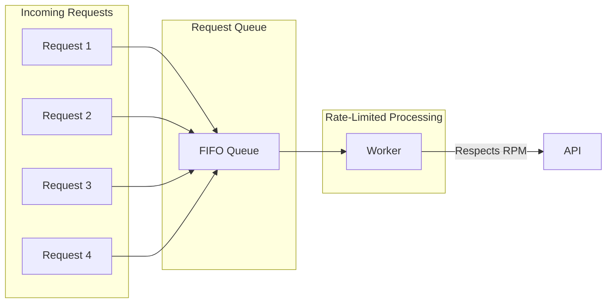

# Request Queuing

## Introduction

When traffic exceeds rate limits, queuing requests allows graceful handling instead of immediate failures. A well-designed queue manages priorities, handles backpressure, and ensures fair processing.

### What We'll Cover

- Queue design principles
- Priority queue implementation
- Queue size and timeout management
- Persistence for reliability
- Distributed queuing patterns

### Prerequisites

- Rate limit fundamentals
- Async programming basics

---

## Why Queue Requests



### Benefits

| Benefit | Description |
|---------|-------------|
| **Smooth traffic** | Convert bursts into steady streams |
| **No lost requests** | Hold requests instead of failing |
| **Priority handling** | Process important requests first |
| **Fair scheduling** | Prevent any client from dominating |

---

## Basic Queue Implementation

```python
import asyncio
from dataclasses import dataclass, field
from datetime import datetime
from typing import Any, Callable, Optional
from queue import PriorityQueue
import uuid

@dataclass(order=True)
class QueuedRequest:
    priority: int
    created_at: datetime = field(compare=False)
    request_id: str = field(compare=False, default_factory=lambda: str(uuid.uuid4())[:8])
    payload: Any = field(compare=False, default=None)
    callback: Optional[Callable] = field(compare=False, default=None)

class RequestQueue:
    """Simple request queue with priority support."""
    
    def __init__(self, max_size: int = 1000):
        self._queue = PriorityQueue(maxsize=max_size)
        self._results = {}
    
    def enqueue(
        self,
        payload: Any,
        priority: int = 5,
        callback: Callable = None
    ) -> str:
        """Add request to queue. Lower priority number = higher priority."""
        
        request = QueuedRequest(
            priority=priority,
            created_at=datetime.now(),
            payload=payload,
            callback=callback
        )
        
        self._queue.put(request, block=False)
        return request.request_id
    
    def dequeue(self) -> Optional[QueuedRequest]:
        """Get next request from queue."""
        try:
            return self._queue.get(block=False)
        except:
            return None
    
    def size(self) -> int:
        return self._queue.qsize()
    
    def is_full(self) -> bool:
        return self._queue.full()
    
    def store_result(self, request_id: str, result: Any):
        """Store result for retrieval."""
        self._results[request_id] = result
    
    def get_result(self, request_id: str) -> Optional[Any]:
        """Get result if available."""
        return self._results.pop(request_id, None)
```

---

## Rate-Limited Queue Worker

```python
import time
import asyncio
from openai import OpenAI

class RateLimitedWorker:
    """Worker that processes queue respecting rate limits."""
    
    def __init__(
        self,
        queue: RequestQueue,
        rpm_limit: int = 500,
        tpm_limit: int = 30000
    ):
        self.queue = queue
        self.client = OpenAI()
        
        # Rate limiting
        self.rpm_limit = rpm_limit
        self.tpm_limit = tpm_limit
        self.min_interval = 60.0 / rpm_limit  # Seconds between requests
        
        # Tracking
        self._last_request_time = 0
        self._tokens_this_minute = 0
        self._minute_start = time.time()
        self._running = False
    
    def _wait_for_rate_limit(self):
        """Wait if needed to respect rate limits."""
        
        # Check RPM
        now = time.time()
        elapsed = now - self._last_request_time
        
        if elapsed < self.min_interval:
            time.sleep(self.min_interval - elapsed)
        
        # Check TPM - reset if minute passed
        if now - self._minute_start >= 60:
            self._tokens_this_minute = 0
            self._minute_start = now
    
    def _can_process(self, estimated_tokens: int) -> bool:
        """Check if we can process given token count."""
        return self._tokens_this_minute + estimated_tokens <= self.tpm_limit
    
    def process_one(self) -> Optional[dict]:
        """Process a single request from the queue."""
        
        request = self.queue.dequeue()
        if not request:
            return None
        
        self._wait_for_rate_limit()
        
        try:
            response = self.client.chat.completions.create(
                **request.payload
            )
            
            # Track usage
            self._last_request_time = time.time()
            self._tokens_this_minute += response.usage.total_tokens
            
            result = {
                "request_id": request.request_id,
                "success": True,
                "content": response.choices[0].message.content,
                "tokens": response.usage.total_tokens
            }
            
            # Store result
            self.queue.store_result(request.request_id, result)
            
            # Call callback if provided
            if request.callback:
                request.callback(result)
            
            return result
        
        except Exception as e:
            result = {
                "request_id": request.request_id,
                "success": False,
                "error": str(e)
            }
            
            self.queue.store_result(request.request_id, result)
            
            if request.callback:
                request.callback(result)
            
            return result
    
    def run(self, max_iterations: int = None):
        """Process queue until empty or max iterations."""
        
        self._running = True
        iterations = 0
        
        while self._running:
            if max_iterations and iterations >= max_iterations:
                break
            
            if self.queue.size() == 0:
                time.sleep(0.1)  # Wait for new items
                continue
            
            self.process_one()
            iterations += 1
    
    def stop(self):
        """Stop the worker."""
        self._running = False


# Usage
queue = RequestQueue(max_size=100)

# Enqueue requests
for i in range(10):
    request_id = queue.enqueue(
        payload={
            "model": "gpt-4.1-mini",
            "messages": [{"role": "user", "content": f"Count to {i+1}"}]
        },
        priority=5
    )
    print(f"Enqueued: {request_id}")

# Process queue
worker = RateLimitedWorker(queue, rpm_limit=100)
worker.run(max_iterations=10)
```

---

## Async Queue Worker

```python
import asyncio
from openai import AsyncOpenAI
from dataclasses import dataclass
from typing import Optional
from datetime import datetime

class AsyncRequestQueue:
    """Async-compatible request queue."""
    
    def __init__(self, max_size: int = 1000):
        self._queue = asyncio.PriorityQueue(maxsize=max_size)
        self._results = {}
    
    async def enqueue(
        self,
        payload: dict,
        priority: int = 5
    ) -> str:
        """Add request to queue."""
        request_id = str(uuid.uuid4())[:8]
        
        await self._queue.put((
            priority,
            datetime.now(),
            request_id,
            payload
        ))
        
        return request_id
    
    async def dequeue(self) -> Optional[tuple]:
        """Get next request."""
        try:
            return await asyncio.wait_for(
                self._queue.get(),
                timeout=1.0
            )
        except asyncio.TimeoutError:
            return None
    
    def store_result(self, request_id: str, result: dict):
        self._results[request_id] = result
    
    def get_result(self, request_id: str) -> Optional[dict]:
        return self._results.pop(request_id, None)


class AsyncRateLimitedWorker:
    """Async worker with rate limiting."""
    
    def __init__(
        self,
        queue: AsyncRequestQueue,
        rpm_limit: int = 500,
        concurrency: int = 10
    ):
        self.queue = queue
        self.client = AsyncOpenAI()
        self.rpm_limit = rpm_limit
        self.concurrency = concurrency
        
        self._semaphore = asyncio.Semaphore(concurrency)
        self._rate_limiter = asyncio.Semaphore(rpm_limit)
        self._running = False
    
    async def _process_request(self, request_id: str, payload: dict) -> dict:
        """Process a single request."""
        
        async with self._semaphore:
            async with self._rate_limiter:
                try:
                    response = await self.client.chat.completions.create(**payload)
                    
                    return {
                        "request_id": request_id,
                        "success": True,
                        "content": response.choices[0].message.content,
                        "tokens": response.usage.total_tokens
                    }
                except Exception as e:
                    return {
                        "request_id": request_id,
                        "success": False,
                        "error": str(e)
                    }
    
    async def _rate_limit_refill(self):
        """Refill rate limit tokens every minute."""
        while self._running:
            await asyncio.sleep(60)
            # Reset semaphore
            for _ in range(self.rpm_limit - self._rate_limiter._value):
                self._rate_limiter.release()
    
    async def run(self):
        """Run the worker."""
        self._running = True
        
        # Start rate limit refiller
        asyncio.create_task(self._rate_limit_refill())
        
        while self._running:
            item = await self.queue.dequeue()
            
            if item is None:
                continue
            
            priority, created, request_id, payload = item
            
            result = await self._process_request(request_id, payload)
            self.queue.store_result(request_id, result)
    
    def stop(self):
        self._running = False
```

---

## Priority Queuing

### Priority Levels

```python
from enum import IntEnum

class Priority(IntEnum):
    CRITICAL = 0    # Highest priority
    HIGH = 1
    NORMAL = 5
    LOW = 8
    BACKGROUND = 10  # Lowest priority

class PriorityQueueManager:
    """Queue manager with priority support."""
    
    def __init__(self):
        self.queue = RequestQueue(max_size=5000)
        self._priority_counts = {p: 0 for p in Priority}
    
    def enqueue_critical(self, payload: dict) -> str:
        """Enqueue with critical priority."""
        return self._enqueue(payload, Priority.CRITICAL)
    
    def enqueue_high(self, payload: dict) -> str:
        """Enqueue with high priority."""
        return self._enqueue(payload, Priority.HIGH)
    
    def enqueue_normal(self, payload: dict) -> str:
        """Enqueue with normal priority."""
        return self._enqueue(payload, Priority.NORMAL)
    
    def enqueue_background(self, payload: dict) -> str:
        """Enqueue with background priority."""
        return self._enqueue(payload, Priority.BACKGROUND)
    
    def _enqueue(self, payload: dict, priority: Priority) -> str:
        """Internal enqueue with tracking."""
        request_id = self.queue.enqueue(payload, priority=priority.value)
        self._priority_counts[priority] += 1
        return request_id
    
    def get_stats(self) -> dict:
        """Get queue statistics."""
        return {
            "total": self.queue.size(),
            "by_priority": {p.name: self._priority_counts[p] for p in Priority}
        }
```

### Fair Scheduling

```python
class FairScheduler:
    """Scheduler that ensures fair processing across clients."""
    
    def __init__(self, max_per_client: int = 100):
        self.max_per_client = max_per_client
        self._client_queues: dict[str, list] = {}
        self._client_order = []
        self._round_robin_index = 0
    
    def enqueue(self, client_id: str, payload: dict) -> str:
        """Enqueue request for a client."""
        
        if client_id not in self._client_queues:
            self._client_queues[client_id] = []
            self._client_order.append(client_id)
        
        queue = self._client_queues[client_id]
        
        if len(queue) >= self.max_per_client:
            raise ValueError(f"Client {client_id} queue full")
        
        request_id = str(uuid.uuid4())[:8]
        queue.append({
            "request_id": request_id,
            "payload": payload,
            "created_at": datetime.now()
        })
        
        return request_id
    
    def dequeue(self) -> Optional[dict]:
        """Get next request using round-robin across clients."""
        
        if not self._client_order:
            return None
        
        # Try each client in round-robin order
        attempts = len(self._client_order)
        
        for _ in range(attempts):
            client_id = self._client_order[self._round_robin_index]
            self._round_robin_index = (self._round_robin_index + 1) % len(self._client_order)
            
            queue = self._client_queues.get(client_id, [])
            
            if queue:
                request = queue.pop(0)
                request["client_id"] = client_id
                
                # Remove empty client queues
                if not queue:
                    self._client_order.remove(client_id)
                    del self._client_queues[client_id]
                    if self._round_robin_index >= len(self._client_order):
                        self._round_robin_index = 0
                
                return request
        
        return None
```

---

## Queue Persistence

### SQLite-Backed Queue

```python
import sqlite3
import json
from contextlib import contextmanager

class PersistentQueue:
    """Queue backed by SQLite for reliability."""
    
    def __init__(self, db_path: str = "queue.db"):
        self.db_path = db_path
        self._init_db()
    
    def _init_db(self):
        """Initialize database schema."""
        with self._get_conn() as conn:
            conn.execute("""
                CREATE TABLE IF NOT EXISTS requests (
                    id TEXT PRIMARY KEY,
                    priority INTEGER,
                    created_at TEXT,
                    payload TEXT,
                    status TEXT DEFAULT 'pending',
                    result TEXT
                )
            """)
            conn.execute("""
                CREATE INDEX IF NOT EXISTS idx_status_priority 
                ON requests(status, priority, created_at)
            """)
    
    @contextmanager
    def _get_conn(self):
        conn = sqlite3.connect(self.db_path)
        try:
            yield conn
            conn.commit()
        finally:
            conn.close()
    
    def enqueue(self, payload: dict, priority: int = 5) -> str:
        """Add request to persistent queue."""
        
        request_id = str(uuid.uuid4())
        
        with self._get_conn() as conn:
            conn.execute(
                """
                INSERT INTO requests (id, priority, created_at, payload, status)
                VALUES (?, ?, ?, ?, 'pending')
                """,
                (request_id, priority, datetime.now().isoformat(), json.dumps(payload))
            )
        
        return request_id
    
    def dequeue(self) -> Optional[dict]:
        """Get and lock next pending request."""
        
        with self._get_conn() as conn:
            cursor = conn.execute(
                """
                SELECT id, payload FROM requests
                WHERE status = 'pending'
                ORDER BY priority, created_at
                LIMIT 1
                """
            )
            row = cursor.fetchone()
            
            if not row:
                return None
            
            request_id, payload = row
            
            # Mark as processing
            conn.execute(
                "UPDATE requests SET status = 'processing' WHERE id = ?",
                (request_id,)
            )
            
            return {
                "request_id": request_id,
                "payload": json.loads(payload)
            }
    
    def complete(self, request_id: str, result: dict):
        """Mark request as completed."""
        
        with self._get_conn() as conn:
            conn.execute(
                "UPDATE requests SET status = 'completed', result = ? WHERE id = ?",
                (json.dumps(result), request_id)
            )
    
    def fail(self, request_id: str, error: str):
        """Mark request as failed."""
        
        with self._get_conn() as conn:
            conn.execute(
                "UPDATE requests SET status = 'failed', result = ? WHERE id = ?",
                (json.dumps({"error": error}), request_id)
            )
    
    def get_status(self, request_id: str) -> Optional[dict]:
        """Get request status and result."""
        
        with self._get_conn() as conn:
            cursor = conn.execute(
                "SELECT status, result FROM requests WHERE id = ?",
                (request_id,)
            )
            row = cursor.fetchone()
            
            if not row:
                return None
            
            status, result = row
            return {
                "status": status,
                "result": json.loads(result) if result else None
            }
    
    def recover_stale(self, max_age_seconds: int = 300):
        """Reset stale 'processing' requests to 'pending'."""
        
        cutoff = (datetime.now() - timedelta(seconds=max_age_seconds)).isoformat()
        
        with self._get_conn() as conn:
            conn.execute(
                """
                UPDATE requests SET status = 'pending'
                WHERE status = 'processing' AND created_at < ?
                """,
                (cutoff,)
            )
```

---

## JavaScript Implementation

```javascript
class RequestQueue {
    constructor(maxSize = 1000) {
        this.maxSize = maxSize;
        this.queue = [];
        this.results = new Map();
    }
    
    enqueue(payload, priority = 5) {
        if (this.queue.length >= this.maxSize) {
            throw new Error('Queue is full');
        }
        
        const requestId = Math.random().toString(36).substr(2, 8);
        
        this.queue.push({
            requestId,
            priority,
            createdAt: Date.now(),
            payload
        });
        
        // Sort by priority
        this.queue.sort((a, b) => a.priority - b.priority);
        
        return requestId;
    }
    
    dequeue() {
        return this.queue.shift() || null;
    }
    
    storeResult(requestId, result) {
        this.results.set(requestId, result);
    }
    
    getResult(requestId) {
        const result = this.results.get(requestId);
        this.results.delete(requestId);
        return result;
    }
    
    get size() {
        return this.queue.length;
    }
}

class RateLimitedWorker {
    constructor(queue, openai, rpmLimit = 500) {
        this.queue = queue;
        this.openai = openai;
        this.minInterval = (60 * 1000) / rpmLimit;
        this.lastRequestTime = 0;
        this.running = false;
    }
    
    async waitForRateLimit() {
        const now = Date.now();
        const elapsed = now - this.lastRequestTime;
        
        if (elapsed < this.minInterval) {
            await new Promise(r => setTimeout(r, this.minInterval - elapsed));
        }
    }
    
    async processOne() {
        const request = this.queue.dequeue();
        if (!request) return null;
        
        await this.waitForRateLimit();
        
        try {
            const response = await this.openai.chat.completions.create(
                request.payload
            );
            
            this.lastRequestTime = Date.now();
            
            const result = {
                requestId: request.requestId,
                success: true,
                content: response.choices[0].message.content
            };
            
            this.queue.storeResult(request.requestId, result);
            return result;
        } catch (error) {
            const result = {
                requestId: request.requestId,
                success: false,
                error: error.message
            };
            
            this.queue.storeResult(request.requestId, result);
            return result;
        }
    }
    
    async run() {
        this.running = true;
        
        while (this.running) {
            if (this.queue.size === 0) {
                await new Promise(r => setTimeout(r, 100));
                continue;
            }
            
            await this.processOne();
        }
    }
    
    stop() {
        this.running = false;
    }
}
```

---

## Hands-on Exercise

### Your Task

Build a priority queue with fair scheduling across clients.

### Requirements

1. Support multiple priority levels
2. Fair round-robin across clients
3. Per-client queue limits
4. Track queue statistics

### Expected Result

```python
scheduler = FairPriorityScheduler(max_per_client=50)

scheduler.enqueue("client1", {"message": "Hello"}, priority=Priority.HIGH)
scheduler.enqueue("client2", {"message": "World"}, priority=Priority.NORMAL)

# Dequeue alternates between clients fairly
item1 = scheduler.dequeue()  # From client1 (higher priority)
item2 = scheduler.dequeue()  # From client2 (round-robin)

print(scheduler.get_stats())
# {'total': 0, 'by_client': {...}, 'by_priority': {...}}
```

<details>
<summary>💡 Hints</summary>

- Use separate queues per priority level
- Within each priority, use round-robin
- Track statistics as requests are added/removed
</details>

<details>
<summary>✅ Solution</summary>

```python
from enum import IntEnum
from dataclasses import dataclass
from datetime import datetime
from typing import Optional, Dict, List
import uuid

class Priority(IntEnum):
    CRITICAL = 0
    HIGH = 1
    NORMAL = 5
    LOW = 8
    BACKGROUND = 10

@dataclass
class QueueItem:
    request_id: str
    client_id: str
    priority: Priority
    payload: dict
    created_at: datetime

class FairPriorityScheduler:
    def __init__(self, max_per_client: int = 50):
        self.max_per_client = max_per_client
        
        # Separate queues by priority
        self._priority_queues: Dict[Priority, Dict[str, List[QueueItem]]] = {
            p: {} for p in Priority
        }
        
        # Track client order per priority for round-robin
        self._client_order: Dict[Priority, List[str]] = {
            p: [] for p in Priority
        }
        self._rr_index: Dict[Priority, int] = {p: 0 for p in Priority}
        
        # Statistics
        self._stats = {
            "enqueued": 0,
            "dequeued": 0,
            "by_priority": {p.name: 0 for p in Priority},
            "by_client": {}
        }
    
    def enqueue(
        self,
        client_id: str,
        payload: dict,
        priority: Priority = Priority.NORMAL
    ) -> str:
        """Enqueue request with priority."""
        
        # Check client limit
        client_total = sum(
            len(self._priority_queues[p].get(client_id, []))
            for p in Priority
        )
        
        if client_total >= self.max_per_client:
            raise ValueError(f"Client {client_id} queue full")
        
        request_id = str(uuid.uuid4())[:8]
        
        item = QueueItem(
            request_id=request_id,
            client_id=client_id,
            priority=priority,
            payload=payload,
            created_at=datetime.now()
        )
        
        # Add to priority queue
        pq = self._priority_queues[priority]
        
        if client_id not in pq:
            pq[client_id] = []
            self._client_order[priority].append(client_id)
        
        pq[client_id].append(item)
        
        # Update stats
        self._stats["enqueued"] += 1
        self._stats["by_priority"][priority.name] += 1
        
        if client_id not in self._stats["by_client"]:
            self._stats["by_client"][client_id] = 0
        self._stats["by_client"][client_id] += 1
        
        return request_id
    
    def dequeue(self) -> Optional[QueueItem]:
        """Get next item using priority + fair scheduling."""
        
        # Check priorities in order
        for priority in sorted(Priority):
            pq = self._priority_queues[priority]
            clients = self._client_order[priority]
            
            if not clients:
                continue
            
            # Round-robin within priority
            start_idx = self._rr_index[priority]
            
            for i in range(len(clients)):
                idx = (start_idx + i) % len(clients)
                client_id = clients[idx]
                
                if pq.get(client_id):
                    item = pq[client_id].pop(0)
                    
                    # Clean up empty client queue
                    if not pq[client_id]:
                        del pq[client_id]
                        clients.remove(client_id)
                        if self._rr_index[priority] >= len(clients):
                            self._rr_index[priority] = 0
                    else:
                        self._rr_index[priority] = (idx + 1) % len(clients)
                    
                    # Update stats
                    self._stats["dequeued"] += 1
                    
                    return item
        
        return None
    
    def get_stats(self) -> dict:
        """Get queue statistics."""
        
        total = sum(
            sum(len(q) for q in pq.values())
            for pq in self._priority_queues.values()
        )
        
        return {
            "total": total,
            "enqueued_total": self._stats["enqueued"],
            "dequeued_total": self._stats["dequeued"],
            "by_priority": self._stats["by_priority"],
            "by_client": self._stats["by_client"],
            "pending_by_priority": {
                p.name: sum(len(q) for q in self._priority_queues[p].values())
                for p in Priority
            }
        }


# Test
scheduler = FairPriorityScheduler(max_per_client=50)

# Enqueue from multiple clients
scheduler.enqueue("client1", {"msg": "c1-1"}, Priority.HIGH)
scheduler.enqueue("client1", {"msg": "c1-2"}, Priority.NORMAL)
scheduler.enqueue("client2", {"msg": "c2-1"}, Priority.HIGH)
scheduler.enqueue("client2", {"msg": "c2-2"}, Priority.NORMAL)
scheduler.enqueue("client3", {"msg": "c3-1"}, Priority.CRITICAL)

# Dequeue in priority + fair order
print("Dequeue order:")
while True:
    item = scheduler.dequeue()
    if not item:
        break
    print(f"  {item.priority.name}: {item.client_id} - {item.payload}")

print("\nStats:", scheduler.get_stats())
```

</details>

---

## Summary

✅ Queues smooth traffic bursts into steady streams  
✅ Priority queues ensure important requests process first  
✅ Fair scheduling prevents any client from monopolizing  
✅ Persistent queues survive restarts  
✅ Async workers maximize throughput within rate limits

**Next:** [Throttling Strategies](./06-throttling-strategies.md)

---

## Further Reading

- [Queue Theory](https://en.wikipedia.org/wiki/Queueing_theory) — Theoretical foundations
- [Redis Queues](https://redis.io/docs/data-types/lists/) — Distributed queuing
- [Celery](https://docs.celeryq.dev/) — Python task queue

<!-- 
Sources Consulted:
- Python queue module: https://docs.python.org/3/library/queue.html
- asyncio Queue: https://docs.python.org/3/library/asyncio-queue.html
-->
