# Throttling Strategies

## Introduction

Throttling controls the rate at which requests flow to an API. Unlike queuing (which holds requests), throttling actively limits request frequency to prevent hitting rate limits in the first place.

### What We'll Cover

- Token bucket algorithm
- Leaky bucket algorithm
- Sliding window counters
- Adaptive throttling
- Client-side throttling patterns

### Prerequisites

- Request queuing basics
- Rate limit concepts

---

## Throttling vs Rate Limiting


| Aspect | Throttling | Rate Limiting |
|--------|------------|---------------|
| **Location** | Client-side | Server-side |
| **Purpose** | Control outflow | Enforce limits |
| **Response** | Delay requests | Reject requests |
| **Goal** | Prevent 429s | Protect server |

---

## Token Bucket Algorithm

The most common throttling algorithm. Tokens refill at a steady rate, and each request consumes a token.

```mermaid
flowchart LR
    subgraph Bucket["Token Bucket"]
        T1[🪙]
        T2[🪙]
        T3[🪙]
        T4[🪙]
        T5[🪙]
    end
    
    Refill["+1 token/second"] -->|Refill| Bucket
    Bucket -->|1 token| Request[Request Sent]
    
    Request --> API[API]
```



### Implementation

```python
import time
import threading
from dataclasses import dataclass

@dataclass
class TokenBucket:
    """Token bucket rate limiter."""
    
    capacity: int        # Maximum tokens
    refill_rate: float   # Tokens per second
    
    def __post_init__(self):
        self.tokens = self.capacity
        self.last_refill = time.time()
        self._lock = threading.Lock()
    
    def _refill(self):
        """Add tokens based on elapsed time."""
        now = time.time()
        elapsed = now - self.last_refill
        
        new_tokens = elapsed * self.refill_rate
        self.tokens = min(self.capacity, self.tokens + new_tokens)
        self.last_refill = now
    
    def acquire(self, tokens: int = 1, block: bool = True) -> bool:
        """
        Acquire tokens.
        
        Args:
            tokens: Number of tokens to acquire
            block: If True, wait for tokens; if False, return immediately
            
        Returns:
            True if tokens acquired, False otherwise
        """
        with self._lock:
            self._refill()
            
            if self.tokens >= tokens:
                self.tokens -= tokens
                return True
            
            if not block:
                return False
            
            # Calculate wait time
            needed = tokens - self.tokens
            wait_time = needed / self.refill_rate
            
        # Wait outside lock
        time.sleep(wait_time)
        
        # Try again
        with self._lock:
            self._refill()
            
            if self.tokens >= tokens:
                self.tokens -= tokens
                return True
            
            return False
    
    def available(self) -> float:
        """Get available tokens."""
        with self._lock:
            self._refill()
            return self.tokens


# Usage
bucket = TokenBucket(
    capacity=60,       # Max 60 tokens
    refill_rate=1.0    # 1 token per second = 60 per minute
)

# Throttled requests
for i in range(10):
    bucket.acquire()  # Blocks if no tokens
    print(f"Request {i + 1} sent")
```

### Token Bucket for AI APIs

```python
from openai import OpenAI

class ThrottledClient:
    """OpenAI client with token bucket throttling."""
    
    def __init__(self, rpm_limit: int = 500, tpm_limit: int = 30000):
        self.client = OpenAI()
        
        # Request bucket (RPM)
        self.request_bucket = TokenBucket(
            capacity=rpm_limit,
            refill_rate=rpm_limit / 60.0
        )
        
        # Token bucket (TPM)
        self.token_bucket = TokenBucket(
            capacity=tpm_limit,
            refill_rate=tpm_limit / 60.0
        )
    
    def estimate_tokens(self, messages: list, max_tokens: int) -> int:
        """Estimate total tokens for a request."""
        # Rough estimate: 4 chars = 1 token
        input_tokens = sum(
            len(m.get("content", "")) // 4 
            for m in messages
        )
        return input_tokens + max_tokens
    
    def chat(self, messages: list, max_tokens: int = 1000, **kwargs) -> str:
        """Send throttled chat request."""
        
        # Acquire request token
        self.request_bucket.acquire()
        
        # Acquire estimated tokens
        estimated = self.estimate_tokens(messages, max_tokens)
        self.token_bucket.acquire(tokens=estimated)
        
        response = self.client.chat.completions.create(
            messages=messages,
            max_tokens=max_tokens,
            **kwargs
        )
        
        return response.choices[0].message.content


# Usage
client = ThrottledClient(rpm_limit=100, tpm_limit=20000)

response = client.chat(
    messages=[{"role": "user", "content": "Hello!"}],
    max_tokens=100,
    model="gpt-4.1-mini"
)
```

---

## Leaky Bucket Algorithm

Requests "leak" from the bucket at a constant rate, smoothing out bursts.


### Implementation

```python
import time
import threading
from collections import deque
from typing import Any, Optional

class LeakyBucket:
    """Leaky bucket for smoothing request bursts."""
    
    def __init__(self, capacity: int, leak_rate: float):
        """
        Args:
            capacity: Maximum items in bucket
            leak_rate: Items processed per second
        """
        self.capacity = capacity
        self.leak_rate = leak_rate
        self.leak_interval = 1.0 / leak_rate
        
        self._queue = deque(maxlen=capacity)
        self._lock = threading.Lock()
        self._last_leak = time.time()
    
    def add(self, item: Any, block: bool = True) -> bool:
        """Add item to bucket."""
        with self._lock:
            if len(self._queue) >= self.capacity:
                if not block:
                    return False
                
                # Wait for space
                wait_time = self.leak_interval
            else:
                self._queue.append(item)
                return True
        
        if block:
            time.sleep(wait_time)
            return self.add(item, block=True)
        
        return False
    
    def leak(self) -> Optional[Any]:
        """Remove and return next item at leak rate."""
        with self._lock:
            now = time.time()
            elapsed = now - self._last_leak
            
            if elapsed < self.leak_interval:
                return None
            
            if self._queue:
                self._last_leak = now
                return self._queue.popleft()
            
            return None
    
    def size(self) -> int:
        with self._lock:
            return len(self._queue)


class LeakyBucketWorker:
    """Worker that processes leaky bucket items."""
    
    def __init__(self, bucket: LeakyBucket, processor):
        self.bucket = bucket
        self.processor = processor
        self._running = False
    
    def run(self):
        """Process items at the bucket's leak rate."""
        self._running = True
        
        while self._running:
            item = self.bucket.leak()
            
            if item is not None:
                self.processor(item)
            else:
                time.sleep(0.01)  # Small sleep to prevent busy-waiting
    
    def stop(self):
        self._running = False
```

---

## Sliding Window Counter

Tracks request counts in a sliding time window for more accurate rate limiting.

```python
import time
from collections import deque
from dataclasses import dataclass, field
import threading

@dataclass
class SlidingWindowCounter:
    """Sliding window rate limiter."""
    
    limit: int           # Max requests in window
    window_seconds: int  # Window size
    
    _timestamps: deque = field(default_factory=deque, repr=False)
    _lock: threading.Lock = field(default_factory=threading.Lock, repr=False)
    
    def _clean_old(self):
        """Remove timestamps outside the window."""
        cutoff = time.time() - self.window_seconds
        
        while self._timestamps and self._timestamps[0] < cutoff:
            self._timestamps.popleft()
    
    def allow(self) -> bool:
        """Check if request is allowed."""
        with self._lock:
            self._clean_old()
            
            if len(self._timestamps) < self.limit:
                self._timestamps.append(time.time())
                return True
            
            return False
    
    def wait_time(self) -> float:
        """Get seconds until next request is allowed."""
        with self._lock:
            self._clean_old()
            
            if len(self._timestamps) < self.limit:
                return 0.0
            
            # Wait until oldest timestamp expires
            oldest = self._timestamps[0]
            return max(0, oldest + self.window_seconds - time.time())
    
    def acquire(self) -> bool:
        """Acquire a slot, waiting if necessary."""
        wait = self.wait_time()
        
        if wait > 0:
            time.sleep(wait)
        
        return self.allow()
    
    def current_count(self) -> int:
        """Get current request count in window."""
        with self._lock:
            self._clean_old()
            return len(self._timestamps)


# Usage
throttle = SlidingWindowCounter(
    limit=100,        # 100 requests
    window_seconds=60  # per minute
)

for i in range(10):
    if throttle.allow():
        print(f"Request {i + 1}: Allowed")
    else:
        wait = throttle.wait_time()
        print(f"Request {i + 1}: Wait {wait:.2f}s")
```

---

## Adaptive Throttling

Adjusts rate based on API response headers and errors.

```python
import time
from dataclasses import dataclass, field
from typing import Optional
from openai import OpenAI, RateLimitError

@dataclass
class AdaptiveThrottler:
    """Throttler that adapts based on API feedback."""
    
    initial_rpm: int = 100
    min_rpm: int = 10
    max_rpm: int = 500
    
    # Adjustment factors
    increase_factor: float = 1.1
    decrease_factor: float = 0.5
    recovery_factor: float = 1.05
    
    # State
    current_rpm: float = field(init=False)
    consecutive_success: int = field(default=0, init=False)
    last_request: float = field(default=0, init=False)
    
    def __post_init__(self):
        self.current_rpm = self.initial_rpm
    
    @property
    def min_interval(self) -> float:
        """Minimum seconds between requests."""
        return 60.0 / self.current_rpm
    
    def wait(self):
        """Wait for next request slot."""
        now = time.time()
        elapsed = now - self.last_request
        
        if elapsed < self.min_interval:
            time.sleep(self.min_interval - elapsed)
        
        self.last_request = time.time()
    
    def record_success(self, remaining_requests: Optional[int] = None):
        """Record successful request."""
        self.consecutive_success += 1
        
        # Gradually increase rate after consecutive successes
        if self.consecutive_success >= 10:
            self.current_rpm = min(
                self.max_rpm,
                self.current_rpm * self.recovery_factor
            )
            self.consecutive_success = 0
        
        # If server reports lots of remaining capacity, increase
        if remaining_requests and remaining_requests > self.current_rpm * 0.5:
            self.current_rpm = min(
                self.max_rpm,
                self.current_rpm * self.increase_factor
            )
    
    def record_rate_limit(self, retry_after: Optional[float] = None):
        """Record rate limit hit."""
        self.consecutive_success = 0
        
        # Aggressive backoff
        self.current_rpm = max(
            self.min_rpm,
            self.current_rpm * self.decrease_factor
        )
        
        # Wait for retry-after if specified
        if retry_after:
            time.sleep(retry_after)
    
    def record_error(self):
        """Record non-rate-limit error."""
        self.consecutive_success = 0


class AdaptiveClient:
    """Client with adaptive throttling."""
    
    def __init__(self):
        self.client = OpenAI()
        self.throttler = AdaptiveThrottler()
    
    def chat(self, messages: list, **kwargs) -> str:
        """Send chat request with adaptive throttling."""
        
        self.throttler.wait()
        
        try:
            response = self.client.chat.completions.create(
                messages=messages,
                **kwargs
            )
            
            self.throttler.record_success()
            
            return response.choices[0].message.content
        
        except RateLimitError as e:
            # Extract retry-after if available
            retry_after = None
            if hasattr(e, 'response'):
                retry_after = e.response.headers.get('retry-after')
                if retry_after:
                    retry_after = float(retry_after)
            
            self.throttler.record_rate_limit(retry_after)
            raise
        
        except Exception as e:
            self.throttler.record_error()
            raise
    
    def get_stats(self) -> dict:
        """Get current throttler stats."""
        return {
            "current_rpm": self.throttler.current_rpm,
            "min_interval_ms": self.throttler.min_interval * 1000,
            "consecutive_success": self.throttler.consecutive_success
        }
```

---

## Concurrent Request Throttling

```python
import asyncio
from openai import AsyncOpenAI
from dataclasses import dataclass

@dataclass
class ConcurrencyThrottler:
    """Throttle concurrent request count."""
    
    max_concurrent: int = 10
    rpm_limit: int = 500
    
    def __post_init__(self):
        self._semaphore = asyncio.Semaphore(self.max_concurrent)
        self._request_interval = 60.0 / self.rpm_limit
        self._last_request = 0
        self._lock = asyncio.Lock()
    
    async def acquire(self):
        """Acquire a slot for concurrent request."""
        await self._semaphore.acquire()
        
        # Also respect RPM
        async with self._lock:
            now = asyncio.get_event_loop().time()
            elapsed = now - self._last_request
            
            if elapsed < self._request_interval:
                await asyncio.sleep(self._request_interval - elapsed)
            
            self._last_request = asyncio.get_event_loop().time()
    
    def release(self):
        """Release the slot."""
        self._semaphore.release()
    
    async def __aenter__(self):
        await self.acquire()
        return self
    
    async def __aexit__(self, *args):
        self.release()


class AsyncThrottledClient:
    """Async client with concurrent throttling."""
    
    def __init__(self, max_concurrent: int = 10, rpm_limit: int = 500):
        self.client = AsyncOpenAI()
        self.throttler = ConcurrencyThrottler(
            max_concurrent=max_concurrent,
            rpm_limit=rpm_limit
        )
    
    async def chat(self, messages: list, **kwargs) -> str:
        """Send throttled chat request."""
        
        async with self.throttler:
            response = await self.client.chat.completions.create(
                messages=messages,
                **kwargs
            )
            
            return response.choices[0].message.content
    
    async def batch(self, requests: list[dict]) -> list[str]:
        """Process multiple requests concurrently with throttling."""
        
        tasks = [
            self.chat(**req) for req in requests
        ]
        
        return await asyncio.gather(*tasks, return_exceptions=True)


# Usage
async def main():
    client = AsyncThrottledClient(max_concurrent=5, rpm_limit=100)
    
    requests = [
        {"messages": [{"role": "user", "content": f"Count to {i}"}], "model": "gpt-4.1-mini"}
        for i in range(1, 11)
    ]
    
    results = await client.batch(requests)
    
    for i, result in enumerate(results):
        if isinstance(result, Exception):
            print(f"Request {i + 1}: Error - {result}")
        else:
            print(f"Request {i + 1}: {result[:50]}...")

# asyncio.run(main())
```

---

## JavaScript Implementation

```javascript
class TokenBucket {
    constructor(capacity, refillRate) {
        this.capacity = capacity;
        this.refillRate = refillRate;  // tokens per second
        this.tokens = capacity;
        this.lastRefill = Date.now();
    }
    
    refill() {
        const now = Date.now();
        const elapsed = (now - this.lastRefill) / 1000;
        
        this.tokens = Math.min(
            this.capacity,
            this.tokens + elapsed * this.refillRate
        );
        this.lastRefill = now;
    }
    
    async acquire(tokens = 1) {
        this.refill();
        
        if (this.tokens >= tokens) {
            this.tokens -= tokens;
            return true;
        }
        
        // Calculate wait time
        const needed = tokens - this.tokens;
        const waitMs = (needed / this.refillRate) * 1000;
        
        await new Promise(r => setTimeout(r, waitMs));
        
        return this.acquire(tokens);
    }
}

class SlidingWindowCounter {
    constructor(limit, windowSeconds) {
        this.limit = limit;
        this.windowMs = windowSeconds * 1000;
        this.timestamps = [];
    }
    
    cleanOld() {
        const cutoff = Date.now() - this.windowMs;
        this.timestamps = this.timestamps.filter(ts => ts > cutoff);
    }
    
    allow() {
        this.cleanOld();
        
        if (this.timestamps.length < this.limit) {
            this.timestamps.push(Date.now());
            return true;
        }
        
        return false;
    }
    
    waitTime() {
        this.cleanOld();
        
        if (this.timestamps.length < this.limit) {
            return 0;
        }
        
        const oldest = this.timestamps[0];
        return Math.max(0, oldest + this.windowMs - Date.now());
    }
    
    async acquire() {
        const wait = this.waitTime();
        
        if (wait > 0) {
            await new Promise(r => setTimeout(r, wait));
        }
        
        return this.allow();
    }
}

class ThrottledClient {
    constructor(openai, rpmLimit = 100) {
        this.openai = openai;
        this.bucket = new TokenBucket(rpmLimit, rpmLimit / 60);
    }
    
    async chat(messages, options = {}) {
        await this.bucket.acquire();
        
        return this.openai.chat.completions.create({
            messages,
            ...options
        });
    }
}
```

---

## Hands-on Exercise

### Your Task

Build an adaptive throttler that responds to API feedback.

### Requirements

1. Start at a configurable initial rate
2. Increase rate after consecutive successes
3. Decrease rate aggressively on rate limits
4. Respect retry-after headers

### Expected Result

```python
throttler = SmartThrottler(initial_rpm=100)

# Simulated API responses
throttler.on_success()  # Slight increase potential
throttler.on_success()  # Building up...
# ... 10 more successes
throttler.get_rate()  # > 100 RPM

throttler.on_rate_limit(retry_after=5.0)  # Big decrease
throttler.get_rate()  # < 100 RPM
```

<details>
<summary>💡 Hints</summary>

- Track consecutive successes as a counter
- Reset counter on any error
- Apply multiplicative decrease on rate limit
- Use gradual increase on sustained success
</details>

<details>
<summary>✅ Solution</summary>

```python
import time
from dataclasses import dataclass, field

@dataclass
class SmartThrottler:
    """Adaptive throttler with smart rate adjustment."""
    
    initial_rpm: float = 100.0
    min_rpm: float = 10.0
    max_rpm: float = 500.0
    
    # How many successes before increasing
    success_threshold: int = 10
    
    # Rate adjustments
    success_increase: float = 1.05  # 5% increase
    rate_limit_decrease: float = 0.5  # 50% decrease
    error_decrease: float = 0.9  # 10% decrease
    
    # State
    _current_rpm: float = field(init=False)
    _consecutive_success: int = field(default=0, init=False)
    _last_request: float = field(default=0, init=False)
    _total_requests: int = field(default=0, init=False)
    _total_rate_limits: int = field(default=0, init=False)
    
    def __post_init__(self):
        self._current_rpm = self.initial_rpm
    
    def get_rate(self) -> float:
        """Get current rate limit (RPM)."""
        return self._current_rpm
    
    def get_interval(self) -> float:
        """Get minimum interval between requests (seconds)."""
        return 60.0 / self._current_rpm
    
    def wait(self):
        """Wait for next request slot."""
        now = time.time()
        elapsed = now - self._last_request
        interval = self.get_interval()
        
        if elapsed < interval:
            time.sleep(interval - elapsed)
        
        self._last_request = time.time()
        self._total_requests += 1
    
    def on_success(self, remaining: int = None):
        """Record successful request."""
        self._consecutive_success += 1
        
        # Increase rate after threshold
        if self._consecutive_success >= self.success_threshold:
            self._current_rpm = min(
                self.max_rpm,
                self._current_rpm * self.success_increase
            )
            self._consecutive_success = 0
        
        # Boost if server reports high remaining capacity
        if remaining and remaining > self._current_rpm * 0.8:
            self._current_rpm = min(
                self.max_rpm,
                self._current_rpm * 1.1
            )
    
    def on_rate_limit(self, retry_after: float = None):
        """Record rate limit error."""
        self._consecutive_success = 0
        self._total_rate_limits += 1
        
        # Aggressive decrease
        self._current_rpm = max(
            self.min_rpm,
            self._current_rpm * self.rate_limit_decrease
        )
        
        # Wait if retry-after specified
        if retry_after and retry_after > 0:
            time.sleep(retry_after)
    
    def on_error(self):
        """Record non-rate-limit error."""
        self._consecutive_success = 0
        
        # Mild decrease
        self._current_rpm = max(
            self.min_rpm,
            self._current_rpm * self.error_decrease
        )
    
    def get_stats(self) -> dict:
        """Get throttler statistics."""
        return {
            "current_rpm": round(self._current_rpm, 1),
            "min_interval_ms": round(self.get_interval() * 1000, 1),
            "consecutive_success": self._consecutive_success,
            "total_requests": self._total_requests,
            "total_rate_limits": self._total_rate_limits,
            "rate_limit_ratio": (
                self._total_rate_limits / self._total_requests 
                if self._total_requests > 0 else 0
            )
        }


# Test the throttler
throttler = SmartThrottler(initial_rpm=100)

print(f"Initial rate: {throttler.get_rate()} RPM")

# Simulate 15 successes
for i in range(15):
    throttler.on_success()

print(f"After 15 successes: {throttler.get_rate():.1f} RPM")

# Simulate rate limit
throttler.on_rate_limit(retry_after=0)  # Skip actual wait

print(f"After rate limit: {throttler.get_rate():.1f} RPM")

# Simulate recovery
for i in range(20):
    throttler.on_success()

print(f"After recovery: {throttler.get_rate():.1f} RPM")

print("\nStats:", throttler.get_stats())
```

</details>

---

## Summary

✅ Token bucket allows bursts while maintaining average rate  
✅ Leaky bucket smooths traffic into constant stream  
✅ Sliding window provides accurate request counting  
✅ Adaptive throttling responds to API feedback  
✅ Concurrent throttling limits parallel requests

**Next:** [Handling 429 Errors](./07-handling-429-errors.md)

---

## Further Reading

- [Token Bucket Algorithm](https://en.wikipedia.org/wiki/Token_bucket) — Algorithm details
- [Rate Limiting Best Practices](https://cloud.google.com/architecture/rate-limiting-strategies-techniques) — Google Cloud patterns
- [OpenAI Rate Limits](https://platform.openai.com/docs/guides/rate-limits) — Official guidance

<!-- 
Sources Consulted:
- Token bucket algorithm: https://en.wikipedia.org/wiki/Token_bucket
- Leaky bucket algorithm: https://en.wikipedia.org/wiki/Leaky_bucket
- Google rate limiting: https://cloud.google.com/architecture/rate-limiting-strategies-techniques
-->
