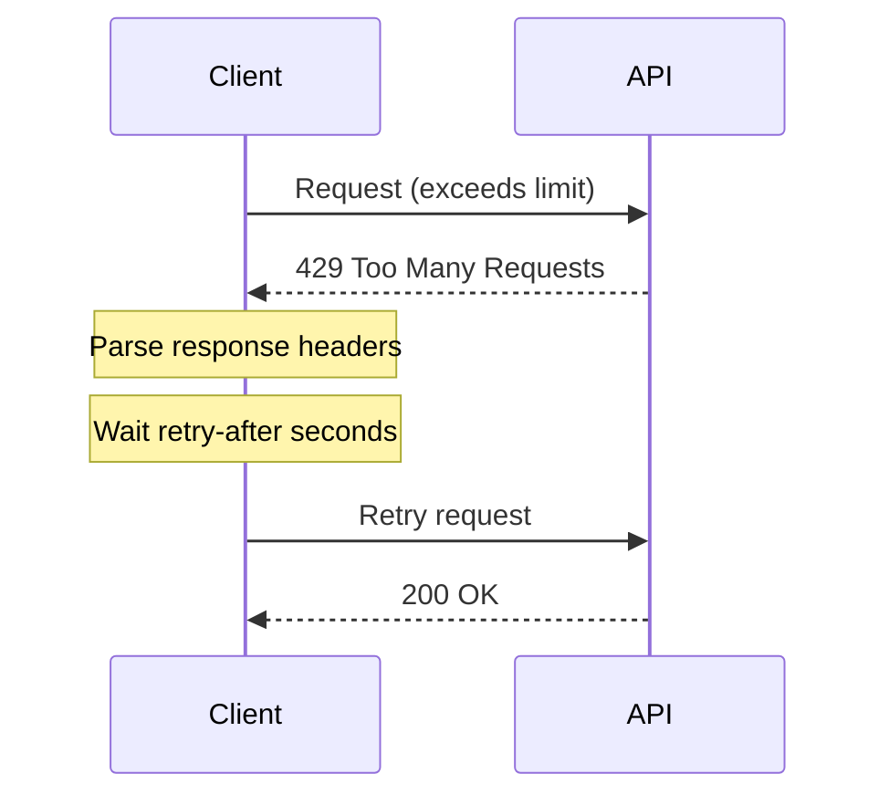

# Handling 429 Errors

## Introduction

HTTP 429 "Too Many Requests" is the server's way of saying you've exceeded rate limits. Proper handling of 429 errors ensures your application recovers gracefully and resumes operations without data loss.

### What We'll Cover

- Understanding 429 responses
- Retry-After header parsing
- Automatic retry logic
- User notification patterns
- Request prioritization during recovery

### Prerequisites

- Rate limit fundamentals
- Error handling basics

---

## Anatomy of a 429 Response



### Response Structure

```http
HTTP/1.1 429 Too Many Requests
Content-Type: application/json
Retry-After: 30
X-RateLimit-Limit-Requests: 500
X-RateLimit-Remaining-Requests: 0
X-RateLimit-Reset-Requests: 30s

{
  "error": {
    "message": "Rate limit reached for gpt-4.1 in organization...",
    "type": "tokens",
    "code": "rate_limit_exceeded"
  }
}
```

### Key Headers

| Header | Purpose | Example |
|--------|---------|---------|
| `Retry-After` | Seconds until retry | `30` |
| `X-RateLimit-Reset-*` | Time until limit resets | `30s` |
| `X-RateLimit-Remaining-*` | Requests/tokens left | `0` |

---

## Basic 429 Handler

```python
import time
from openai import OpenAI, RateLimitError

def call_with_retry(
    func,
    *args,
    max_retries: int = 3,
    **kwargs
) -> any:
    """Call function with automatic 429 retry."""
    
    last_error = None
    
    for attempt in range(max_retries):
        try:
            return func(*args, **kwargs)
        
        except RateLimitError as e:
            last_error = e
            
            # Extract retry-after from headers
            retry_after = 30  # Default
            
            if hasattr(e, 'response') and e.response:
                retry_header = e.response.headers.get('retry-after')
                if retry_header:
                    retry_after = float(retry_header)
            
            print(f"Rate limited. Waiting {retry_after}s (attempt {attempt + 1}/{max_retries})")
            time.sleep(retry_after)
    
    raise last_error


# Usage
client = OpenAI()

response = call_with_retry(
    client.chat.completions.create,
    model="gpt-4.1-mini",
    messages=[{"role": "user", "content": "Hello!"}]
)
```

---

## Advanced Retry Handler

```python
import time
import random
from dataclasses import dataclass, field
from typing import Callable, Optional, Any
from openai import OpenAI, RateLimitError, APIError

@dataclass
class RetryConfig:
    """Configuration for retry behavior."""
    
    max_retries: int = 5
    base_delay: float = 1.0
    max_delay: float = 60.0
    exponential_base: float = 2.0
    jitter: bool = True
    
    # Callbacks
    on_retry: Optional[Callable[[int, float], None]] = None
    on_success: Optional[Callable[[int], None]] = None
    on_failure: Optional[Callable[[Exception], None]] = None


@dataclass
class RetryResult:
    """Result of a retry operation."""
    
    success: bool
    result: Any = None
    error: Exception = None
    attempts: int = 0
    total_delay: float = 0.0


class RateLimitHandler:
    """Comprehensive 429 error handler."""
    
    def __init__(self, config: RetryConfig = None):
        self.config = config or RetryConfig()
        self._stats = {
            "total_requests": 0,
            "rate_limits_hit": 0,
            "retries_succeeded": 0,
            "retries_failed": 0,
            "total_wait_time": 0.0
        }
    
    def _calculate_delay(
        self,
        attempt: int,
        retry_after: Optional[float] = None
    ) -> float:
        """Calculate delay before next retry."""
        
        # Use retry-after if provided
        if retry_after:
            delay = retry_after
        else:
            # Exponential backoff
            delay = self.config.base_delay * (
                self.config.exponential_base ** attempt
            )
        
        # Cap at max delay
        delay = min(delay, self.config.max_delay)
        
        # Add jitter
        if self.config.jitter:
            delay = delay * (0.5 + random.random())
        
        return delay
    
    def _parse_retry_after(self, error: RateLimitError) -> Optional[float]:
        """Extract retry-after from error response."""
        
        if not hasattr(error, 'response') or not error.response:
            return None
        
        headers = error.response.headers
        
        # Check retry-after header
        retry_after = headers.get('retry-after')
        if retry_after:
            try:
                return float(retry_after)
            except ValueError:
                pass
        
        # Check x-ratelimit-reset headers
        for header in ['x-ratelimit-reset-requests', 'x-ratelimit-reset-tokens']:
            reset = headers.get(header)
            if reset:
                # Parse "30s" or "1m30s" format
                return self._parse_duration(reset)
        
        return None
    
    def _parse_duration(self, duration_str: str) -> float:
        """Parse duration string like '30s' or '1m30s'."""
        
        total = 0.0
        current = ""
        
        for char in duration_str:
            if char.isdigit() or char == '.':
                current += char
            elif char == 's':
                total += float(current) if current else 0
                current = ""
            elif char == 'm':
                total += (float(current) * 60) if current else 0
                current = ""
            elif char == 'h':
                total += (float(current) * 3600) if current else 0
                current = ""
        
        return total
    
    def call(
        self,
        func: Callable,
        *args,
        **kwargs
    ) -> RetryResult:
        """Call function with automatic retry on 429."""
        
        self._stats["total_requests"] += 1
        
        total_delay = 0.0
        last_error = None
        
        for attempt in range(self.config.max_retries):
            try:
                result = func(*args, **kwargs)
                
                if attempt > 0:
                    self._stats["retries_succeeded"] += 1
                    
                    if self.config.on_success:
                        self.config.on_success(attempt)
                
                return RetryResult(
                    success=True,
                    result=result,
                    attempts=attempt + 1,
                    total_delay=total_delay
                )
            
            except RateLimitError as e:
                last_error = e
                self._stats["rate_limits_hit"] += 1
                
                # Calculate delay
                retry_after = self._parse_retry_after(e)
                delay = self._calculate_delay(attempt, retry_after)
                
                total_delay += delay
                self._stats["total_wait_time"] += delay
                
                if self.config.on_retry:
                    self.config.on_retry(attempt, delay)
                
                time.sleep(delay)
        
        # All retries exhausted
        self._stats["retries_failed"] += 1
        
        if self.config.on_failure:
            self.config.on_failure(last_error)
        
        return RetryResult(
            success=False,
            error=last_error,
            attempts=self.config.max_retries,
            total_delay=total_delay
        )
    
    def get_stats(self) -> dict:
        """Get retry statistics."""
        return self._stats.copy()


# Usage
handler = RateLimitHandler(
    RetryConfig(
        max_retries=5,
        on_retry=lambda attempt, delay: print(
            f"Retry {attempt + 1}, waiting {delay:.1f}s"
        )
    )
)

client = OpenAI()

result = handler.call(
    client.chat.completions.create,
    model="gpt-4.1-mini",
    messages=[{"role": "user", "content": "Hello!"}]
)

if result.success:
    print(f"Success after {result.attempts} attempts")
else:
    print(f"Failed: {result.error}")
```

---

## Async 429 Handler

```python
import asyncio
import random
from openai import AsyncOpenAI, RateLimitError

class AsyncRateLimitHandler:
    """Async handler for 429 errors."""
    
    def __init__(
        self,
        max_retries: int = 5,
        base_delay: float = 1.0,
        max_delay: float = 60.0
    ):
        self.max_retries = max_retries
        self.base_delay = base_delay
        self.max_delay = max_delay
    
    async def call(
        self,
        func,
        *args,
        **kwargs
    ):
        """Call async function with 429 retry."""
        
        last_error = None
        
        for attempt in range(self.max_retries):
            try:
                return await func(*args, **kwargs)
            
            except RateLimitError as e:
                last_error = e
                
                # Get retry-after
                retry_after = None
                if hasattr(e, 'response') and e.response:
                    retry_after = e.response.headers.get('retry-after')
                
                if retry_after:
                    delay = float(retry_after)
                else:
                    # Exponential backoff with jitter
                    delay = min(
                        self.base_delay * (2 ** attempt) * (0.5 + random.random()),
                        self.max_delay
                    )
                
                print(f"Rate limited. Waiting {delay:.1f}s...")
                await asyncio.sleep(delay)
        
        raise last_error


# Usage
async def main():
    client = AsyncOpenAI()
    handler = AsyncRateLimitHandler()
    
    response = await handler.call(
        client.chat.completions.create,
        model="gpt-4.1-mini",
        messages=[{"role": "user", "content": "Hello!"}]
    )
    
    print(response.choices[0].message.content)
```

---

## User Notification Patterns

### Progress Indicator

```python
from dataclasses import dataclass
from typing import Callable, Optional
import sys

@dataclass
class UserNotifier:
    """Notify users about rate limit status."""
    
    on_waiting: Optional[Callable[[float], None]] = None
    on_progress: Optional[Callable[[float, float], None]] = None
    on_recovered: Optional[Callable[[int], None]] = None
    
    def notify_waiting(self, seconds: float):
        """Notify user we're waiting."""
        if self.on_waiting:
            self.on_waiting(seconds)
        else:
            print(f"⏳ Rate limited. Waiting {seconds:.0f} seconds...")
    
    def notify_progress(self, elapsed: float, total: float):
        """Show progress during wait."""
        if self.on_progress:
            self.on_progress(elapsed, total)
        else:
            pct = (elapsed / total) * 100
            bar = "█" * int(pct / 5) + "░" * (20 - int(pct / 5))
            sys.stdout.write(f"\r⏳ [{bar}] {pct:.0f}% ({total - elapsed:.0f}s remaining)")
            sys.stdout.flush()
    
    def notify_recovered(self, attempts: int):
        """Notify user we've recovered."""
        if self.on_recovered:
            self.on_recovered(attempts)
        else:
            print(f"\n✅ Recovered after {attempts} attempts")


def wait_with_progress(seconds: float, notifier: UserNotifier):
    """Wait while showing progress."""
    
    notifier.notify_waiting(seconds)
    
    interval = 0.5
    elapsed = 0.0
    
    while elapsed < seconds:
        time.sleep(interval)
        elapsed += interval
        notifier.notify_progress(elapsed, seconds)
    
    print()  # New line after progress bar
```

### Queue Status Display

```python
@dataclass
class QueueStatus:
    """Track and display queue status during rate limiting."""
    
    pending: int = 0
    completed: int = 0
    failed: int = 0
    rate_limited: bool = False
    retry_in: float = 0.0
    
    def to_dict(self) -> dict:
        return {
            "pending": self.pending,
            "completed": self.completed,
            "failed": self.failed,
            "rate_limited": self.rate_limited,
            "retry_in": self.retry_in
        }
    
    def display(self):
        """Print current status."""
        status = "🔴 RATE LIMITED" if self.rate_limited else "🟢 OK"
        print(f"\rQueue: {self.pending} pending | {self.completed} done | {self.failed} failed | {status}", end="")
        
        if self.rate_limited:
            print(f" | Retry in {self.retry_in:.0f}s", end="")
```

---

## Request Prioritization During Recovery

```python
from enum import IntEnum
from dataclasses import dataclass
from typing import Callable, Any
import heapq

class Priority(IntEnum):
    CRITICAL = 0
    HIGH = 1
    NORMAL = 5
    LOW = 10

@dataclass(order=True)
class PendingRequest:
    priority: int
    created_at: float
    request_id: str
    func: Callable = None
    args: tuple = None
    kwargs: dict = None

class PriorityRecoveryHandler:
    """Handle 429 recovery with request prioritization."""
    
    def __init__(self):
        self._pending = []
        self._rate_limited = False
        self._resume_time = 0
    
    def submit(
        self,
        func: Callable,
        *args,
        priority: Priority = Priority.NORMAL,
        **kwargs
    ) -> str:
        """Submit request for processing."""
        
        request_id = str(uuid.uuid4())[:8]
        
        request = PendingRequest(
            priority=priority,
            created_at=time.time(),
            request_id=request_id,
            func=func,
            args=args,
            kwargs=kwargs
        )
        
        heapq.heappush(self._pending, request)
        
        return request_id
    
    def process_one(self) -> tuple[str, Any]:
        """Process highest priority pending request."""
        
        if not self._pending:
            return None, None
        
        # Check if still rate limited
        if self._rate_limited:
            if time.time() < self._resume_time:
                wait = self._resume_time - time.time()
                time.sleep(wait)
            self._rate_limited = False
        
        request = heapq.heappop(self._pending)
        
        try:
            result = request.func(*request.args, **request.kwargs)
            return request.request_id, result
        
        except RateLimitError as e:
            # Re-queue with same priority
            heapq.heappush(self._pending, request)
            
            # Mark rate limited
            self._rate_limited = True
            
            retry_after = 30  # Default
            if hasattr(e, 'response') and e.response:
                retry_header = e.response.headers.get('retry-after')
                if retry_header:
                    retry_after = float(retry_header)
            
            self._resume_time = time.time() + retry_after
            
            raise
    
    def process_all(self) -> list[tuple[str, Any]]:
        """Process all pending requests."""
        
        results = []
        
        while self._pending:
            try:
                request_id, result = self.process_one()
                if request_id:
                    results.append((request_id, result))
            except RateLimitError:
                continue  # Will retry after wait
        
        return results
    
    @property
    def pending_count(self) -> int:
        return len(self._pending)
```

---

## JavaScript Implementation

```javascript
class RateLimitHandler {
    constructor(options = {}) {
        this.maxRetries = options.maxRetries || 5;
        this.baseDelay = options.baseDelay || 1000;
        this.maxDelay = options.maxDelay || 60000;
    }
    
    parseRetryAfter(response) {
        const header = response.headers?.get('retry-after');
        if (header) {
            return parseFloat(header) * 1000;  // Convert to ms
        }
        return null;
    }
    
    calculateDelay(attempt, retryAfter) {
        if (retryAfter) {
            return retryAfter;
        }
        
        // Exponential backoff with jitter
        const delay = this.baseDelay * Math.pow(2, attempt) * (0.5 + Math.random());
        return Math.min(delay, this.maxDelay);
    }
    
    async call(fn, ...args) {
        let lastError;
        
        for (let attempt = 0; attempt < this.maxRetries; attempt++) {
            try {
                return await fn(...args);
            } catch (error) {
                // Check if rate limit error
                if (error.status !== 429) {
                    throw error;
                }
                
                lastError = error;
                
                const retryAfter = this.parseRetryAfter(error);
                const delay = this.calculateDelay(attempt, retryAfter);
                
                console.log(`Rate limited. Waiting ${delay / 1000}s...`);
                await new Promise(r => setTimeout(r, delay));
            }
        }
        
        throw lastError;
    }
}

// Usage
const handler = new RateLimitHandler({ maxRetries: 5 });

try {
    const response = await handler.call(
        () => openai.chat.completions.create({
            model: 'gpt-4.1-mini',
            messages: [{ role: 'user', content: 'Hello!' }]
        })
    );
    console.log(response.choices[0].message.content);
} catch (error) {
    console.error('All retries failed:', error.message);
}
```

---

## Hands-on Exercise

### Your Task

Build a 429 handler with user notification and statistics.

### Requirements

1. Parse retry-after headers
2. Implement exponential backoff with jitter
3. Show progress during wait
4. Track retry statistics

### Expected Result

```python
handler = NotifyingRateLimitHandler()

result = handler.call(make_api_request)

# During execution:
# ⏳ Rate limited. Waiting 30 seconds...
# ⏳ [████████████░░░░░░░░] 60% (12s remaining)
# ✅ Recovered after 2 attempts

print(handler.get_stats())
# {'total_requests': 1, 'rate_limits_hit': 1, 'total_wait_time': 30.0}
```

<details>
<summary>💡 Hints</summary>

- Use sys.stdout.write for in-place progress updates
- Track stats in a dict or dataclass
- Calculate jitter as random value between 0.5 and 1.5
</details>

<details>
<summary>✅ Solution</summary>

```python
import time
import random
import sys
from dataclasses import dataclass, field
from typing import Callable, Optional, Any

@dataclass
class NotifyingRateLimitHandler:
    """429 handler with user notifications and statistics."""
    
    max_retries: int = 5
    base_delay: float = 1.0
    max_delay: float = 60.0
    show_progress: bool = True
    
    # Stats
    _stats: dict = field(default_factory=lambda: {
        "total_requests": 0,
        "rate_limits_hit": 0,
        "total_wait_time": 0.0,
        "retries_succeeded": 0,
        "retries_failed": 0
    })
    
    def _calculate_delay(
        self,
        attempt: int,
        retry_after: Optional[float] = None
    ) -> float:
        """Calculate delay with exponential backoff and jitter."""
        
        if retry_after:
            delay = retry_after
        else:
            delay = self.base_delay * (2 ** attempt)
        
        # Cap at max
        delay = min(delay, self.max_delay)
        
        # Add jitter (50% to 150%)
        delay *= 0.5 + random.random()
        
        return delay
    
    def _wait_with_progress(self, total_seconds: float):
        """Wait while showing progress bar."""
        
        print(f"\n⏳ Rate limited. Waiting {total_seconds:.0f} seconds...")
        
        if not self.show_progress:
            time.sleep(total_seconds)
            return
        
        interval = 0.5
        elapsed = 0.0
        
        while elapsed < total_seconds:
            time.sleep(interval)
            elapsed += interval
            
            pct = min(100, (elapsed / total_seconds) * 100)
            filled = int(pct / 5)
            bar = "█" * filled + "░" * (20 - filled)
            remaining = max(0, total_seconds - elapsed)
            
            sys.stdout.write(
                f"\r⏳ [{bar}] {pct:.0f}% ({remaining:.0f}s remaining)"
            )
            sys.stdout.flush()
        
        print()  # New line
    
    def call(self, func: Callable, *args, **kwargs) -> Any:
        """Call function with 429 handling and notifications."""
        
        self._stats["total_requests"] += 1
        
        for attempt in range(self.max_retries):
            try:
                result = func(*args, **kwargs)
                
                if attempt > 0:
                    self._stats["retries_succeeded"] += 1
                    print(f"✅ Recovered after {attempt + 1} attempts")
                
                return result
            
            except Exception as e:
                # Check for rate limit (adapt to your SDK)
                is_rate_limit = (
                    "rate limit" in str(e).lower() or
                    getattr(e, 'status_code', None) == 429 or
                    type(e).__name__ == 'RateLimitError'
                )
                
                if not is_rate_limit:
                    raise
                
                self._stats["rate_limits_hit"] += 1
                
                # Extract retry-after
                retry_after = None
                if hasattr(e, 'response') and e.response:
                    headers = getattr(e.response, 'headers', {})
                    if headers.get('retry-after'):
                        retry_after = float(headers['retry-after'])
                
                delay = self._calculate_delay(attempt, retry_after)
                self._stats["total_wait_time"] += delay
                
                self._wait_with_progress(delay)
        
        self._stats["retries_failed"] += 1
        print(f"❌ Failed after {self.max_retries} attempts")
        raise Exception("Max retries exceeded")
    
    def get_stats(self) -> dict:
        """Get handler statistics."""
        return self._stats.copy()


# Test with mock function
def mock_api_call():
    """Simulate rate limit on first call."""
    if not hasattr(mock_api_call, 'called'):
        mock_api_call.called = True
        error = Exception("Rate limit exceeded")
        error.status_code = 429
        raise error
    return "Success!"

handler = NotifyingRateLimitHandler(base_delay=2.0, show_progress=True)

try:
    result = handler.call(mock_api_call)
    print(f"Result: {result}")
except Exception as e:
    print(f"Error: {e}")

print("\nStats:", handler.get_stats())
```

</details>

---

## Summary

✅ 429 errors include retry-after hints — use them  
✅ Exponential backoff with jitter prevents thundering herd  
✅ User notifications improve experience during waits  
✅ Priority queuing ensures critical requests process first  
✅ Track statistics to monitor rate limit health

**Next:** [Usage Monitoring](./08-usage-monitoring.md)

---

## Further Reading

- [HTTP 429 Specification](https://developer.mozilla.org/en-US/docs/Web/HTTP/Status/429) — MDN reference
- [Retry-After Header](https://developer.mozilla.org/en-US/docs/Web/HTTP/Headers/Retry-After) — Header details
- [OpenAI Rate Limits](https://platform.openai.com/docs/guides/rate-limits) — Official guidance

<!-- 
Sources Consulted:
- MDN 429 Status: https://developer.mozilla.org/en-US/docs/Web/HTTP/Status/429
- MDN Retry-After: https://developer.mozilla.org/en-US/docs/Web/HTTP/Headers/Retry-After
- OpenAI rate limits: https://platform.openai.com/docs/guides/rate-limits
-->
