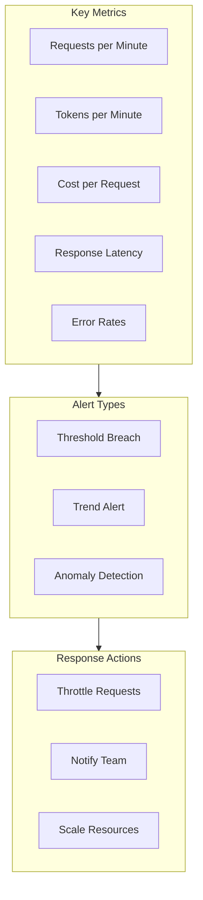

# Usage Monitoring

## Introduction

Effective monitoring of API usage helps prevent unexpected rate limits, manage costs, and identify optimization opportunities. Real-time tracking and alerting ensure you stay within limits proactively.

### What We'll Cover

- Real-time usage tracking
- Dashboard metrics
- Alert thresholds and notifications
- Historical analysis
- Usage forecasting

### Prerequisites

- Rate limit fundamentals
- Basic metrics concepts

---

## What to Monitor



### Core Metrics

| Metric | Description | Alert Threshold |
|--------|-------------|-----------------|
| **RPM** | Requests per minute | 80% of limit |
| **TPM** | Tokens per minute | 80% of limit |
| **RPD** | Requests per day | 90% of limit |
| **Error Rate** | 4xx/5xx percentage | >5% |
| **429 Rate** | Rate limit errors | >1% |
| **Latency P95** | 95th percentile response time | >5s |

---

## Real-Time Usage Tracker

```python
import time
import threading
from dataclasses import dataclass, field
from collections import deque
from datetime import datetime, timedelta
from typing import Optional, Callable

@dataclass
class UsageMetrics:
    """Current usage metrics snapshot."""
    
    requests_per_minute: int = 0
    tokens_per_minute: int = 0
    requests_per_day: int = 0
    tokens_per_day: int = 0
    error_rate: float = 0.0
    rate_limit_rate: float = 0.0
    avg_latency_ms: float = 0.0
    timestamp: datetime = field(default_factory=datetime.now)


@dataclass
class RequestRecord:
    """Record of a single request."""
    
    timestamp: datetime
    tokens: int
    latency_ms: float
    success: bool
    rate_limited: bool = False


class UsageTracker:
    """Real-time API usage tracker."""
    
    def __init__(
        self,
        rpm_limit: int = 500,
        tpm_limit: int = 30000,
        rpd_limit: int = 10000
    ):
        self.rpm_limit = rpm_limit
        self.tpm_limit = tpm_limit
        self.rpd_limit = rpd_limit
        
        # Circular buffers for time-windowed metrics
        self._minute_requests: deque[RequestRecord] = deque(maxlen=10000)
        self._day_requests: deque[RequestRecord] = deque(maxlen=100000)
        
        # Lock for thread safety
        self._lock = threading.Lock()
    
    def record(
        self,
        tokens: int,
        latency_ms: float,
        success: bool,
        rate_limited: bool = False
    ):
        """Record a request."""
        
        record = RequestRecord(
            timestamp=datetime.now(),
            tokens=tokens,
            latency_ms=latency_ms,
            success=success,
            rate_limited=rate_limited
        )
        
        with self._lock:
            self._minute_requests.append(record)
            self._day_requests.append(record)
    
    def _get_window_records(
        self,
        records: deque,
        window: timedelta
    ) -> list[RequestRecord]:
        """Get records within time window."""
        
        cutoff = datetime.now() - window
        return [r for r in records if r.timestamp > cutoff]
    
    def get_metrics(self) -> UsageMetrics:
        """Get current usage metrics."""
        
        with self._lock:
            # Minute window
            minute_records = self._get_window_records(
                self._minute_requests,
                timedelta(minutes=1)
            )
            
            # Day window
            day_records = self._get_window_records(
                self._day_requests,
                timedelta(days=1)
            )
        
        # Calculate metrics
        rpm = len(minute_records)
        tpm = sum(r.tokens for r in minute_records)
        rpd = len(day_records)
        tpd = sum(r.tokens for r in day_records)
        
        # Error rates
        total = len(minute_records) or 1
        errors = sum(1 for r in minute_records if not r.success)
        rate_limits = sum(1 for r in minute_records if r.rate_limited)
        
        # Latency
        latencies = [r.latency_ms for r in minute_records if r.success]
        avg_latency = sum(latencies) / len(latencies) if latencies else 0
        
        return UsageMetrics(
            requests_per_minute=rpm,
            tokens_per_minute=tpm,
            requests_per_day=rpd,
            tokens_per_day=tpd,
            error_rate=errors / total,
            rate_limit_rate=rate_limits / total,
            avg_latency_ms=avg_latency
        )
    
    def get_utilization(self) -> dict[str, float]:
        """Get utilization percentages."""
        
        metrics = self.get_metrics()
        
        return {
            "rpm_utilization": (metrics.requests_per_minute / self.rpm_limit) * 100,
            "tpm_utilization": (metrics.tokens_per_minute / self.tpm_limit) * 100,
            "rpd_utilization": (metrics.requests_per_day / self.rpd_limit) * 100
        }


# Usage
tracker = UsageTracker(rpm_limit=500, tpm_limit=30000)

# Record some requests
tracker.record(tokens=150, latency_ms=250, success=True)
tracker.record(tokens=200, latency_ms=300, success=True)
tracker.record(tokens=0, latency_ms=100, success=False, rate_limited=True)

print(tracker.get_metrics())
print(tracker.get_utilization())
```

---

## Alert System

```python
from enum import Enum
from dataclasses import dataclass
from typing import Callable, Optional
import threading
import time

class AlertLevel(Enum):
    INFO = "info"
    WARNING = "warning"
    CRITICAL = "critical"


@dataclass
class AlertThreshold:
    """Define an alert threshold."""
    
    metric: str
    level: AlertLevel
    threshold: float
    message_template: str


@dataclass
class Alert:
    """An alert that was triggered."""
    
    level: AlertLevel
    metric: str
    current_value: float
    threshold: float
    message: str
    timestamp: datetime


class AlertManager:
    """Manage usage alerts."""
    
    DEFAULT_THRESHOLDS = [
        AlertThreshold(
            metric="rpm_utilization",
            level=AlertLevel.WARNING,
            threshold=80.0,
            message_template="RPM at {value:.1f}% of limit"
        ),
        AlertThreshold(
            metric="rpm_utilization",
            level=AlertLevel.CRITICAL,
            threshold=95.0,
            message_template="CRITICAL: RPM at {value:.1f}% - imminent rate limiting"
        ),
        AlertThreshold(
            metric="tpm_utilization",
            level=AlertLevel.WARNING,
            threshold=80.0,
            message_template="TPM at {value:.1f}% of limit"
        ),
        AlertThreshold(
            metric="rate_limit_rate",
            level=AlertLevel.WARNING,
            threshold=0.01,  # 1%
            message_template="Rate limit errors at {value:.1%}"
        ),
        AlertThreshold(
            metric="error_rate",
            level=AlertLevel.WARNING,
            threshold=0.05,  # 5%
            message_template="Error rate at {value:.1%}"
        )
    ]
    
    def __init__(
        self,
        tracker: UsageTracker,
        thresholds: list[AlertThreshold] = None,
        on_alert: Callable[[Alert], None] = None
    ):
        self.tracker = tracker
        self.thresholds = thresholds or self.DEFAULT_THRESHOLDS
        self.on_alert = on_alert or self._default_alert_handler
        
        self._active_alerts: dict[str, Alert] = {}
        self._alert_history: list[Alert] = []
    
    def _default_alert_handler(self, alert: Alert):
        """Default alert handler - print to console."""
        
        emoji = {"info": "ℹ️", "warning": "⚠️", "critical": "🚨"}
        print(f"{emoji[alert.level.value]} [{alert.level.value.upper()}] {alert.message}")
    
    def check_alerts(self) -> list[Alert]:
        """Check all thresholds and trigger alerts."""
        
        metrics = self.tracker.get_metrics()
        utilization = self.tracker.get_utilization()
        
        # Combine all metrics
        values = {
            **utilization,
            "error_rate": metrics.error_rate,
            "rate_limit_rate": metrics.rate_limit_rate,
            "avg_latency_ms": metrics.avg_latency_ms
        }
        
        new_alerts = []
        
        for threshold in self.thresholds:
            value = values.get(threshold.metric, 0)
            
            if value >= threshold.threshold:
                alert_key = f"{threshold.metric}_{threshold.level.value}"
                
                # Only alert if not already active
                if alert_key not in self._active_alerts:
                    alert = Alert(
                        level=threshold.level,
                        metric=threshold.metric,
                        current_value=value,
                        threshold=threshold.threshold,
                        message=threshold.message_template.format(value=value),
                        timestamp=datetime.now()
                    )
                    
                    self._active_alerts[alert_key] = alert
                    self._alert_history.append(alert)
                    new_alerts.append(alert)
                    
                    self.on_alert(alert)
            else:
                # Clear alert if below threshold
                alert_key = f"{threshold.metric}_{threshold.level.value}"
                self._active_alerts.pop(alert_key, None)
        
        return new_alerts
    
    def get_active_alerts(self) -> list[Alert]:
        """Get currently active alerts."""
        return list(self._active_alerts.values())
    
    def start_monitoring(self, interval_seconds: float = 5.0):
        """Start background monitoring."""
        
        def monitor_loop():
            while True:
                self.check_alerts()
                time.sleep(interval_seconds)
        
        thread = threading.Thread(target=monitor_loop, daemon=True)
        thread.start()
        
        return thread
```

---

## Dashboard Metrics

```python
from dataclasses import dataclass
from datetime import datetime, timedelta
from typing import Optional
import json

@dataclass
class DashboardSnapshot:
    """Snapshot of all dashboard metrics."""
    
    # Current utilization
    rpm_current: int
    rpm_limit: int
    rpm_utilization: float
    
    tpm_current: int
    tpm_limit: int
    tpm_utilization: float
    
    # Health indicators
    error_rate: float
    rate_limit_rate: float
    avg_latency_ms: float
    
    # Costs
    estimated_cost_today: float
    estimated_cost_month: float
    
    # Alerts
    active_alerts: list[dict]
    
    # Timestamps
    timestamp: datetime
    
    def to_json(self) -> str:
        """Convert to JSON for API/frontend."""
        return json.dumps({
            "utilization": {
                "rpm": {
                    "current": self.rpm_current,
                    "limit": self.rpm_limit,
                    "percent": round(self.rpm_utilization, 1)
                },
                "tpm": {
                    "current": self.tpm_current,
                    "limit": self.tpm_limit,
                    "percent": round(self.tpm_utilization, 1)
                }
            },
            "health": {
                "error_rate": round(self.error_rate * 100, 2),
                "rate_limit_rate": round(self.rate_limit_rate * 100, 2),
                "avg_latency_ms": round(self.avg_latency_ms, 0)
            },
            "costs": {
                "today": round(self.estimated_cost_today, 2),
                "month_estimate": round(self.estimated_cost_month, 2)
            },
            "alerts": self.active_alerts,
            "timestamp": self.timestamp.isoformat()
        }, indent=2)


class Dashboard:
    """Usage monitoring dashboard."""
    
    # Cost per 1K tokens (approximate)
    COST_PER_1K_INPUT = 0.0015
    COST_PER_1K_OUTPUT = 0.006
    
    def __init__(
        self,
        tracker: UsageTracker,
        alert_manager: AlertManager
    ):
        self.tracker = tracker
        self.alert_manager = alert_manager
        
        self._daily_tokens = 0
        self._daily_cost = 0.0
        self._day_start = datetime.now().replace(
            hour=0, minute=0, second=0, microsecond=0
        )
    
    def record_usage(
        self,
        input_tokens: int,
        output_tokens: int,
        latency_ms: float,
        success: bool,
        rate_limited: bool = False
    ):
        """Record usage and update costs."""
        
        total_tokens = input_tokens + output_tokens
        
        # Track in usage tracker
        self.tracker.record(
            tokens=total_tokens,
            latency_ms=latency_ms,
            success=success,
            rate_limited=rate_limited
        )
        
        # Track costs
        if success:
            cost = (
                (input_tokens / 1000) * self.COST_PER_1K_INPUT +
                (output_tokens / 1000) * self.COST_PER_1K_OUTPUT
            )
            
            self._daily_tokens += total_tokens
            self._daily_cost += cost
        
        # Reset daily counters if new day
        now = datetime.now()
        if now.date() > self._day_start.date():
            self._daily_tokens = 0
            self._daily_cost = 0.0
            self._day_start = now.replace(
                hour=0, minute=0, second=0, microsecond=0
            )
    
    def get_snapshot(self) -> DashboardSnapshot:
        """Get current dashboard snapshot."""
        
        metrics = self.tracker.get_metrics()
        utilization = self.tracker.get_utilization()
        alerts = self.alert_manager.get_active_alerts()
        
        # Estimate monthly cost
        days_elapsed = max(1, (datetime.now() - self._day_start).days + 1)
        daily_avg = self._daily_cost / days_elapsed
        month_estimate = daily_avg * 30
        
        return DashboardSnapshot(
            rpm_current=metrics.requests_per_minute,
            rpm_limit=self.tracker.rpm_limit,
            rpm_utilization=utilization["rpm_utilization"],
            tpm_current=metrics.tokens_per_minute,
            tpm_limit=self.tracker.tpm_limit,
            tpm_utilization=utilization["tpm_utilization"],
            error_rate=metrics.error_rate,
            rate_limit_rate=metrics.rate_limit_rate,
            avg_latency_ms=metrics.avg_latency_ms,
            estimated_cost_today=self._daily_cost,
            estimated_cost_month=month_estimate,
            active_alerts=[{
                "level": a.level.value,
                "message": a.message,
                "metric": a.metric
            } for a in alerts],
            timestamp=datetime.now()
        )
    
    def print_status(self):
        """Print current status to console."""
        
        snapshot = self.get_snapshot()
        
        print("\n" + "=" * 50)
        print("📊 API USAGE DASHBOARD")
        print("=" * 50)
        
        print(f"\n📈 Utilization:")
        print(f"   RPM: {snapshot.rpm_current}/{snapshot.rpm_limit} ({snapshot.rpm_utilization:.1f}%)")
        print(f"   TPM: {snapshot.tpm_current}/{snapshot.tpm_limit} ({snapshot.tpm_utilization:.1f}%)")
        
        print(f"\n🏥 Health:")
        print(f"   Error Rate: {snapshot.error_rate * 100:.2f}%")
        print(f"   Rate Limit Rate: {snapshot.rate_limit_rate * 100:.2f}%")
        print(f"   Avg Latency: {snapshot.avg_latency_ms:.0f}ms")
        
        print(f"\n💰 Costs:")
        print(f"   Today: ${snapshot.estimated_cost_today:.2f}")
        print(f"   Month (est): ${snapshot.estimated_cost_month:.2f}")
        
        if snapshot.active_alerts:
            print(f"\n🚨 Active Alerts:")
            for alert in snapshot.active_alerts:
                print(f"   [{alert['level'].upper()}] {alert['message']}")
        else:
            print(f"\n✅ No active alerts")
        
        print("\n" + "=" * 50)
```

---

## Historical Analysis

```python
from dataclasses import dataclass, field
from datetime import datetime, timedelta
from collections import defaultdict
import statistics

@dataclass
class HourlyStats:
    """Statistics for one hour."""
    
    hour: datetime
    request_count: int = 0
    token_count: int = 0
    error_count: int = 0
    rate_limit_count: int = 0
    total_latency_ms: float = 0.0
    cost: float = 0.0


class HistoricalAnalyzer:
    """Analyze historical usage patterns."""
    
    def __init__(self):
        self._hourly_stats: dict[str, HourlyStats] = defaultdict(
            lambda: HourlyStats(hour=datetime.now())
        )
    
    def _hour_key(self, dt: datetime) -> str:
        """Get hour key for datetime."""
        return dt.strftime("%Y-%m-%d-%H")
    
    def record(
        self,
        tokens: int,
        latency_ms: float,
        success: bool,
        rate_limited: bool,
        cost: float
    ):
        """Record usage for historical analysis."""
        
        now = datetime.now()
        key = self._hour_key(now)
        
        stats = self._hourly_stats[key]
        stats.hour = now.replace(minute=0, second=0, microsecond=0)
        stats.request_count += 1
        stats.token_count += tokens
        stats.total_latency_ms += latency_ms
        stats.cost += cost
        
        if not success:
            stats.error_count += 1
        if rate_limited:
            stats.rate_limit_count += 1
    
    def get_daily_summary(self, date: datetime = None) -> dict:
        """Get summary for a specific day."""
        
        date = date or datetime.now()
        date_prefix = date.strftime("%Y-%m-%d")
        
        day_stats = [
            stats for key, stats in self._hourly_stats.items()
            if key.startswith(date_prefix)
        ]
        
        if not day_stats:
            return {"error": "No data for date"}
        
        return {
            "date": date_prefix,
            "total_requests": sum(s.request_count for s in day_stats),
            "total_tokens": sum(s.token_count for s in day_stats),
            "total_errors": sum(s.error_count for s in day_stats),
            "total_rate_limits": sum(s.rate_limit_count for s in day_stats),
            "total_cost": sum(s.cost for s in day_stats),
            "avg_latency_ms": (
                sum(s.total_latency_ms for s in day_stats) /
                sum(s.request_count for s in day_stats)
            ) if day_stats else 0,
            "peak_hour": max(day_stats, key=lambda s: s.request_count).hour.hour,
            "hourly_breakdown": [
                {
                    "hour": s.hour.hour,
                    "requests": s.request_count,
                    "tokens": s.token_count
                }
                for s in sorted(day_stats, key=lambda s: s.hour)
            ]
        }
    
    def get_peak_hours(self, days: int = 7) -> list[int]:
        """Identify peak usage hours over the past N days."""
        
        cutoff = datetime.now() - timedelta(days=days)
        
        hour_totals = defaultdict(int)
        
        for key, stats in self._hourly_stats.items():
            if stats.hour > cutoff:
                hour_totals[stats.hour.hour] += stats.request_count
        
        # Sort by total requests
        sorted_hours = sorted(
            hour_totals.items(),
            key=lambda x: x[1],
            reverse=True
        )
        
        return [hour for hour, count in sorted_hours[:5]]
    
    def forecast_daily_usage(self) -> dict:
        """Forecast today's usage based on current rate."""
        
        now = datetime.now()
        today_prefix = now.strftime("%Y-%m-%d")
        
        today_stats = [
            stats for key, stats in self._hourly_stats.items()
            if key.startswith(today_prefix)
        ]
        
        if not today_stats:
            return {"error": "No data for today"}
        
        hours_elapsed = now.hour + (now.minute / 60)
        current_requests = sum(s.request_count for s in today_stats)
        current_tokens = sum(s.token_count for s in today_stats)
        current_cost = sum(s.cost for s in today_stats)
        
        if hours_elapsed < 1:
            hours_elapsed = 1
        
        hourly_rate_requests = current_requests / hours_elapsed
        hourly_rate_tokens = current_tokens / hours_elapsed
        hourly_rate_cost = current_cost / hours_elapsed
        
        remaining_hours = 24 - hours_elapsed
        
        return {
            "current_requests": current_requests,
            "current_tokens": current_tokens,
            "current_cost": current_cost,
            "forecast_requests": int(current_requests + hourly_rate_requests * remaining_hours),
            "forecast_tokens": int(current_tokens + hourly_rate_tokens * remaining_hours),
            "forecast_cost": current_cost + hourly_rate_cost * remaining_hours,
            "hourly_rate_requests": hourly_rate_requests,
            "confidence": min(hours_elapsed / 12, 1.0)  # More confident with more data
        }
```

---

## JavaScript Implementation

```javascript
class UsageTracker {
    constructor(rpmLimit = 500, tpmLimit = 30000) {
        this.rpmLimit = rpmLimit;
        this.tpmLimit = tpmLimit;
        this.minuteRequests = [];
        this.dayRequests = [];
    }
    
    record(tokens, latencyMs, success, rateLimited = false) {
        const record = {
            timestamp: Date.now(),
            tokens,
            latencyMs,
            success,
            rateLimited
        };
        
        this.minuteRequests.push(record);
        this.dayRequests.push(record);
        
        // Cleanup old records
        this.cleanup();
    }
    
    cleanup() {
        const minuteAgo = Date.now() - 60000;
        const dayAgo = Date.now() - 86400000;
        
        this.minuteRequests = this.minuteRequests.filter(r => r.timestamp > minuteAgo);
        this.dayRequests = this.dayRequests.filter(r => r.timestamp > dayAgo);
    }
    
    getMetrics() {
        this.cleanup();
        
        const rpm = this.minuteRequests.length;
        const tpm = this.minuteRequests.reduce((sum, r) => sum + r.tokens, 0);
        
        const total = this.minuteRequests.length || 1;
        const errors = this.minuteRequests.filter(r => !r.success).length;
        const rateLimits = this.minuteRequests.filter(r => r.rateLimited).length;
        
        const latencies = this.minuteRequests
            .filter(r => r.success)
            .map(r => r.latencyMs);
        const avgLatency = latencies.length 
            ? latencies.reduce((a, b) => a + b, 0) / latencies.length 
            : 0;
        
        return {
            requestsPerMinute: rpm,
            tokensPerMinute: tpm,
            errorRate: errors / total,
            rateLimitRate: rateLimits / total,
            avgLatencyMs: avgLatency,
            rpmUtilization: (rpm / this.rpmLimit) * 100,
            tpmUtilization: (tpm / this.tpmLimit) * 100
        };
    }
}

class AlertManager {
    constructor(tracker, onAlert) {
        this.tracker = tracker;
        this.onAlert = onAlert || console.warn;
        this.activeAlerts = new Map();
        
        this.thresholds = [
            { metric: 'rpmUtilization', level: 'warning', threshold: 80 },
            { metric: 'rpmUtilization', level: 'critical', threshold: 95 },
            { metric: 'errorRate', level: 'warning', threshold: 0.05 }
        ];
    }
    
    check() {
        const metrics = this.tracker.getMetrics();
        
        for (const threshold of this.thresholds) {
            const value = metrics[threshold.metric];
            const key = `${threshold.metric}_${threshold.level}`;
            
            if (value >= threshold.threshold) {
                if (!this.activeAlerts.has(key)) {
                    const alert = {
                        level: threshold.level,
                        metric: threshold.metric,
                        value,
                        threshold: threshold.threshold
                    };
                    
                    this.activeAlerts.set(key, alert);
                    this.onAlert(alert);
                }
            } else {
                this.activeAlerts.delete(key);
            }
        }
    }
    
    startMonitoring(intervalMs = 5000) {
        return setInterval(() => this.check(), intervalMs);
    }
}
```

---

## Hands-on Exercise

### Your Task

Build a monitoring dashboard with alerts and historical analysis.

### Requirements

1. Track real-time usage metrics
2. Alert at 80% and 95% utilization
3. Track daily costs
4. Provide hourly breakdown

### Expected Result

```python
dashboard = MonitoringDashboard(rpm_limit=500, tpm_limit=30000)

# Record usage
dashboard.record(input_tokens=100, output_tokens=50, latency_ms=250, success=True)

# Get status
dashboard.print_status()
# 📊 API USAGE DASHBOARD
# RPM: 5/500 (1.0%)
# TPM: 750/30000 (2.5%)
# Today's Cost: $0.03
# ✅ No active alerts

# Get forecast
forecast = dashboard.forecast()
# {'forecast_cost': 1.44, 'forecast_requests': 240, ...}
```

<details>
<summary>💡 Hints</summary>

- Use dataclasses for clean metric structures
- Store hourly breakdowns in a dict
- Calculate forecast by extrapolating current rate
</details>

<details>
<summary>✅ Solution</summary>

```python
from dataclasses import dataclass, field
from datetime import datetime, timedelta
from typing import Optional
from collections import deque, defaultdict

@dataclass
class MonitoringDashboard:
    """Complete monitoring dashboard with alerts and forecasting."""
    
    rpm_limit: int = 500
    tpm_limit: int = 30000
    
    # Cost per 1K tokens
    cost_per_1k_input: float = 0.0015
    cost_per_1k_output: float = 0.006
    
    # Internal storage
    _minute_records: deque = field(default_factory=lambda: deque(maxlen=10000))
    _hourly_stats: dict = field(default_factory=dict)
    _daily_cost: float = field(default=0.0)
    _daily_requests: int = field(default=0)
    _day_start: datetime = field(default_factory=lambda: datetime.now().replace(
        hour=0, minute=0, second=0
    ))
    
    def record(
        self,
        input_tokens: int,
        output_tokens: int,
        latency_ms: float,
        success: bool,
        rate_limited: bool = False
    ):
        """Record a request."""
        
        now = datetime.now()
        total_tokens = input_tokens + output_tokens
        
        # Cost calculation
        cost = 0.0
        if success:
            cost = (
                (input_tokens / 1000) * self.cost_per_1k_input +
                (output_tokens / 1000) * self.cost_per_1k_output
            )
        
        # Reset daily stats if new day
        if now.date() > self._day_start.date():
            self._daily_cost = 0.0
            self._daily_requests = 0
            self._day_start = now.replace(hour=0, minute=0, second=0)
        
        # Update stats
        self._daily_cost += cost
        self._daily_requests += 1
        
        self._minute_records.append({
            "timestamp": now,
            "tokens": total_tokens,
            "latency_ms": latency_ms,
            "success": success,
            "rate_limited": rate_limited,
            "cost": cost
        })
        
        # Update hourly stats
        hour_key = now.strftime("%Y-%m-%d-%H")
        if hour_key not in self._hourly_stats:
            self._hourly_stats[hour_key] = {
                "hour": now.hour,
                "requests": 0,
                "tokens": 0,
                "cost": 0.0
            }
        
        self._hourly_stats[hour_key]["requests"] += 1
        self._hourly_stats[hour_key]["tokens"] += total_tokens
        self._hourly_stats[hour_key]["cost"] += cost
    
    def _get_minute_metrics(self) -> dict:
        """Get metrics for last minute."""
        
        cutoff = datetime.now() - timedelta(minutes=1)
        records = [r for r in self._minute_records if r["timestamp"] > cutoff]
        
        if not records:
            return {
                "rpm": 0, "tpm": 0, "error_rate": 0,
                "rate_limit_rate": 0, "avg_latency": 0
            }
        
        rpm = len(records)
        tpm = sum(r["tokens"] for r in records)
        errors = sum(1 for r in records if not r["success"])
        rate_limits = sum(1 for r in records if r["rate_limited"])
        
        latencies = [r["latency_ms"] for r in records if r["success"]]
        avg_latency = sum(latencies) / len(latencies) if latencies else 0
        
        return {
            "rpm": rpm,
            "tpm": tpm,
            "error_rate": errors / len(records),
            "rate_limit_rate": rate_limits / len(records),
            "avg_latency": avg_latency
        }
    
    def get_alerts(self) -> list[str]:
        """Check for alert conditions."""
        
        metrics = self._get_minute_metrics()
        alerts = []
        
        rpm_util = (metrics["rpm"] / self.rpm_limit) * 100
        tpm_util = (metrics["tpm"] / self.tpm_limit) * 100
        
        if rpm_util >= 95:
            alerts.append(f"🚨 CRITICAL: RPM at {rpm_util:.1f}%")
        elif rpm_util >= 80:
            alerts.append(f"⚠️ WARNING: RPM at {rpm_util:.1f}%")
        
        if tpm_util >= 95:
            alerts.append(f"🚨 CRITICAL: TPM at {tpm_util:.1f}%")
        elif tpm_util >= 80:
            alerts.append(f"⚠️ WARNING: TPM at {tpm_util:.1f}%")
        
        if metrics["error_rate"] > 0.05:
            alerts.append(f"⚠️ Error rate: {metrics['error_rate']:.1%}")
        
        return alerts
    
    def forecast(self) -> dict:
        """Forecast daily usage."""
        
        now = datetime.now()
        hours_elapsed = now.hour + (now.minute / 60)
        
        if hours_elapsed < 0.5:
            hours_elapsed = 0.5
        
        hourly_rate = self._daily_cost / hours_elapsed
        remaining_hours = 24 - hours_elapsed
        
        return {
            "current_requests": self._daily_requests,
            "current_cost": round(self._daily_cost, 4),
            "forecast_requests": int(
                self._daily_requests + 
                (self._daily_requests / hours_elapsed) * remaining_hours
            ),
            "forecast_cost": round(
                self._daily_cost + hourly_rate * remaining_hours, 2
            ),
            "hours_elapsed": round(hours_elapsed, 1),
            "confidence": min(hours_elapsed / 12, 1.0)
        }
    
    def print_status(self):
        """Print dashboard status."""
        
        metrics = self._get_minute_metrics()
        alerts = self.get_alerts()
        
        rpm_util = (metrics["rpm"] / self.rpm_limit) * 100
        tpm_util = (metrics["tpm"] / self.tpm_limit) * 100
        
        print("\n" + "=" * 40)
        print("📊 API USAGE DASHBOARD")
        print("=" * 40)
        
        print(f"\nRPM: {metrics['rpm']}/{self.rpm_limit} ({rpm_util:.1f}%)")
        print(f"TPM: {metrics['tpm']}/{self.tpm_limit} ({tpm_util:.1f}%)")
        print(f"Avg Latency: {metrics['avg_latency']:.0f}ms")
        print(f"\nToday's Cost: ${self._daily_cost:.2f}")
        print(f"Today's Requests: {self._daily_requests}")
        
        if alerts:
            print("\n" + "\n".join(alerts))
        else:
            print("\n✅ No active alerts")
        
        print("=" * 40)


# Test
dashboard = MonitoringDashboard(rpm_limit=100, tpm_limit=10000)

# Simulate some usage
for i in range(10):
    dashboard.record(
        input_tokens=100 + i * 10,
        output_tokens=50 + i * 5,
        latency_ms=200 + i * 10,
        success=True
    )

dashboard.print_status()
print("\nForecast:", dashboard.forecast())
```

</details>

---

## Summary

✅ Track RPM, TPM, and error rates in real-time  
✅ Set alerts at 80% and 95% utilization thresholds  
✅ Monitor costs alongside usage metrics  
✅ Analyze historical patterns for optimization  
✅ Forecast daily usage for planning

**Next:** [Service Tier Routing](./09-service-tier-routing.md)

---

## Further Reading

- [OpenAI Usage Dashboard](https://platform.openai.com/usage) — Official usage tracking
- [Prometheus Metrics](https://prometheus.io/docs/concepts/metric_types/) — Metrics best practices
- [Grafana Dashboards](https://grafana.com/docs/grafana/latest/dashboards/) — Dashboard design

<!-- 
Sources Consulted:
- OpenAI usage API: https://platform.openai.com/docs/api-reference/usage
- Prometheus concepts: https://prometheus.io/docs/concepts/metric_types/
-->
