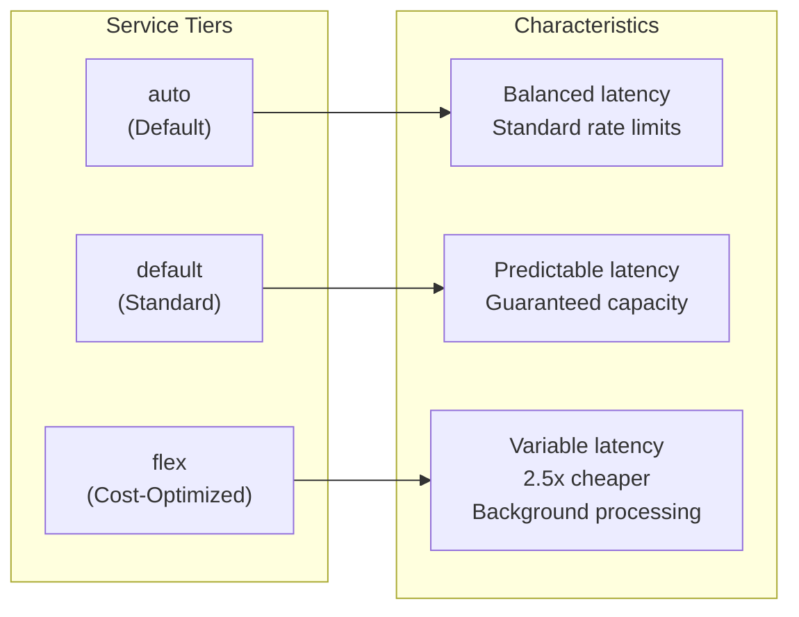

# Service Tier Routing

## Introduction

OpenAI's service tiers allow you to balance latency, throughput, and cost based on your application's needs. Understanding when to use each tier enables optimal resource allocation.

### What We'll Cover

- Available service tiers (auto, default, flex)
- Tier selection strategies
- Dynamic tier routing
- Cost optimization with flex tier
- Background processing patterns

### Prerequisites

- Rate limiting fundamentals
- Basic cost awareness

---

## Service Tier Overview



### Tier Comparison

| Tier | Latency | Cost | Rate Limits | Best For |
|------|---------|------|-------------|----------|
| `auto` | Variable | Standard | Standard | General use |
| `default` | Predictable | Standard | Standard | Production |
| `flex` | Higher (up to 24h) | ~60% off | Separate pool | Batch/background |

---

## Using Service Tiers

### Basic Usage

```python
from openai import OpenAI

client = OpenAI()

# Default tier (explicit)
response = client.chat.completions.create(
    model="gpt-4.1",
    messages=[{"role": "user", "content": "Hello!"}],
    service_tier="default"
)

# Flex tier for non-urgent requests
response = client.chat.completions.create(
    model="gpt-4.1",
    messages=[{"role": "user", "content": "Analyze this document..."}],
    service_tier="flex"
)

# Auto tier (let OpenAI decide)
response = client.chat.completions.create(
    model="gpt-4.1",
    messages=[{"role": "user", "content": "Quick question"}],
    service_tier="auto"
)
```

### Response Tier Information

```python
response = client.chat.completions.create(
    model="gpt-4.1",
    messages=[{"role": "user", "content": "Hello!"}],
    service_tier="auto"
)

# Check which tier was used
print(f"Service tier used: {response.service_tier}")
# Output: "default" or "flex"
```

---

## Dynamic Tier Router

```python
from dataclasses import dataclass
from enum import Enum
from typing import Optional
from openai import OpenAI

class RequestPriority(Enum):
    CRITICAL = "critical"      # User-facing, real-time
    HIGH = "high"              # User-facing, can wait slightly
    NORMAL = "normal"          # Background, same-day
    LOW = "low"                # Background, can wait 24h


@dataclass
class TierConfig:
    """Configuration for tier routing."""
    
    # Priority -> tier mapping
    priority_tiers: dict[RequestPriority, str] = None
    
    # Token thresholds (large requests -> flex)
    flex_token_threshold: int = 5000
    
    # Time-based routing
    off_peak_tier: str = "flex"
    peak_tier: str = "default"
    off_peak_hours: tuple[int, int] = (22, 6)  # 10 PM to 6 AM
    
    def __post_init__(self):
        if self.priority_tiers is None:
            self.priority_tiers = {
                RequestPriority.CRITICAL: "default",
                RequestPriority.HIGH: "default",
                RequestPriority.NORMAL: "auto",
                RequestPriority.LOW: "flex"
            }


class ServiceTierRouter:
    """Intelligent service tier routing."""
    
    def __init__(self, config: TierConfig = None):
        self.client = OpenAI()
        self.config = config or TierConfig()
        
        self._stats = {
            "default": 0,
            "flex": 0,
            "auto": 0
        }
    
    def _is_off_peak(self) -> bool:
        """Check if current time is off-peak."""
        from datetime import datetime
        
        hour = datetime.now().hour
        start, end = self.config.off_peak_hours
        
        if start > end:  # Spans midnight
            return hour >= start or hour < end
        else:
            return start <= hour < end
    
    def _estimate_tokens(self, messages: list) -> int:
        """Estimate input token count."""
        text = " ".join(m.get("content", "") for m in messages)
        return len(text) // 4  # Rough estimate
    
    def select_tier(
        self,
        priority: RequestPriority = RequestPriority.NORMAL,
        estimated_tokens: int = None,
        messages: list = None,
        force_tier: str = None
    ) -> str:
        """Select optimal service tier."""
        
        # Forced tier overrides all
        if force_tier:
            return force_tier
        
        # Priority-based selection
        tier = self.config.priority_tiers.get(priority, "auto")
        
        # Large requests -> flex (unless critical)
        if estimated_tokens is None and messages:
            estimated_tokens = self._estimate_tokens(messages)
        
        if estimated_tokens and estimated_tokens > self.config.flex_token_threshold:
            if priority not in [RequestPriority.CRITICAL, RequestPriority.HIGH]:
                tier = "flex"
        
        # Off-peak routing
        if self._is_off_peak() and priority == RequestPriority.NORMAL:
            tier = self.config.off_peak_tier
        
        return tier
    
    def chat(
        self,
        messages: list,
        model: str = "gpt-4.1",
        priority: RequestPriority = RequestPriority.NORMAL,
        force_tier: str = None,
        **kwargs
    ) -> dict:
        """Send chat request with intelligent tier routing."""
        
        tier = self.select_tier(
            priority=priority,
            messages=messages,
            force_tier=force_tier
        )
        
        response = self.client.chat.completions.create(
            model=model,
            messages=messages,
            service_tier=tier,
            **kwargs
        )
        
        # Track stats
        actual_tier = response.service_tier or tier
        self._stats[actual_tier] = self._stats.get(actual_tier, 0) + 1
        
        return {
            "content": response.choices[0].message.content,
            "requested_tier": tier,
            "actual_tier": actual_tier,
            "tokens": response.usage.total_tokens
        }
    
    def get_stats(self) -> dict:
        """Get tier usage statistics."""
        total = sum(self._stats.values())
        
        return {
            "counts": self._stats.copy(),
            "percentages": {
                tier: (count / total * 100) if total > 0 else 0
                for tier, count in self._stats.items()
            }
        }


# Usage
router = ServiceTierRouter()

# Critical user request
response = router.chat(
    messages=[{"role": "user", "content": "What's the weather?"}],
    priority=RequestPriority.CRITICAL
)
print(f"Critical: {response['actual_tier']}")

# Background processing
response = router.chat(
    messages=[{"role": "user", "content": "Summarize this long document..." * 100}],
    priority=RequestPriority.LOW
)
print(f"Background: {response['actual_tier']}")

print(router.get_stats())
```

---

## Flex Tier Patterns

### Background Processing Queue

```python
import time
import threading
from dataclasses import dataclass
from queue import Queue
from typing import Callable, Optional
from openai import OpenAI

@dataclass
class FlexJob:
    """A job for flex tier processing."""
    
    job_id: str
    messages: list
    model: str = "gpt-4.1"
    callback: Optional[Callable] = None
    max_wait_hours: float = 24.0


class FlexProcessor:
    """Background processor using flex tier."""
    
    def __init__(self, max_workers: int = 5):
        self.client = OpenAI()
        self.queue = Queue()
        self.results = {}
        self.max_workers = max_workers
        self._running = False
    
    def submit(
        self,
        job_id: str,
        messages: list,
        model: str = "gpt-4.1",
        callback: Callable = None
    ) -> str:
        """Submit job for flex tier processing."""
        
        job = FlexJob(
            job_id=job_id,
            messages=messages,
            model=model,
            callback=callback
        )
        
        self.queue.put(job)
        return job_id
    
    def _process_job(self, job: FlexJob):
        """Process a single job."""
        
        try:
            response = self.client.chat.completions.create(
                model=job.model,
                messages=job.messages,
                service_tier="flex"
            )
            
            result = {
                "job_id": job.job_id,
                "success": True,
                "content": response.choices[0].message.content,
                "tokens": response.usage.total_tokens,
                "tier_used": response.service_tier
            }
        except Exception as e:
            result = {
                "job_id": job.job_id,
                "success": False,
                "error": str(e)
            }
        
        self.results[job.job_id] = result
        
        if job.callback:
            job.callback(result)
    
    def _worker(self):
        """Worker thread."""
        
        while self._running:
            try:
                job = self.queue.get(timeout=1.0)
                self._process_job(job)
                self.queue.task_done()
            except:
                continue
    
    def start(self):
        """Start background processing."""
        
        self._running = True
        
        for _ in range(self.max_workers):
            thread = threading.Thread(target=self._worker, daemon=True)
            thread.start()
    
    def stop(self):
        """Stop processing."""
        self._running = False
    
    def get_result(self, job_id: str) -> Optional[dict]:
        """Get result for a job."""
        return self.results.get(job_id)
    
    def wait_for_completion(self, timeout: float = None):
        """Wait for all jobs to complete."""
        self.queue.join()


# Usage
processor = FlexProcessor(max_workers=3)
processor.start()

# Submit background jobs
for i in range(5):
    processor.submit(
        job_id=f"job_{i}",
        messages=[{"role": "user", "content": f"Process item {i}"}],
        callback=lambda r: print(f"Completed: {r['job_id']}")
    )

# Wait for completion
processor.wait_for_completion()

# Get results
for i in range(5):
    result = processor.get_result(f"job_{i}")
    print(f"Job {i}: {result['success']}")

processor.stop()
```

### Cost Comparison

```python
from dataclasses import dataclass

@dataclass
class CostCalculator:
    """Calculate costs for different tiers."""
    
    # Per 1K tokens (approximate)
    default_input: float = 0.0025
    default_output: float = 0.010
    flex_input: float = 0.00125  # ~50% of default
    flex_output: float = 0.005   # ~50% of default
    
    def calculate(
        self,
        input_tokens: int,
        output_tokens: int,
        tier: str = "default"
    ) -> float:
        """Calculate cost for a request."""
        
        if tier == "flex":
            input_cost = (input_tokens / 1000) * self.flex_input
            output_cost = (output_tokens / 1000) * self.flex_output
        else:
            input_cost = (input_tokens / 1000) * self.default_input
            output_cost = (output_tokens / 1000) * self.default_output
        
        return input_cost + output_cost
    
    def compare(self, input_tokens: int, output_tokens: int) -> dict:
        """Compare costs between tiers."""
        
        default_cost = self.calculate(input_tokens, output_tokens, "default")
        flex_cost = self.calculate(input_tokens, output_tokens, "flex")
        
        return {
            "default": default_cost,
            "flex": flex_cost,
            "savings": default_cost - flex_cost,
            "savings_percent": ((default_cost - flex_cost) / default_cost) * 100
        }


# Usage
calc = CostCalculator()

# Compare for a batch of 1000 requests
input_tokens = 500
output_tokens = 1000
batch_size = 1000

comparison = calc.compare(input_tokens, output_tokens)

print(f"Per request:")
print(f"  Default: ${comparison['default']:.4f}")
print(f"  Flex: ${comparison['flex']:.4f}")
print(f"  Savings: ${comparison['savings']:.4f} ({comparison['savings_percent']:.1f}%)")

print(f"\nFor {batch_size} requests:")
print(f"  Default: ${comparison['default'] * batch_size:.2f}")
print(f"  Flex: ${comparison['flex'] * batch_size:.2f}")
print(f"  Savings: ${comparison['savings'] * batch_size:.2f}")
```

---

## Hybrid Tier Strategy

```python
from dataclasses import dataclass, field
from datetime import datetime
from typing import Optional
from enum import Enum
from openai import OpenAI

class RequestType(Enum):
    INTERACTIVE = "interactive"   # Real-time user interaction
    ASYNC_RESULT = "async"        # User waiting but not real-time
    BACKGROUND = "background"     # No user waiting


@dataclass
class HybridTierStrategy:
    """Hybrid strategy combining multiple tier selection criteria."""
    
    client: OpenAI = field(default_factory=OpenAI)
    
    # Thresholds
    large_request_tokens: int = 3000
    batch_mode: bool = False
    
    # Cost tracking
    daily_budget: float = 100.0
    _daily_spend: float = field(default=0.0, init=False)
    
    def _get_time_factor(self) -> str:
        """Get tier based on time of day."""
        
        hour = datetime.now().hour
        
        # Business hours: prioritize default
        if 9 <= hour <= 17:
            return "default"
        # Off hours: use flex for non-critical
        else:
            return "flex"
    
    def _get_budget_factor(self) -> str:
        """Get tier based on remaining budget."""
        
        utilization = self._daily_spend / self.daily_budget
        
        if utilization > 0.9:
            return "flex"  # Near budget limit
        elif utilization > 0.7:
            return "auto"  # Conserve
        else:
            return "default"  # Budget available
    
    def select_tier(
        self,
        request_type: RequestType,
        estimated_tokens: int = 0,
        force_tier: str = None
    ) -> str:
        """Select tier using hybrid strategy."""
        
        if force_tier:
            return force_tier
        
        # Batch mode always uses flex
        if self.batch_mode:
            return "flex"
        
        # Interactive always uses default
        if request_type == RequestType.INTERACTIVE:
            return "default"
        
        # Large requests prefer flex
        if estimated_tokens > self.large_request_tokens:
            return "flex"
        
        # Background uses flex
        if request_type == RequestType.BACKGROUND:
            return "flex"
        
        # Check budget
        budget_tier = self._get_budget_factor()
        if budget_tier == "flex":
            return "flex"
        
        # Check time
        time_tier = self._get_time_factor()
        
        # For async requests, combine factors
        if request_type == RequestType.ASYNC_RESULT:
            if time_tier == "flex" or budget_tier != "default":
                return "auto"
            return "default"
        
        return "auto"
    
    def chat(
        self,
        messages: list,
        request_type: RequestType = RequestType.INTERACTIVE,
        **kwargs
    ) -> dict:
        """Send request with hybrid tier selection."""
        
        # Estimate tokens
        text = " ".join(m.get("content", "") for m in messages)
        estimated_tokens = len(text) // 4
        
        tier = self.select_tier(request_type, estimated_tokens)
        
        response = self.client.chat.completions.create(
            messages=messages,
            service_tier=tier,
            **kwargs
        )
        
        return {
            "content": response.choices[0].message.content,
            "tier": response.service_tier,
            "tokens": response.usage.total_tokens
        }


# Usage
strategy = HybridTierStrategy(daily_budget=50.0)

# Interactive request
result = strategy.chat(
    messages=[{"role": "user", "content": "Quick question"}],
    request_type=RequestType.INTERACTIVE,
    model="gpt-4.1-mini"
)
print(f"Interactive: {result['tier']}")

# Background request
result = strategy.chat(
    messages=[{"role": "user", "content": "Analyze this data..." * 100}],
    request_type=RequestType.BACKGROUND,
    model="gpt-4.1"
)
print(f"Background: {result['tier']}")
```

---

## JavaScript Implementation

```javascript
class ServiceTierRouter {
    constructor(options = {}) {
        this.flexTokenThreshold = options.flexTokenThreshold || 5000;
        this.offPeakHours = options.offPeakHours || [22, 6];
        this.stats = { default: 0, flex: 0, auto: 0 };
    }
    
    isOffPeak() {
        const hour = new Date().getHours();
        const [start, end] = this.offPeakHours;
        
        if (start > end) {
            return hour >= start || hour < end;
        }
        return hour >= start && hour < end;
    }
    
    estimateTokens(messages) {
        const text = messages.map(m => m.content || '').join(' ');
        return Math.ceil(text.length / 4);
    }
    
    selectTier(options = {}) {
        const { priority = 'normal', messages = [], forceTier } = options;
        
        if (forceTier) return forceTier;
        
        // Priority mapping
        const priorityTiers = {
            critical: 'default',
            high: 'default',
            normal: 'auto',
            low: 'flex'
        };
        
        let tier = priorityTiers[priority] || 'auto';
        
        // Large requests -> flex
        const tokens = this.estimateTokens(messages);
        if (tokens > this.flexTokenThreshold && !['critical', 'high'].includes(priority)) {
            tier = 'flex';
        }
        
        // Off-peak -> flex for normal priority
        if (this.isOffPeak() && priority === 'normal') {
            tier = 'flex';
        }
        
        return tier;
    }
    
    async chat(openai, messages, options = {}) {
        const tier = this.selectTier({ messages, ...options });
        
        const response = await openai.chat.completions.create({
            model: options.model || 'gpt-4.1',
            messages,
            service_tier: tier,
            ...options.extra
        });
        
        const actualTier = response.service_tier || tier;
        this.stats[actualTier] = (this.stats[actualTier] || 0) + 1;
        
        return {
            content: response.choices[0].message.content,
            requestedTier: tier,
            actualTier,
            tokens: response.usage.total_tokens
        };
    }
    
    getStats() {
        const total = Object.values(this.stats).reduce((a, b) => a + b, 0);
        return {
            counts: { ...this.stats },
            percentages: Object.fromEntries(
                Object.entries(this.stats).map(([tier, count]) => [
                    tier,
                    total > 0 ? (count / total * 100).toFixed(1) : 0
                ])
            )
        };
    }
}

// Usage
const router = new ServiceTierRouter();

// Critical request
const result = await router.chat(openai, 
    [{ role: 'user', content: 'Quick question' }],
    { priority: 'critical' }
);
console.log('Tier used:', result.actualTier);
```

---

## Hands-on Exercise

### Your Task

Build a tier router that optimizes for cost while respecting latency requirements.

### Requirements

1. Route interactive requests to default tier
2. Route background requests to flex tier
3. Consider token count for tier selection
4. Track cost savings

### Expected Result

```python
router = CostOptimizingRouter()

# Interactive - uses default
result = router.chat(
    messages=[{"role": "user", "content": "Hi"}],
    interactive=True
)
print(f"Interactive: {result['tier']}")  # "default"

# Background - uses flex
result = router.chat(
    messages=[{"role": "user", "content": "Process this..."}],
    interactive=False
)
print(f"Background: {result['tier']}")  # "flex"

print(router.get_savings())
# {'default_cost': 0.50, 'flex_cost': 0.25, 'saved': 0.25}
```

<details>
<summary>💡 Hints</summary>

- Track costs separately for each tier
- Calculate savings as difference between default and flex costs
- Use token count to decide between tiers for borderline cases
</details>

<details>
<summary>✅ Solution</summary>

```python
from dataclasses import dataclass, field
from openai import OpenAI

@dataclass
class CostOptimizingRouter:
    """Tier router optimized for cost savings."""
    
    # Cost per 1K tokens
    default_input_cost: float = 0.0025
    default_output_cost: float = 0.010
    flex_input_cost: float = 0.00125
    flex_output_cost: float = 0.005
    
    # Threshold for preferring flex
    flex_token_threshold: int = 2000
    
    # State
    client: OpenAI = field(default_factory=OpenAI)
    _default_spend: float = field(default=0.0, init=False)
    _flex_spend: float = field(default=0.0, init=False)
    _would_have_spent: float = field(default=0.0, init=False)
    
    def _calculate_cost(
        self,
        input_tokens: int,
        output_tokens: int,
        tier: str
    ) -> float:
        """Calculate cost for a request."""
        
        if tier == "flex":
            return (
                (input_tokens / 1000) * self.flex_input_cost +
                (output_tokens / 1000) * self.flex_output_cost
            )
        else:
            return (
                (input_tokens / 1000) * self.default_input_cost +
                (output_tokens / 1000) * self.default_output_cost
            )
    
    def _select_tier(
        self,
        interactive: bool,
        estimated_tokens: int
    ) -> str:
        """Select optimal tier."""
        
        # Interactive always uses default
        if interactive:
            return "default"
        
        # Large non-interactive -> flex
        if estimated_tokens > self.flex_token_threshold:
            return "flex"
        
        # Non-interactive -> flex
        return "flex"
    
    def chat(
        self,
        messages: list,
        interactive: bool = True,
        model: str = "gpt-4.1-mini",
        **kwargs
    ) -> dict:
        """Send chat with cost-optimized tier."""
        
        # Estimate tokens
        text = " ".join(m.get("content", "") for m in messages)
        estimated = len(text) // 4
        
        tier = self._select_tier(interactive, estimated)
        
        response = self.client.chat.completions.create(
            model=model,
            messages=messages,
            service_tier=tier,
            **kwargs
        )
        
        # Calculate costs
        input_tokens = response.usage.prompt_tokens
        output_tokens = response.usage.completion_tokens
        
        actual_tier = response.service_tier or tier
        actual_cost = self._calculate_cost(input_tokens, output_tokens, actual_tier)
        default_cost = self._calculate_cost(input_tokens, output_tokens, "default")
        
        # Track spending
        if actual_tier == "flex":
            self._flex_spend += actual_cost
        else:
            self._default_spend += actual_cost
        
        self._would_have_spent += default_cost
        
        return {
            "content": response.choices[0].message.content,
            "tier": actual_tier,
            "cost": actual_cost,
            "default_cost": default_cost,
            "saved": default_cost - actual_cost
        }
    
    def get_savings(self) -> dict:
        """Get cumulative savings."""
        
        actual_spend = self._default_spend + self._flex_spend
        saved = self._would_have_spent - actual_spend
        
        return {
            "default_spend": round(self._default_spend, 4),
            "flex_spend": round(self._flex_spend, 4),
            "actual_total": round(actual_spend, 4),
            "would_have_spent": round(self._would_have_spent, 4),
            "saved": round(saved, 4),
            "savings_percent": round(
                (saved / self._would_have_spent * 100) 
                if self._would_have_spent > 0 else 0, 1
            )
        }


# Test
router = CostOptimizingRouter()

# Interactive request
result = router.chat(
    messages=[{"role": "user", "content": "Hello!"}],
    interactive=True
)
print(f"Interactive: tier={result['tier']}, cost=${result['cost']:.4f}")

# Background request
result = router.chat(
    messages=[{"role": "user", "content": "Process this document: " + "text " * 500}],
    interactive=False
)
print(f"Background: tier={result['tier']}, cost=${result['cost']:.4f}, saved=${result['saved']:.4f}")

print("\nCumulative savings:", router.get_savings())
```

</details>

---

## Summary

✅ Use `default` tier for interactive, latency-sensitive requests  
✅ Use `flex` tier for background processing at ~50% cost savings  
✅ `auto` tier lets OpenAI optimize based on current capacity  
✅ Route based on priority, token count, and time of day  
✅ Track savings to measure optimization effectiveness

**Next Lesson:** [Cost Management](../08-cost-management/00-cost-management.md)

---

## Further Reading

- [OpenAI Service Tiers](https://platform.openai.com/docs/guides/rate-limits#service-tiers) — Official documentation
- [Flex Tier Announcement](https://openai.com/index/introducing-flex-processing/) — Background on flex tier
- [Batch API](https://platform.openai.com/docs/guides/batch) — Alternative for large batch processing

<!-- 
Sources Consulted:
- OpenAI service tiers: https://platform.openai.com/docs/guides/rate-limits
- OpenAI flex tier: https://platform.openai.com/docs/guides/flex-processing
- API reference: https://platform.openai.com/docs/api-reference/chat/create
-->
