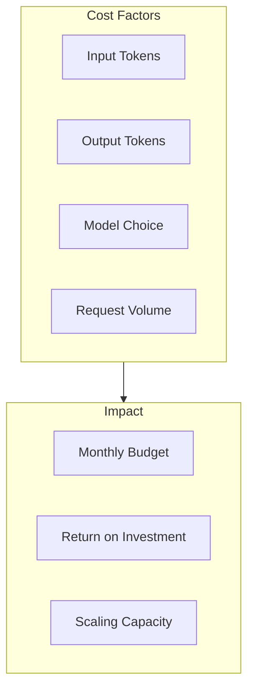

# Cost Management

## Overview

Effective cost management is critical for sustainable AI API usage. This lesson covers pricing models, estimation techniques, budget controls, and optimization strategies to maximize value while minimizing expenses.

### Learning Objectives

By the end of this lesson, you will be able to:

- Understand token-based and request-based pricing models
- Estimate costs before sending requests
- Implement budget limits and alerts
- Optimize prompts and caching for cost reduction
- Choose appropriate models based on cost-performance trade-offs

### Prerequisites

- Rate limiting fundamentals
- Basic understanding of tokens
- API authentication and request structure

---

## Lesson Structure

This lesson is organized into the following topics:

| # | Topic | Description |
|---|-------|-------------|
| 01 | [Pricing Models](./01-pricing-models.md) | Token pricing, batch discounts, tier differences |
| 02 | [Token Pricing Categories](./02-token-pricing-categories.md) | Cached, reasoning, audio, image tokens |
| 03 | [Cost Estimation](./03-cost-estimation.md) | Pre-request cost calculation and budgeting |
| 04 | [Usage Tracking & Alerts](./04-usage-tracking-alerts.md) | Dashboards, custom tracking, notifications |
| 05 | [Budget Limits](./05-budget-limits.md) | Hard limits, soft warnings, per-user budgets |
| 06 | [Prompt Optimization](./06-prompt-optimization.md) | Shorter prompts, compression, model selection |
| 07 | [Prompt Caching](./07-prompt-caching.md) | Cache-friendly structure, 90% cost reduction |
| 08 | [Predicted Outputs](./08-predicted-outputs.md) | Code regeneration, accepted vs rejected |

---

## Why Cost Management Matters

### The Cost Challenge



### Cost Reality Check

| Model | 1M Input Tokens | 1M Output Tokens | Monthly 1K users |
|-------|-----------------|------------------|------------------|
| GPT-4.1 | $2.00 | $8.00 | ~$500-2000 |
| GPT-4.1-mini | $0.40 | $1.60 | ~$100-400 |
| GPT-4o | $2.50 | $10.00 | ~$600-2500 |
| Claude Sonnet 4 | $3.00 | $15.00 | ~$900-3600 |

> **🤖 AI Context:** A single chatbot conversation (10 exchanges) can cost $0.02-0.50 depending on model and context length. At scale, small optimizations yield significant savings.

---

## Key Concepts

### Token Economics

- **Input tokens**: Text you send (cheaper)
- **Output tokens**: Text model generates (2-4x more expensive)
- **Cached tokens**: Previously seen context (50-90% discount)
- **Reasoning tokens**: Internal "thinking" (same as output)

### Cost Optimization Levers

1. **Model selection**: Right-size for the task
2. **Prompt engineering**: Shorter, more efficient prompts
3. **Caching**: Reuse repeated context
4. **Batching**: Use batch API for 50% savings
5. **Service tiers**: Flex tier for non-urgent requests

---

## Quick Reference

### Pricing Formula

```
Total Cost = (Input Tokens × Input Price) + (Output Tokens × Output Price)
           - (Cached Tokens × Cache Discount)
```

### Cost-Saving Quick Wins

| Strategy | Effort | Savings |
|----------|--------|---------|
| Use mini model | Low | 70-80% |
| Enable caching | Low | 50-90% |
| Batch requests | Medium | 50% |
| Optimize prompts | Medium | 20-40% |
| Use flex tier | Low | 50% |

---

## Navigation

**Next:** [Pricing Models](./01-pricing-models.md)

---

## Further Reading

- [OpenAI Pricing](https://openai.com/api/pricing/) — Current pricing
- [Anthropic Pricing](https://www.anthropic.com/pricing) — Claude pricing
- [Token Counter](https://platform.openai.com/tokenizer) — Interactive tokenizer
